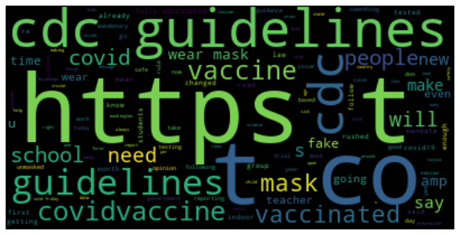
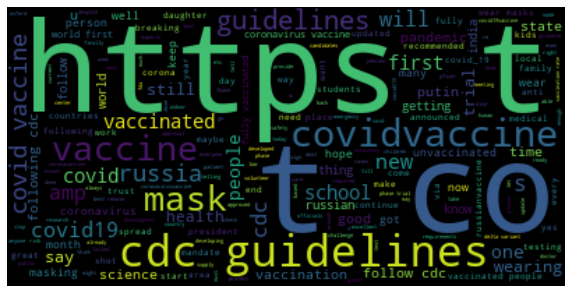
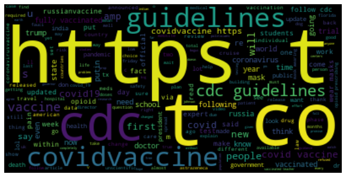

# Introduction

This project picks up from work previously done to annotate social media comments to determine if comments are pro COVID mitigation, anti-mitigation, or unrelated.  In this portion of the project, the work of different annotators on the same data is reviewed to determine the reliability of the annotators. Unreliable annotators and their annotations are dropped from the data before moving on to building a machine learning model to predict the stance of unseen comments. Additionally, before building the predictive model, all social media comments must only have ONE target label so the remaining annotatotions are annalyzed to give a final rating to each social media comment. To finish up, data cleaning, exploratory data analysis, and model building is done before assessing the models to determine their accuracy at predicting the label (pro-mitigation, anti-mitigation, unrelated) of unseen comments.  


```python
#Import packages and data
import itertools
import pandas as pd
import numpy as np
import csv
from sklearn.metrics import cohen_kappa_score
from sklearn.metrics import confusion_matrix

#import csvs to df
nyt_stance = []
twitter_stance = []


for i in range(3):
    nyt_stance.append(pd.read_csv('original_csvs/nyt_stance_'+ str(i) +'.csv'))
    twitter_stance.append(pd.read_csv('original_csvs/twitter_stance_'+ str(i) +'.csv'))
```


```python
#Replace NaN values with 'missing' for all csvs in nyt_stance
for nyt in nyt_stance:
    for i in list(nyt.columns[1:]):
        nyt[i].fillna('missing', inplace=True)
        
for twit in twitter_stance:
    for i in list(twit.columns[1:]):
        twit[i].fillna('missing', inplace=True)

```


```python
#Compute Cohen's Kappa for each pair of observers. 
# k=(p_0 - p_e)/(1 - p_e) where p_0 is empirical probability and p_e is expected agreement.
# p_0 = num in agreement/ total
# p_e = p_correct + p_incorrect which is:
# = (a_correct/total * b_correct/total) + (a_incorrect/total * b_incorrect/total)
```


```python
#Compute Cohen's Kappa for each pair of observers and then find the score for each annotator.
    # k=(p_0 - p_e)/(1 - p_e) where p_0 is empirical probability and p_e is expected agreement.
    # p_0 = num in agreement/ total
    # p_e = p_correct + p_incorrect 


#nyt_stance work

nyt_pair_dict ={}
for nyt in nyt_stance:
    
    #Creat a confusion matrix for each pair of annotators
    for pair in itertools.combinations(list(nyt.columns[1:]),2):
        #print(pair)
        cm = confusion_matrix(nyt[pair[0]],nyt[pair[1]])
        #print(cm)

        # Find number of rows in df to equal the total count
        total = len(nyt.text)

        #Find p0   
        p0 = sum(cm[m][m] for m in range(len(cm)))/ total
        #print('p0 = ', p0)

        #Find pe
        #pe = p of each class sum verticle/total * each class sum horizontal/total
        pe = 0
        for col in range(len(cm)):
            pe += sum(cm[m][col] for m in range(len(cm)))*sum(cm[col][m] for m in range(len(cm)))

        pe = pe/(total*total)
        #print('pe = ', pe)

        #Calculate Cohen's Kappa k=(p_0 - p_e)/(1 - p_e)
        k = (p0 - pe) / (1 - pe)
        #print('k = ',k)
        
        #Add the annotator pair and their Cohen's Kappa value to the dictionary
        nyt_pair_dict[pair] = k
        
    

```

Cohen's Kappa values for nyt_stance data


```python
#annotator pair Cohen's Kappa values for nyt_stance data
print(nyt_pair_dict)
```

    {('annotation_64', 'annotation_60'): 0.4766392841425847, ('annotation_64', 'annotation_61'): 0.37361510053344266, ('annotation_64', 'annotation_63'): 0.22998553963454713, ('annotation_60', 'annotation_61'): 0.4495505617977528, ('annotation_60', 'annotation_63'): 0.3249869406233677, ('annotation_61', 'annotation_63'): 0.3003073010490623, ('annotation_34', 'annotation_5'): 0.26157741130138196, ('annotation_34', 'annotation_20'): 0.3498383779018513, ('annotation_34', 'annotation_4'): 0.5355299722111949, ('annotation_5', 'annotation_20'): 0.30353430353430355, ('annotation_5', 'annotation_4'): 0.3226017918275184, ('annotation_20', 'annotation_4'): 0.37449258247841166, ('annotation_7', 'annotation_8'): -0.0043363965218954316, ('annotation_7', 'annotation_9'): 0.2823912756860603, ('annotation_7', 'annotation_78'): 0.5118937287611987, ('annotation_7', 'annotation_62'): 0.44581280788177335, ('annotation_8', 'annotation_9'): -0.0033332587637860444, ('annotation_8', 'annotation_78'): 0.0028331139714903968, ('annotation_8', 'annotation_62'): 0.0025661050987392615, ('annotation_9', 'annotation_78'): 0.22663448881088202, ('annotation_9', 'annotation_62'): 0.24590835459064933, ('annotation_78', 'annotation_62'): 0.5237416807441027}


```python
#Iterate through the complete list of annotators in all three nyt_stance csvs to
#calculate each annotator's score
#which is the average kappa score for that annotator in all the annotator pairs.  

nyt_annotator_dict ={}

for nyt in nyt_stance:
    for annotator in list(nyt.columns[1:]):
        #find the occurance of the annotator in the dictionary
        k =0
        counter = 0
        for pair in nyt_pair_dict.keys():
            if annotator in pair:
                k += nyt_pair_dict[pair]
                counter +=1
        score = k/counter
        nyt_annotator_dict[annotator] = score    
```

Annotator Scores (average k) for nyt_stance data


```python
print(nyt_annotator_dict)
```

    {'annotation_64': 0.3600799747701915, 'annotation_60': 0.41705892885456836, 'annotation_61': 0.37449098779341927, 'annotation_63': 0.285093260435659, 'annotation_34': 0.38231525380480935, 'annotation_5': 0.29590450222106796, 'annotation_20': 0.34262175463818884, 'annotation_4': 0.41087478217237505, 'annotation_7': 0.3089403539517842, 'annotation_8': -0.0005676090538629544, 'annotation_9': 0.1879002150809514, 'annotation_78': 0.31627575307191846, 'annotation_62': 0.30450723707881616}


```python

#twitter_stance work

twitter_pair_dict ={}
for twit in twitter_stance:
    
    #Creat a confusion matrix for each pair of annotators
    for pair in itertools.combinations(list(twit.columns[1:]),2):
        #print(pair)
        cm = confusion_matrix(twit[pair[0]],twit[pair[1]])
        #print(cm)

        # Find number of rows in df to equal the total count
        total = len(twit.text)

        #Find p0   
        p0 = sum(cm[m][m] for m in range(len(cm)))/ total
        #print('p0 = ', p0)

        #Find pe
        #pe = p of each class sum verticle/total * each class sum horizontal/total
        pe = 0
        for col in range(len(cm)):
            pe += sum(cm[m][col] for m in range(len(cm)))*sum(cm[col][m] for m in range(len(cm)))

        pe = pe/(total*total)
        #print('pe = ', pe)

        #Calculate Cohen's Kappa k=(p_0 - p_e)/(1 - p_e)
        k = (p0 - pe) / (1 - pe)
        #print('k = ',k)
        
        #Add the annotator pair and their Cohen's Kappa value to the dictionary
        twitter_pair_dict[pair] = k
        
    
```

Cohen's Kappa values for twitter_stance data


```python
print(twitter_pair_dict)
```

    {('annotation_32', 'annotation_33'): 0.2534050781906845, ('annotation_32', 'annotation_35'): 0.4085410679676536, ('annotation_32', 'annotation_17'): 0.23917483660130712, ('annotation_33', 'annotation_35'): 0.3273542600896861, ('annotation_33', 'annotation_17'): 0.39112611526404634, ('annotation_35', 'annotation_17'): 0.4136460554371002, ('annotation_26', 'annotation_37'): 0.14795244385733158, ('annotation_26', 'annotation_38'): 0.2274502447260262, ('annotation_26', 'annotation_39'): 0.16167664670658682, ('annotation_37', 'annotation_38'): 0.31476016605812035, ('annotation_37', 'annotation_39'): 0.4467213114754098, ('annotation_38', 'annotation_39'): 0.28344746951728744, ('annotation_113', 'annotation_114'): 0.23612454070779346, ('annotation_113', 'annotation_115'): 0.23195876288659786, ('annotation_113', 'annotation_116'): 0.24873096446700513, ('annotation_114', 'annotation_115'): 0.16709511568123395, ('annotation_114', 'annotation_116'): 0.2042306723747167, ('annotation_115', 'annotation_116'): 0.27222222222222225}


```python
#Iterate through the complete list of annotators in all three nyt_stance csvs to
#calculate each annotator's score
#which is the average kappa score for that annotator in all the annotator pairs.  

twitter_annotator_dict ={}

for twit in twitter_stance:
    for annotator in list(twit.columns[1:]):
        #find the occurance of the annotator in the dictionary
        k =0
        counter = 0
        for pair in twitter_pair_dict.keys():
            if annotator in pair:
                k += twitter_pair_dict[pair]
                counter +=1
        score = k/counter
        twitter_annotator_dict[annotator] = score    
```

Annotator Scores (average k) for twitter_stance data


```python
print(twitter_annotator_dict)
```

    {'annotation_32': 0.3003736609198817, 'annotation_33': 0.323961817848139, 'annotation_35': 0.3831804611648133, 'annotation_17': 0.34798233576748455, 'annotation_26': 0.1790264450966482, 'annotation_37': 0.3031446404636206, 'annotation_38': 0.27521929343381135, 'annotation_39': 0.29728180923309466, 'annotation_113': 0.23893808935379882, 'annotation_114': 0.202483442921248, 'annotation_115': 0.22375870026335135, 'annotation_116': 0.2417279530213147}


```python
#Assemble the Dataset
#    1. Assign a final label to each text, according to the following logic: 
#        - First, eliminate any labels for annotators whose average kappa score is less 
#        than 0.2 (unreliable annotators) 
#        - Second, assign the final label to each text as the most frequent label among 
#        the remainiing annotators 
#        - If there are ties (the same number of annotators for different labels), 
#        use the label with higher-reliability annotators (higher kappa scores on average) 
#    2. Combine all of the text/label pairs for the PRIMARY dataset into a single CSV file, 
#    with the columns "text" and "label" 
#    3. Combine all of the text/label pairs for the SECONDARY dataset into a single CSV file, 
#    with the columns "text" and "label" 
```


```python
#First, eliminate any labels for annotators whose average kappa score is less 
#than 0.2 (unreliable annotators) 

#nyt_stance
for annotator,score in nyt_annotator_dict.items():
    if score < 0.2:
        for nyt in nyt_stance:
            if annotator in list(nyt.columns[1:]):
                del nyt[annotator]
                
                        
#twitter_stance
for annotator,score in twitter_annotator_dict.items():
    if score < 0.2:
        for twit in twitter_stance:
            if annotator in list(twit.columns[1:]):
                del twit[annotator]

#Check that only annotators at score of 0.2 or above remain
#for twit in twitter_stance:
#    for annotator in list(twit.columns[1:]):
#        print(annotator)
```


```python
def majority_vote(votes):
    d={}
    for e in votes:
        d[e]=d.get(e,0)+1
    
    answers = sorted([(k,v,) for k,v in d.items()],key=lambda x:-x[1])
    if len(answers)==1:
        return answers[0][0]
    if answers[0][1]> answers[1][1]:
        return answers[0][0]
    majority=answers[0][1]
    ties=[]
    for ans in answers:
        if ans[1] ==majority: #if votes are the same as currently labeled majority
            ties.append(ans[0]) #ans[0] is one of tied labelS
        else:
            break
    for vote in votes:
        if vote in ties:
            return vote #returns the first vote that matches in ties, which is also the vote of the highest scoring annotator
    
```


```python
# Second, assign the final label to each text as the most frequent label among 
# the remainiing annotators 
with open("secondary_labels.csv",'w') as secondary_labels:
    csvwriter = csv.writer(secondary_labels)
    csvwriter.writerow(["text","label"])
    
    #nyt_stance
    for nyt in nyt_stance:
        #put annotators in order of highest score 
        #to be able to use mode later and select the one with the highest score
        #(b/c mode returns the first most frequent mode in the case of a tie, we need annotators in order of highest score)
        annotator_tup =[]
        labels = []
        for annotator in list(nyt.columns[1:]):
            annotator_tup.append([annotator,nyt_annotator_dict[annotator]])   

        #Reorder annotators in score order
        newOrder = ['text']+[ ann for ann,other in sorted(annotator_tup,key=lambda x:-x[1]) ]
        nyt_new=nyt[newOrder]

        #iterate through rows to find count and determine labels
        #call majority_vote function to determine final vote on label
        for row in nyt_new.itertuples():
            #write to file
            #    2. Combine all of the text/label pairs for the PRIMARY dataset into a single CSV file, 
            #    with the columns "text" and "label" 
            csvwriter.writerow([row[1],majority_vote(row[2:])])
     
                        
#twitter_stance

with open("primary_labels.csv",'w') as primary_labels:
    csvwriter = csv.writer(primary_labels)
    csvwriter.writerow(["text","label"])
    
    #twitter_stance
    for twit in twitter_stance:
        #put annotators in order of highest score 
        #to be able to use mode later and select the one with the highest score
        #(b/c mode returns the first most frequent mode in the case of a tie, we need annotators in order of highest score)
        annotator_tup =[]
        labels = []
        for annotator in list(twit.columns[1:]):
            annotator_tup.append([annotator,twitter_annotator_dict[annotator]])   

        #Reorder annotators in score order
        newOrder = ['text']+[ ann for ann,other in sorted(annotator_tup,key=lambda x:-x[1]) ]
        twitter_new=twit[newOrder]

        #iterate through rows to find count and determine labels
        #call majority_vote function to determine final vote on label
        for row in twitter_new.itertuples():
            #write to file
            #    3. Combine all of the text/label pairs for the SECONDARY dataset into a single CSV file, 
            #    with the columns "text" and "label
            csvwriter.writerow([row[1],majority_vote(row[2:])])
```
The goal of this final phase of the project is to build a text categorization model on your primary dataset, and to evaluate it on both your primary and your secondary dataset.  Follow the steps below.

## Data Partitioning

1. Data partitioning: Create a Training set for your model by randomly selecting 70% of the texts in your PRIMARY dataset.  Use the remaining 30% of texts from the PRIMARY dataset as your Test (PRIMARY) set.  Designate 100% of your SECONDARY dataset as the Test (SECONDARY) dataset.  So you should have one Training set (drawn from the PRIMARY data), and two different Test sets (one from PRIMARY and one from SECONDARY).


```python
!pip3 install yake
import csv
import numpy as np
import pandas as pd
from sklearn.model_selection import train_test_split
from sklearn.linear_model import LogisticRegression
from sklearn.feature_extraction.text import TfidfVectorizer
from sklearn.feature_extraction.text import TfidfTransformer
from sklearn.ensemble import RandomForestClassifier
from sklearn.feature_extraction.text import CountVectorizer
from sklearn.naive_bayes import MultinomialNB
from sklearn.metrics import accuracy_score, classification_report
from pprint import pprint
import yake
```

    Requirement already satisfied: yake in /home/userina/.local/lib/python3.7/site-packages (0.4.8)
    Requirement already satisfied: numpy in /usr/local/lib/python3.7/dist-packages (from yake) (1.21.2)
    Requirement already satisfied: tabulate in /home/userina/.local/lib/python3.7/site-packages (from yake) (0.8.9)
    Requirement already satisfied: jellyfish in /home/userina/.local/lib/python3.7/site-packages (from yake) (0.8.9)
    Requirement already satisfied: segtok in /home/userina/.local/lib/python3.7/site-packages (from yake) (1.5.10)
    Requirement already satisfied: networkx in /home/userina/.local/lib/python3.7/site-packages (from yake) (2.6.3)
    Requirement already satisfied: click>=6.0 in /usr/lib/python3/dist-packages (from yake) (7.0)
    Requirement already satisfied: regex in /home/userina/.local/lib/python3.7/site-packages (from segtok->yake) (2021.11.2)


```python
#import data and simultaneous convert uppercase to lowercase
primary = pd.read_csv('primary_labels.csv', 
                    dtype=str).apply(lambda x: x.astype(str).str.lower())

secondary = pd.read_csv('secondary_labels.csv',
                   dtype=str).apply(lambda x: x.astype(str).str.lower())


#Randomly Split Primary Data into Training Set (70%) and Testing Set (30%)

X = primary.iloc[:, :-1]
y = primary.iloc[:, -1]
X_train,X_test,y_train,y_test = train_test_split(X, y, test_size=0.3, train_size=0.7)


#Prep Secondary Data for Testing (100% of data)
X_sec = secondary.iloc[:, :-1]
y_sec = secondary.iloc[:, -1]

```

2. Baseline model training: Train a simple bag-of-words classifier on your Training dataset.  If your data comes from the stance task, you will build a multiclass model (one which can assign one of three labels - pro-mitigation, anti-mitigation, or unclear).  If your data comes from the topic task, choose only one of the topics (masking and distancing, lockdowns, vaccination) to model as a binary classification task.  (You should avoid topics with low numbers of positive examples.)  An example of how to use scikit-learn to build a simple text categorization model is here. (https://blackboard.iit.edu/ultra/courses/_119779_1/cl/outline)  The course sample notebooks here and here may also be useful as examples.


```python
#Text Cleaning
import string
import re
import nltk  #natural language toolkit
nltk.download('stopwords')
nltk.download('wordnet')
from nltk.stem import WordNetLemmatizer
#from nltk.corpus import stopwords

stopwords = nltk.corpus.stopwords.words('english')
ps = nltk.PorterStemmer()
lemmatizer = WordNetLemmatizer()


def txt_clean(txt):
    #remove punctuation
    txt = "".join([c for c in txt if c not in string.punctuation])
    #create word tokens
    tokens = re.split('\W+', txt)
    #stem word after tokenizing
    #txt = [ps.stem(word) for word in tokens] #if word not in stopwords]
    txt = [lemmatizer.lemmatize(word) for word in tokens] 
    return " ".join(txt)
```

    [nltk_data] Downloading package stopwords to
    [nltk_data]     /home/userina/nltk_data...
    [nltk_data]   Package stopwords is already up-to-date!
    [nltk_data] Downloading package wordnet to /home/userina/nltk_data...
    [nltk_data]   Package wordnet is already up-to-date!


```python
#Functions created and used to complete steps 2-5.

def create_basemodel(X_train, y_train):
    #Vectorize and tf*idf with PRIMARY training data
    vectorizer = TfidfVectorizer( stop_words="english")
    vectorizer = vectorizer.fit([txt_clean(i[1].text) for i in X_train.iterrows()])
    X_vect = vectorizer.transform([txt_clean(i[1].text) for i in X_train.iterrows()])

    y_vect = [t for t in y_train]
    # Random Forest Model PRIMARY
    rf_model = RandomForestClassifier().fit(X_vect, y_vect)
    return rf_model, vectorizer


def create_newFeatureModel(X_train, y_train):
    #Vectorize and tf*idf with PRIMARY training data
    vectorizer = TfidfVectorizer( stop_words="english")
    vectorizer = vectorizer.fit([add_feat(i[1].text) for i in X_train.iterrows()])
    X_vect = vectorizer.transform([add_feat(i[1].text) for i in X_train.iterrows()])

    y_vect = [t for t in y_train]
    # Random Forest Model PRIMARY
    rf_model = RandomForestClassifier().fit(X_vect, y_vect)
    return rf_model, vectorizer

def predict_and_evaluate(model,xtest,ytest):
    # Random Forest Model
    y_hat_rf_base_test = model.predict(xtest)
    return classification_report(ytest, y_hat_rf_base_test,output_dict=True)

def get_average_answers(accTests):
    average_answers = {'anti-mitigation': {'precision': 0.0,
                                           'recall': 0.0,
                                           'f1-score': 0.0
                                           , 'support': 0},
                       'pro-mitigation': {'precision': 0.0,
                                          'recall': 0.0,
                                          'f1-score': 0.0,
                                          'support': 0},
                       'unclear': {'precision': 0.0,
                                          'recall': 0.0,
                                          'f1-score': 0.0,
                                          'support': 0},
                       'accuracy': 0.0,
                       'macro avg': {'precision': 0.0,
                                     'recall': 0.0,
                                     'f1-score': 0.0,
                                     'support': 0},

                      'weighted avg': {'f1-score': 0.0,
                      'precision': 0.0,
                      'recall': 0.0,
                      'support': 0}
                      }
    for runs in accTests:
        for keyElement in runs:
            if keyElement != "accuracy":
                for score in runs[keyElement]:
                    average_answers[keyElement][score] += runs[keyElement][score]
            else:
                average_answers[keyElement] +=runs[keyElement]
    for keyElement in average_answers:
        if keyElement != "accuracy":
            for score in average_answers[keyElement]:
                average_answers[keyElement][score] = average_answers[keyElement][score] / len(accTests)
        else:
            average_answers[keyElement] = average_answers[keyElement] / len(accTests)
    return average_answers


def add_feat(txt):
    #remove punctuation
    txt = "".join([c for c in txt if c not in string.punctuation])
    #create word tokens 
    tokens = re.split('\W+', txt)
    txt = [lemmatizer.lemmatize(word) for word in tokens]
    if "cdc" in txt and 'guideline' in txt :
        if 'mask' in txt or 'school' in txt or 'make' in txt:
            txt.append("86967b9aaac70ec94683ff0e768bcd03") #anti md5 hash
        elif 'released' in txt or 'due' in txt:
            txt.append("05cac50f47bd9793a1578ddc85de1393") #unclear md5 hash
    if "cdc" in txt and 'guidelines' in txt :
        if 'follow' in txt:
            txt.append("86967b9aaac70ec94683ff0e768bcd03") #Anti
        elif 'travel' in txt:
            txt.append("05cac50f47bd9793a1578ddc85de1393") #unclear
    #Results from Keywords extractions for Anti-mitigation label in training data
        #{'cdc travel guidelines', 'released cdc guideline', 'cdc guideline due'}
    #Results from Keywords extractions for unclear label in training data
        #{'cdc school guideline', 'cdc make guideline', 'cdc mask guideline', 'follow cdc guidelines'}
    #Pro-mitigation returned only keywords that were already included in the other label sets

    grams = []
    #bi-grams
    for n in range(len(txt)-1):
        grams.append("-".join(txt[n:n+2]))
    #tri-grams
    for m in range(len(txt)-2):
        grams.append("-".join(txt[m:m+3]))
    return ' '.join(txt+grams)
    

```


```python
#Investigation to determine new features
kw_extractor = yake.KeywordExtractor()
text = """spaCy is an open-source software library for advanced natural language processing, written in the programming languages Python and Cython. The library is published under the MIT license and its main developers are Matthew Honnibal and Ines Montani, the founders of the software company Explosion."""
text = " ".join([i[1].text for i in X_train.loc[y_train=="anti-mitigation",:].iterrows()])
text = " ".join([lemmatizer.lemmatize(word) for word in text.split(" ")])
language = "en"
max_ngram_size = 3
deduplication_threshold = 0.9
numOfKeywords = 100
custom_kw_extractor = yake.KeywordExtractor(lan=language, n=max_ngram_size, dedupLim=deduplication_threshold, top=numOfKeywords, features=None)
keywords = custom_kw_extractor.extract_keywords(text)
antiset=set()
for kw in keywords:
    #print(kw)
    antiset.add(kw[0])    

text = " ".join([i[1].text for i in X_train.loc[y_train=="pro-mitigation",:].iterrows()])
text = " ".join([lemmatizer.lemmatize(word) for word in text.split(" ")])
language = "en"
max_ngram_size = 3
deduplication_threshold = 0.9
numOfKeywords = 100
custom_kw_extractor = yake.KeywordExtractor(lan=language, n=max_ngram_size, dedupLim=deduplication_threshold, top=numOfKeywords, features=None)
keywords = custom_kw_extractor.extract_keywords(text)
proset = set()
for kw in keywords:
    #print(kw)
    proset.add(kw[0])

text = " ".join([i[1].text for i in X_train.loc[y_train=="unclear",:].iterrows()])
text = " ".join([lemmatizer.lemmatize(word) for word in text.split(" ")])
language = "en"
max_ngram_size = 3
deduplication_threshold = 0.9
numOfKeywords = 15
custom_kw_extractor = yake.KeywordExtractor(lan=language, 
                                            n=max_ngram_size, dedupLim=deduplication_threshold, 
                                            top=numOfKeywords, features=None)
keywords = custom_kw_extractor.extract_keywords(text)
unclearset = set()
for kw in keywords:
    #print(kw)
    unclearset.add(kw[0])

#print("AntiSet\n\n")
#print( (antiset - proset ) - unclearset )
#Result: {'cdc school guideline', 'cdc mask guideline', 'follow cdc guidelines'}

#print(proset - antiset)
#print("ProSet\n\n")
#print( ( proset -antiset ) - unclearset )
#Result: {'follow cdc guideline'}

#print("UnclearSet\n\n")
#print( (unclearset - proset ) -antiset  )
#Result: {'cdc travel guidelines', 'released cdc guideline', 'cdc guideline due'}
```

3. Model evaluation 1: Calculate your baseline model's accuracy for your model's predictions on the Test (PRIMARY) set, and on the Test (SECONDARY) set. Enter these values in the answer boxes provided.


```python
#Running and evaluating the base model Primary Dataset
accRuns=[]
for x in range(50):
    model , vectorizer = create_basemodel(X_train,y_train)
    testdata= vectorizer.transform([txt_clean(i[1].text) for i in X_test.iterrows()])
    accRuns.append(predict_and_evaluate(model,testdata,y_test))
pprint(get_average_answers(accRuns))
```

    {'accuracy': 0.5493333333333333,
     'anti-mitigation': {'f1-score': 0.12152114229335927,
                         'precision': 0.575888888888889,
                         'recall': 0.06823529411764703,
                         'support': 51.0},
     'macro avg': {'f1-score': 0.4275972150902468,
                   'precision': 0.5664273295964317,
                   'recall': 0.45233445378151266,
                   'support': 270.0},
     'pro-mitigation': {'f1-score': 0.5096797678503351,
                        'precision': 0.5911346506958752,
                        'recall': 0.4486,
                        'support': 100.0},
     'unclear': {'f1-score': 0.6515907351270459,
                 'precision': 0.532258449204531,
                 'recall': 0.8401680672268905,
                 'support': 119.0},
     'weighted avg': {'f1-score': 0.49890686119301214,
                      'precision': 0.5623057550305925,
                      'recall': 0.5493333333333333,
                      'support': 270.0}}


```python
#Running and evaluating the base model Secondary dataset
accRuns=[]
for x in range(50):
    model , vectorizer = create_basemodel(X_train,y_train)
    testdata= vectorizer.transform([txt_clean(i[1].text) for i in X_sec.iterrows()])
    accRuns.append(predict_and_evaluate(model,testdata,y_sec))
pprint(get_average_answers(accRuns))
```

    {'accuracy': 0.48455104551045525,
     'anti-mitigation': {'f1-score': 0.026625445437879466,
                         'precision': 0.06494597289245252,
                         'recall': 0.016962025316455694,
                         'support': 79.0},
     'macro avg': {'f1-score': 0.3508999290415169,
                   'precision': 0.3857168687740018,
                   'recall': 0.4008631877326651,
                   'support': 813.0},
     'pro-mitigation': {'f1-score': 0.49822672683981184,
                        'precision': 0.6974427005512731,
                        'recall': 0.38836518046709123,
                        'support': 471.0},
     'unclear': {'f1-score': 0.5278476148468589,
                 'precision': 0.39476193287827954,
                 'recall': 0.7972623574144485,
                 'support': 263.0},
     'weighted avg': {'f1-score': 0.46198292894940685,
                      'precision': 0.5380671982351055,
                      'recall': 0.48455104551045525,
                      'support': 813.0}}


```python
#Running and evaluating the Featured model Primary Data
accRuns=[]
for x in range(50):
    model , vectorizer = create_newFeatureModel(X_train,y_train)
    testdata= vectorizer.transform([add_feat(i[1].text) for i in X_test.iterrows()])
    accRuns.append(predict_and_evaluate(model,testdata,y_test))
pprint(get_average_answers(accRuns))
```

    {'accuracy': 0.5468148148148149,
     'anti-mitigation': {'f1-score': 0.12555582655078834,
                         'precision': 0.5345238095238096,
                         'recall': 0.07137254901960782,
                         'support': 51.0},
     'macro avg': {'f1-score': 0.42364879518791004,
                   'precision': 0.5544758646155242,
                   'recall': 0.44924967320261433,
                   'support': 270.0},
     'pro-mitigation': {'f1-score': 0.4902528963464223,
                        'precision': 0.6001310549874115,
                        'recall': 0.4152,
                        'support': 100.0},
     'unclear': {'f1-score': 0.6551376626665195,
                 'precision': 0.5287727293353525,
                 'recall': 0.8611764705882352,
                 'support': 119.0},
     'weighted avg': {'f1-score': 0.49403710609647505,
                      'precision': 0.5562880539828235,
                      'recall': 0.5468148148148149,
                      'support': 270.0}}


```python
#Running and evaluating the Featured model Secondary Data
accRuns=[]
for x in range(50):
    model , vectorizer = create_newFeatureModel(X_train,y_train)
    testdata= vectorizer.transform([add_feat(i[1].text) for i in X_sec.iterrows()])
    accRuns.append(predict_and_evaluate(model,testdata,y_sec))
pprint(get_average_answers(accRuns))
```

    {'accuracy': 0.43092250922509234,
     'anti-mitigation': {'f1-score': 0.022961554157652615,
                         'precision': 0.060907477083937914,
                         'recall': 0.014430379746835446,
                         'support': 79.0},
     'macro avg': {'f1-score': 0.3053136939392358,
                   'precision': 0.36652361305493764,
                   'recall': 0.37687183494487564,
                   'support': 813.0},
     'pro-mitigation': {'f1-score': 0.381287581485797,
                        'precision': 0.6721912533738492,
                        'recall': 0.2675159235668791,
                        'support': 471.0},
     'unclear': {'f1-score': 0.5116919461742576,
                 'precision': 0.3664721087070255,
                 'recall': 0.8486692015209125,
                 'support': 263.0},
     'weighted avg': {'f1-score': 0.38865362300380646,
                      'precision': 0.5138941397523515,
                      'recall': 0.43092250922509234,
                      'support': 813.0}}


4. Feature engineering: In order to try to improve your model, think about what features of the text might be associated with the category you are trying to predict.  What attributes of a text besides the presence of individual words might be good predictors (for example, regular expression patterns or specific word sequences)?  Create at least three new features that represent attributes of the text.  Add them to your model and retrain.  An example of how to add a set of features (defined as a vector of 1/0 values indicating whether the attribute is present or absent for a given text) is shown here. (https://gist.github.com/DerrickHiggins/20c77745b080e3d493231424d7da9a2f)


```python
#Attempts with other classifiers

#Vectorize and tf*idf with PRIMARY training data
#vectorizer = TfidfVectorizer( stop_words="english")
#vectorizer = vectorizer.fit([add_feat(i[1].text) for i in X_train.iterrows()])
#X_vect = vectorizer.transform([add_feat(i[1].text) for i in X_train.iterrows()])

#y_vect = [t for t in y_train]
#print(y_vect)

#Naive Bayes Model PRIMARY
#nb_model = MultinomialNB(alpha=1.0).fit(X_vect, y_vect)
#X_test_vect = vectorizer.transform([add_feat(i[1].text) for i in X_test.iterrows()])
#y_hat_nb_test = nb_model.predict(X_test_vect)


#Naive Bayes Model SECONDARY
#X_test_vect_sec= vectorizer.transform([add_feat(i[1].text) for i in X_sec.iterrows()])
#y_hat_nb_test_sec = nb_model.predict(X_test_vect_sec)


#Logistic Regression Model PRIMARY
#lr_model = LogisticRegression(penalty="none", 
#                              multi_class="multinomial",
#                              solver="lbfgs").fit(X_vect, y_vect)
#y_hat_lr_test = lr_model.predict(X_test_vect)


#Logistic Regression Model SECONDARY
#y_hat_lr_test_sec = lr_model.predict(X_test_vect_sec)


# Random Forest Model PRIMARY
#rf_model = RandomForestClassifier().fit(X_vect, y_vect)
#y_hat_rf_featEng_test = rf_model.predict(X_test_vect)


# Random Forest Model SECONDARY
#y_hat_rf_featEng_test_sec = rf_model.predict(X_test_vect_sec)

```


```python
#Investigating new features

import matplotlib.pyplot as plt
from wordcloud import WordCloud, STOPWORDS, ImageColorGenerator
wordclou = WordCloud(stopwords=STOPWORDS).generate(" ".join([i[1].text for i in X_train.loc[y_train=="anti-mitigation",:].iterrows()]))
plt.figure(figsize=(10,10))
plt.imshow(wordclou, interpolation="bilinear")
plt.axis("off")
plt.show()
```


    

    


```python
#Investigating new features
import matplotlib.pyplot as plt
from wordcloud import WordCloud, STOPWORDS, ImageColorGenerator
wordclou = WordCloud(stopwords=STOPWORDS).generate(" ".join([i[1].text for i in X_train.loc[y_train=="pro-mitigation",:].iterrows()]))
plt.figure(figsize=(10,10))
plt.imshow(wordclou, interpolation="bilinear")
plt.axis("off")
plt.show()
```


    

    


```python
#Investigating new features
import matplotlib.pyplot as plt
from wordcloud import WordCloud, STOPWORDS, ImageColorGenerator
wordclou = WordCloud(stopwords=STOPWORDS).generate(" ".join([i[1].text for i in X_train.loc[y_train=="unclear",:].iterrows()]))
plt.figure(figsize=(10,10))
plt.imshow(wordclou, interpolation="bilinear")
plt.axis("off")
plt.show()
```


    

    


```python
#POS TAGGING 
import nltk

# download required nltk packages
# required for tokenization
nltk.download('punkt')
# required for parts of speech tagging
nltk.download('averaged_perceptron_tagger')

#remove punctuation
txt = "".join([c[1].text for c in X_train.iterrows() if c[1].text not in string.punctuation])
#create word tokens
tokens = re.split('\W+', txt)

#txt = [word for word in tokens]


# input text
#sentence = """Today morning, Arthur felt very good."""

# tokene into words
#tokens = nltk.word_tokenize(sentence)

# parts of speech tagging
tagged = nltk.pos_tag(tokens)

# print tagged tokens
print(tagged)
```

    [nltk_data] Downloading package punkt to /home/userina/nltk_data...
    [nltk_data]   Package punkt is already up-to-date!
    [nltk_data] Downloading package averaged_perceptron_tagger to
    [nltk_data]     /home/userina/nltk_data...
    [nltk_data]   Package averaged_perceptron_tagger is already up-to-
    [nltk_data]       date!


    [('and', 'CC'), ('now', 'RB'), ('they', 'PRP'), ('call', 'VBP'), ('our', 'PRP$'), ('hope', 'NN'), ('for', 'IN'), ('any', 'DT'), ('covidvaccine', 'JJ'), ('delusional', 'JJ'), ('https', 'NN'), ('t', 'NN'), ('co', 'JJ'), ('jbe8hzujc5labor', 'NN'), ('day', 'NN'), ('at', 'IN'), ('the', 'DT'), ('earliest', 'JJS'), ('doc', 'NN'), ('and', 'CC'), ('if', 'IN'), ('there', 'EX'), ('isn', 'VBP'), ('t', 'VB'), ('a', 'DT'), ('covidvaccine', 'NN'), ('by', 'IN'), ('then', 'RB'), ('the', 'DT'), ('time', 'NN'), ('has', 'VBZ'), ('come', 'VBN'), ('for', 'IN'), ('massive', 'JJ'), ('investm', 'NN'), ('https', 'NN'), ('t', 'NN'), ('co', 'NN'), ('bn2eq88bgwethealthworld', 'NN'), ('vaccine', 'NN'), ('storage', 'NN'), ('demands', 'NNS'), ('could', 'MD'), ('leave', 'VB'), ('3b', 'CD'), ('people', 'NNS'), ('in', 'IN'), ('virus', 'NN'), ('cold', 'JJ'), ('covidvaccine', 'NN'), ('unicef', 'JJ'), ('coronavirus', 'NN'), ('https', 'NN'), ('t', 'NN'), ('co', 'NN'), ('ipg1ppblk3such', 'PDT'), ('a', 'DT'), ('great', 'JJ'), ('example', 'NN'), ('of', 'IN'), ('leadership', 'NN'), ('didn', 'NN'), ('t', 'VBD'), ('even', 'RB'), ('bother', 'JJR'), ('to', 'TO'), ('apply', 'VB'), ('the', 'DT'), ('covidvaccine', 'NN'), ('on', 'IN'), ('his', 'PRP$'), ('daughter', 'NN'), ('https', 'NN'), ('t', 'VBD'), ('co', 'JJ'), ('2iw34x3jwr', 'CD'), ('covidvaccine', 'NN'), ('pursuit', 'NN'), ('has', 'VBZ'), ('to', 'TO'), ('be', 'VB'), ('for', 'IN'), ('common', 'JJ'), ('good', 'JJ'), ('says', 'VBZ'), ('common', 'JJ'), ('good', 'NN'), ('is', 'VBZ'), ('a', 'DT'), ('rock', 'NN'), ('he', 'PRP'), ('adds', 'VBZ'), ('https', 'JJ'), ('t', 'NN'), ('co', 'NN'), ('r7qpsgaqxdvaccinated', 'VBD'), ('teachers', 'NNS'), ('and', 'CC'), ('students', 'NNS'), ('don', 'VBP'), ('t', 'RB'), ('need', 'VBP'), ('to', 'TO'), ('wear', 'VB'), ('masks', 'NNS'), ('inside', 'IN'), ('school', 'NN'), ('buildings', 'NNS'), ('the', 'DT'), ('cdc', 'NN'), ('said', 'VBD'), ('friday', 'JJ'), ('read', 'VB'), ('the', 'DT'), ('new', 'JJ'), ('guidelines', 'NNS'), ('here', 'RB'), ('https', 'VBP'), ('t', 'JJ'), ('co', 'JJ'), ('m5uuztfgfryes', 'NNS'), ('sounds', 'VBZ'), ('smart', 'JJ'), ('and', 'CC'), ('following', 'VBG'), ('cdc', 'NN'), ('guidelines', 'NNS'), ('i', 'NNS'), ('have', 'VBP'), ('great', 'JJ'), ('seats', 'NNS'), ('because', 'IN'), ('i', 'JJ'), ('m', 'VBP'), ('vaxxed', 'VBN'), ('i', 'JJ'), ('agree', 'VBP'), ('i', 'NN'), ('was', 'VBD'), ('telling', 'VBG'), ('my', 'PRP$'), ('coworker', 'NN'), ('this', 'DT'), ('morning', 'NN'), ('that', 'IN'), ('i', 'NN'), ('don', 'VBP'), ('t', 'NN'), ('have', 'VBP'), ('faith', 'VBN'), ('in', 'IN'), ('the', 'DT'), ('cdc', 'NN'), ('right', 'RB'), ('now', 'RB'), ('how', 'WRB'), ('they', 'PRP'), ('are', 'VBP'), ('not', 'RB'), ('following', 'VBG'), ('the', 'DT'), ('who', 'WP'), ('s', 'VBP'), ('mitigation', 'NN'), ('guidelines', 'NNS'), ('is', 'VBZ'), ('mind', 'JJ'), ('blowing', 'NN'), ('and', 'CC'), ('down', 'RB'), ('right', 'RB'), ('shameful', 'JJ'), ('we', 'PRP'), ('must', 'MD'), ('vaccinate', 'VB'), ('mask', 'VB'), ('up', 'RP'), ('and', 'CC'), ('social', 'JJ'), ('distance', 'NN'), ('this', 'DT'), ('delta', 'NN'), ('variant', 'NN'), ('is', 'VBZ'), ('no', 'DT'), ('joke', 'NN'), ('watch', 'VBD'), ('172', 'CD'), ('countries', 'NNS'), ('signed', 'VBD'), ('up', 'RB'), ('to', 'TO'), ('covid19', 'VB'), ('vaccines', 'NNS'), ('development', 'NN'), ('programme', 'IN'), ('the', 'DT'), ('who', 'WP'), ('has', 'VBZ'), ('announced', 'VBN'), ('https', 'JJ'), ('t', 'NNS'), ('co', 'VBP'), ('vmalohnlis', 'JJ'), ('covidvaccine', 'NN'), ('very', 'RB'), ('large', 'JJ'), ('spread', 'NN'), ('in', 'IN'), ('vaccine', 'NN'), ('effeciacy', 'NN'), ('flu', 'NN'), ('is', 'VBZ'), ('modest', 'JJ'), ('to', 'TO'), ('measles', 'NNS'), ('being', 'VBG'), ('v', 'JJ'), ('effective', 'JJ'), ('depending', 'VBG'), ('on', 'IN'), ('https', 'NN'), ('t', 'NN'), ('co', 'NN'), ('s2da4v2y6c', 'NN'), ('nurses', 'NNS'), ('are', 'VBP'), ('going', 'VBG'), ('to', 'TO'), ('have', 'VB'), ('to', 'TO'), ('get', 'VB'), ('a', 'DT'), ('lot', 'NN'), ('more', 'RBR'), ('vocal', 'JJ'), ('about', 'IN'), ('vaccinesafety', 'NN'), ('this', 'DT'), ('season', 'NN'), ('it', 'PRP'), ('s', 'VBD'), ('estimated', 'VBN'), ('that', 'IN'), ('1', 'CD'), ('3', 'CD'), ('of', 'IN'), ('ame', 'NN'), ('https', 'NN'), ('t', 'NN'), ('co', 'NN'), ('wtnyvcnc1b', 'NN'), ('emergency', 'NN'), ('use', 'NN'), ('authorization', 'NN'), ('for', 'IN'), ('covid', 'JJ'), ('19', 'CD'), ('vaccine', 'NN'), ('to', 'TO'), ('depend', 'VB'), ('on', 'IN'), ('clinical', 'JJ'), ('trial', 'NN'), ('data', 'NNS'), ('harsh', 'NN'), ('vardhan', 'NN'), ('read', 'VBD'), ('more', 'RBR'), ('https', 'JJ'), ('t', 'NN'), ('co', 'NN'), ('hu7dbylyxinew', 'VBD'), ('cdc', 'JJ'), ('guidelines', 'NNS'), ('for', 'IN'), ('school', 'NN'), ('in', 'IN'), ('the', 'DT'), ('fall', 'NN'), ('which', 'WDT'), ('i', 'VBP'), ('strongly', 'RB'), ('believe', 'VBP'), ('were', 'VBD'), ('written', 'VBN'), ('by', 'IN'), ('the', 'DT'), ('teacher', 'NN'), ('s', 'NN'), ('unions', 'NNS'), ('that', 'WDT'), ('is', 'VBZ'), ('why', 'WRB'), ('they', 'PRP'), ('endorsed', 'VBD'), ('them', 'PRP'), ('are', 'VBP'), ('just', 'RB'), ('brutal', 'JJ'), ('how', 'WRB'), ('can', 'MD'), ('you', 'PRP'), ('tell', 'VB'), ('a', 'DT'), ('2', 'CD'), ('year', 'NN'), ('old', 'JJ'), ('to', 'TO'), ('wear', 'VB'), ('a', 'DT'), ('mask', 'NN'), ('and', 'CC'), ('social', 'JJ'), ('distance', 'NN'), ('it', 'PRP'), ('s', 'VBZ'), ('child', 'JJ'), ('abuse', 'NN'), ('and', 'CC'), ('pure', 'NN'), ('evil', 'VBP'), ('a', 'DT'), ('threat', 'NN'), ('to', 'TO'), ('humanity', 'NN'), ('why', 'WRB'), ('cdc', 'NN'), ('unscientific', 'JJ'), ('opioid', 'JJ'), ('prescribing', 'VBG'), ('guidelines', 'NNS'), ('cannot', 'RB'), ('be', 'VB'), ('reformed', 'VBN'), ('why', 'WRB'), ('they', 'PRP'), ('must', 'MD'), ('be', 'VB'), ('repudiated', 'VBN'), ('abandoned', 'JJ'), ('youarewithinthenorms', 'NNS'), ('https', 'VBP'), ('t', 'JJ'), ('co', 'NN'), ('shh8kc9ja5opioid', 'NN'), ('prescribing', 'NN'), ('practices', 'NNS'), ('after', 'IN'), ('the', 'DT'), ('2016', 'CD'), ('release', 'NN'), ('of', 'IN'), ('cdc', 'NN'), ('guidelines', 'NNS'), ('for', 'IN'), ('opioid', 'JJ'), ('prescribing', 'VBG'), ('https', 'NN'), ('t', 'NN'), ('co', 'NN'), ('muefmjixzs', 'NN'), ('via', 'IN'), ('part', 'NN'), ('of', 'IN'), ('they', 'PRP'), ('say', 'VBP'), ('there', 'EX'), ('will', 'MD'), ('be', 'VB'), ('a', 'DT'), ('covidvaccine', 'NN'), ('by', 'IN'), ('election', 'NN'), ('day', 'NN'), ('oh', 'UH'), ('hell', 'NN'), ('no', 'DT'), ('that', 'WDT'), ('s', 'VBZ'), ('way', 'NN'), ('too', 'RB'), ('fast', 'RB'), ('too', 'RB'), ('obvious', 'JJ'), ('that', 'IN'), ('trump', 'NN'), ('is', 'VBZ'), ('https', 'JJ'), ('t', 'JJ'), ('co', 'NN'), ('zz3cypqrzbwait', 'NN'), ('if', 'IN'), ('russia', 'NN'), ('is', 'VBZ'), ('claiming', 'VBG'), ('the', 'DT'), ('first', 'JJ'), ('covidvaccine', 'NN'), ('with', 'IN'), ('just', 'RB'), ('a', 'DT'), ('phase', 'NN'), ('2', 'CD'), ('testing', 'VBG'), ('doesn', 'NN'), ('t', 'NN'), ('that', 'IN'), ('mean', 'JJ'), ('oxford', 'NN'), ('and', 'CC'), ('modern', 'JJ'), ('https', 'NN'), ('t', 'NN'), ('co', 'NN'), ('4dnw1gbxw2dr', 'CD'), ('fauci', 'NN'), ('speaks', 'NNS'), ('on', 'IN'), ('cdc', 'NNS'), ('s', 'JJ'), ('new', 'JJ'), ('guidelines', 'NNS'), ('for', 'IN'), ('fully', 'RB'), ('vaccinated', 'JJ'), ('students', 'NNS'), ('https', 'VBP'), ('t', 'JJ'), ('co', 'NN'), ('4pfpsldyzu', 'CD'), ('via', 'IN'), ('yikes', 'NNS'), ('of', 'IN'), ('course', 'NN'), ('you', 'PRP'), ('wouldn', 'VBP'), ('t', 'NNS'), ('know', 'VBP'), ('that', 'IN'), ('the', 'DT'), ('vaccines', 'NNS'), ('are', 'VBP'), ('so', 'RB'), ('effective', 'JJ'), ('by', 'IN'), ('looking', 'VBG'), ('at', 'IN'), ('the', 'DT'), ('cdc', 'NN'), ('s', 'VBD'), ('overly', 'RB'), ('cautious', 'JJ'), ('guidelines', 'NNS'), ('sputnikv', 'VBP'), ('let', 'VB'), ('s', 'PRP'), ('hope', 'VB'), ('this', 'DT'), ('works', 'VBZ'), ('russia', 'JJ'), ('coronavirusvaccine', 'NN'), ('covidvaccinehi', 'NN'), ('we', 'PRP'), ('are', 'VBP'), ('doing', 'VBG'), ('our', 'PRP$'), ('best', 'JJS'), ('to', 'TO'), ('remain', 'VB'), ('open', 'JJ'), ('to', 'TO'), ('serve', 'VB'), ('our', 'PRP$'), ('clients', 'NNS'), ('while', 'IN'), ('implementing', 'VBG'), ('changes', 'NNS'), ('within', 'IN'), ('our', 'PRP$'), ('financial', 'JJ'), ('centers', 'NNS'), ('to', 'TO'), ('follow', 'VB'), ('cdc', 'NN'), ('and', 'CC'), ('government', 'NN'), ('guidelines', 'NNS'), ('as', 'IN'), ('such', 'JJ'), ('some', 'DT'), ('locations', 'NNS'), ('may', 'MD'), ('be', 'VB'), ('either', 'CC'), ('temporarily', 'RB'), ('closed', 'VBD'), ('or', 'CC'), ('operating', 'VBG'), ('at', 'IN'), ('adjusted', 'VBN'), ('hours', 'NNS'), ('annettenorwegian', 'JJ'), ('cruise', 'NN'), ('line', 'NN'), ('and', 'CC'), ('princess', 'NN'), ('cruise', 'NN'), ('line', 'NN'), ('are', 'VBP'), ('denying', 'VBG'), ('passengers', 'NNS'), ('who', 'WP'), ('received', 'VBD'), ('mixed', 'JJ'), ('doses', 'NNS'), ('of', 'IN'), ('astrazeneca', 'NN'), ('and', 'CC'), ('moderna', 'JJ'), ('pfizer', 'NN'), ('they', 'PRP'), ('base', 'VBP'), ('this', 'DT'), ('on', 'IN'), ('the', 'DT'), ('cdc', 'NN'), ('guidelines', 'NNS'), ('which', 'WDT'), ('means', 'VBZ'), ('you', 'PRP'), ('likely', 'JJ'), ('can', 'MD'), ('t', 'VB'), ('travel', 'NN'), ('into', 'IN'), ('the', 'DT'), ('usa', 'JJ'), ('as', 'IN'), ('they', 'PRP'), ('follow', 'VBP'), ('cdc', 'JJ'), ('guidelines', 'NNS'), ('as', 'RB'), ('well', 'RB'), ('wth', 'IN'), ('i', 'NNS'), ('would', 'MD'), ('encourage', 'VB'), ('you', 'PRP'), ('to', 'TO'), ('look', 'VB'), ('into', 'IN'), ('the', 'DT'), ('cdc', 'NN'), ('guidelines', 'NNS'), ('when', 'WRB'), ('you', 'PRP'), ('change', 'VBP'), ('policies', 'NNS'), ('it', 'PRP'), ('will', 'MD'), ('affect', 'VB'), ('numbers', 'NNS'), ('that', 'WDT'), ('quoted', 'VBD'), ('statistic', 'JJ'), ('is', 'VBZ'), ('misleading', 'VBG'), ('maybe', 'RB'), ('if', 'IN'), ('he', 'PRP'), ('had', 'VBD'), ('to', 'TO'), ('dig', 'VB'), ('the', 'DT'), ('graves', 'NNS'), ('himself', 'PRP'), ('he', 'PRP'), ('might', 'MD'), ('start', 'VB'), ('to', 'TO'), ('care', 'VB'), ('who', 'WP'), ('are', 'VBP'), ('we', 'PRP'), ('kidding', 'VBG'), ('all', 'DT'), ('he', 'PRP'), ('d', 'VBZ'), ('care', 'NN'), ('about', 'RB'), ('would', 'MD'), ('https', 'VB'), ('t', 'VB'), ('co', 'JJ'), ('3lw0oe5co0', 'CD'), ('punehospital', 'NN'), ('to', 'TO'), ('begin', 'VB'), ('phase', 'JJ'), ('iii', 'NN'), ('of', 'IN'), ('human', 'JJ'), ('trial', 'NN'), ('of', 'IN'), ('covidvaccine', 'NN'), ('https', 'NN'), ('t', 'NN'), ('co', 'NN'), ('kuanfh2jwz', 'NN'), ('covid19', 'NN'), ('covid19vaccine', 'NN'), ('https', 'NN'), ('t', 'NN'), ('co', 'NN'), ('v92fd9idhr', 'NN'), ('russia', 'NN'), ('and', 'CC'), ('iran', 'NN'), ('to', 'TO'), ('jointly', 'RB'), ('produce', 'VB'), ('coronavirus', 'NN'), ('vaccine', 'NN'), ('covidvaccine', 'NN'), ('https', 'NN'), ('t', 'NN'), ('co', 'NN'), ('xj33drvbckwith', 'NNP'), ('cdc', 'NN'), ('amp', 'NN'), ('who', 'WP'), ('guidance', 'VBP'), ('changing', 'VBG'), ('constantly', 'RB'), ('we', 'PRP'), ('re', 'VBP'), ('all', 'PDT'), ('a', 'DT'), ('bit', 'NN'), ('confused', 'JJ'), ('about', 'IN'), ('what', 'WP'), ('vaccinated', 'VBD'), ('life', 'NN'), ('looks', 'NNS'), ('like', 'IN'), ('to', 'TO'), ('mask', 'VB'), ('or', 'CC'), ('not', 'RB'), ('to', 'TO'), ('mask', 'VB'), ('here', 'RB'), ('are', 'VBP'), ('some', 'DT'), ('helpful', 'JJ'), ('guidelines', 'NNS'), ('https', 'VBP'), ('t', 'JJ'), ('co', 'NN'), ('zzpkxzxn3gno', 'NN'), ('they', 'PRP'), ('are', 'VBP'), ('not', 'RB'), ('in', 'IN'), ('violation', 'NN'), ('take', 'VB'), ('some', 'DT'), ('time', 'NN'), ('to', 'TO'), ('educate', 'VB'), ('yourself', 'PRP'), ('its', 'PRP$'), ('called', 'VBD'), ('a', 'DT'), ('private', 'JJ'), ('conveyance', 'NN'), ('and', 'CC'), ('is', 'VBZ'), ('exempt', 'JJ'), ('from', 'IN'), ('cdc', 'JJ'), ('guidelines', 'NNS'), ('our', 'PRP$'), ('district', 'NN'), ('wouldn', 'NN'), ('t', 'IN'), ('budge', 'NN'), ('i', 'NN'), ('m', 'VBP'), ('a', 'DT'), ('school', 'NN'), ('rn', 'NN'), ('parents', 'NNS'), ('hollering', 'VBG'), ('amp', 'NN'), ('fussing', 'VBG'), ('amp', 'JJ'), ('my', 'PRP$'), ('boss', 'NN'), ('just', 'RB'), ('looked', 'VBD'), ('at', 'IN'), ('them', 'PRP'), ('like', 'IN'), ('come', 'NN'), ('at', 'IN'), ('me', 'PRP'), ('bro', 'VB'), ('her', 'PRP$'), ('only', 'JJ'), ('response', 'NN'), ('was', 'VBD'), ('i', 'JJ'), ('am', 'VBP'), ('following', 'VBG'), ('cdc', 'NN'), ('and', 'CC'), ('local', 'JJ'), ('health', 'NN'), ('dept', 'NN'), ('guidelines', 'NNS'), ('with', 'IN'), ('a', 'DT'), ('look', 'NN'), ('that', 'WDT'), ('could', 'MD'), ('kill', 'VB'), ('she', 'PRP'), ('s', 'VBZ'), ('the', 'DT'), ('best', 'JJS'), ('how', 'WRB'), ('fantastic', 'JJ'), ('to', 'TO'), ('see', 'VB'), ('our', 'PRP$'), ('charlie', 'NN'), ('and', 'CC'), ('the', 'DT'), ('c', 'NN'), ('monsters', 'NNS'), ('resources', 'NNS'), ('featured', 'VBD'), ('on', 'IN'), ('the', 'DT'), ('website', 'NN'), ('and', 'CC'), ('availab', 'NN'), ('https', 'NN'), ('t', 'NN'), ('co', 'NN'), ('csxawxrgldif', 'VBD'), ('the', 'DT'), ('cruise', 'NN'), ('lines', 'NNS'), ('want', 'VBP'), ('guidelines', 'NNS'), ('then', 'RB'), ('they', 'PRP'), ('can', 'MD'), ('talk', 'VB'), ('to', 'TO'), ('legislators', 'NNS'), ('on', 'IN'), ('capitol', 'NN'), ('hill', 'NN'), ('and', 'CC'), ('persuade', 'VB'), ('them', 'PRP'), ('to', 'TO'), ('pass', 'VB'), ('legislation', 'NN'), ('pertaining', 'VBG'), ('to', 'TO'), ('cruise', 'VB'), ('ships', 'NNS'), ('otherwise', 'RB'), ('what', 'WP'), ('business', 'NN'), ('does', 'VBZ'), ('the', 'DT'), ('cdc', 'NN'), ('have', 'VBP'), ('in', 'IN'), ('telling', 'VBG'), ('anyone', 'NN'), ('to', 'TO'), ('do', 'VB'), ('something', 'NN'), ('we', 'PRP'), ('will', 'MD'), ('adhere', 'VB'), ('to', 'TO'), ('then', 'RB'), ('current', 'JJ'), ('cdc', 'NN'), ('guidelines', 'NNS'), ('vaccinated', 'VBN'), ('people', 'NNS'), ('are', 'VBP'), ('free', 'JJ'), ('to', 'TO'), ('unmask', 'VB'), ('but', 'CC'), ('not', 'RB'), ('vaccinated', 'JJ'), ('people', 'NNS'), ('will', 'MD'), ('be', 'VB'), ('required', 'VBN'), ('to', 'TO'), ('they', 'PRP'), ('think', 'VBP'), ('the', 'DT'), ('cdc', 'NN'), ('guidelines', 'NNS'), ('are', 'VBP'), ('a', 'DT'), ('chance', 'NN'), ('to', 'TO'), ('push', 'VB'), ('that', 'DT'), ('liberal', 'JJ'), ('science', 'NN'), ('stuff', 'NN'), ('on', 'IN'), ('them', 'PRP'), ('also', 'RB'), ('that', 'IN'), ('it', 'PRP'), ('s', 'VBZ'), ('wrong', 'JJ'), ('with', 'IN'), ('no', 'DT'), ('proof', 'NN'), ('that', 'IN'), ('it', 'PRP'), ('is', 'VBZ'), ('the', 'DT'), ('asian', 'JJ'), ('countries', 'NNS'), ('were', 'VBD'), ('wearing', 'VBG'), ('masks', 'NNS'), ('before', 'IN'), ('us', 'PRP'), ('if', 'IN'), ('anything', 'NN'), ('be', 'VB'), ('mad', 'VBN'), ('at', 'IN'), ('the', 'DT'), ('cdc', 'NN'), ('about', 'IN'), ('that', 'DT'), ('they', 'PRP'), ('do', 'VBP'), ('this', 'DT'), ('on', 'IN'), ('climate', 'NN'), ('change', 'NN'), ('as', 'RB'), ('well', 'RB'), ('did', 'VBD'), ('give', 'VB'), ('any', 'DT'), ('indian', 'JJ'), ('15', 'CD'), ('lakh', 'JJ'), ('rs', 'NN'), ('as', 'IN'), ('promised', 'VBN'), ('so', 'RB'), ('people', 'NNS'), ('of', 'IN'), ('bihar', 'JJ'), ('think', 'VBP'), ('thrice', 'NN'), ('before', 'IN'), ('u', 'JJ'), ('vote', 'NN'), ('for', 'IN'), ('https', 'NN'), ('t', 'NN'), ('co', 'NN'), ('ks9d0toh4xwtf', 'NNS'), ('do', 'VBP'), ('any', 'DT'), ('of', 'IN'), ('these', 'DT'), ('people', 'NNS'), ('think', 'VBP'), ('they', 'PRP'), ('are', 'VBP'), ('overruling', 'VBG'), ('cdc', 'JJ'), ('guidelines', 'NNS'), ('or', 'CC'), ('making', 'VBG'), ('decisions', 'NNS'), ('for', 'IN'), ('anyone', 'NN'), ('regarding', 'VBG'), ('medical', 'JJ'), ('information', 'NN'), ('what', 'WP'), ('s', 'VBD'), ('next', 'JJ'), ('are', 'VBP'), ('republicans', 'VBZ'), ('going', 'VBG'), ('to', 'TO'), ('accompany', 'VB'), ('me', 'PRP'), ('to', 'TO'), ('my', 'PRP$'), ('annual', 'JJ'), ('physical', 'JJ'), ('and', 'CC'), ('provide', 'VB'), ('me', 'PRP'), ('you', 'PRP'), ('results', 'NNS'), ('fuck', 'VBP'), ('all', 'DT'), ('of', 'IN'), ('them', 'PRP'), ('abus', 'VB'), ('funny', 'JJ'), ('how', 'WRB'), ('acuitas', 'JJ'), ('tx', 'NN'), ('suddenly', 'RB'), ('goes', 'VBZ'), ('as', 'RB'), ('far', 'RB'), ('to', 'TO'), ('claim', 'VB'), ('that', 'DT'), ('access', 'NN'), ('to', 'TO'), ('mrna', 'VB'), ('lnps', 'FW'), ('only', 'RB'), ('from', 'IN'), ('them', 'PRP'), ('i', 'VBP'), ('guess', 'NN'), ('they', 'PRP'), ('are', 'VBP'), ('https', 'JJ'), ('t', 'IN'), ('co', 'NN'), ('1ekyknbe5dps', 'CD'), ('if', 'IN'), ('you', 'PRP'), ('need', 'VBP'), ('data', 'NNS'), ('to', 'TO'), ('support', 'VB'), ('unmasking', 'JJ'), ('children', 'NNS'), ('please', 'VB'), ('ask', 'JJ'), ('cdc', 'NN'), ('guidelines', 'NNS'), ('are', 'VBP'), ('not', 'RB'), ('laws', 'NNS'), ('unions', 'NNS'), ('do', 'VBP'), ('not', 'RB'), ('raise', 'VB'), ('my', 'PRP$'), ('child', 'NN'), ('and', 'CC'), ('masks', 'NNS'), ('are', 'VBP'), ('not', 'RB'), ('harmless', 'JJ'), ('do', 'VBP'), ('better', 'JJR'), ('use', 'VB'), ('foia', 'NN'), ('to', 'TO'), ('get', 'VB'), ('information', 'NN'), ('very', 'RB'), ('disappointed', 'JJ'), ('in', 'IN'), ('this', 'DT'), ('year', 'NN'), ('the', 'DT'), ('disgraceful', 'JJ'), ('media', 'NNS'), ('repeated', 'VBN'), ('undermined', 'VBD'), ('a', 'DT'), ('covidvaccine', 'NN'), ('by', 'IN'), ('labeling', 'VBG'), ('it', 'PRP'), ('political', 'JJ'), ('if', 'IN'), ('approved', 'VBN'), ('prior', 'RB'), ('to', 'TO'), ('election', 'NN'), ('https', 'NN'), ('t', 'NN'), ('co', 'VB'), ('tmcjjerzgxour', 'NN'), ('first', 'JJ'), ('choice', 'NN'), ('can', 'MD'), ('be', 'VB'), ('some', 'DT'), ('rogue', 'JJ'), ('shivsena', 'JJ'), ('politicians', 'NNS'), ('of', 'IN'), ('maharashtra', 'JJ'), ('lol', 'JJ'), ('covidvaccine', 'NN'), ('https', 'NN'), ('t', 'NN'), ('co', 'NN'), ('arleuoltpdde', 'NN'), ('blasio', 'NN'), ('to', 'TO'), ('keep', 'VB'), ('masks', 'NNS'), ('in', 'IN'), ('schools', 'NNS'), ('despite', 'IN'), ('cdc', 'JJ'), ('guidelines', 'NNS'), ('https', 'VBP'), ('t', 'JJ'), ('co', 'NN'), ('vkkj8aga8v', 'NN'), ('via', 'IN'), ('that', 'DT'), ('s', 'JJ'), ('my', 'PRP$'), ('understanding', 'NN'), ('of', 'IN'), ('the', 'DT'), ('differences', 'NNS'), ('in', 'IN'), ('guidance', 'NN'), ('us', 'PRP'), ('is', 'VBZ'), ('further', 'JJ'), ('along', 'RB'), ('in', 'IN'), ('the', 'DT'), ('public', 'JJ'), ('vaccination', 'NN'), ('process', 'NN'), ('so', 'RB'), ('guidelines', 'NNS'), ('from', 'IN'), ('cdc', 'NN'), ('are', 'VBP'), ('going', 'VBG'), ('to', 'TO'), ('seem', 'VB'), ('riskier', 'JJR'), ('or', 'CC'), ('more', 'RBR'), ('liberal', 'JJ'), ('than', 'IN'), ('from', 'IN'), ('the', 'DT'), ('who', 'WP'), ('because', 'IN'), ('the', 'DT'), ('general', 'JJ'), ('population', 'NN'), ('has', 'VBZ'), ('a', 'DT'), ('lower', 'JJR'), ('overall', 'JJ'), ('risk', 'NN'), ('because', 'IN'), ('of', 'IN'), ('immunizations', 'NNS'), ('bfd', 'VBP'), ('did', 'VBD'), ('he', 'PRP'), ('check', 'VB'), ('the', 'DT'), ('cdc', 'NN'), ('guidelines', 'NNS'), ('during', 'IN'), ('a', 'DT'), ('pandemic', 'JJ'), ('it', 'PRP'), ('is', 'VBZ'), ('a', 'DT'), ('patriots', 'JJ'), ('duty', 'NN'), ('to', 'TO'), ('do', 'VB'), ('whatever', 'WDT'), ('helps', 'VB'), ('stop', 'VB'), ('the', 'DT'), ('spread', 'NN'), ('of', 'IN'), ('a', 'DT'), ('virulent', 'JJ'), ('virus', 'NN'), ('meanwhile', 'RB'), ('some', 'DT'), ('good', 'JJ'), ('news', 'NN'), ('around', 'IN'), ('on', 'IN'), ('covid__19', 'NN'), ('feluda', 'NN'), ('covidvaccine', 'NN'), ('ipl2020', 'NN'), ('tata', 'NN'), ('medicine', 'NN'), ('https', 'NN'), ('t', 'NN'), ('co', 'NN'), ('exjyybsiebread', 'VBP'), ('up', 'RP'), ('on', 'IN'), ('the', 'DT'), ('cdc', 'NN'), ('website', 'NN'), ('for', 'IN'), ('guidelines', 'NNS'), ('and', 'CC'), ('recommendations', 'NNS'), ('i', 'VBP'), ('think', 'VBP'), ('you', 'PRP'), ('re', 'VBP'), ('ok', 'JJ'), ('to', 'TO'), ('go', 'VB'), ('it', 'PRP'), ('s', 'RB'), ('funny', 'JJ'), ('killercuomo', 'NNS'), ('wantsa', 'JJ'), ('committee', 'NN'), ('over', 'IN'), ('covidvaccine', 'NN'), ('he', 'PRP'), ('doesn', 'VBZ'), ('t', 'JJ'), ('trust', 'IN'), ('the', 'DT'), ('fda', 'NN'), ('or', 'CC'), ('federal', 'JJ'), ('government', 'NN'), ('but', 'CC'), ('be', 'VB'), ('https', 'JJ'), ('t', 'JJ'), ('co', 'NN'), ('h84sackrigcdc', 'NN'), ('updates', 'VBZ'), ('school', 'NN'), ('guidelines', 'NNS'), ('for', 'IN'), ('students', 'NNS'), ('returning', 'VBG'), ('in', 'IN'), ('the', 'DT'), ('fall', 'NN'), ('https', 'NN'), ('t', 'NN'), ('co', 'NN'), ('hoh6se5lh3', 'NN'), ('https', 'NN'), ('t', 'NN'), ('co', 'NN'), ('omdecetugwthey', 'NN'), ('should', 'MD'), ('first', 'RB'), ('test', 'VB'), ('the', 'DT'), ('covidvaccine', 'NN'), ('on', 'IN'), ('gov', 'JJ'), ('t', 'NN'), ('officials', 'NNS'), ('if', 'IN'), ('they', 'PRP'), ('are', 'VBP'), ('safe', 'JJ'), ('the', 'DT'), ('vaccine', 'NN'), ('is', 'VBZ'), ('good', 'JJ'), ('but', 'CC'), ('if', 'IN'), ('they', 'PRP'), ('die', 'VBP'), ('the', 'DT'), ('country', 'NN'), ('is', 'VBZ'), ('safe', 'JJ'), ('so', 'IN'), ('you', 'PRP'), ('didn', 'VBP'), ('t', 'JJ'), ('trust', 'NN'), ('the', 'DT'), ('cdc', 'NN'), ('that', 'WDT'), ('s', 'VBZ'), ('not', 'RB'), ('their', 'PRP$'), ('guidelines3', 'NN'), ('the', 'DT'), ('point', 'NN'), ('is', 'VBZ'), ('criticism', 'NN'), ('of', 'IN'), ('bjp', 'NN'), ('could', 'MD'), ('make', 'VB'), ('it', 'PRP'), ('withdraw', 'VB'), ('the', 'DT'), ('false', 'JJ'), ('promise', 'NN'), ('as', 'RB'), ('well', 'RB'), ('as', 'IN'), ('make', 'VB'), ('other', 'JJ'), ('parties', 'NNS'), ('realize', 'VBP'), ('th', 'JJ'), ('https', 'NN'), ('t', 'NN'), ('co', 'NN'), ('erd3fkumg0you', 'NN'), ('still', 'RB'), ('haven', 'VBN'), ('t', 'RP'), ('shown', 'VBN'), ('me', 'PRP'), ('a', 'DT'), ('person', 'NN'), ('that', 'WDT'), ('died', 'VBD'), ('from', 'IN'), ('following', 'VBG'), ('cdc', 'NN'), ('guidelines', 'NNS'), ('the', 'DT'), ('current', 'JJ'), ('consensus', 'NN'), ('is', 'VBZ'), ('wearing', 'VBG'), ('a', 'DT'), ('mask', 'NN'), ('now', 'RB'), ('is', 'VBZ'), ('a', 'DT'), ('good', 'JJ'), ('idea', 'NN'), ('i', 'NN'), ('can', 'MD'), ('guarantee', 'VB'), ('the', 'DT'), ('cdc', 'NN'), ('has', 'VBZ'), ('save', 'VBN'), ('many', 'JJ'), ('more', 'JJR'), ('lives', 'NNS'), ('than', 'IN'), ('it', 'PRP'), ('s', 'VBZ'), ('harmed', 'VBN'), ('during', 'IN'), ('this', 'DT'), ('pandemic', 'JJ'), ('looks', 'VBZ'), ('like', 'IN'), ('covidvaccine', 'NN'), ('will', 'MD'), ('also', 'RB'), ('meet', 'VB'), ('fate', 'NN'), ('of', 'IN'), ('poliovaccine', 'NN'), ('btw', 'NN'), ('what', 'WP'), ('happened', 'VBD'), ('to', 'TO'), ('economicboycott', 'VB'), ('https', 'JJ'), ('t', 'NNS'), ('co', 'VBP'), ('x5k6ayw1xvchina', 'NNP'), ('national', 'JJ'), ('biotech', 'NN'), ('group', 'NN'), ('has', 'VBZ'), ('two', 'CD'), ('vaccine', 'NN'), ('candidates', 'NNS'), ('out', 'IN'), ('of', 'IN'), ('five', 'CD'), ('from', 'IN'), ('chinese', 'JJ'), ('developers', 'NNS'), ('that', 'WDT'), ('are', 'VBP'), ('in', 'IN'), ('the', 'DT'), ('final', 'JJ'), ('s', 'NN'), ('https', 'NN'), ('t', 'NN'), ('co', 'NN'), ('gjvxmew7fzanother', 'RB'), ('death', 'NN'), ('on', 'IN'), ('your', 'PRP$'), ('watch', 'NN'), ('kristi', 'VB'), ('all', 'DT'), ('because', 'IN'), ('you', 'PRP'), ('refused', 'VBD'), ('to', 'TO'), ('protect', 'VB'), ('your', 'PRP$'), ('constituents', 'NNS'), ('amp', 'VB'), ('went', 'VBD'), ('full', 'JJ'), ('trump', 'NN'), ('i', 'NNS'), ('hope', 'VBP'), ('all', 'PDT'), ('these', 'DT'), ('governors', 'NNS'), ('who', 'WP'), ('refused', 'VBD'), ('to', 'TO'), ('enact', 'VB'), ('cdc', 'JJ'), ('guidelines', 'NNS'), ('are', 'VBP'), ('sued', 'VBN'), ('into', 'IN'), ('oblivion', 'NN'), ('negligenthomicide', 'IN'), ('recklessendangerment', 'NN'), ('cult45', 'NN'), ('covidiots', 'NNS'), ('cult45people', 'VBP'), ('taking', 'VBG'), ('that', 'DT'), ('covid19', 'NN'), ('vaccine', 'NN'), ('and', 'CC'), ('then', 'RB'), ('6', 'CD'), ('months', 'NNS'), ('later', 'RB'), ('the', 'DT'), ('blm', 'NN'), ('protests', 'VBZ'), ('gonna', 'JJ'), ('look', 'NN'), ('https', 'NN'), ('t', 'NN'), ('co', 'NN'), ('v5efzri22cum', 'NN'), ('has', 'VBZ'), ('been', 'VBN'), ('a', 'DT'), ('great', 'JJ'), ('and', 'CC'), ('devoted', 'VBN'), ('mother', 'NN'), ('and', 'CC'), ('has', 'VBZ'), ('raised', 'VBN'), ('all', 'DT'), ('her', 'PRP$'), ('girls', 'NNS'), ('well', 'RB'), ('she', 'PRP'), ('was', 'VBD'), ('following', 'VBG'), ('cdc', 'NN'), ('guidelines', 'NNS'), ('it', 'PRP'), ('s', 'VBZ'), ('extremely', 'RB'), ('disgusting', 'VBG'), ('to', 'TO'), ('judge', 'VB'), ('someone', 'NN'), ('s', 'NN'), ('parenting', 'VBG'), ('today', 'NN'), ('s', 'JJ'), ('meeting', 'NN'), ('fda', 'NNS'), ('center', 'NN'), ('for', 'IN'), ('biologics', 'NNS'), ('evaluation', 'NN'), ('and', 'CC'), ('research', 'NN'), ('meeting', 'NN'), ('with', 'IN'), ('top', 'JJ'), ('medical', 'JJ'), ('scientific', 'JJ'), ('research', 'NN'), ('exper', 'NN'), ('https', 'NN'), ('t', 'VBD'), ('co', 'JJ'), ('4cyeksjoascdc', 'CD'), ('guidelines', 'NNS'), ('to', 'TO'), ('let', 'VB'), ('vaccinated', 'JJ'), ('people', 'NNS'), ('not', 'RB'), ('wear', 'JJ'), ('masks', 'NNS'), ('isn', 'VBP'), ('t', 'NN'), ('because', 'IN'), ('vaccines', 'NNS'), ('protect', 'VBP'), ('us', 'PRP'), ('from', 'IN'), ('getting', 'VBG'), ('sick', 'JJ'), ('it', 'PRP'), ('s', 'VBZ'), ('accepting', 'VBG'), ('we', 'PRP'), ('have', 'VBP'), ('to', 'TO'), ('live', 'VB'), ('with', 'IN'), ('covid', 'NN'), ('like', 'IN'), ('the', 'DT'), ('flu', 'NN'), ('and', 'CC'), ('to', 'TO'), ('accept', 'VB'), ('we', 'PRP'), ('will', 'MD'), ('inevitably', 'RB'), ('catch', 'VB'), ('covid', 'NN'), ('get', 'VB'), ('sick', 'JJ'), ('die', 'NN'), ('or', 'CC'), ('get', 'VB'), ('longcovid', 'JJ'), ('forever', 'RB'), ('with', 'IN'), ('no', 'DT'), ('public', 'JJ'), ('debate', 'NN'), ('there', 'RB'), ('seems', 'VBZ'), ('to', 'TO'), ('be', 'VB'), ('a', 'DT'), ('holier', 'JJR'), ('than', 'IN'), ('thou', 'JJ'), ('attitude', 'NN'), ('among', 'IN'), ('those', 'DT'), ('who', 'WP'), ('continue', 'VBP'), ('to', 'TO'), ('wear', 'VB'), ('masks', 'NNS'), ('despite', 'IN'), ('it', 'PRP'), ('being', 'VBG'), ('inconsistent', 'JJ'), ('with', 'IN'), ('cdc', 'JJ'), ('guidelines', 'NNS'), ('i', 'NN'), ('still', 'RB'), ('trust', 'VBZ'), ('the', 'DT'), ('science', 'NN'), ('sadly', 'RB'), ('i', 'JJ'), ('think', 'VBP'), ('the', 'DT'), ('only', 'JJ'), ('way', 'NN'), ('to', 'TO'), ('protect', 'VB'), ('ourselves', 'PRP'), ('from', 'IN'), ('these', 'DT'), ('selfish', 'JJ'), ('assholes', 'NNS'), ('is', 'VBZ'), ('to', 'TO'), ('continue', 'VB'), ('to', 'TO'), ('mask', 'VB'), ('and', 'CC'), ('keep', 'VB'), ('to', 'TO'), ('the', 'DT'), ('cdc', 'NN'), ('guidelines', 'NNS'), ('we', 'PRP'), ('were', 'VBD'), ('following', 'VBG'), ('last', 'JJ'), ('winter', 'NN'), ('it', 'PRP'), ('makes', 'VBZ'), ('me', 'PRP'), ('mad', 'JJ'), ('as', 'IN'), ('hell', 'NN'), ('it', 'PRP'), ('is', 'VBZ'), ('the', 'DT'), ('people', 'NNS'), ('who', 'WP'), ('didn', 'VBP'), ('t', 'JJ'), ('get', 'NN'), ('vaccinated', 'VBN'), ('and', 'CC'), ('were', 'VBD'), ('supposed', 'VBN'), ('to', 'TO'), ('continue', 'VB'), ('to', 'TO'), ('follow', 'VB'), ('the', 'DT'), ('cdc', 'NN'), ('guidelines', 'NNS'), ('who', 'WP'), ('didn', 'VBP'), ('t', 'NNS'), ('give', 'VB'), ('a', 'DT'), ('rat', 'NN'), ('s', 'JJ'), ('ass', 'NN'), ('about', 'IN'), ('it', 'PRP'), ('and', 'CC'), ('have', 'VB'), ('caused', 'VBN'), ('this', 'DT'), ('recent', 'JJ'), ('surge', 'NN'), ('in', 'IN'), ('new', 'JJ'), ('cases', 'NNS'), ('honor', 'VBP'), ('system', 'NN'), ('in', 'IN'), ('a', 'DT'), ('major', 'JJ'), ('development', 'NN'), ('adar', 'NN'), ('poonawalla', 'NN'), ('s', 'NN'), ('serum', 'VBD'), ('institute', 'NN'), ('of', 'IN'), ('india', 'NN'), ('has', 'VBZ'), ('started', 'VBN'), ('the', 'DT'), ('phase', 'NN'), ('2', 'CD'), ('3', 'CD'), ('trial', 'NN'), ('of', 'IN'), ('a', 'DT'), ('promising', 'JJ'), ('c', 'NN'), ('https', 'NN'), ('t', 'NN'), ('co', 'NN'), ('n7eh9gejoogiven', 'RB'), ('a', 'DT'), ('chance', 'NN'), ('in', 'IN'), ('september', 'NN'), ('will', 'MD'), ('you', 'PRP'), ('take', 'VB'), ('a', 'DT'), ('shot', 'NN'), ('of', 'IN'), ('putin', 'NN'), ('s', 'JJ'), ('vaccine', 'NN'), ('covidvaccine', 'NN'), ('coronavirusvaccine', 'NN'), ('https', 'NN'), ('t', 'NN'), ('co', 'NN'), ('gx68uqmjmband', 'VBP'), ('the', 'DT'), ('is', 'VBZ'), ('going', 'VBG'), ('to', 'TO'), ('approve', 'VB'), ('and', 'CC'), ('administer', 'VB'), ('the', 'DT'), ('covidvaccine', 'NN'), ('who', 'WP'), ('s', 'VBZ'), ('running', 'VBG'), ('the', 'DT'), ('show', 'NN'), ('there', 'RB'), ('https', 'VBZ'), ('t', 'NN'), ('co', 'JJ'), ('jmxtriwjpdclinical', 'JJ'), ('research', 'NN'), ('ageism', 'NN'), ('is', 'VBZ'), ('real', 'JJ'), ('as', 'IN'), ('exemplified', 'VBN'), ('by', 'IN'), ('exclusion', 'NN'), ('of', 'IN'), ('older', 'JJR'), ('adults', 'NNS'), ('from', 'IN'), ('all', 'DT'), ('sorts', 'NNS'), ('of', 'IN'), ('trials', 'NNS'), ('in', 'IN'), ('https', 'NN'), ('t', 'NN'), ('co', 'VBP'), ('wgclr7mnbgthe', 'NN'), ('indian', 'JJ'), ('express', 'NN'), ('russia', 'NN'), ('covid', 'NN'), ('19', 'CD'), ('vaccine', 'NN'), ('world', 'NN'), ('leaders', 'NNS'), ('health', 'NN'), ('officials', 'NNS'), ('have', 'VBP'), ('mixed', 'VBN'), ('response', 'NN'), ('https', 'NN'), ('t', 'NN'), ('co', 'NN'), ('euui4zjppe', 'FW'), ('covidvaccine', 'NN'), ('trials', 'NNS'), ('have', 'VBP'), ('been', 'VBN'), ('fast', 'RB'), ('tracked', 'JJ'), ('amp', 'JJ'), ('phase', 'NN'), ('3', 'CD'), ('trials', 'NNS'), ('are', 'VBP'), ('being', 'VBG'), ('exempted', 'VBN'), ('by', 'IN'), ('many', 'JJ'), ('countri', 'NNS'), ('https', 'VBP'), ('t', 'JJ'), ('co', 'NN'), ('f9054r16yjwhat', 'WP'), ('if', 'IN'), ('bjp', 'NN'), ('will', 'MD'), ('do', 'VB'), ('covidvaccine', 'VB'), ('is', 'VBZ'), ('not', 'RB'), ('invented', 'VBN'), ('till', 'NN'), ('next', 'IN'), ('5', 'CD'), ('years', 'NNS'), ('world', 'NN'), ('will', 'MD'), ('laugh', 'VB'), ('by', 'IN'), ('this', 'DT'), ('kind', 'NN'), ('of', 'IN'), ('absolute', 'JJ'), ('nons', 'NNS'), ('https', 'VBP'), ('t', 'JJ'), ('co', 'NN'), ('4miusiq8ubcdc', 'CD'), ('updates', 'JJ'), ('school', 'NN'), ('guidelines', 'NNS'), ('for', 'IN'), ('students', 'NNS'), ('returning', 'VBG'), ('in', 'IN'), ('the', 'DT'), ('fall', 'NN'), ('https', 'NN'), ('t', 'NN'), ('co', 'NN'), ('j8oekla9uj', 'NN'), ('united', 'JJ'), ('states', 'NNS'), ('new', 'JJ'), ('daily', 'JJ'), ('covid', 'NN'), ('19', 'CD'), ('cases', 'NNS'), ('7', 'CD'), ('4', 'CD'), ('12', 'CD'), ('575', 'CD'), ('7', 'CD'), ('5', 'CD'), ('12', 'CD'), ('163', 'CD'), ('7', 'CD'), ('6', 'CD'), ('15', 'CD'), ('325', 'CD'), ('7', 'CD'), ('7', 'CD'), ('19', 'CD'), ('714', 'CD'), ('7', 'CD'), ('8', 'CD'), ('24', 'CD'), ('473', 'CD'), ('7', 'CD'), ('9', 'CD'), ('26', 'CD'), ('860', 'CD'), ('an', 'DT'), ('hour', 'NN'), ('of', 'IN'), ('counting', 'NN'), ('left', 'VBD'), ('the', 'DT'), ('delta', 'NN'), ('variant', 'NN'), ('isn', 'NN'), ('t', 'NN'), ('screwing', 'VBG'), ('around', 'IN'), ('if', 'IN'), ('you', 'PRP'), ('haven', 'VBP'), ('t', 'VB'), ('done', 'VBN'), ('so', 'RB'), ('already', 'RB'), ('get', 'VB'), ('vaccinated', 'VBN'), ('follow', 'JJ'), ('cdc', 'NN'), ('guidelines', 'NNS'), ('for', 'IN'), ('conduct', 'NN'), ('indoors', 'NNS'), ('so', 'RB'), ('finally', 'RB'), ('russia', 'NN'), ('has', 'VBZ'), ('officially', 'RB'), ('announced', 'VBN'), ('about', 'IN'), ('the', 'DT'), ('1st', 'CD'), ('covid', 'NN'), ('vaccine', 'NN'), ('make', 'VBP'), ('sure', 'JJ'), ('next', 'JJ'), ('time', 'NN'), ('me', 'PRP'), ('syllabus', 'JJ'), ('jitne', 'NN'), ('bhi', 'NN'), ('https', 'NN'), ('t', 'VBD'), ('co', 'JJ'), ('0yfx0n44fl', 'CD'), ('covid', 'NN'), ('19', 'CD'), ('vaccine', 'NN'), ('won', 'VBD'), ('t', 'RB'), ('be', 'VB'), ('available', 'JJ'), ('to', 'TO'), ('everyone', 'NN'), ('before', 'IN'), ('end', 'NN'), ('of', 'IN'), ('2024', 'CD'), ('serum', 'NN'), ('institute', 'NN'), ('chief', 'NN'), ('said', 'VBD'), ('in', 'IN'), ('an', 'DT'), ('interview', 'NN'), ('to', 'TO'), ('https', 'VB'), ('t', 'JJ'), ('co', 'NN'), ('penihydtjtdiscussing', 'VBG'), ('cdc', 'NN'), ('guidelines', 'NNS'), ('as', 'IN'), ('superintendent', 'NN'), ('he', 'PRP'), ('follows', 'VBZ'), ('cdc', 'JJ'), ('guidelines', 'NNS'), ('and', 'CC'), ('governor', 'NN'), ('directives', 'VBZ'), ('the', 'DT'), ('plan', 'NN'), ('will', 'MD'), ('be', 'VB'), ('presented', 'VBN'), ('vegased', 'JJ'), ('vegas', 'NN'), ('nevada', 'JJ'), ('covid19', 'NN'), ('safety', 'NN'), ('https', 'NN'), ('t', 'VBD'), ('co', 'JJ'), ('1oasgtybygwe', 'CD'), ('shouldn', 'NN'), ('t', 'NNS'), ('need', 'VBP'), ('to', 'TO'), ('go', 'VB'), ('digging', 'VBG'), ('to', 'TO'), ('find', 'VB'), ('these', 'DT'), ('things', 'NNS'), ('out', 'RP'), ('release', 'VB'), ('your', 'PRP$'), ('data', 'NNS'), ('covidvaccine', 'NN'), ('https', 'NN'), ('t', 'NN'), ('co', 'NN'), ('vhsyzqopz5sisolak', 'NN'), ('isn', 'NN'), ('t', 'VBD'), ('an', 'DT'), ('idiot', 'JJ'), ('look', 'NN'), ('around', 'IN'), ('the', 'DT'), ('number', 'NN'), ('of', 'IN'), ('people', 'NNS'), ('in', 'IN'), ('masks', 'NNS'), ('isn', 'JJ'), ('t', 'VBP'), ('a', 'DT'), ('lot', 'NN'), ('no', 'DT'), ('pressure', 'NN'), ('there', 'RB'), ('also', 'RB'), ('the', 'DT'), ('forced', 'JJ'), ('masking', 'NN'), ('of', 'IN'), ('vaccinated', 'JJ'), ('individuals', 'NNS'), ('made', 'VBD'), ('many', 'JJ'), ('people', 'NNS'), ('delay', 'VBP'), ('getting', 'VBG'), ('the', 'DT'), ('shot', 'NN'), ('and', 'CC'), ('the', 'DT'), ('cdc', 'NN'), ('realized', 'VBD'), ('this', 'DT'), ('when', 'WRB'), ('they', 'PRP'), ('revised', 'VBD'), ('the', 'DT'), ('guidelines', 'NNS'), ('what', 'WDT'), ('do', 'VBP'), ('the', 'DT'), ('relaxed', 'NN'), ('cdc', 'NN'), ('mask', 'NN'), ('guidelines', 'NNS'), ('mean', 'VBP'), ('for', 'IN'), ('washington', 'NN'), ('employers', 'NNS'), ('https', 'VBP'), ('t', 'JJ'), ('co', 'NN'), ('4cs5p0z1alrussia', 'CD'), ('have', 'VBP'), ('putin', 'VBN'), ('a', 'DT'), ('lot', 'NN'), ('of', 'IN'), ('effort', 'NN'), ('in', 'IN'), ('this', 'DT'), ('vaccine', 'NN'), ('magic', 'NN'), ('al', 'NN'), ('moments', 'NNS'), ('for', 'IN'), ('all', 'DT'), ('what', 'WP'), ('do', 'VBP'), ('mean', 'VB'), ('it', 'PRP'), ('does', 'VBZ'), ('not', 'RB'), ('have', 'VB'), ('vodka', 'NNS'), ('in', 'IN'), ('https', 'NN'), ('t', 'NN'), ('co', 'NN'), ('xkxpe9ymxbgoing', 'VBG'), ('against', 'IN'), ('cdc', 'NN'), ('guidelines', 'NNS'), ('you', 'PRP'), ('must', 'MD'), ('be', 'VB'), ('anti', 'JJ'), ('vax', 'NN'), ('too23', 'NN'), ('year', 'NN'), ('old', 'JJ'), ('man', 'NN'), ('becomes', 'VBZ'), ('one', 'CD'), ('of', 'IN'), ('first', 'JJ'), ('to', 'TO'), ('test', 'VB'), ('coronavirus', 'NN'), ('vaccine', 'NN'), ('after', 'IN'), ('losing', 'VBG'), ('7', 'CD'), ('family', 'NN'), ('members', 'NNS'), ('https', 'VBP'), ('t', 'JJ'), ('co', 'NN'), ('h4x30gz4hogiven', 'RB'), ('all', 'PDT'), ('the', 'DT'), ('anti', 'JJ'), ('vaxxers', 'NNS'), ('this', 'DT'), ('is', 'VBZ'), ('completely', 'RB'), ('unsurprising', 'JJ'), ('i', 'NN'), ('always', 'RB'), ('figured', 'VBD'), ('the', 'DT'), ('cdc', 'NN'), ('removed', 'VBD'), ('masking', 'VBG'), ('from', 'IN'), ('their', 'PRP$'), ('guidelines', 'NNS'), ('based', 'VBN'), ('on', 'IN'), ('the', 'DT'), ('naive', 'JJ'), ('belief', 'NN'), ('that', 'IN'), ('the', 'DT'), ('vast', 'JJ'), ('majority', 'NN'), ('people', 'NNS'), ('would', 'MD'), ('get', 'VB'), ('the', 'DT'), ('vaccine', 'NN'), ('they', 'PRP'), ('underestimated', 'VBD'), ('the', 'DT'), ('willful', 'JJ'), ('ignorance', 'NN'), ('and', 'CC'), ('selfishness', 'NN'), ('of', 'IN'), ('us', 'PRP'), ('citizens', 'NNS'), ('now', 'RB'), ('that', 'IN'), ('vaccine', 'NN'), ('is', 'VBZ'), ('here', 'RB'), ('i', 'JJ'), ('m', 'VBP'), ('anxious', 'JJ'), ('to', 'TO'), ('meet', 'VB'), ('ppl', 'NN'), ('i', 'NN'), ('said', 'VBD'), ('i', 'NN'), ('was', 'VBD'), ('so', 'RB'), ('waiting', 'VBG'), ('to', 'TO'), ('meet', 'VB'), ('after', 'IN'), ('pandemic', 'JJ'), ('covidvaccineevery', 'NN'), ('graph', 'NN'), ('i', 'NN'), ('ve', 'VBP'), ('seen', 'VBN'), ('from', 'IN'), ('cdc', 'JJ'), ('nih', 'JJ'), ('hhs', 'NN'), ('amp', 'NN'), ('nida', 'NN'), ('shows', 'VBZ'), ('that', 'IN'), ('they', 'PRP'), ('were', 'VBD'), ('tracking', 'VBG'), ('fentanyl', 'JJ'), ('carfentanyl', 'JJ'), ('od', 'JJ'), ('deaths', 'NNS'), ('long', 'RB'), ('before', 'IN'), ('the', 'DT'), ('2016', 'CD'), ('cdc', 'NN'), ('guidelines', 'NNS'), ('were', 'VBD'), ('put', 'VBN'), ('out', 'RP'), ('frieden', 'JJ'), ('prop', 'NN'), ('knowingly', 'RB'), ('screwed', 'VBD'), ('us', 'PRP'), ('western', 'JJ'), ('msm', 'NNS'), ('chastise', 'VBP'), ('russia', 'NN'), ('for', 'IN'), ('taking', 'VBG'), ('timely', 'JJ'), ('covid', 'NN'), ('measures', 'NNS'), ('which', 'WDT'), ('us', 'PRP'), ('amp', 'VBP'), ('eu', 'RB'), ('failed', 'VBN'), ('to', 'TO'), ('do', 'VB'), ('scholars', 'NNS'), ('covid19', 'VB'), ('https', 'NN'), ('t', 'NN'), ('co', 'NN'), ('xqlateyhb5when', 'NNP'), ('tx', 'NN'), ('dropped', 'VBD'), ('its', 'PRP$'), ('mandate', 'NN'), ('most', 'JJS'), ('people', 'NNS'), ('stayed', 'VBP'), ('masked', 'VBN'), ('when', 'WRB'), ('the', 'DT'), ('cdc', 'NN'), ('changed', 'VBD'), ('its', 'PRP$'), ('guidelines', 'NNS'), ('the', 'DT'), ('tx', 'NN'), ('population', 'NN'), ('went', 'VBD'), ('maskless', 'RB'), ('practically', 'RB'), ('overnight', 'JJ'), ('it', 'PRP'), ('s', 'VBD'), ('been', 'VBN'), ('something', 'NN'), ('to', 'TO'), ('see', 'VB'), ('from', 'IN'), ('what', 'WP'), ('i', 'JJ'), ('ve', 'VBP'), ('read', 'VBP'), ('the', 'DT'), ('problem', 'NN'), ('is', 'VBZ'), ('that', 'IN'), ('it', 'PRP'), ('can', 'MD'), ('also', 'RB'), ('kill', 'VB'), ('cancer', 'NN'), ('cells', 'NNS'), ('don', 'VBP'), ('t', 'JJ'), ('think', 'VBP'), ('the', 'DT'), ('governmen', 'NNS'), ('https', 'VBP'), ('t', 'JJ'), ('co', 'NN'), ('ir2ytd18kihere', 'RB'), ('s', 'JJ'), ('chancellor', 'NN'), ('statement', 'NN'), ('about', 'IN'), ('new', 'JJ'), ('cdc', 'JJ'), ('school', 'NN'), ('guidelines', 'NNS'), ('the', 'DT'), ('science', 'NN'), ('shows', 'VBZ'), ('that', 'IN'), ('our', 'PRP$'), ('rigorous', 'JJ'), ('multi', 'NN'), ('layered', 'VBD'), ('approach', 'NN'), ('has', 'VBZ'), ('made', 'VBN'), ('our', 'PRP$'), ('schools', 'NNS'), ('the', 'DT'), ('safest', 'JJS'), ('places', 'NNS'), ('to', 'TO'), ('be', 'VB'), ('and', 'CC'), ('we', 'PRP'), ('are', 'VBP'), ('reviewing', 'VBG'), ('the', 'DT'), ('cdc', 'NN'), ('guidance', 'NN'), ('with', 'IN'), ('our', 'PRP$'), ('health', 'NN'), ('experts', 'NNS'), ('putin', 'VBP'), ('scores', 'NNS'), ('over', 'IN'), ('trump', 'NN'), ('johnson', 'NN'), ('merkel', 'NN'), ('castex', 'NN'), ('jinping', 'VBG'), ('netanyahu', 'JJ'), ('conte', 'NN'), ('abe', 'NNS'), ('need', 'VBP'), ('to', 'TO'), ('wait', 'VB'), ('for', 'IN'), ('effec', 'JJ'), ('https', 'NN'), ('t', 'NN'), ('co', 'NN'), ('w73adps36qi', 'VBD'), ('haven', 'JJ'), ('t', 'NNS'), ('been', 'VBN'), ('locked', 'VBN'), ('in', 'IN'), ('my', 'PRP$'), ('home', 'NN'), ('because', 'IN'), ('some', 'DT'), ('of', 'IN'), ('us', 'PRP'), ('have', 'VBP'), ('to', 'TO'), ('work', 'VB'), ('i', 'JJ'), ('ll', 'JJ'), ('base', 'NN'), ('things', 'NNS'), ('on', 'IN'), ('the', 'DT'), ('increase', 'NN'), ('of', 'IN'), ('case', 'NN'), ('numbers', 'NNS'), ('in', 'IN'), ('the', 'DT'), ('following', 'JJ'), ('weeks', 'NNS'), ('after', 'IN'), ('everything', 'NN'), ('opens', 'VBZ'), ('up', 'RP'), ('without', 'IN'), ('masks', 'NNS'), ('if', 'IN'), ('we', 'PRP'), ('were', 'VBD'), ('to', 'TO'), ('follow', 'VB'), ('cdc', 'NN'), ('guidelines', 'NNS'), ('this', 'DT'), ('wouldn', 'NN'), ('t', 'NN'), ('be', 'VB'), ('happening', 'VBG'), ('right', 'RB'), ('now', 'RB'), ('thanks', 'NNS'), ('for', 'IN'), ('your', 'PRP$'), ('input', 'NN'), ('great', 'JJ'), ('news', 'NN'), ('for', 'IN'), ('and', 'CC'), ('globalhealth', 'NN'), ('but', 'CC'), ('we', 'PRP'), ('will', 'MD'), ('need', 'VB'), ('to', 'TO'), ('also', 'RB'), ('focus', 'VB'), ('on', 'IN'), ('how', 'WRB'), ('we', 'PRP'), ('will', 'MD'), ('deliver', 'VB'), ('this', 'DT'), ('covidvaccine', 'NN'), ('https', 'NN'), ('t', 'NN'), ('co', 'NN'), ('cury2k7xnjrussia', 'NN'), ('is', 'VBZ'), ('the', 'DT'), ('first', 'JJ'), ('country', 'NN'), ('to', 'TO'), ('approve', 'VB'), ('a', 'DT'), ('vaccine', 'NN'), ('president', 'NN'), ('putin', 'NN'), ('said', 'VBD'), ('this', 'DT'), ('russian', 'JJ'), ('vaccine', 'NN'), ('works', 'VBZ'), ('effectively', 'RB'), ('but', 'CC'), ('https', 'JJ'), ('t', 'NN'), ('co', 'NN'), ('ysuhxsn8ucreminder', 'NN'), ('to', 'TO'), ('all', 'PDT'), ('those', 'DT'), ('anxiously', 'RB'), ('awaiting', 'VBG'), ('a', 'DT'), ('covidvaccine', 'NN'), ('the', 'DT'), ('national', 'JJ'), ('childhood', 'NN'), ('vaccine', 'NN'), ('injury', 'NN'), ('act', 'NN'), ('of', 'IN'), ('1986', 'CD'), ('made', 'VBD'), ('it', 'PRP'), ('https', 'VB'), ('t', 'JJ'), ('co', 'NN'), ('jucebziverall', 'NN'), ('who', 'WP'), ('failed', 'VBD'), ('to', 'TO'), ('bring', 'VB'), ('a', 'DT'), ('clarity', 'NN'), ('on', 'IN'), ('covidvaccine', 'NN'), ('are', 'VBP'), ('now', 'RB'), ('questioning', 'VBG'), ('for', 'IN'), ('making', 'VBG'), ('it', 'PRP'), ('clear', 'JJ'), ('that', 'IN'), ('the', 'DT'), ('vacc', 'NN'), ('https', 'NN'), ('t', 'VBD'), ('co', 'JJ'), ('9lzlkaeklhhere', 'CD'), ('is', 'VBZ'), ('an', 'DT'), ('excellent', 'JJ'), ('podcast', 'NN'), ('about', 'IN'), ('the', 'DT'), ('process', 'NN'), ('progress', 'NN'), ('and', 'CC'), ('challenges', 'NNS'), ('of', 'IN'), ('developing', 'VBG'), ('covid', 'JJ'), ('vaccine', 'NN'), ('covid19', 'NN'), ('https', 'NN'), ('t', 'NN'), ('co', 'NN'), ('z0wuy1drxiwhat', 'WP'), ('to', 'TO'), ('know', 'VB'), ('about', 'IN'), ('cdc', 'JJ'), ('guidelines', 'NNS'), ('on', 'IN'), ('vaccinated', 'JJ'), ('travel', 'NN'), ('https', 'NN'), ('t', 'NN'), ('co', 'NN'), ('im0rj5aapki', 'NN'), ('think', 'VBP'), ('it', 'PRP'), ('is', 'VBZ'), ('more', 'RBR'), ('likely', 'JJ'), ('that', 'IN'), ('trump', 'NN'), ('is', 'VBZ'), ('hitler', 'JJR'), ('than', 'IN'), ('don', 'NN'), ('lemon', 'NN'), ('is', 'VBZ'), ('from', 'IN'), ('earth', 'JJ'), ('donlemon', 'JJ'), ('donlemonisanalien', 'NN'), ('https', 'NN'), ('t', 'NN'), ('co', 'NN'), ('awsw4tm9wayou', 'NN'), ('will', 'MD'), ('get', 'VB'), ('same', 'JJ'), ('promise', 'NN'), ('of', 'IN'), ('free', 'JJ'), ('vaccine', 'NN'), ('only', 'RB'), ('in', 'IN'), ('may', 'MD'), ('2021', 'CD'), ('covidvaccine', 'NN'), ('biharelections', 'NNS'), ('https', 'VBP'), ('t', 'JJ'), ('co', 'NN'), ('shs5zr09qpdoctor', 'NN'), ('behind', 'IN'), ('pulse', 'JJ'), ('polio', 'NN'), ('bats', 'NNS'), ('for', 'IN'), ('covid', 'NN'), ('19', 'CD'), ('vaccination', 'NN'), ('policy', 'NN'), ('covidvaccine', 'NN'), ('coronavaccine', 'NN'), ('covid19india', 'NN'), ('https', 'NN'), ('t', 'NN'), ('co', 'NN'), ('jg6uaxknvwthe', 'NN'), ('changed', 'VBD'), ('its', 'PRP$'), ('testing', 'VBG'), ('guidelines', 'NNS'), ('decided', 'VBD'), ('to', 'TO'), ('not', 'RB'), ('test', 'VB'), ('mild', 'NN'), ('breakthrough', 'IN'), ('covid', 'NN'), ('cases', 'NNS'), ('to', 'TO'), ('the', 'DT'), ('consternation', 'NN'), ('of', 'IN'), ('epidemiologists', 'NNS'), ('https', 'VBP'), ('t', 'JJ'), ('co', 'NN'), ('izejiumjodtotally', 'RB'), ('agree', 'JJ'), ('with', 'IN'), ('on', 'IN'), ('russia', 'NN'), ('going', 'VBG'), ('for', 'IN'), ('broke', 'NN'), ('with', 'IN'), ('the', 'DT'), ('covidvaccine', 'NN'), ('announcement', 'NN'), ('it', 'PRP'), ('is', 'VBZ'), ('downright', 'JJ'), ('stupid', 'JJ'), ('amp', 'NN'), ('u', 'JJ'), ('https', 'NN'), ('t', 'NN'), ('co', 'JJ'), ('ohig4rawyhmajority', 'NN'), ('of', 'IN'), ('stores', 'NNS'), ('in', 'IN'), ('my', 'PRP$'), ('town', 'NN'), ('seem', 'VBP'), ('to', 'TO'), ('have', 'VB'), ('the', 'DT'), ('sign', 'NN'), ('if', 'IN'), ('you', 'PRP'), ('re', 'VBP'), ('fully', 'RB'), ('vaccinated', 'VBN'), ('masks', 'NNS'), ('are', 'VBP'), ('optional', 'JJ'), ('per', 'IN'), ('cdc', 'NN'), ('guidelines', 'NNS'), ('i', 'VBP'), ('told', 'VBD'), ('my', 'PRP$'), ('kids', 'NNS'), ('soon', 'RB'), ('they', 'PRP'), ('ll', 'VBP'), ('require', 'VBP'), ('proof', 'NN'), ('of', 'IN'), ('v', 'NN'), ('to', 'TO'), ('shop', 'VB'), ('you', 'PRP'), ('can', 'MD'), ('mark', 'VB'), ('my', 'PRP$'), ('words', 'NNS'), ('it', 'PRP'), ('s', 'VBD'), ('fine', 'JJ'), ('anti', 'IN'), ('ageing', 'VBG'), ('drugs', 'NNS'), ('could', 'MD'), ('boost', 'VB'), ('vaccine', 'JJ'), ('efficacy', 'NN'), ('for', 'IN'), ('older', 'JJR'), ('people', 'NNS'), ('as', 'IN'), ('they', 'PRP'), ('rejuvenate', 'VBP'), ('the', 'DT'), ('immune', 'NN'), ('system', 'NN'), ('find', 'VB'), ('out', 'RP'), ('more', 'JJR'), ('https', 'JJ'), ('t', 'NN'), ('co', 'NN'), ('u9thdebwoscovid', 'JJ'), ('19', 'CD'), ('research', 'NN'), ('and', 'CC'), ('vaccine', 'NN'), ('ecosystem', 'NN'), ('reviewed', 'VBN'), ('by', 'IN'), ('pm', 'NN'), ('modi', 'NN'), ('covid__19', 'NN'), ('covidvaccine', 'NN'), ('https', 'NN'), ('t', 'NN'), ('co', 'NN'), ('yvjlpuenrhvaccines', 'NNS'), ('can', 'MD'), ('t', 'VB'), ('be', 'VB'), ('given', 'VBN'), ('to', 'TO'), ('youngsters', 'NNS'), ('unless', 'IN'), ('they', 'PRP'), ('ve', 'VBP'), ('been', 'VBN'), ('tested', 'VBN'), ('in', 'IN'), ('their', 'PRP$'), ('age', 'NN'), ('group', 'NN'), ('covid19', 'VBZ'), ('covidvaccine', 'VBP'), ('https', 'NN'), ('t', 'NN'), ('co', 'NN'), ('7vfzsovbw6local', 'CD'), ('medical', 'JJ'), ('centers', 'NNS'), ('in', 'IN'), ('the', 'DT'), ('bay', 'JJ'), ('area', 'NN'), ('sf', 'NN'), ('are', 'VBP'), ('recruiting', 'VBG'), ('to', 'TO'), ('test', 'VB'), ('if', 'IN'), ('vaccine', 'NN'), ('works', 'NNS'), ('would', 'MD'), ('you', 'PRP'), ('want', 'VB'), ('to', 'TO'), ('sign', 'VB'), ('up', 'RP'), ('as', 'IN'), ('https', 'NN'), ('t', 'NN'), ('co', 'NN'), ('btulhcgdlbthere', 'EX'), ('are', 'VBP'), ('already', 'RB'), ('states', 'NNS'), ('that', 'WDT'), ('have', 'VBP'), ('banned', 'VBN'), ('mask', 'NN'), ('mandates', 'NNS'), ('in', 'IN'), ('schools', 'NNS'), ('cdc', 'JJ'), ('guidelines', 'NNS'), ('are', 'VBP'), ('not', 'RB'), ('mandatory', 'JJ'), ('state', 'NN'), ('directives', 'NNS'), ('override', 'VBP'), ('them', 'PRP'), ('of', 'IN'), ('course', 'NN'), ('they', 'PRP'), ('bear', 'VBP'), ('some', 'DT'), ('responsibility', 'NN'), ('as', 'IN'), ('is', 'VBZ'), ('true', 'JJ'), ('of', 'IN'), ('nearly', 'RB'), ('anyone', 'NN'), ('infected', 'JJ'), ('none', 'NN'), ('of', 'IN'), ('us', 'PRP'), ('take', 'VBP'), ('maximal', 'JJ'), ('precautions', 'NNS'), ('all', 'PDT'), ('the', 'DT'), ('time', 'NN'), ('they', 'PRP'), ('were', 'VBD'), ('however', 'RB'), ('following', 'VBG'), ('cdc', 'NN'), ('guidelines', 'NNS'), ('for', 'IN'), ('the', 'DT'), ('fully', 'RB'), ('vaccinated', 'VBN'), ('the', 'DT'), ('problem', 'NN'), ('is', 'VBZ'), ('that', 'IN'), ('they', 'PRP'), ('got', 'VBD'), ('infected', 'VBN'), ('we', 'PRP'), ('keep', 'VBP'), ('learning', 'VBG'), ('i', 'NN'), ('completely', 'RB'), ('agree', 'VBP'), ('i', 'NNS'), ('have', 'VBP'), ('ask', 'VBN'), ('virginia', 'NNS'), ('to', 'TO'), ('come', 'VB'), ('together', 'RB'), ('for', 'IN'), ('our', 'PRP$'), ('cause', 'NN'), ('and', 'CC'), ('can', 'MD'), ('t', 'VB'), ('get', 'VB'), ('1', 'CD'), ('cpp', 'NN'), ('to', 'TO'), ('even', 'RB'), ('answer', 'VB'), ('come', 'NN'), ('on', 'IN'), ('virginia', 'NN'), ('we', 'PRP'), ('have', 'VBP'), ('to', 'TO'), ('help', 'VB'), ('ourselves', 'PRP'), ('no', 'DT'), ('one', 'NN'), ('is', 'VBZ'), ('going', 'VBG'), ('to', 'TO'), ('do', 'VB'), ('it', 'PRP'), ('for', 'IN'), ('us', 'PRP'), ('we', 'PRP'), ('have', 'VBP'), ('to', 'TO'), ('put', 'VB'), ('forth', 'RP'), ('the', 'DT'), ('effort', 'NN'), ('to', 'TO'), ('change', 'VB'), ('the', 'DT'), ('cdc', 'NN'), ('guidelines', 'NNS'), ('we', 'PRP'), ('can', 'MD'), ('do', 'VB'), ('it', 'PRP'), ('makethisgoviral', 'VB'), ('https', 'JJ'), ('t', 'NNS'), ('co', 'VBP'), ('9r3dfsq7ej', 'CD'), ('donations', 'NNS'), ('accepted', 'VBD'), ('cash', 'NN'), ('app', 'NN'), ('docnorm', 'NN'), ('studies', 'NNS'), ('show', 'VBP'), ('morphine', 'JJ'), ('milligram', 'FW'), ('equivalent', 'JJ'), ('mme', 'NN'), ('used', 'VBN'), ('in', 'IN'), ('cdc', 'JJ'), ('2016', 'CD'), ('opioid', 'JJ'), ('guidelines', 'NNS'), ('are', 'VBP'), ('both', 'DT'), ('bogus', 'JJ'), ('and', 'CC'), ('unscientific', 'JJ'), ('1', 'CD'), ('https', 'NN'), ('t', 'NN'), ('co', 'VBP'), ('emej17ze19the', 'JJ'), ('cdc', 'NN'), ('doesn', 'NN'), ('t', 'NNS'), ('make', 'VBP'), ('rules', 'NNS'), ('they', 'PRP'), ('issue', 'VBP'), ('guidelines', 'NNS'), ('airlines', 'NNS'), ('make', 'VBP'), ('rules', 'NNS'), ('based', 'VBN'), ('on', 'IN'), ('the', 'DT'), ('guidelines', 'NNS'), ('with', 'IN'), ('a', 'DT'), ('private', 'JJ'), ('plane', 'NN'), ('there', 'EX'), ('is', 'VBZ'), ('no', 'DT'), ('one', 'NN'), ('to', 'TO'), ('make', 'VB'), ('a', 'DT'), ('rule', 'NN'), ('100', 'CD'), ('vaccinated', 'VBD'), ('people', 'NNS'), ('do', 'VBP'), ('not', 'RB'), ('need', 'VB'), ('masks', 'NNS'), ('if', 'IN'), ('vaccine', 'NN'), ('is', 'VBZ'), ('approved', 'VBN'), ('they', 'PRP'), ('have', 'VBP'), ('every', 'DT'), ('intention', 'NN'), ('of', 'IN'), ('making', 'VBG'), ('it', 'PRP'), ('mandatory', 'JJ'), ('but', 'CC'), ('by', 'IN'), ('other', 'JJ'), ('means', 'NNS'), ('targeting', 'VBG'), ('the', 'DT'), ('poor', 'JJ'), ('and', 'CC'), ('https', 'JJ'), ('t', 'NN'), ('co', 'NN'), ('gdr3fti82gi', 'VBD'), ('wish', 'JJ'), ('1', 'CD'), ('law', 'NN'), ('firm', 'NN'), ('would', 'MD'), ('sign', 'VB'), ('up', 'RP'), ('to', 'TO'), ('go', 'VB'), ('agst', 'RP'), ('the', 'DT'), ('govt', 'NN'), ('the', 'DT'), ('cdc', 'NN'), ('guidelines', 'NNS'), ('amp', 'IN'), ('the', 'DT'), ('dea', 'NN'), ('game', 'NN'), ('on', 'IN'), ('we', 'PRP'), ('win', 'VBP'), ('our', 'PRP$'), ('disability', 'NN'), ('rights', 'NNS'), ('have', 'VBP'), ('been', 'VBN'), ('stepped', 'VBN'), ('all', 'DT'), ('over', 'IN'), ('the', 'DT'), ('ada', 'NN'), ('should', 'MD'), ('have', 'VB'), ('out', 'RP'), ('backs', 'NNS'), ('the', 'DT'), ('aclu', 'NN'), ('too', 'RB'), ('enough', 'RB'), ('is', 'VBZ'), ('enough', 'JJ'), ('opiophobics', 'NNS'), ('opioidhysteria', 'VBP'), ('savingustodeathpeople', 'NN'), ('who', 'WP'), ('are', 'VBP'), ('fully', 'RB'), ('vaccinated', 'VBN'), ('can', 'MD'), ('travel', 'VB'), ('within', 'IN'), ('the', 'DT'), ('u', 'JJ'), ('s', 'NN'), ('according', 'VBG'), ('to', 'TO'), ('updated', 'VBN'), ('cdc', 'NN'), ('guidelines', 'NNS'), ('announced', 'VBD'), ('on', 'IN'), ('friday', 'JJ'), ('https', 'NN'), ('t', 'NN'), ('co', 'NN'), ('gcsa5mhcs2', 'VBD'), ('04oxford', 'CD'), ('covid', 'JJ'), ('19', 'CD'), ('vaccine', 'NN'), ('trials', 'NNS'), ('not', 'RB'), ('paused', 'VBN'), ('in', 'IN'), ('india', 'JJ'), ('clarifies', 'NNS'), ('serum', 'VBP'), ('institute', 'JJ'), ('covidvaccine', 'NN'), ('india', 'VBP'), ('humantrial', 'JJ'), ('https', 'NN'), ('t', 'NN'), ('co', 'NN'), ('jzebwzkvvqworld', 'NN'), ('conference', 'NN'), ('tip', 'VBD'), ('1', 'CD'), ('from', 'IN'), ('walmart', 'NN'), ('on', 'IN'), ('going', 'VBG'), ('back', 'RB'), ('to', 'TO'), ('in', 'IN'), ('person', 'NN'), ('meetings', 'NNS'), ('have', 'VBP'), ('someone', 'NN'), ('focused', 'VBN'), ('on', 'IN'), ('emerging', 'VBG'), ('and', 'CC'), ('evolving', 'VBG'), ('cdc', 'NN'), ('guidelines', 'NNS'), ('still', 'RB'), ('provide', 'VBP'), ('virtual', 'JJ'), ('optionswho', 'NN'), ('cdc', 'VBP'), ('different', 'JJ'), ('guidelines', 'NNS'), ('cdc', 'VBP'), ('dr', 'JJ'), ('fauci', 'NN'), ('not', 'RB'), ('yet', 'RB'), ('changed', 'VBN'), ('it', 'PRP'), ('s', 'JJ'), ('same', 'JJ'), ('fully', 'RB'), ('vaccinated', 'VBN'), ('don', 'NN'), ('t', 'NN'), ('need', 'NN'), ('to', 'TO'), ('wear', 'VB'), ('mask', 'JJ'), ('outdoors', 'NNS'), ('and', 'CC'), ('indoor', 'JJ'), ('settings', 'NNS'), ('egypt', 'VBP'), ('reaches', 'NNS'), ('deal', 'VB'), ('with', 'IN'), ('russia', 'NN'), ('over', 'IN'), ('covidvaccine', 'NN'), ('amid', 'IN'), ('russian', 'JJ'), ('soft', 'JJ'), ('power', 'NN'), ('push', 'NN'), ('as', 'IN'), ('concerns', 'NNS'), ('remain', 'VBP'), ('over', 'IN'), ('the', 'DT'), ('drugs', 'NNS'), ('c', 'VBP'), ('https', 'NN'), ('t', 'NN'), ('co', 'NN'), ('gkkcdnkqkxbig', 'NN'), ('breaking', 'NN'), ('russia', 'NN'), ('has', 'VBZ'), ('become', 'VBN'), ('the', 'DT'), ('first', 'JJ'), ('country', 'NN'), ('in', 'IN'), ('the', 'DT'), ('world', 'NN'), ('to', 'TO'), ('register', 'VB'), ('a', 'DT'), ('covidvaccine', 'NN'), ('says', 'VBZ'), ('president', 'NN'), ('vladimi', 'NN'), ('https', 'NN'), ('t', 'VBD'), ('co', 'JJ'), ('9xlqmuybhbfight', 'CD'), ('against', 'IN'), ('corona', 'NN'), ('covid', 'NN'), ('19', 'CD'), ('vaccine', 'NN'), ('maybe', 'RB'), ('ready', 'JJ'), ('by', 'IN'), ('the', 'DT'), ('end', 'NN'), ('of', 'IN'), ('2020', 'CD'), ('said', 'VBD'), ('experts', 'NNS'), ('https', 'VBP'), ('t', 'JJ'), ('co', 'NN'), ('utynpwsxr2', 'JJ'), ('https', 'NN'), ('t', 'NN'), ('co', 'NN'), ('yuxdsicxlqdr', 'NN'), ('reddy', 'NN'), ('s', 'NN'), ('laboratories', 'NNS'), ('and', 'CC'), ('russian', 'JJ'), ('direct', 'JJ'), ('investment', 'NN'), ('fund', 'NN'), ('rdif', 'NN'), ('have', 'VBP'), ('agreed', 'VBN'), ('to', 'TO'), ('cooperate', 'VB'), ('on', 'IN'), ('clinical', 'JJ'), ('trials', 'NNS'), ('and', 'CC'), ('d', 'NN'), ('https', 'NN'), ('t', 'NN'), ('co', 'NN'), ('tgfyjynk3sit', 'NN'), ('s', 'VBD'), ('one', 'CD'), ('thing', 'NN'), ('developing', 'VBG'), ('a', 'DT'), ('vaccine', 'NN'), ('but', 'CC'), ('distributing', 'VBG'), ('it', 'PRP'), ('is', 'VBZ'), ('another', 'DT'), ('challenge', 'NN'), ('getting', 'VBG'), ('a', 'DT'), ('vaccine', 'NN'), ('to', 'TO'), ('every', 'DT'), ('single', 'JJ'), ('per', 'IN'), ('https', 'NN'), ('t', 'NN'), ('co', 'NN'), ('jusn3v0rna', 'NN'), ('we', 'PRP'), ('are', 'VBP'), ('going', 'VBG'), ('to', 'TO'), ('publish', 'VB'), ('it', 'PRP'), ('there', 'EX'), ('are', 'VBP'), ('two', 'CD'), ('reports', 'NNS'), ('the', 'DT'), ('first', 'JJ'), ('one', 'CD'), ('will', 'MD'), ('come', 'VB'), ('in', 'IN'), ('several', 'JJ'), ('days', 'NNS'), ('and', 'CC'), ('it', 'PRP'), ('will', 'MD'), ('tell', 'VB'), ('people', 'NNS'), ('https', 'VBP'), ('t', 'JJ'), ('co', 'NN'), ('pkm2rpq0r0maybe', 'RB'), ('but', 'CC'), ('many', 'JJ'), ('of', 'IN'), ('the', 'DT'), ('unvaccinated', 'JJ'), ('are', 'VBP'), ('also', 'RB'), ('anti', 'JJ'), ('masks', 'NNS'), ('also', 'RB'), ('too', 'RB'), ('many', 'JJ'), ('governors', 'NNS'), ('in', 'IN'), ('states', 'NNS'), ('like', 'IN'), ('mine', 'NN'), ('failed', 'VBD'), ('to', 'TO'), ('mandate', 'VB'), ('masking', 'VBG'), ('policies', 'NNS'), ('amp', 'VBP'), ('or', 'CC'), ('follow', 'VBP'), ('cdc', 'JJ'), ('guidelines', 'NNS'), ('in', 'IN'), ('the', 'DT'), ('1st', 'JJ'), ('place', 'NN'), ('once', 'RB'), ('masks', 'NNS'), ('were', 'VBD'), ('politicized', 'VBN'), ('amp', 'RB'), ('weaponized', 'VBN'), ('all', 'DT'), ('bets', 'NNS'), ('were', 'VBD'), ('off', 'IN'), ('i', 'NN'), ('have', 'VBP'), ('continued', 'VBN'), ('to', 'TO'), ('mask', 'VB'), ('up', 'RP'), ('indoors', 'NNS'), ('i', 'VBP'), ('agree', 'VBP'), ('but', 'CC'), ('i', 'VBP'), ('think', 'VBP'), ('22', 'CD'), ('years', 'NNS'), ('is', 'VBZ'), ('a', 'DT'), ('bit', 'NN'), ('to', 'TO'), ('short', 'VB'), ('for', 'IN'), ('what', 'WP'), ('he', 'PRP'), ('doneafter', 'VBD'), ('a', 'DT'), ('thorough', 'JJ'), ('review', 'NN'), ('and', 'CC'), ('in', 'IN'), ('accordance', 'NN'), ('with', 'IN'), ('cdc', 'JJ'), ('guidelines', 'NNS'), ('customers', 'NNS'), ('who', 'WP'), ('are', 'VBP'), ('fully', 'RB'), ('vaccinated', 'VBN'), ('are', 'VBP'), ('no', 'RB'), ('longer', 'RB'), ('required', 'VBN'), ('to', 'TO'), ('wear', 'VB'), ('masks', 'NNS'), ('while', 'IN'), ('visiting', 'VBG'), ('our', 'PRP$'), ('stores', 'NNS'), ('unless', 'IN'), ('mandated', 'VBN'), ('by', 'IN'), ('state', 'NN'), ('or', 'CC'), ('local', 'JJ'), ('regulations', 'NNS'), ('when', 'WRB'), ('it', 'PRP'), ('comes', 'VBZ'), ('to', 'TO'), ('mixing', 'VBG'), ('vaccines', 'NNS'), ('the', 'DT'), ('cdc', 'NN'), ('is', 'VBZ'), ('parroting', 'VBG'), ('the', 'DT'), ('manufacturers', 'NNS'), ('guidelines', 'NNS'), ('canadian', 'JJ'), ('politicians', 'NNS'), ('and', 'CC'), ('medical', 'JJ'), ('officials', 'NNS'), ('are', 'VBP'), ('just', 'RB'), ('creating', 'VBG'), ('random', 'JJ'), ('studies', 'NNS'), ('that', 'WDT'), ('aren', 'VBP'), ('t', 'NNS'), ('endorsed', 'VBN'), ('by', 'IN'), ('the', 'DT'), ('vaccine', 'NN'), ('makers', 'NNS'), ('themselvesour', 'VBP'), ('candy', 'NN'), ('assed', 'VBN'), ('supermajority', 'NN'), ('tied', 'VBN'), ('business', 'NN'), ('openings', 'NNS'), ('to', 'TO'), ('cdc', 'VB'), ('guidelines', 'NNS'), ('so', 'RB'), ('if', 'IN'), ('cdc', 'NN'), ('says', 'VBZ'), ('masks', 'NNS'), ('are', 'VBP'), ('recommended', 'VBN'), ('and', 'CC'), ('gov', 'JJ'), ('dickhead', 'NN'), ('issues', 'NNS'), ('a', 'DT'), ('emergency', 'NN'), ('mandate', 'NN'), ('businesses', 'NNS'), ('must', 'MD'), ('comply', 'VB'), ('if', 'IN'), ('they', 'PRP'), ('want', 'VBP'), ('to', 'TO'), ('remain', 'VB'), ('open', 'JJ'), ('as', 'IN'), ('someone', 'NN'), ('who', 'WP'), ('grew', 'VBD'), ('up', 'RP'), ('in', 'IN'), ('upland', 'NN'), ('and', 'CC'), ('alta', 'JJ'), ('loma', 'NN'), ('fuck', 'NN'), ('you', 'PRP'), ('this', 'DT'), ('is', 'VBZ'), ('not', 'RB'), ('only', 'RB'), ('morally', 'RB'), ('bankrupt', 'VB'), ('it', 'PRP'), ('s', 'PRP'), ('against', 'IN'), ('cdc', 'NN'), ('guidelines', 'NNS'), ('babies', 'NNS'), ('come', 'VBP'), ('out', 'IN'), ('of', 'IN'), ('a', 'DT'), ('vagina', 'NN'), ('i', 'NN'), ('thought', 'VBD'), ('my', 'PRP$'), ('two', 'CD'), ('testicles', 'NNS'), ('were', 'VBD'), ('eggs', 'NNS'), ('that', 'IN'), ('hatch', 'NN'), ('i', 'NN'), ('ve', 'VBP'), ('been', 'VBN'), ('lied', 'VBN'), ('to', 'TO'), ('balls', 'NNS'), ('baller', 'IN'), ('https', 'NN'), ('t', 'NN'), ('co', 'NN'), ('potlitaqs5just', 'NN'), ('in', 'IN'), ('vaccinated', 'JJ'), ('teachers', 'NNS'), ('and', 'CC'), ('students', 'NNS'), ('don', 'VBP'), ('t', 'RB'), ('need', 'VBP'), ('to', 'TO'), ('wear', 'VB'), ('masks', 'NNS'), ('inside', 'IN'), ('schools', 'NNS'), ('the', 'DT'), ('cdc', 'NN'), ('said', 'VBD'), ('in', 'IN'), ('relaxing', 'VBG'), ('its', 'PRP$'), ('covid', 'NN'), ('19', 'CD'), ('guidelines', 'NNS'), ('https', 'RB'), ('t', 'VBP'), ('co', 'JJ'), ('kbty8tgv8lpic', 'NN'), ('is', 'VBZ'), ('a', 'DT'), ('quote', 'NN'), ('from', 'IN'), ('your', 'PRP$'), ('website', 'NN'), ('can', 'MD'), ('you', 'PRP'), ('please', 'VB'), ('explain', 'VB'), ('to', 'TO'), ('me', 'PRP'), ('what', 'WP'), ('your', 'PRP$'), ('plan', 'NN'), ('is', 'VBZ'), ('for', 'IN'), ('chronic', 'JJ'), ('pain', 'NN'), ('patients', 'NNS'), ('in', 'IN'), ('mi', 'NN'), ('who', 'WP'), ('ve', 'VBP'), ('been', 'VBN'), ('forced', 'VBN'), ('off', 'RP'), ('their', 'PRP$'), ('opioid', 'JJ'), ('meds', 'NNS'), ('due', 'JJ'), ('to', 'TO'), ('misinterpreted', 'VBN'), ('cdc', 'NN'), ('guidelines', 'NNS'), ('amp', 'VBP'), ('govt', 'JJ'), ('meddling', 'NN'), ('between', 'IN'), ('doctor', 'NN'), ('amp', 'IN'), ('patient', 'NN'), ('i', 'NN'), ('m', 'VBP'), ('trying', 'VBG'), ('to', 'TO'), ('become', 'VB'), ('more', 'RBR'), ('informed', 'JJ'), ('https', 'NN'), ('t', 'NN'), ('co', 'NN'), ('gsd4la4kh6', 'NN'), ('pfizer', 'NN'), ('covidvaccine', 'NN'), ('may', 'MD'), ('be', 'VB'), ('ready', 'JJ'), ('by', 'IN'), ('end', 'NN'), ('of', 'IN'), ('october', 'NN'), ('if', 'IN'), ('every', 'DT'), ('goes', 'VBZ'), ('well', 'RB'), ('and', 'CC'), ('no', 'DT'), ('glitches', 'NNS'), ('https', 'VBP'), ('t', 'JJ'), ('co', 'NN'), ('xhxwey2narif', 'JJ'), ('staff', 'NN'), ('are', 'VBP'), ('fully', 'RB'), ('vaxxed', 'VBN'), ('and', 'CC'), ('they', 'PRP'), ('re', 'VBP'), ('continuing', 'VBG'), ('to', 'TO'), ('follow', 'VB'), ('best', 'JJS'), ('practices', 'NNS'), ('and', 'CC'), ('cdc', 'VB'), ('guidelines', 'NNS'), ('that', 'WDT'), ('s', 'VBP'), ('very', 'RB'), ('reassuring', 'JJ'), ('lots', 'NNS'), ('of', 'IN'), ('other', 'JJ'), ('personal', 'JJ'), ('questions', 'NNS'), ('about', 'IN'), ('family', 'NN'), ('s', 'VBP'), ('health', 'NN'), ('necessity', 'NN'), ('of', 'IN'), ('day', 'NN'), ('care', 'NN'), ('personal', 'JJ'), ('risk', 'NN'), ('tolerance', 'NN'), ('etc', 'NNS'), ('are', 'VBP'), ('all', 'DT'), ('things', 'NNS'), ('i', 'NN'), ('would', 'MD'), ('weigh', 'VB'), ('cdc', 'JJ'), ('guidelines', 'NNS'), ('as', 'IN'), ('of', 'IN'), ('february', 'JJ'), ('2021', 'CD'), ('some', 'DT'), ('patients', 'NNS'), ('remained', 'VBD'), ('positive', 'JJ'), ('even', 'RB'), ('after', 'IN'), ('143', 'CD'), ('days', 'NNS'), ('after', 'IN'), ('symptoms', 'NNS'), ('have', 'VBP'), ('resolved', 'VBN'), ('https', 'JJ'), ('t', 'NNS'), ('co', 'VBP'), ('xwaryr3oqgthe', 'JJ'), ('world', 'NN'), ('s', 'NN'), ('best', 'RBS'), ('hope', 'NN'), ('for', 'IN'), ('enough', 'JJ'), ('covid19', 'NN'), ('vaccine', 'NN'), ('comes', 'VBZ'), ('from', 'IN'), ('india', 'JJ'), ('coronavirusvaccine', 'NN'), ('https', 'NN'), ('t', 'NN'), ('co', 'NN'), ('po5njbjwoupharma', 'VBP'), ('supply', 'NN'), ('chains', 'NNS'), ('start', 'VBP'), ('planning', 'VBG'), ('for', 'IN'), ('covid', 'JJ'), ('19', 'CD'), ('vaccine', 'NN'), ('surge', 'NN'), ('https', 'NN'), ('t', 'NN'), ('co', 'NN'), ('wm2qwnv6ml', 'NN'), ('supplychain', 'NN'), ('logistics', 'NNS'), ('https', 'VBP'), ('t', 'JJ'), ('co', 'NN'), ('mb0dbzkwlb', 'NN'), ('cdcowgchat', 'NN'), ('i', 'NN'), ('have', 'VBP'), ('a', 'DT'), ('conflict', 'NN'), ('i', 'NN'), ('receive', 'VBP'), ('funding', 'NN'), ('to', 'TO'), ('conduct', 'VB'), ('reviews', 'NNS'), ('of', 'IN'), ('opioids', 'NNS'), ('i', 'JJ'), ('ll', 'VBP'), ('be', 'VB'), ('recusing', 'VBG'), ('myself', 'PRP'), ('after', 'IN'), ('the', 'DT'), ('director', 'NN'), ('s', 'JJ'), ('update', 'JJ'), ('rogerchou', 'NN'), ('cois', 'NN'), ('cdcguidelinescdc', 'JJ'), ('school', 'NN'), ('guidelines', 'NNS'), ('vaccinated', 'VBD'), ('teachers', 'NNS'), ('and', 'CC'), ('students', 'NNS'), ('don', 'VBP'), ('t', 'JJ'), ('need', 'NN'), ('masks', 'NNS'), ('cdc', 'VBP'), ('says', 'VBZ'), ('world', 'NN'), ('news', 'NN'), ('https', 'NN'), ('t', 'NN'), ('co', 'NN'), ('ssbk6rvabbyour', 'NN'), ('requirements', 'NNS'), ('for', 'IN'), ('full', 'JJ'), ('covid', 'NN'), ('vaccination', 'NN'), ('are', 'VBP'), ('not', 'RB'), ('following', 'VBG'), ('cdc', 'NN'), ('guidelines', 'NNS'), ('please', 'VBP'), ('note', 'VB'), ('the', 'DT'), ('following', 'JJ'), ('guidance', 'NN'), ('that', 'WDT'), ('includes', 'VBZ'), ('all', 'DT'), ('who', 'WP'), ('approved', 'VBD'), ('vaccines', 'NNS'), ('springsteen', 'VBN'), ('on', 'IN'), ('broadway', 'NN'), ('has', 'VBZ'), ('already', 'RB'), ('backtracked', 'VBN'), ('so', 'RB'), ('should', 'MD'), ('you', 'PRP'), ('https', 'VB'), ('t', 'JJ'), ('co', 'NN'), ('s1rfy7dlu4stupid', 'JJ'), ('people', 'NNS'), ('should', 'MD'), ('not', 'RB'), ('be', 'VB'), ('able', 'JJ'), ('to', 'TO'), ('tweet', 'VB'), ('the', 'DT'), ('cdc', 'NN'), ('guidelines', 'NNS'), ('say', 'VBP'), ('even', 'RB'), ('if', 'IN'), ('fully', 'RB'), ('vaxed', 'VBN'), ('to', 'TO'), ('still', 'RB'), ('wear', 'VB'), ('a', 'DT'), ('mask', 'NN'), ('https', 'NN'), ('t', 'NN'), ('co', 'NN'), ('agsoj6ttmrcdc', 'NN'), ('if', 'IN'), ('the', 'DT'), ('dea', 'NN'), ('was', 'VBD'), ('already', 'RB'), ('decreasing', 'VBG'), ('the', 'DT'), ('opioid', 'JJ'), ('quote', 'NN'), ('since', 'IN'), ('2011', 'CD'), ('and', 'CC'), ('prescribing', 'VBG'), ('them', 'PRP'), ('also', 'RB'), ('declined', 'VBD'), ('why', 'WRB'), ('did', 'VBD'), ('you', 'PRP'), ('publish', 'VB'), ('the', 'DT'), ('2016', 'CD'), ('guidelines', 'NNS'), ('for', 'IN'), ('opioid', 'JJ'), ('prescribing', 'VBG'), ('https', 'NN'), ('t', 'NN'), ('co', 'NN'), ('czmu5r7vg7first', 'JJ'), ('covidvaccine', 'NN'), ('registered', 'VBN'), ('amongst', 'IN'), ('all', 'DT'), ('in', 'IN'), ('the', 'DT'), ('covidvaccinerace', 'NN'), ('what', 'WP'), ('better', 'JJR'), ('day', 'NN'), ('could', 'MD'), ('it', 'PRP'), ('be', 'VB'), ('than', 'IN'), ('https', 'JJ'), ('t', 'JJ'), ('co', 'NN'), ('criu2napl5so', 'NN'), ('both', 'DT'), ('pharmaceutical', 'JJ'), ('companies', 'NNS'), ('lilly', 'RB'), ('and', 'CC'), ('johnsonandjohnson', 'NN'), ('have', 'VBP'), ('suspended', 'VBN'), ('trials', 'NNS'), ('on', 'IN'), ('covidvaccine', 'NN'), ('i', 'NN'), ('m', 'VBP'), ('sure', 'JJ'), ('https', 'NN'), ('t', 'NN'), ('co', 'NN'), ('iglsglyquhalso', 'VBP'), ('the', 'DT'), ('problem', 'NN'), ('with', 'IN'), ('those', 'DT'), ('who', 'WP'), ('keep', 'VBP'), ('baying', 'VBG'), ('about', 'IN'), ('losing', 'VBG'), ('their', 'PRP$'), ('freedom', 'NN'), ('because', 'IN'), ('of', 'IN'), ('covid', 'NN'), ('19', 'CD'), ('restrictions', 'NNS'), ('is', 'VBZ'), ('that', 'IN'), ('they', 'PRP'), ('forget', 'VBP'), ('that', 'IN'), ('rights', 'NNS'), ('and', 'CC'), ('freedom', 'NN'), ('come', 'VBP'), ('with', 'IN'), ('responsibilities', 'NNS'), ('and', 'CC'), ('we', 'PRP'), ('all', 'DT'), ('have', 'VBP'), ('the', 'DT'), ('responsibility', 'NN'), ('of', 'IN'), ('following', 'VBG'), ('cdc', 'NN'), ('guidelines', 'NNS'), ('to', 'TO'), ('keep', 'VB'), ('us', 'PRP'), ('safe', 'JJ'), ('i', 'JJ'), ('admit', 'VBP'), ('the', 'DT'), ('dropping', 'NN'), ('of', 'IN'), ('masks', 'NNS'), ('from', 'IN'), ('cdc', 'JJ'), ('guidelines', 'NNS'), ('amp', 'IN'), ('ensuing', 'VBG'), ('dropping', 'NN'), ('of', 'IN'), ('masks', 'NNS'), ('in', 'IN'), ('stores', 'NNS'), ('are', 'VBP'), ('what', 'WP'), ('finally', 'RB'), ('convinced', 'VBD'), ('me', 'PRP'), ('to', 'TO'), ('get', 'VB'), ('vaccinated', 'JJ'), ('tx', 'NN'), ('was', 'VBD'), ('one', 'CD'), ('of', 'IN'), ('the', 'DT'), ('first', 'JJ'), ('to', 'TO'), ('drop', 'VB'), ('the', 'DT'), ('mandate', 'NN'), ('but', 'CC'), ('people', 'NNS'), ('still', 'RB'), ('masked', 'VBN'), ('in', 'IN'), ('urban', 'JJ'), ('areas', 'NNS'), ('but', 'CC'), ('yes', 'NNS'), ('it', 'PRP'), ('s', 'VBD'), ('backfiring', 'VBG'), ('horriblyno', 'NN'), ('immunity', 'NN'), ('if', 'IN'), ('that', 'IN'), ('the', 'DT'), ('case', 'NN'), ('then', 'RB'), ('the', 'DT'), ('covidvaccine', 'NN'), ('will', 'MD'), ('never', 'RB'), ('work', 'VB'), ('it', 'PRP'), ('will', 'MD'), ('be', 'VB'), ('completely', 'RB'), ('useless', 'JJ'), ('this', 'DT'), ('individualism', 'NN'), ('shit', 'NN'), ('might', 'MD'), ('make', 'VB'), ('it', 'PRP'), ('so', 'IN'), ('we', 'PRP'), ('never', 'RB'), ('get', 'VBP'), ('a', 'DT'), ('vaccine', 'NN'), ('or', 'CC'), ('cure', 'NN'), ('https', 'NN'), ('t', 'NN'), ('co', 'NN'), ('eay3jjzxwc', 'NN'), ('tyt', 'NN'), ('covid19', 'NN'), ('https', 'NN'), ('t', 'VBD'), ('co', 'JJ'), ('7ik4a3eachthat', 'CD'), ('s', 'NN'), ('true', 'JJ'), ('but', 'CC'), ('the', 'DT'), ('ca', 'MD'), ('school', 'NN'), ('system', 'NN'), ('is', 'VBZ'), ('acknowledging', 'VBG'), ('that', 'IN'), ('distancing', 'VBG'), ('by', 'IN'), ('3', 'CD'), ('feet', 'NNS'), ('is', 'VBZ'), ('not', 'RB'), ('always', 'RB'), ('possible', 'JJ'), ('so', 'RB'), ('universal', 'JJ'), ('mask', 'NN'), ('wearing', 'VBG'), ('to', 'TO'), ('start', 'VB'), ('the', 'DT'), ('academic', 'JJ'), ('year', 'NN'), ('is', 'VBZ'), ('the', 'DT'), ('safest', 'JJS'), ('approach', 'NN'), ('they', 'PRP'), ('relied', 'VBD'), ('upon', 'IN'), ('science', 'NN'), ('amp', 'NN'), ('cdc', 'NN'), ('guidelines', 'NNS'), ('to', 'TO'), ('establish', 'VB'), ('their', 'PRP$'), ('plan', 'NN'), ('https', 'VBZ'), ('t', 'JJ'), ('co', 'NN'), ('2xaeqgqkrzwe', 'CD'), ('re', 'NN'), ('revisiting', 'VBG'), ('biotech', 'JJ'), ('company', 'NN'), ('pharmaceuticals', 'NNS'), ('that', 'WDT'), ('s', 'VBP'), ('leading', 'VBG'), ('the', 'DT'), ('way', 'NN'), ('with', 'IN'), ('a', 'DT'), ('covid19', 'NN'), ('antibody', 'NN'), ('cockta', 'JJ'), ('https', 'NN'), ('t', 'NN'), ('co', 'NN'), ('u1v0bgdzyohttps', 'JJ'), ('t', 'NN'), ('co', 'NN'), ('rymqkimnqw', 'NN'), ('covidvaccine', 'NN'), ('oxfordvaccine', 'JJ'), ('covishield', 'NN'), ('russia', 'NN'), ('announces', 'NNS'), ('world', 'NN'), ('s', 'VBP'), ('first', 'JJ'), ('covid', 'NN'), ('19', 'CD'), ('vaccine', 'NN'), ('putin', 'NN'), ('s', 'JJ'), ('daughter', 'NN'), ('gets', 'VBZ'), ('vaccinated', 'VBN'), ('covid19', 'NN'), ('russia', 'NN'), ('covidvaccine', 'NN'), ('https', 'NN'), ('t', 'VBD'), ('co', 'JJ'), ('5febfy1pcncdc', 'CD'), ('updates', 'NNS'), ('mask', 'VBP'), ('guidelines', 'NNS'), ('for', 'IN'), ('k', 'NN'), ('12', 'CD'), ('schools', 'NNS'), ('strongly', 'RB'), ('recommends', 'VBZ'), ('vaccination', 'NN'), ('for', 'IN'), ('children', 'NNS'), ('https', 'VBP'), ('t', 'JJ'), ('co', 'NN'), ('ezsqxgu9sq', 'VBP'), ('1', 'CD'), ('they', 'PRP'), ('were', 'VBD'), ('warned', 'VBN'), ('by', 'IN'), ('a', 'DT'), ('very', 'RB'), ('experienced', 'JJ'), ('group', 'NN'), ('of', 'IN'), ('pain', 'NN'), ('researchers', 'NNS'), ('and', 'CC'), ('specialists', 'NNS'), ('iprcc', 'VBP'), ('2', 'CD'), ('they', 'PRP'), ('admittedly', 'RB'), ('didn', 'VBP'), ('t', 'NNS'), ('have', 'VBP'), ('evidence', 'NN'), ('to', 'TO'), ('back', 'VB'), ('up', 'RP'), ('the', 'DT'), ('cdc', 'NN'), ('guidelines', 'NNS'), ('3', 'CD'), ('they', 'PRP'), ('totally', 'RB'), ('ignored', 'VBD'), ('cois', 'NNS'), ('4', 'CD'), ('they', 'PRP'), ('were', 'VBD'), ('influenced', 'VBN'), ('by', 'IN'), ('recovery', 'NN'), ('non', 'NN'), ('profits', 'NNS'), ('to', 'TO'), ('rush', 'VB'), ('the', 'DT'), ('guidelines', 'NNS'), ('through', 'IN'), ('hopefully', 'RB'), ('they', 'PRP'), ('will', 'MD'), ('release', 'VB'), ('information', 'NN'), ('on', 'IN'), ('the', 'DT'), ('adverse', 'JJ'), ('event', 'NN'), ('clinicaltrial', 'JJ'), ('covidvaccine', 'NN'), ('https', 'NN'), ('t', 'NN'), ('co', 'NN'), ('z2lxmjh6ut', 'NN'), ('trials', 'NNS'), ('of', 'IN'), ('oxfordvaccine', 'NN'), ('paused', 'VBN'), ('after', 'IN'), ('unexpected', 'JJ'), ('illness', 'NN'), ('in', 'IN'), ('volunteer', 'NN'), ('read', 'VBP'), ('the', 'DT'), ('entire', 'JJ'), ('article', 'NN'), ('here', 'RB'), ('https', 'VBZ'), ('t', 'JJ'), ('co', 'NN'), ('x1mskpy2tofederal', 'JJ'), ('judge', 'NN'), ('rules', 'NNS'), ('against', 'IN'), ('cdc', 'NN'), ('throws', 'VBZ'), ('out', 'RP'), ('cruise', 'NN'), ('guidelines', 'NNS'), ('in', 'IN'), ('fl', 'JJ'), ('https', 'NN'), ('t', 'NN'), ('co', 'NN'), ('xgmleuscdsindia', 'NNP'), ('s', 'JJ'), ('drug', 'NN'), ('regulator', 'NN'), ('has', 'VBZ'), ('directed', 'VBN'), ('serum', 'JJ'), ('institute', 'NN'), ('of', 'IN'), ('india', 'NN'), ('to', 'TO'), ('suspend', 'VB'), ('recruitment', 'NN'), ('of', 'IN'), ('new', 'JJ'), ('volunteers', 'NNS'), ('for', 'IN'), ('phase', 'NN'), ('2', 'CD'), ('a', 'DT'), ('https', 'NN'), ('t', 'NN'), ('co', 'NN'), ('g1a3nfbr0tstay', 'NN'), ('tuned', 'VBD'), ('the', 'DT'), ('cdc', 'NN'), ('has', 'VBZ'), ('been', 'VBN'), ('late', 'RB'), ('on', 'IN'), ('all', 'PDT'), ('their', 'PRP$'), ('mandates', 'NNS'), ('if', 'IN'), ('we', 'PRP'), ('only', 'RB'), ('followed', 'VBD'), ('cdc', 'JJ'), ('guidelines', 'NNS'), ('previously', 'RB'), ('many', 'JJ'), ('folks', 'NNS'), ('would', 'MD'), ('have', 'VB'), ('died', 'VBN'), ('oops', 'JJ'), ('best', 'RB'), ('to', 'TO'), ('use', 'VB'), ('common', 'JJ'), ('sense', 'NN'), ('my', 'PRP$'), ('guess', 'NN'), ('is', 'VBZ'), ('that', 'IN'), ('these', 'DT'), ('people', 'NNS'), ('are', 'VBP'), ('following', 'VBG'), ('us', 'PRP'), ('cdc', 'JJ'), ('guidelines', 'NNS'), ('rather', 'RB'), ('than', 'IN'), ('our', 'PRP$'), ('own', 'JJ'), ('so', 'RB'), ('he', 'PRP'), ('gets', 'VBZ'), ('all', 'DT'), ('upset', 'NN'), ('about', 'IN'), ('bleach', 'NN'), ('being', 'VBG'), ('referenced', 'VBN'), ('to', 'TO'), ('as', 'IN'), ('a', 'DT'), ('disinfectant', 'JJ'), ('even', 'RB'), ('though', 'IN'), ('it', 'PRP'), ('is', 'VBZ'), ('a', 'DT'), ('common', 'JJ'), ('disinfectant', 'NN'), ('and', 'CC'), ('part', 'NN'), ('of', 'IN'), ('the', 'DT'), ('cdc', 'NN'), ('guidelines', 'NNS'), ('yet', 'RB'), ('wants', 'VBZ'), ('to', 'TO'), ('believe', 'VB'), ('that', 'IN'), ('trump', 'NN'), ('meant', 'FW'), ('chlorine', 'NN'), ('dioxide', 'NN'), ('which', 'WDT'), ('was', 'VBD'), ('not', 'RB'), ('even', 'RB'), ('discussed', 'VBD'), ('i', 'NN'), ('meandered', 'VBD'), ('onto', 'IN'), ('some', 'DT'), ('trolls', 'NNS'), ('timeline', 'VBP'), ('and', 'CC'), ('saw', 'VBD'), ('a', 'DT'), ('bre', 'JJ'), ('tbart', 'NN'), ('personality', 'NN'), ('urging', 'VBG'), ('red', 'JJ'), ('state', 'NN'), ('legislators', 'NNS'), ('to', 'TO'), ('write', 'VB'), ('laws', 'NNS'), ('override', 'IN'), ('cdc', 'JJ'), ('guidelines', 'NNS'), ('just', 'RB'), ('like', 'IN'), ('an', 'DT'), ('active', 'JJ'), ('effort', 'NN'), ('to', 'TO'), ('doom', 'VB'), ('people', 'NNS'), ('thanks', 'NNS'), ('amp', 'VBP'), ('for', 'IN'), ('interview', 'NN'), ('last', 'JJ'), ('week', 'NN'), ('on', 'IN'), ('covidvaccine', 'NN'), ('prioritisation', 'NN'), ('https', 'NN'), ('t', 'NN'), ('co', 'NN'), ('k1qvwuslui', 'NN'), ('ha', 'NN'), ('https', 'NN'), ('t', 'NN'), ('co', 'NN'), ('rrbt96q2w8', 'NN'), ('today', 'NN'), ('is', 'VBZ'), ('15th', 'CD'), ('august', 'JJ'), ('independence', 'NN'), ('day', 'NN'), ('one', 'CD'), ('more', 'JJR'), ('announcement', 'NN'), ('expected', 'VBN'), ('where', 'WRB'), ('is', 'VBZ'), ('the', 'DT'), ('vaccine', 'NN'), ('for', 'IN'), ('covid', 'NN'), ('covidvaccineare', 'NN'), ('you', 'PRP'), ('maybe', 'RB'), ('confusing', 'VBG'), ('it', 'PRP'), ('with', 'IN'), ('the', 'DT'), ('cdc', 'NN'), ('guidelines', 'NNS'), ('where', 'WRB'), ('people', 'NNS'), ('misrepresented', 'VBD'), ('positive', 'JJ'), ('tests', 'NNS'), ('vs', 'VBP'), ('requirements', 'NNS'), ('for', 'IN'), ('sequencing', 'VBG'), ('https', 'NN'), ('t', 'NN'), ('co', 'NN'), ('n6giaiahtn', 'JJ'), ('trump', 'NN'), ('was', 'VBD'), ('right', 'JJ'), ('wuhanlableak', 'NN'), ('faucicoverup', 'NN'), ('fauci', 'NN'), ('zuckerbergcoverup', 'NN'), ('dorseycoverup', 'NN'), ('cdcguidelines', 'NNS'), ('cdc', 'VBP'), ('npr', 'JJ'), ('cnn', 'NN'), ('same', 'JJ'), ('here', 'RB'), ('since', 'IN'), ('i', 'NN'), ('got', 'VBD'), ('vaccinated', 'VBN'), ('and', 'CC'), ('the', 'DT'), ('cdc', 'NN'), ('changed', 'VBD'), ('guidelines', 'NNS'), ('i', 'RB'), ('mostly', 'RB'), ('just', 'RB'), ('mask', 'NN'), ('in', 'IN'), ('places', 'NNS'), ('where', 'WRB'), ('the', 'DT'), ('employees', 'NNS'), ('are', 'VBP'), ('still', 'RB'), ('masking', 'VBG'), ('how', 'WRB'), ('will', 'MD'), ('be', 'VB'), ('vaccinate', 'VB'), ('the', 'DT'), ('world', 'NN'), ('vacine', 'NN'), ('vaccinate', 'NN'), ('coronavirus', 'NN'), ('covidvaccine', 'NN'), ('source', 'NN'), ('design', 'NN'), ('mark', 'NN'), ('hall', 'NN'), ('https', 'NN'), ('t', 'NN'), ('co', 'NN'), ('laginun9zbas', 'VBD'), ('the', 'DT'), ('cdc', 'NN'), ('continues', 'VBZ'), ('to', 'TO'), ('update', 'VB'), ('guidelines', 'NNS'), ('for', 'IN'), ('fully', 'RB'), ('vaccinated', 'VBN'), ('and', 'CC'), ('non', 'RB'), ('vaccinated', 'JJ'), ('individuals', 'NNS'), ('businesses', 'NNS'), ('are', 'VBP'), ('also', 'RB'), ('regularly', 'RB'), ('updating', 'VBG'), ('their', 'PRP$'), ('mask', 'NN'), ('requirements', 'NNS'), ('here', 'RB'), ('are', 'VBP'), ('some', 'DT'), ('of', 'IN'), ('the', 'DT'), ('latest', 'JJS'), ('developments', 'NNS'), ('https', 'VBP'), ('t', 'JJ'), ('co', 'NN'), ('izfgel4rnda', 'NN'), ('key', 'JJ'), ('change', 'NN'), ('between', 'IN'), ('that', 'DT'), ('vote', 'NN'), ('and', 'CC'), ('today', 'NN'), ('s', 'VBP'), ('announcement', 'NN'), ('by', 'IN'), ('cooper', 'NN'), ('was', 'VBD'), ('new', 'JJ'), ('cdc', 'JJ'), ('guidelines', 'NNS'), ('in', 'IN'), ('general', 'JJ'), ('cooper', 'NN'), ('has', 'VBZ'), ('been', 'VBN'), ('pretty', 'RB'), ('eager', 'JJ'), ('to', 'TO'), ('follow', 'VB'), ('what', 'WP'), ('the', 'DT'), ('cdc', 'NN'), ('has', 'VBZ'), ('recommended', 'VBN'), ('for', 'IN'), ('covid', 'JJ'), ('issues', 'NNS'), ('but', 'CC'), ('some', 'DT'), ('think', 'VBP'), ('masks', 'NNS'), ('should', 'MD'), ('still', 'RB'), ('be', 'VB'), ('mandatory', 'JJ'), ('and', 'CC'), ('cooper', 'NN'), ('did', 'VBD'), ('recommend', 'VB'), ('schools', 'NNS'), ('do', 'VBP'), ('that', 'IN'), ('https', 'VB'), ('t', 'JJ'), ('co', 'NN'), ('c5cjnbkal0i', 'NN'), ('don', 'NN'), ('t', 'NN'), ('think', 'VBP'), ('the', 'DT'), ('gop', 'NN'), ('lost', 'VBD'), ('in', 'IN'), ('texas', 'NN'), ('and', 'CC'), ('if', 'IN'), ('a', 'DT'), ('large', 'JJ'), ('majority', 'NN'), ('of', 'IN'), ('texans', 'NNS'), ('opposed', 'VBD'), ('the', 'DT'), ('bill', 'NN'), ('i', 'VBZ'), ('don', 'VBP'), ('t', 'JJ'), ('think', 'VBP'), ('the', 'DT'), ('gop', 'NN'), ('would', 'MD'), ('have', 'VB'), ('majority', 'NN'), ('power', 'NN'), ('there', 'EX'), ('can', 'MD'), ('s', 'VB'), ('putin', 'JJ'), ('s', 'JJ'), ('covidvaccine', 'NN'), ('reverse', 'VB'), ('the', 'DT'), ('world', 'NN'), ('market', 'NN'), ('trend', 'NN'), ('and', 'CC'), ('bring', 'VB'), ('back', 'RP'), ('the', 'DT'), ('rerun', 'NN'), ('of', 'IN'), ('bulls', 'NNS'), ('pict', 'JJ'), ('https', 'NN'), ('t', 'NN'), ('co', 'NN'), ('h8jl9ycdc8no', 'VBD'), ('it', 'PRP'), ('s', 'VBZ'), ('not', 'RB'), ('inconsistent', 'JJ'), ('but', 'CC'), ('then', 'RB'), ('again', 'RB'), ('no', 'DT'), ('one', 'NN'), ('is', 'VBZ'), ('spectacular', 'JJ'), ('you', 'PRP'), ('to', 'TO'), ('really', 'RB'), ('know', 'VB'), ('what', 'WP'), ('the', 'DT'), ('cdc', 'NN'), ('guidelines', 'NNS'), ('say', 'VBP'), ('especially', 'RB'), ('in', 'IN'), ('countries', 'NNS'), ('where', 'WRB'), ('vaccination', 'NN'), ('rates', 'NNS'), ('are', 'VBP'), ('extremely', 'RB'), ('low', 'JJ'), ('i', 'NN'), ('a', 'DT'), ('pretty', 'JJ'), ('sure', 'JJ'), ('the', 'DT'), ('vaccinated', 'JJ'), ('healthcare', 'NN'), ('workers', 'NNS'), ('in', 'IN'), ('springfield', 'NN'), ('mo', 'NN'), ('are', 'VBP'), ('wearing', 'VBG'), ('masks', 'NNS'), ('in', 'IN'), ('their', 'PRP$'), ('icuswhy', 'NN'), ('does', 'VBZ'), ('continue', 'VB'), ('to', 'TO'), ('promise', 'VB'), ('a', 'DT'), ('covidvaccine', 'NN'), ('by', 'IN'), ('the', 'DT'), ('end', 'NN'), ('of', 'IN'), ('the', 'DT'), ('year', 'NN'), ('when', 'WRB'), ('the', 'DT'), ('true', 'JJ'), ('experts', 'NNS'), ('say', 'VBP'), ('differently', 'RB'), ('delusionaland', 'VBP'), ('the', 'DT'), ('people', 'NNS'), ('of', 'IN'), ('her', 'PRP$'), ('district', 'NN'), ('should', 'MD'), ('know', 'VB'), ('they', 'PRP'), ('have', 'VBP'), ('no', 'DT'), ('freedom', 'NN'), ('to', 'TO'), ('infect', 'VB'), ('those', 'DT'), ('adhering', 'VBG'), ('to', 'TO'), ('cdc', 'VB'), ('guidelines', 'NNS'), ('that', 'WDT'), ('could', 'MD'), ('make', 'VB'), ('travel', 'RP'), ('an', 'DT'), ('interesting', 'JJ'), ('future', 'NN'), ('concepti', 'NN'), ('wouldn', 'JJ'), ('t', 'NNS'), ('take', 'VBP'), ('a', 'DT'), ('vaccine', 'NN'), ('from', 'IN'), ('any', 'DT'), ('of', 'IN'), ('them', 'PRP'), ('until', 'IN'), ('at', 'IN'), ('least', 'JJS'), ('next', 'JJ'), ('year', 'NN'), ('covidvaccineif', 'NN'), ('you', 'PRP'), ('have', 'VBP'), ('a', 'DT'), ('spare', 'JJ'), ('5', 'CD'), ('minutes', 'NNS'), ('sign', 'VBD'), ('up', 'RB'), ('to', 'TO'), ('the', 'DT'), ('nhs', 'NN'), ('covid', 'VBZ'), ('19', 'CD'), ('vaccine', 'NN'), ('research', 'NN'), ('registry', 'NN'), ('i', 'NN'), ('did', 'VBD'), ('bepartofresearch', 'NN'), ('https', 'NN'), ('t', 'NN'), ('co', 'NN'), ('jdxlt0igeuso', 'NN'), ('is', 'VBZ'), ('it', 'PRP'), ('time', 'NN'), ('to', 'TO'), ('be', 'VB'), ('happy', 'JJ'), ('or', 'CC'), ('not', 'RB'), ('yet', 'RB'), ('coronavaccine', 'JJ'), ('covidvaccinerace', 'NN'), ('covidvaccine', 'NN'), ('corona', 'NN'), ('covid19', 'NN'), ('covid_19', 'NN'), ('https', 'NN'), ('t', 'VBD'), ('co', 'JJ'), ('6jx4wxqitswe', 'CD'), ('ll', 'NN'), ('be', 'VB'), ('following', 'VBG'), ('cdc', 'JJ'), ('guidelines', 'NNS'), ('for', 'IN'), ('safe', 'JJ'), ('meetings', 'NNS'), ('regardless', 'RB'), ('though', 'IN'), ('we', 'PRP'), ('agree', 'VBP'), ('with', 'IN'), ('you', 'PRP'), ('hope', 'VBP'), ('our', 'PRP$'), ('friends', 'NNS'), ('in', 'IN'), ('georgia', 'NN'), ('who', 'WP'), ('are', 'VBP'), ('able', 'JJ'), ('will', 'MD'), ('consider', 'VB'), ('getting', 'VBG'), ('vaccinated', 'VBN'), ('los', 'JJ'), ('angeles', 'NNS'), ('country', 'NN'), ('california', 'NN'), ('will', 'MD'), ('keep', 'VB'), ('masking', 'VBG'), ('testing', 'VBG'), ('in', 'IN'), ('schools', 'NNS'), ('despite', 'IN'), ('new', 'JJ'), ('cdc', 'NN'), ('guidelines', 'NNS'), ('https', 'VBP'), ('t', 'JJ'), ('co', 'NN'), ('sakqodbz65', 'NN'), ('via', 'IN'), ('a', 'DT'), ('taiwanese', 'JJ'), ('developed', 'VBN'), ('covidvaccine', 'NN'), ('has', 'VBZ'), ('been', 'VBN'), ('given', 'VBN'), ('the', 'DT'), ('go', 'NN'), ('ahead', 'RB'), ('to', 'TO'), ('start', 'VB'), ('human', 'JJ'), ('trials', 'NNS'), ('from', 'IN'), ('addimune', 'IN'), ('corp', 'NN'), ('it', 'PRP'), ('is', 'VBZ'), ('t', 'JJ'), ('https', 'NN'), ('t', 'NN'), ('co', 'NN'), ('7ma2gh9lnnit', 'CD'), ('is', 'VBZ'), ('a', 'DT'), ('tactical', 'JJ'), ('statement', 'NN'), ('by', 'IN'), ('so', 'IN'), ('that', 'IN'), ('all', 'DT'), ('state', 'NN'), ('governments', 'NNS'), ('declare', 'VBP'), ('that', 'IN'), ('the', 'DT'), ('covidvaccine', 'NN'), ('https', 'NN'), ('t', 'NN'), ('co', 'VBP'), ('lamc2cqcg2the', 'JJ'), ('cdc', 'NN'), ('guidelines', 'NNS'), ('fail', 'VBP'), ('to', 'TO'), ('understand', 'VB'), ('that', 'IN'), ('people', 'NNS'), ('will', 'MD'), ('just', 'RB'), ('lie68', 'VB'), ('volunteers', 'NNS'), ('from', 'IN'), ('three', 'CD'), ('pune', 'NNS'), ('based', 'VBN'), ('hospitals', 'NNS'), ('get', 'VBP'), ('covishield', 'JJ'), ('vaccine', 'NN'), ('dose', 'NN'), ('in', 'IN'), ('the', 'DT'), ('second', 'JJ'), ('phase', 'NN'), ('of', 'IN'), ('human', 'JJ'), ('trials', 'NNS'), ('https', 'VBP'), ('t', 'JJ'), ('co', 'NN'), ('8zkshwbovqwell', 'CD'), ('done', 'VBN'), ('russia', 'NN'), ('and', 'CC'), ('mr', 'NN'), ('putin', 'NN'), ('you', 'PRP'), ('are', 'VBP'), ('hope', 'VBN'), ('of', 'IN'), ('millions', 'NNS'), ('of', 'IN'), ('lives', 'NNS'), ('that', 'WDT'), ('could', 'MD'), ('saved', 'VB'), ('from', 'IN'), ('now', 'RB'), ('till', 'VBZ'), ('th', 'JJ'), ('https', 'NN'), ('t', 'NN'), ('co', 'NN'), ('d6j19teec4bill', 'NN'), ('gates', 'VBZ'), ('calls', 'VBZ'), ('india', 'JJ'), ('inspiring', 'NN'), ('makes', 'VBZ'), ('big', 'JJ'), ('announcement', 'NN'), ('about', 'IN'), ('availability', 'NN'), ('of', 'IN'), ('covid', 'JJ'), ('19', 'CD'), ('vaccine', 'NN'), ('https', 'NN'), ('t', 'NN'), ('co', 'NN'), ('ff1ptnjfiqso', 'NN'), ('psyched', 'VBD'), ('to', 'TO'), ('be', 'VB'), ('participating', 'VBG'), ('in', 'IN'), ('the', 'DT'), ('pfizer', 'NN'), ('covid', 'VBZ'), ('19', 'CD'), ('phase', 'NN'), ('3', 'CD'), ('trial', 'NN'), ('one', 'CD'), ('small', 'JJ'), ('step', 'NN'), ('to', 'TO'), ('see', 'VB'), ('socially', 'RB'), ('distanced', 'VBN'), ('loved', 'VBN'), ('https', 'RBR'), ('t', 'JJ'), ('co', 'NN'), ('9cz0dczjelvaccinated', 'CD'), ('people', 'NNS'), ('are', 'VBP'), ('also', 'RB'), ('killing', 'VBG'), ('unvaccinated', 'JJ'), ('acquired', 'VBN'), ('immune', 'JJ'), ('compromised', 'VBN'), ('people', 'NNS'), ('by', 'IN'), ('not', 'RB'), ('wearing', 'VBG'), ('their', 'PRP$'), ('mask', 'NN'), ('following', 'VBG'), ('cdc', 'JJ'), ('guidelines', 'NNS'), ('so', 'RB'), ('shove', 'VB'), ('the', 'DT'), ('vaccine', 'NN'), ('up', 'IN'), ('your', 'PRP$'), ('ass', 'NN'), ('dan', 'VBZ'), ('the', 'DT'), ('cdc', 'NN'), ('is', 'VBZ'), ('leaving', 'VBG'), ('it', 'PRP'), ('up', 'IN'), ('to', 'TO'), ('local', 'JJ'), ('officials', 'NNS'), ('to', 'TO'), ('set', 'VB'), ('mask', 'NN'), ('wearing', 'VBG'), ('guidelines', 'NNS'), ('as', 'IN'), ('the', 'DT'), ('highly', 'RB'), ('contagious', 'JJ'), ('delta', 'NN'), ('variant', 'JJ'), ('spreads', 'NNS'), ('in', 'IN'), ('areas', 'NNS'), ('with', 'IN'), ('low', 'JJ'), ('vaccination', 'NN'), ('rates', 'NNS'), ('https', 'VBP'), ('t', 'JJ'), ('co', 'NN'), ('usdjk3epqdwhat', 'IN'), ('if', 'IN'), ('and', 'CC'), ('hang', 'NN'), ('with', 'IN'), ('me', 'PRP'), ('here', 'RB'), ('what', 'WP'), ('if', 'IN'), ('the', 'DT'), ('kids', 'NNS'), ('aren', 'VBP'), ('t', 'RB'), ('vaccinated', 'VBN'), ('so', 'RB'), ('they', 'PRP'), ('re', 'VBP'), ('simply', 'RB'), ('following', 'VBG'), ('cdc', 'NN'), ('guidelines', 'NNS'), ('i', 'VBP'), ('know', 'VBP'), ('i', 'RB'), ('know', 'VBP'), ('crazy', 'JJ'), ('covidvaccine', 'NN'), ('can', 'MD'), ('anyone', 'NN'), ('tell', 'VB'), ('me', 'PRP'), ('why', 'WRB'), ('a', 'DT'), ('covid', 'NN'), ('vaccine', 'NN'), ('will', 'MD'), ('work', 'VB'), ('when', 'WRB'), ('scientists', 'NNS'), ('say', 'VBP'), ('that', 'IN'), ('some', 'DT'), ('people', 'NNS'), ('loose', 'VBP'), ('there', 'EX'), ('imm', 'JJ'), ('https', 'NN'), ('t', 'NN'), ('co', 'NN'), ('dlzoujzplm', 'NN'), ('enzc', 'NN'), ('enzolytics', 'NNS'), ('news', 'NN'), ('bio', 'NN'), ('tech', 'NN'), ('merger', 'NN'), ('funding', 'NN'), ('for', 'IN'), ('sars', 'NNS'), ('2', 'CD'), ('covidvaccine', 'JJ'), ('hiv', 'NN'), ('vaccine', 'NN'), ('trials', 'NNS'), ('on', 'IN'), ('chimps', 'NNS'), ('stocks', 'NNS'), ('https', 'VBP'), ('t', 'JJ'), ('co', 'NN'), ('1exeqn3lzqtill', 'CD'), ('date', 'NN'), ('the', 'DT'), ('nation', 'NN'), ('has', 'VBZ'), ('announced', 'VBN'), ('almost', 'RB'), ('24', 'CD'), ('000', 'CD'), ('instances', 'NNS'), ('of', 'IN'), ('the', 'DT'), ('infection', 'NN'), ('of', 'IN'), ('which', 'WDT'), ('upwards', 'NNS'), ('of', 'IN'), ('438', 'CD'), ('individuals', 'NNS'), ('https', 'JJ'), ('t', 'NN'), ('co', 'NN'), ('xsxcnls30z', 'NNP'), ('amp', 'NN'), ('reasonably', 'RB'), ('optimistic', 'JJ'), ('about', 'IN'), ('covidvaccine', 'NN'), ('but', 'CC'), ('emphasise', 'NN'), ('nothing', 'NN'), ('s', 'NN'), ('certain', 'JJ'), ('in', 'IN'), ('meant', 'JJ'), ('https', 'NN'), ('t', 'NN'), ('co', 'NN'), ('gtgzitupnvlets', 'NNS'), ('spread', 'VBD'), ('more', 'RBR'), ('such', 'JJ'), ('positive', 'JJ'), ('news', 'NN'), ('let', 'NN'), ('s', 'PRP'), ('hope', 'VB'), ('2021', 'CD'), ('brings', 'VBZ'), ('new', 'JJ'), ('hopes', 'NNS'), ('covid_19', 'VBP'), ('covid19', 'JJ'), ('covidvaccine', 'NN'), ('https', 'NN'), ('t', 'NN'), ('co', 'NN'), ('nkupres04fthere', 'RB'), ('are', 'VBP'), ('plenty', 'JJ'), ('of', 'IN'), ('people', 'NNS'), ('for', 'IN'), ('whom', 'WP'), ('this', 'DT'), ('is', 'VBZ'), ('absolutely', 'RB'), ('an', 'DT'), ('urgent', 'JJ'), ('matter', 'NN'), ('cdc', 'NN'), ('needs', 'VBZ'), ('to', 'TO'), ('treat', 'VB'), ('it', 'PRP'), ('as', 'IN'), ('such', 'JJ'), ('hopefully', 'RB'), ('more', 'RBR'), ('thoughtful', 'JJ'), ('guidelines', 'NNS'), ('coming', 'VBG'), ('soon', 'RB'), ('despite', 'IN'), ('my', 'PRP$'), ('expectations', 'NNS'), ('i', 'VBP'), ('wasn', 'VBP'), ('t', 'NN'), ('vaccined', 'VBN'), ('yesterday', 'NN'), ('i', 'NN'), ('was', 'VBD'), ('only', 'RB'), ('tested', 'VBN'), ('for', 'IN'), ('alcohol', 'NN'), ('drugs', 'NNS'), ('hepatitis', 'NN'), ('syphilis', 'NN'), ('and', 'CC'), ('https', 'NN'), ('t', 'NN'), ('co', 'NN'), ('cawpaajt6xdraft', 'NN'), ('landscape', 'NN'), ('of', 'IN'), ('list', 'NN'), ('of', 'IN'), ('approved', 'VBN'), ('vaccines', 'NNS'), ('by', 'IN'), ('who', 'WP'), ('astrazeneca', 'VBP'), ('moderna', 'JJ'), ('pfizer', 'NN'), ('are', 'VBP'), ('on', 'IN'), ('phase', 'NN'), ('3', 'CD'), ('of', 'IN'), ('trials', 'NNS'), ('india', 'VBP'), ('https', 'JJ'), ('t', 'NN'), ('co', 'NN'), ('yt63917yw7with', 'VBP'), ('growing', 'VBG'), ('uncertainty', 'NN'), ('over', 'IN'), ('work', 'NN'), ('wages', 'NNS'), ('and', 'CC'), ('wellbeing', 'VBG'), ('in', 'IN'), ('the', 'DT'), ('wake', 'NN'), ('of', 'IN'), ('the', 'DT'), ('global', 'JJ'), ('pandemic', 'NN'), ('novel', 'NN'), ('coronavirus', 'NN'), ('covid', 'NN'), ('https', 'NN'), ('t', 'VBD'), ('co', 'JJ'), ('0r49yueonda', 'CD'), ('good', 'JJ'), ('read', 'NN'), ('about', 'IN'), ('india', 'JJ'), ('s', 'JJ'), ('crucial', 'JJ'), ('role', 'NN'), ('in', 'IN'), ('saving', 'VBG'), ('the', 'DT'), ('world', 'NN'), ('from', 'IN'), ('this', 'DT'), ('pandemic', 'JJ'), ('and', 'CC'), ('lot', 'NN'), ('more', 'JJR'), ('about', 'IN'), ('how', 'WRB'), ('inevitable', 'JJ'), ('a', 'DT'), ('https', 'NN'), ('t', 'NN'), ('co', 'NN'), ('pbd0eu2wgsare', 'NN'), ('people', 'NNS'), ('stupid', 'JJ'), ('enough', 'RB'), ('to', 'TO'), ('fall', 'VB'), ('for', 'IN'), ('an', 'DT'), ('11th', 'CD'), ('hour', 'NN'), ('covid', 'NN'), ('vaccine', 'NN'), ('that', 'WDT'), ('was', 'VBD'), ('rushed', 'VBN'), ('to', 'TO'), ('market', 'NN'), ('to', 'TO'), ('make', 'VB'), ('it', 'PRP'), ('look', 'VB'), ('like', 'IN'), ('trum', 'NN'), ('https', 'NN'), ('t', 'NN'), ('co', 'NN'), ('l14jaw6re6if', 'NN'), ('vaccines', 'NNS'), ('are', 'VBP'), ('100', 'CD'), ('safe', 'JJ'), ('then', 'RB'), ('why', 'WRB'), ('do', 'VBP'), ('governments', 'NNS'), ('take', 'VB'), ('on', 'IN'), ('the', 'DT'), ('liability', 'NN'), ('for', 'IN'), ('pharmaceutical', 'JJ'), ('companies', 'NNS'), ('so', 'IN'), ('that', 'IN'), ('they', 'PRP'), ('c', 'VBP'), ('https', 'JJ'), ('t', 'NN'), ('co', 'NN'), ('bdfvais3jtwhy', 'NN'), ('is', 'VBZ'), ('there', 'RB'), ('no', 'DT'), ('news', 'NN'), ('articles', 'VBZ'), ('on', 'IN'), ('the', 'DT'), ('protests', 'NNS'), ('going', 'VBG'), ('on', 'IN'), ('in', 'IN'), ('manchester', 'NN'), ('about', 'IN'), ('saveourchildren', 'NN'), ('and', 'CC'), ('the', 'DT'), ('covidvaccine', 'NN'), ('b', 'NN'), ('https', 'NN'), ('t', 'NN'), ('co', 'NN'), ('pldabutowzwhy', 'NN'), ('don', 'NN'), ('t', 'NN'), ('you', 'PRP'), ('tell', 'VBP'), ('big', 'JJ'), ('brother', 'NN'), ('newsom', 'NN'), ('to', 'TO'), ('follow', 'VB'), ('the', 'DT'), ('science', 'NN'), ('and', 'CC'), ('to', 'TO'), ('follow', 'VB'), ('the', 'DT'), ('cdc', 'NN'), ('guidelines', 'NNS'), ('on', 'IN'), ('mask', 'NN'), ('wearing', 'NN'), ('in', 'IN'), ('schools', 'NNS'), ('translation', 'NN'), ('i', 'NN'), ('ll', 'VBP'), ('waste', 'NN'), ('a', 'DT'), ('lot', 'NN'), ('of', 'IN'), ('time', 'NN'), ('i', 'JJ'), ('ll', 'JJ'), ('start', 'NN'), ('by', 'IN'), ('calling', 'VBG'), ('goalpost', 'NN'), ('moving', 'VBG'), ('dr', 'JJ'), ('fauci', 'NN'), ('refuse', 'NN'), ('t', 'NN'), ('https', 'NN'), ('t', 'NN'), ('co', 'NN'), ('ugsdevmfqycovid19', 'JJ'), ('primary', 'JJ'), ('way', 'NN'), ('of', 'IN'), ('spreading', 'NN'), ('is', 'VBZ'), ('person', 'NN'), ('to', 'TO'), ('person', 'NN'), ('and', 'CC'), ('not', 'RB'), ('from', 'IN'), ('surfaces', 'NNS'), ('moh', 'NN'), ('is', 'VBZ'), ('a', 'DT'), ('bit', 'NN'), ('slow', 'JJ'), ('in', 'IN'), ('updating', 'VBG'), ('it', 'PRP'), ('s', 'JJ'), ('guidelines', 'NNS'), ('cdc', 'VBP'), ('already', 'RB'), ('updated', 'VBN'), ('it', 'PRP'), ('s', 'JJ'), ('guidelines', 'NNS'), ('to', 'TO'), ('reflect', 'VB'), ('this', 'DT'), ('no', 'DT'), ('to', 'TO'), ('covidvaccine', 'VB'), ('hyped', 'VBN'), ('up', 'RP'), ('plandemic', 'JJ'), ('scam', 'NN'), ('by', 'IN'), ('global', 'JJ'), ('elites', 'NNS'), ('billgatesbioterrorist', 'VBP'), ('https', 'JJ'), ('t', 'NN'), ('co', 'NN'), ('syqx1xicbrthe', 'NN'), ('cdc', 'NN'), ('director', 'NN'), ('under', 'IN'), ('obama', 'NN'), ('criticized', 'VBD'), ('the', 'DT'), ('trump', 'NN'), ('administration', 'NN'), ('for', 'IN'), ('not', 'RB'), ('following', 'VBG'), ('cdc', 'NN'), ('guidelines', 'NNS'), ('to', 'TO'), ('transition', 'NN'), ('to', 'TO'), ('elastomeric', 'JJ'), ('respirators', 'NNS'), ('at', 'IN'), ('the', 'DT'), ('start', 'NN'), ('of', 'IN'), ('the', 'DT'), ('pandemic', 'JJ'), ('but', 'CC'), ('he', 'PRP'), ('refuses', 'VBZ'), ('to', 'TO'), ('publicly', 'RB'), ('talk', 'VB'), ('about', 'IN'), ('that', 'DT'), ('problem', 'NN'), ('with', 'IN'), ('biden', 'NN'), ('in', 'IN'), ('office', 'NN'), ('so', 'RB'), ('journalists', 'VBZ'), ('aren', 'JJ'), ('t', 'NN'), ('reporting', 'NN'), ('on', 'IN'), ('this', 'DT'), ('as', 'IN'), ('more', 'JJR'), ('older', 'NN'), ('adults', 'NNS'), ('are', 'VBP'), ('currently', 'RB'), ('receiving', 'VBG'), ('the', 'DT'), ('covid', 'NN'), ('19', 'CD'), ('vaccine', 'NN'), ('the', 'DT'), ('u', 'JJ'), ('s', 'NN'), ('centers', 'NNS'), ('for', 'IN'), ('disease', 'NN'), ('control', 'NN'), ('and', 'CC'), ('prevention', 'NN'), ('cdc', 'NN'), ('has', 'VBZ'), ('released', 'VBN'), ('new', 'JJ'), ('guidelines', 'NNS'), ('for', 'IN'), ('fully', 'RB'), ('vaccinated', 'VBN'), ('individuals', 'NNS'), ('visitingangels', 'NNS'), ('homecareassistance', 'NN'), ('covid19vaccine', 'NN'), ('https', 'NN'), ('t', 'NN'), ('co', 'NN'), ('vsprm1nblxpeople', 'NN'), ('who', 'WP'), ('are', 'VBP'), ('fully', 'RB'), ('vaccinated', 'VBN'), ('can', 'MD'), ('travel', 'VB'), ('within', 'IN'), ('the', 'DT'), ('u', 'JJ'), ('s', 'NN'), ('according', 'VBG'), ('to', 'TO'), ('updated', 'VBN'), ('cdc', 'NN'), ('guidelines', 'NNS'), ('announced', 'VBD'), ('on', 'IN'), ('friday', 'JJ'), ('https', 'NN'), ('t', 'NN'), ('co', 'NN'), ('gcsa5mhcs2', 'VBD'), ('01we', 'CD'), ('all', 'DT'), ('want', 'VBP'), ('news', 'NN'), ('about', 'IN'), ('covid', 'NN'), ('treatments', 'NNS'), ('this', 'DT'), ('week', 'NN'), ('mike', 'NN'), ('sullivan', 'VBP'), ('ceo', 'NN'), ('of', 'IN'), ('will', 'MD'), ('be', 'VB'), ('sharing', 'VBG'), ('the', 'DT'), ('latest', 'JJS'), ('o', 'NN'), ('https', 'NN'), ('t', 'NN'), ('co', 'VBP'), ('sbshjojkntthe', 'NN'), ('cdc', 'NN'), ('s', 'JJ'), ('guidelines', 'NNS'), ('we', 'PRP'), ('re', 'VBP'), ('guidelines', 'NNS'), ('not', 'RB'), ('laws', 'NNS'), ('but', 'CC'), ('of', 'IN'), ('course', 'NN'), ('dumb', 'JJ'), ('politicians', 'NNS'), ('individual', 'JJ'), ('states', 'NNS'), ('ran', 'VBD'), ('with', 'IN'), ('it', 'PRP'), ('well', 'RB'), ('i', 'VB'), ('m', 'MD'), ('not', 'RB'), ('sitting', 'VBG'), ('by', 'IN'), ('and', 'CC'), ('doing', 'VBG'), ('nothing', 'NN'), ('i', 'JJ'), ('m', 'NN'), ('fighting', 'VBG'), ('back', 'RB'), ('and', 'CC'), ('doctors', 'NNS'), ('need', 'VBP'), ('to', 'TO'), ('do', 'VB'), ('the', 'DT'), ('same', 'JJ'), ('and', 'CC'), ('there', 'EX'), ('s', 'VB'), ('still', 'RB'), ('time', 'NN'), ('to', 'TO'), ('get', 'VB'), ('your', 'PRP$'), ('voice', 'NN'), ('heardwho', 'NN'), ('will', 'MD'), ('get', 'VB'), ('the', 'DT'), ('first', 'JJ'), ('doses', 'NNS'), ('of', 'IN'), ('a', 'DT'), ('coronavirus', 'NN'), ('vaccine', 'NN'), ('experts', 'NNS'), ('have', 'VBP'), ('some', 'DT'), ('ideas', 'NNS'), ('https', 'VBP'), ('t', 'JJ'), ('co', 'NN'), ('3kq3aw7kuu', 'CD'), ('covishield', 'NN'), ('will', 'MD'), ('be', 'VB'), ('commercialised', 'VBN'), ('once', 'RB'), ('the', 'DT'), ('trials', 'NNS'), ('are', 'VBP'), ('proven', 'VBN'), ('successful', 'JJ'), ('and', 'CC'), ('all', 'PDT'), ('the', 'DT'), ('requisite', 'JJ'), ('regulatory', 'JJ'), ('approval', 'NN'), ('https', 'NN'), ('t', 'NN'), ('co', 'NN'), ('kwicl6xvqsvaccines', 'NNS'), ('are', 'VBP'), ('on', 'IN'), ('the', 'DT'), ('way', 'NN'), ('repeat', 'NN'), ('vaccines', 'NNS'), ('are', 'VBP'), ('on', 'IN'), ('the', 'DT'), ('way', 'NN'), ('covidvaccine', 'NN'), ('covid19', 'NN'), ('pandemicisending', 'VBG'), ('https', 'JJ'), ('t', 'NN'), ('co', 'NN'), ('xyjwqajfgthave', 'VBP'), ('to', 'TO'), ('understand', 'VB'), ('how', 'WRB'), ('covid', 'JJ'), ('affects', 'VBZ'), ('peeps', 'JJ'), ('my', 'PRP$'), ('b', 'NN'), ('brother', 'NN'), ('in', 'IN'), ('hospital', 'NN'), ('his', 'PRP$'), ('o', 'JJ'), ('wife', 'NN'), ('sniffles', 'NNS'), ('nada', 'IN'), ('we', 'PRP'), ('have', 'VBP'), ('to', 'TO'), ('understand', 'VB'), ('this', 'DT'), ('disease', 'NN'), ('it', 'PRP'), ('is', 'VBZ'), ('the', 'DT'), ('catholic', 'JJ'), ('thing', 'NN'), ('to', 'TO'), ('do', 'VB'), ('i', 'NNS'), ('have', 'VBP'), ('o', 'VBN'), ('blood', 'NN'), ('did', 'VBD'), ('cdc', 'JJ'), ('guidelines', 'NNS'), ('but', 'CC'), ('food', 'NN'), ('shop', 'NN'), ('amp', 'NN'), ('outdoor', 'JJ'), ('dine', 'NN'), ('i', 'NN'), ('am', 'VBP'), ('still', 'RB'), ('here', 'RB'), ('vino', 'NN'), ('helps', 'VBZ'), ('beijing', 'VBG'), ('has', 'VBZ'), ('not', 'RB'), ('released', 'VBN'), ('official', 'JJ'), ('data', 'NNS'), ('on', 'IN'), ('the', 'DT'), ('uptake', 'NN'), ('in', 'IN'), ('domestic', 'JJ'), ('targeted', 'VBN'), ('groups', 'NNS'), ('which', 'WDT'), ('include', 'VBP'), ('medical', 'JJ'), ('transport', 'NN'), ('https', 'NN'), ('t', 'NN'), ('co', 'NN'), ('cyccpwjnq1the', 'NN'), ('union', 'NN'), ('changed', 'VBD'), ('guidelines', 'NNS'), ('and', 'CC'), ('the', 'DT'), ('cdc', 'NN'), ('published', 'VBN'), ('what', 'WP'), ('they', 'PRP'), ('wanted', 'VBD'), ('that', 'IN'), ('s', 'VBZ'), ('a', 'DT'), ('bit', 'NN'), ('more', 'JJR'), ('than', 'IN'), ('lobbying', 'NN'), ('and', 'CC'), ('transparency', 'NN'), ('only', 'RB'), ('through', 'IN'), ('a', 'DT'), ('foia', 'JJ'), ('request', 'NN'), ('i', 'NN'), ('genuinely', 'RB'), ('like', 'IN'), ('and', 'CC'), ('respect', 'VB'), ('teachers', 'NNS'), ('not', 'RB'), ('in', 'IN'), ('love', 'NN'), ('with', 'IN'), ('smarmy', 'NN'), ('tacticsplanning', 'VBG'), ('to', 'TO'), ('reopen', 'VB'), ('your', 'PRP$'), ('building', 'NN'), ('or', 'CC'), ('increase', 'VB'), ('building', 'NN'), ('usage', 'NN'), ('following', 'VBG'), ('reduced', 'JJ'), ('operation', 'NN'), ('be', 'VB'), ('sure', 'JJ'), ('to', 'TO'), ('follow', 'VB'), ('cdc', 'NN'), ('guidelines', 'NNS'), ('to', 'TO'), ('ensure', 'VB'), ('the', 'DT'), ('water', 'NN'), ('quality', 'NN'), ('is', 'VBZ'), ('safe', 'JJ'), ('visit', 'NN'), ('https', 'NN'), ('t', 'NN'), ('co', 'NN'), ('gxziqqksqd', 'NN'), ('to', 'TO'), ('learn', 'VB'), ('more', 'JJR'), ('or', 'CC'), ('contact', 'VB'), ('us', 'PRP'), ('at', 'IN'), ('dwmconnect', 'JJ'), ('https', 'NN'), ('t', 'NN'), ('co', 'VBD'), ('7lkesvvajmthree', 'CD'), ('top', 'JJ'), ('u', 'JJ'), ('s', 'JJ'), ('health', 'NN'), ('officials', 'NNS'), ('express', 'VBP'), ('optimism', 'NN'), ('that', 'WDT'), ('one', 'CD'), ('or', 'CC'), ('two', 'CD'), ('covid', 'JJ'), ('19', 'CD'), ('vaccine', 'NN'), ('candidates', 'NNS'), ('will', 'MD'), ('be', 'VB'), ('approved', 'VBN'), ('and', 'CC'), ('https', 'VBN'), ('t', 'NNS'), ('co', 'VBP'), ('kdvh3at1mkbook', 'NN'), ('ordered', 'VBN'), ('ultimate', 'JJ'), ('betrayal', 'NN'), ('could', 'MD'), ('trump', 'VB'), ('rebrand', 'VB'), ('putin', 'NN'), ('s', 'JJ'), ('russianvaccine', 'NN'), ('https', 'NN'), ('t', 'NN'), ('co', 'NN'), ('an1ftcizswliterally', 'RB'), ('how', 'WRB'), ('should', 'MD'), ('you', 'PRP'), ('have', 'VB'), ('to', 'TO'), ('think', 'VB'), ('about', 'IN'), ('the', 'DT'), ('cdc', 'NN'), ('guidelines', 'NNS'), ('about', 'IN'), ('covid', 'NN'), ('what', 'WP'), ('the', 'DT'), ('fuck', 'NN'), ('are', 'VBP'), ('they', 'PRP'), ('even', 'RB'), ('there', 'EX'), ('for', 'IN'), ('or', 'CC'), ('paid', 'VBN'), ('to', 'TO'), ('do', 'VB'), ('then', 'RB'), ('putin', 'VB'), ('says', 'VBZ'), ('he', 'PRP'), ('has', 'VBZ'), ('the', 'DT'), ('first', 'JJ'), ('long', 'JJ'), ('term', 'NN'), ('covidvaccine', 'NN'), ('and', 'CC'), ('has', 'VBZ'), ('tested', 'VBN'), ('it', 'PRP'), ('on', 'IN'), ('his', 'PRP$'), ('daughter', 'NN'), ('https', 'NN'), ('t', 'VBD'), ('co', 'JJ'), ('2ck4wpyq4dparticularly', 'CD'), ('sad', 'JJ'), ('ruthbaderginsburg', 'NN'), ('handed', 'VBD'), ('grimreaper', 'JJ'), ('moscowmitch', 'NN'), ('amp', 'NN'), ('trumpunfit4potus', 'VBD'), ('the', 'DT'), ('octobersurprise', 'NN'), ('whn', 'NN'), ('ot', 'NN'), ('https', 'NN'), ('t', 'NN'), ('co', 'NN'), ('lwwh0fzmqm', 'NN'), ('lockdown2', 'NN'), ('covidbriefing', 'VBG'), ('covid_19', 'NN'), ('covid19', 'VBD'), ('the', 'DT'), ('covid', 'NN'), ('vaccine', 'NN'), ('challenge', 'NN'), ('will', 'MD'), ('only', 'RB'), ('be', 'VB'), ('solved', 'VBN'), ('by', 'IN'), ('powerful', 'JJ'), ('finessed', 'JJ'), ('https', 'NN'), ('t', 'NN'), ('co', 'NN'), ('1nlswt0nb8new', 'CD'), ('covid', 'JJ'), ('school', 'NN'), ('guidelines', 'NNS'), ('cdc', 'VBP'), ('says', 'VBZ'), ('vaccinated', 'JJ'), ('teachers', 'NNS'), ('students', 'NNS'), ('don', 'VBP'), ('t', 'RB'), ('need', 'VBP'), ('to', 'TO'), ('wear', 'VB'), ('masks', 'NNS'), ('in', 'IN'), ('schools', 'NNS'), ('https', 'VBP'), ('t', 'JJ'), ('co', 'NN'), ('npcaqqefupso', 'RB'), ('currently', 'RB'), ('we', 'PRP'), ('re', 'VBP'), ('facing', 'VBG'), ('the', 'DT'), ('daunting', 'VBG'), ('choice', 'NN'), ('between', 'IN'), ('a', 'DT'), ('russian', 'JJ'), ('covidvaccine', 'NN'), ('or', 'CC'), ('injecting', 'NN'), ('disinfectant', 'NN'), ('up', 'IN'), ('our', 'PRP$'), ('asses', 'NNS'), ('hardpasschoiceslol', 'VBP'), ('cdc', 'NN'), ('came', 'VBD'), ('out', 'RP'), ('with', 'IN'), ('more', 'RBR'), ('useful', 'JJ'), ('guidelines', 'NNS'), ('weeks', 'NNS'), ('ago', 'RB'), ('tam', 'PRP'), ('has', 'VBZ'), ('no', 'DT'), ('credibility', 'NN'), ('is', 'VBZ'), ('irrelevant', 'JJ'), ('for', 'IN'), ('those', 'DT'), ('who', 'WP'), ('refuse', 'VBP'), ('to', 'TO'), ('get', 'VB'), ('their', 'PRP$'), ('shots', 'NNS'), ('osdh', 'VBP'), ('is', 'VBZ'), ('asking', 'VBG'), ('them', 'PRP'), ('to', 'TO'), ('follow', 'VB'), ('cdc', 'NN'), ('guidelines', 'NNS'), ('and', 'CC'), ('wear', 'VB'), ('a', 'DT'), ('mask', 'NN'), ('when', 'WRB'), ('appropriate', 'NN'), ('will', 'MD'), ('have', 'VB'), ('more', 'RBR'), ('coming', 'VBG'), ('up', 'RP'), ('on', 'IN'), ('ktul', 'JJ'), ('news', 'NN'), ('at', 'IN'), ('4', 'CD'), ('5', 'CD'), ('and', 'CC'), ('6', 'CD'), ('venmo', 'NN'), ('responds', 'NNS'), ('to', 'TO'), ('privacy', 'VB'), ('vulnerability', 'NN'), ('consumers', 'NNS'), ('want', 'VBP'), ('companies', 'NNS'), ('to', 'TO'), ('address', 'VB'), ('social', 'JJ'), ('justice', 'NN'), ('issues', 'NNS'), ('and', 'CC'), ('twitter', 'NN'), ('users', 'NNS'), ('roast', 'VBP'), ('cdc', 'JJ'), ('guidelines', 'NNS'), ('https', 'VBP'), ('t', 'JJ'), ('co', 'NN'), ('cvofaauztu', 'NN'), ('https', 'NN'), ('t', 'NN'), ('co', 'VBP'), ('x61dwqhtexthe', 'JJ'), ('push', 'NN'), ('to', 'TO'), ('fully', 'RB'), ('reopen', 'VB'), ('schools', 'NNS'), ('coincides', 'NNS'), ('with', 'IN'), ('the', 'DT'), ('cdc', 'NN'), ('s', 'JJ'), ('issuance', 'NN'), ('of', 'IN'), ('new', 'JJ'), ('guidelines', 'NNS'), ('for', 'IN'), ('k', 'NN'), ('12', 'CD'), ('school', 'NN'), ('reopenings', 'NNS'), ('that', 'IN'), ('further', 'JJ'), ('relax', 'VB'), ('already', 'RB'), ('inadequate', 'JJ'), ('safety', 'NN'), ('measures', 'NNS'), ('intended', 'VBN'), ('to', 'TO'), ('mitigate', 'VB'), ('the', 'DT'), ('spread', 'NN'), ('of', 'IN'), ('covid', 'JJ'), ('19', 'CD'), ('on', 'IN'), ('school', 'NN'), ('campuses', 'NNS'), ('https', 'VBP'), ('t', 'JJ'), ('co', 'NN'), ('qys26sud2wstatus', 'NN'), ('and', 'CC'), ('future', 'NN'), ('of', 'IN'), ('the', 'DT'), ('pandemic', 'JJ'), ('fema', 'NN'), ('iaem', 'NN'), ('nema', 'NN'), ('dhs', 'NN'), ('disasters', 'NNS'), ('covid19', 'VBP'), ('coronavirus', 'JJ'), ('hhs', 'NN'), ('cdc', 'NN'), ('nytimes', 'NNS'), ('https', 'VBP'), ('t', 'JJ'), ('co', 'NN'), ('8mc5g42sno', 'CD'), ('covidvaccine', 'NN'), ('fail', 'JJ'), ('trial', 'NN'), ('stopped', 'VBD'), ('again', 'RB'), ('due', 'JJ'), ('to', 'TO'), ('serious', 'JJ'), ('adverse', 'JJ'), ('event', 'NN'), ('the', 'DT'), ('first', 'JJ'), ('time', 'NN'), ('in', 'IN'), ('july', 'NN'), ('the', 'DT'), ('person', 'NN'), ('got', 'VBD'), ('ms', 'PDT'), ('the', 'DT'), ('https', 'NN'), ('t', 'VBD'), ('co', '$'), ('35yz4audg3did', 'CD'), ('they', 'PRP'), ('break', 'VBP'), ('the', 'DT'), ('cdc', 'NN'), ('guidelines', 'NNS'), ('they', 'PRP'), ('were', 'VBD'), ('all', 'DT'), ('vaccinated', 'VBN'), ('on', 'IN'), ('a', 'DT'), ('private', 'JJ'), ('chartered', 'JJ'), ('jet', 'NN'), ('nepal', 'JJ'), ('precident', 'JJ'), ('announces', 'NNS'), ('of', 'IN'), ('corona', 'NN'), ('vaccine', 'NN'), ('made', 'VBN'), ('by', 'IN'), ('him', 'PRP'), ('covidvaccine', 'VB'), ('russianvaccine', 'NN'), ('putin', 'NN'), ('nepaloncorona', 'JJ'), ('https', 'NN'), ('t', 'NN'), ('co', 'NN'), ('5htbp2fvrcdo', 'CD'), ('you', 'PRP'), ('agree', 'VBP'), ('with', 'IN'), ('cdc', 'NN'), ('guidelines', 'NNS'), ('that', 'WDT'), ('children', 'NNS'), ('as', 'RB'), ('young', 'JJ'), ('as', 'IN'), ('two', 'CD'), ('should', 'MD'), ('be', 'VB'), ('masked', 'VBN'), ('you', 'PRP'), ('should', 'MD'), ('attend', 'VB'), ('some', 'DT'), ('school', 'NN'), ('board', 'NN'), ('meetings', 'NNS'), ('here', 'RB'), ('in', 'IN'), ('pennsyltucky', 'JJ'), ('parents', 'NNS'), ('are', 'VBP'), ('screaming', 'VBG'), ('and', 'CC'), ('pulling', 'VBG'), ('their', 'PRP$'), ('kids', 'NNS'), ('out', 'RP'), ('because', 'IN'), ('the', 'DT'), ('boards', 'NNS'), ('are', 'VBP'), ('saying', 'VBG'), ('they', 'PRP'), ('will', 'MD'), ('follow', 'VB'), ('cdc', 'NN'), ('guidelines', 'NNS'), ('about', 'IN'), ('masks', 'NNS'), ('and', 'CC'), ('they', 'PRP'), ('are', 'VBP'), ('literally', 'RB'), ('losing', 'VBG'), ('their', 'PRP$'), ('flipping', 'NN'), ('minds', 'NNS'), ('looks', 'VBZ'), ('like', 'IN'), ('covidvaccine', 'NN'), ('will', 'MD'), ('also', 'RB'), ('meet', 'VB'), ('fate', 'NN'), ('of', 'IN'), ('poliovaccine', 'NN'), ('btw', 'NN'), ('what', 'WP'), ('happened', 'VBD'), ('to', 'TO'), ('economicboycott', 'VB'), ('https', 'JJ'), ('t', 'NNS'), ('co', 'VBP'), ('x5k6ayw1xvfederal', 'JJ'), ('judge', 'NN'), ('rules', 'NNS'), ('in', 'IN'), ('favor', 'NN'), ('of', 'IN'), ('florida', 'NN'), ('tosses', 'NNS'), ('out', 'RP'), ('cdc', 'JJ'), ('cruise', 'NN'), ('guidelines', 'NNS'), ('https', 'VBP'), ('t', 'JJ'), ('co', 'NN'), ('vjjpvqq7vscdc', 'NN'), ('travel', 'NN'), ('guidelines', 'NNS'), ('what', 'WP'), ('you', 'PRP'), ('need', 'VBP'), ('to', 'TO'), ('know', 'VB'), ('https', 'JJ'), ('t', 'NNS'), ('co', 'VBP'), ('lrrboswxnc', 'JJ'), ('https', 'NN'), ('t', 'NN'), ('co', 'NN'), ('zqmbtsmxblthen', 'IN'), ('he', 'PRP'), ('can', 'MD'), ('wear', 'VB'), ('a', 'DT'), ('mask', 'NN'), ('the', 'DT'), ('entire', 'JJ'), ('time', 'NN'), ('he', 'PRP'), ('s', 'VBZ'), ('in', 'IN'), ('an', 'DT'), ('indoor', 'JJ'), ('stadium', 'NN'), ('locker', 'NN'), ('room', 'NN'), ('press', 'NN'), ('room', 'NN'), ('etc', 'NN'), ('that', 'WDT'), ('s', 'VBZ'), ('the', 'DT'), ('cdc', 'NN'), ('guidelines', 'NNS'), ('and', 'CC'), ('the', 'DT'), ('amp', 'NN'), ('should', 'MD'), ('ensure', 'VB'), ('he', 'PRP'), ('adheres', 'VBZ'), ('to', 'TO'), ('those', 'DT'), ('guidelines', 'NNS'), ('the', 'DT'), ('entire', 'JJ'), ('time', 'NN'), ('for', 'IN'), ('the', 'DT'), ('safety', 'NN'), ('of', 'IN'), ('those', 'DT'), ('unfortunate', 'JJ'), ('enough', 'JJ'), ('to', 'TO'), ('be', 'VB'), ('around', 'IN'), ('him', 'PRP'), ('here', 'RB'), ('is', 'VBZ'), ('my', 'PRP$'), ('latest', 'JJS'), ('video', 'NN'), ('about', 'IN'), ('8', 'CD'), ('things', 'NNS'), ('you', 'PRP'), ('should', 'MD'), ('know', 'VB'), ('about', 'IN'), ('covidー19', 'JJ'), ('vaccines', 'NNS'), ('by', 'IN'), ('who', 'WP'), ('https', 'VBP'), ('t', 'NNS'), ('co', 'VBP'), ('vxrdohbmnk', 'JJ'), ('https', 'NN'), ('t', 'NN'), ('co', 'NN'), ('r761nqaor9cdc', 'NN'), ('guidelines', 'NNS'), ('vaccinated', 'VBD'), ('students', 'NNS'), ('can', 'MD'), ('go', 'VB'), ('maskless', 'VB'), ('the', 'DT'), ('washington', 'NN'), ('post', 'NN'), ('so', 'IN'), ('they', 'PRP'), ('changed', 'VBD'), ('they', 'PRP'), ('minds', 'VBP'), ('again', 'RB'), ('https', 'JJ'), ('t', 'NN'), ('co', 'NN'), ('noslgs8ywfnot', 'IN'), ('really', 'RB'), ('i', 'JJ'), ('graduated', 'VBN'), ('from', 'IN'), ('highschool', 'NN'), ('last', 'JJ'), ('month', 'NN'), ('and', 'CC'), ('follow', 'JJ'), ('guidelines', 'NNS'), ('of', 'IN'), ('the', 'DT'), ('cdc', 'NN'), ('do', 'VBP'), ('you', 'PRP'), ('work', 'VB'), ('for', 'IN'), ('the', 'DT'), ('cdc', 'NN'), ('as', 'IN'), ('gbpusd', 'NN'), ('falls', 'VBZ'), ('below', 'IN'), ('the', 'DT'), ('1', 'CD'), ('27', 'CD'), ('handle', 'JJ'), ('amidst', 'NN'), ('increased', 'VBD'), ('covid', 'JJ'), ('measures', 'NNS'), ('this', 'DT'), ('morning', 'NN'), ('the', 'DT'), ('uk', 'NN'), ('can', 'MD'), ('at', 'IN'), ('least', 'JJS'), ('be', 'VB'), ('positiv', 'JJ'), ('https', 'NN'), ('t', 'NN'), ('co', 'NN'), ('cpaesbjbugi', 'NN'), ('will', 'MD'), ('not', 'RB'), ('receive', 'VB'), ('any', 'DT'), ('covidvaccine', 'NN'), ('until', 'IN'), ('drfauci', 'NN'), ('does', 'VBZ'), ('trumpvirusdeathtoll193k', 'VB'), ('biden2020', 'VB'), ('votebluethe', 'NNS'), ('cdc', 'VB'), ('says', 'VBZ'), ('you', 'PRP'), ('should', 'MD'), ('not', 'RB'), ('get', 'VB'), ('tested', 'VBN'), ('if', 'IN'), ('you', 'PRP'), ('are', 'VBP'), ('fully', 'RB'), ('vaccinated', 'VBN'), ('and', 'CC'), ('don', 'JJ'), ('t', 'NN'), ('have', 'VBP'), ('symptoms', 'NNS'), ('could', 'MD'), ('have', 'VB'), ('been', 'VBN'), ('the', 'DT'), ('dead', 'JJ'), ('virus', 'NN'), ('i', 'NN'), ('wonder', 'VBP'), ('why', 'WRB'), ('your', 'PRP$'), ('providers', 'NNS'), ('advised', 'VBD'), ('you', 'PRP'), ('to', 'TO'), ('go', 'VB'), ('against', 'IN'), ('cdc', 'JJ'), ('testing', 'VBG'), ('guidelines', 'NNS'), ('unprecedented', 'JJ'), ('virtual', 'JJ'), ('unga', 'NN'), ('in', 'IN'), ('times', 'NNS'), ('of', 'IN'), ('covid19', 'NN'), ('see', 'NN'), ('attached', 'VBD'), ('what', 'WP'), ('globalgoals', 'NNS'), ('high', 'JJ'), ('level', 'NN'), ('meetings', 'NNS'), ('to', 'TO'), ('expect', 'VB'), ('in', 'IN'), ('https', 'JJ'), ('t', 'NN'), ('co', 'NN'), ('vcw0bpd7ehi', 'NN'), ('did', 'VBD'), ('this', 'DT'), ('sorry', 'NN'), ('putin', 'VBZ'), ('covidvaccine', 'JJ'), ('https', 'NN'), ('t', 'NN'), ('co', 'NN'), ('whuinsfwx6with', 'VBP'), ('the', 'DT'), ('different', 'JJ'), ('provincial', 'JJ'), ('approaches', 'NNS'), ('to', 'TO'), ('fully', 'RB'), ('vaccinated', 'JJ'), ('people', 'NNS'), ('it', 'PRP'), ('is', 'VBZ'), ('time', 'NN'), ('for', 'IN'), ('the', 'DT'), ('federal', 'JJ'), ('government', 'NN'), ('to', 'TO'), ('establish', 'VB'), ('national', 'JJ'), ('guidelines', 'NNS'), ('for', 'IN'), ('consistency', 'NN'), ('across', 'IN'), ('the', 'DT'), ('country', 'NN'), ('much', 'RB'), ('like', 'IN'), ('the', 'DT'), ('cdc', 'NN'), ('did', 'VBD'), ('in', 'IN'), ('the', 'DT'), ('us', 'PRP'), ('a', 'DT'), ('number', 'NN'), ('of', 'IN'), ('months', 'NNS'), ('ago', 'IN'), ('time', 'NN'), ('to', 'TO'), ('step', 'VB'), ('up', 'RP'), ('do', 'VB'), ('your', 'PRP$'), ('job', 'NN'), ('russia', 'NN'), ('wants', 'VBZ'), ('to', 'TO'), ('partner', 'NN'), ('india', 'NN'), ('in', 'IN'), ('covid', 'JJ'), ('19', 'CD'), ('vaccine', 'NN'), ('production', 'NN'), ('corona', 'NN'), ('coronavaccine', 'NN'), ('covid19', 'NN'), ('russia', 'NN'), ('sputnikv', 'NN'), ('https', 'NN'), ('t', 'NN'), ('co', 'NN'), ('mcckizry2lwe', 'NN'), ('have', 'VBP'), ('a', 'DT'), ('range', 'NN'), ('of', 'IN'), ('usb', 'JJ'), ('and', 'CC'), ('wifi', 'JJ'), ('easylog', 'NN'), ('data', 'NNS'), ('loggers', 'NNS'), ('that', 'WDT'), ('are', 'VBP'), ('designed', 'VBN'), ('to', 'TO'), ('meet', 'VB'), ('and', 'CC'), ('exceed', 'VB'), ('phe', 'NN'), ('and', 'CC'), ('cdc', 'NN'), ('guidelines', 'NNS'), ('ideal', 'NN'), ('for', 'IN'), ('monitoring', 'NN'), ('temperature', 'NN'), ('and', 'CC'), ('humidity', 'NN'), ('levels', 'NNS'), ('of', 'IN'), ('your', 'PRP$'), ('pharmaceutical', 'JJ'), ('and', 'CC'), ('medical', 'JJ'), ('goods', 'NNS'), ('remotemonitoring', 'VBG'), ('temperaturemonitoring', 'VBG'), ('https', 'NN'), ('t', 'NN'), ('co', 'NN'), ('l307g14avy', 'JJ'), ('https', 'NN'), ('t', 'NN'), ('co', 'NN'), ('cznjwafm7qndtv', 'VBP'), ('live', 'NN'), ('on', 'IN'), ('the', 'DT'), ('news', 'NN'), ('of', 'IN'), ('oxford', 'NN'), ('vaccine', 'NN'), ('paused', 'VBN'), ('today', 'NN'), ('the', 'DT'), ('astrazenica', 'NN'), ('trail', 'NN'), ('stopped', 'VBD'), ('pros', 'NNS'), ('and', 'CC'), ('cons', 'NNS'), ('thanks', 'NNS'), ('fo', 'VBP'), ('https', 'JJ'), ('t', 'NN'), ('co', 'VBZ'), ('z7fguop6iwsome', 'CD'), ('months', 'NNS'), ('ago', 'IN'), ('i', 'JJ'), ('d', 'NN'), ('dreamed', 'VBN'), ('people', 'NNS'), ('were', 'VBD'), ('dying', 'VBG'), ('horrible', 'JJ'), ('deaths', 'NNS'), ('it', 'PRP'), ('was', 'VBD'), ('from', 'IN'), ('covidvaccine', 'NN'), ('in', 'IN'), ('russia', 'NN'), ('which', 'WDT'), ('was', 'VBD'), ('the', 'DT'), ('https', 'NN'), ('t', 'NN'), ('co', 'NN'), ('wzgmr11hhri', 'NN'), ('had', 'VBD'), ('it', 'PRP'), ('the', 'DT'), ('3rd', 'CD'), ('wk', 'NN'), ('of', 'IN'), ('february', 'JJ'), ('2020', 'CD'), ('wouldn', 'NN'), ('t', 'NN'), ('t', 'NN'), ('cells', 'NNS'), ('be', 'VB'), ('a', 'DT'), ('way', 'NN'), ('to', 'TO'), ('tell', 'VB'), ('if', 'IN'), ('you', 'PRP'), ('had', 'VBD'), ('it', 'PRP'), ('that', 'IN'), ('s', 'VBZ'), ('why', 'WRB'), ('herd', 'JJ'), ('immunity', 'NN'), ('was', 'VBD'), ('on', 'IN'), ('who', 'WP'), ('cdc', 'VBP'), ('etc', 'FW'), ('guidelines', 'NNS'), ('not', 'RB'), ('wait', 'VB'), ('bend', 'VB'), ('the', 'DT'), ('curve', 'NN'), ('then', 'RB'), ('wait', 'VBZ'), ('for', 'IN'), ('a', 'DT'), ('vaccine', 'NN'), ('for', 'IN'), ('herd', 'NN'), ('immunity', 'NN'), ('covidー19', 'NN'), ('covid_19', 'NN'), ('pandemic', 'JJ'), ('vaccinated', 'VBN'), ('vaccinesworkso', 'NN'), ('will', 'MD'), ('shove', 'VB'), ('an', 'DT'), ('unproven', 'JJ'), ('covidvaccine', 'NN'), ('covid19', 'NN'), ('covid__19', 'NN'), ('vaccine', 'VBP'), ('down', 'IN'), ('america', 'NN'), ('s', 'NN'), ('throat', 'NN'), ('for', 'IN'), ('el', 'JJ'), ('https', 'NN'), ('t', 'NN'), ('co', 'NN'), ('skwv6fwkjdcdc', 'NN'), ('can', 'MD'), ('t', 'VB'), ('mandate', 'VB'), ('this', 'DT'), ('they', 'PRP'), ('re', 'VBP'), ('just', 'RB'), ('guidelines', 'NNS'), ('states', 'NNS'), ('will', 'MD'), ('adopt', 'VB'), ('them', 'PRP'), ('though', 'IN'), ('and', 'CC'), ('force', 'NN'), ('schools', 'NNS'), ('to', 'TO'), ('adopt', 'VB'), ('them', 'PRP'), ('parents', 'NNS'), ('just', 'RB'), ('need', 'VBP'), ('to', 'TO'), ('say', 'VB'), ('no', 'DT'), ('makethisgoviral', 'JJ'), ('https', 'NN'), ('t', 'NN'), ('co', 'NN'), ('9r3dfsq7ej', 'CD'), ('donations', 'NNS'), ('accepted', 'VBD'), ('cash', 'NN'), ('app', 'NN'), ('docnorm', 'NN'), ('studies', 'NNS'), ('show', 'VBP'), ('morphine', 'JJ'), ('milligram', 'FW'), ('equivalent', 'JJ'), ('mme', 'NN'), ('used', 'VBN'), ('in', 'IN'), ('cdc', 'JJ'), ('2016', 'CD'), ('opioid', 'JJ'), ('guidelines', 'NNS'), ('are', 'VBP'), ('both', 'DT'), ('bogus', 'JJ'), ('and', 'CC'), ('unscientific', 'JJ'), ('they', 'PRP'), ('must', 'MD'), ('be', 'VB'), ('repudiated', 'VBN'), ('1', 'CD'), ('https', 'JJ'), ('t', 'NN'), ('co', 'NN'), ('emej17ze19you', 'NN'), ('re', 'NN'), ('mistaken', 'VBD'), ('the', 'DT'), ('confusion', 'NN'), ('you', 'PRP'), ('re', 'VBP'), ('having', 'VBG'), ('is', 'VBZ'), ('that', 'IN'), ('the', 'DT'), ('cdc', 'NNS'), ('have', 'VBP'), ('set', 'VBN'), ('guidelines', 'NNS'), ('for', 'IN'), ('sending', 'VBG'), ('samples', 'NNS'), ('for', 'IN'), ('whole', 'JJ'), ('genome', 'NN'), ('sequencing', 'NN'), ('this', 'DT'), ('has', 'VBZ'), ('no', 'DT'), ('bearing', 'NN'), ('on', 'IN'), ('test', 'NN'), ('results', 'NNS'), ('ada', 'VBP'), ('law', 'NN'), ('protects', 'VBZ'), ('the', 'DT'), ('right', 'NN'), ('of', 'IN'), ('disabled', 'JJ'), ('to', 'TO'), ('receive', 'VB'), ('opiod', 'RP'), ('pain', 'JJ'), ('medication', 'NN'), ('why', 'WRB'), ('are', 'VBP'), ('we', 'PRP'), ('fighting', 'VBG'), ('cdc', 'JJ'), ('guidelines', 'NNS'), ('amp', 'RB'), ('prop', 'VBP'), ('so', 'RB'), ('hard', 'RB'), ('when', 'WRB'), ('law', 'NN'), ('is', 'VBZ'), ('on', 'IN'), ('our', 'PRP$'), ('side', 'NN'), ('cdc', 'NN'), ('amp', 'NN'), ('prop', 'NN'), ('guidelines', 'NNS'), ('ada', 'CC'), ('is', 'VBZ'), ('law', 'NN'), ('what', 'WP'), ('am', 'VBP'), ('i', 'JJ'), ('missing', 'VBG'), ('phase', 'NN'), ('3', 'CD'), ('trials', 'NNS'), ('of', 'IN'), ('covid', 'JJ'), ('vaccine', 'NN'), ('deferred', 'VBN'), ('for', 'IN'), ('a', 'DT'), ('fortnight', 'NN'), ('in', 'IN'), ('lucknow', 'JJ'), ('hospital', 'NN'), ('covidvaccine', 'NN'), ('covaxin', 'NN'), ('phase3trials', 'NNS'), ('https', 'VBP'), ('t', 'JJ'), ('co', 'NN'), ('f2crevw9ob', 'NN'), ('askwho', 'NN'), ('covid', 'VBD'), ('19', 'CD'), ('q', 'NN'), ('amp', 'NN'), ('a', 'DT'), ('https', 'NN'), ('t', 'NN'), ('co', 'NN'), ('ruaabf7owg', 'NN'), ('covidvaccine', 'NN'), ('covidvaccine', 'NN'), ('gujarati', 'NN'), ('always', 'RB'), ('rock', 'VB'), ('https', 'NN'), ('t', 'NN'), ('co', 'NN'), ('azdcxxm2zdprime', 'JJ'), ('minister', 'NN'), ('is', 'VBZ'), ('fast', 'JJ'), ('becoming', 'VBG'), ('a', 'DT'), ('true', 'JJ'), ('expert', 'NN'), ('in', 'IN'), ('talking', 'VBG'), ('out', 'IN'), ('of', 'IN'), ('both', 'DT'), ('sides', 'NNS'), ('of', 'IN'), ('his', 'PRP$'), ('mouth', 'NN'), ('when', 'WRB'), ('it', 'PRP'), ('c', 'VBD'), ('https', 'JJ'), ('t', 'NN'), ('co', 'NN'), ('ugigw5k6lsnow', 'IN'), ('we', 'PRP'), ('can', 'MD'), ('all', 'DT'), ('laugh', 'RB'), ('and', 'CC'), ('cough', 'RB'), ('as', 'IN'), ('we', 'PRP'), ('like', 'VBP'), ('russia', 'NN'), ('is', 'VBZ'), ('here', 'RB'), ('for', 'IN'), ('us', 'PRP'), ('covidvaccinethat', 'WDT'), ('was', 'VBD'), ('my', 'PRP$'), ('mis', 'JJ'), ('statement', 'NN'), ('i', 'NN'), ('was', 'VBD'), ('shorthanding', 'VBG'), ('that', 'IN'), ('they', 'PRP'), ('claimed', 'VBD'), ('to', 'TO'), ('be', 'VB'), ('following', 'VBG'), ('all', 'DT'), ('cdc', 'VBP'), ('guidelines', 'NNS'), ('when', 'WRB'), ('the', 'DT'), ('photos', 'NN'), ('of', 'IN'), ('the', 'DT'), ('private', 'JJ'), ('plane', 'NN'), ('were', 'VBD'), ('posted', 'VBN'), ('my', 'PRP$'), ('bad', 'JJ'), ('for', 'IN'), ('being', 'VBG'), ('unclear', 'JJ'), ('my', 'PRP$'), ('apologies', 'NNS'), ('thanks', 'NNS'), ('for', 'IN'), ('reaching', 'VBG'), ('out', 'RP'), ('we', 'PRP'), ('re', 'VBP'), ('continuing', 'VBG'), ('to', 'TO'), ('follow', 'VB'), ('cdc', 'NN'), ('guidelines', 'NNS'), ('fully', 'RB'), ('vaccinated', 'VBN'), ('associates', 'NNS'), ('and', 'CC'), ('customers', 'NNS'), ('are', 'VBP'), ('no', 'RB'), ('longer', 'RB'), ('required', 'VBN'), ('to', 'TO'), ('wear', 'VB'), ('masks', 'NNS'), ('covid', 'JJ'), ('19', 'CD'), ('warriors', 'NNS'), ('will', 'MD'), ('first', 'RB'), ('ones', 'NNS'), ('to', 'TO'), ('get', 'VB'), ('vaccine', 'JJ'), ('dose', 'JJ'), ('announces', 'NNS'), ('mos', 'VBP'), ('health', 'NN'), ('covid19', 'NN'), ('coronavirus', 'NN'), ('covidvaccine', 'NN'), ('https', 'NN'), ('t', 'NN'), ('co', 'NN'), ('uv5fhpi72bhttps', 'JJ'), ('t', 'NN'), ('co', 'NN'), ('iyx1mboy0n', 'NN'), ('thank', 'VBD'), ('the', 'DT'), ('volunteers', 'NNS'), ('coronavirus', 'VBP'), ('covidvaccine', 'NN'), ('coronaindiafully', 'RB'), ('sourced', 'VBD'), ('and', 'CC'), ('cited', 'VBD'), ('means', 'NNS'), ('nothing', 'NN'), ('it', 'PRP'), ('s', 'VBZ'), ('extremely', 'RB'), ('biased', 'VBN'), ('written', 'VBN'), ('by', 'IN'), ('a', 'DT'), ('rabid', 'NN'), ('anti', 'NN'), ('trumper', 'IN'), ('doesn', 'NN'), ('t', 'NNS'), ('include', 'VBP'), ('any', 'DT'), ('information', 'NN'), ('about', 'IN'), ('cdc', 'NN'), ('guidelines', 'NNS'), ('and', 'CC'), ('is', 'VBZ'), ('completely', 'RB'), ('opinion', 'NN'), ('based', 'VBN'), ('people', 'NNS'), ('who', 'WP'), ('share', 'NN'), ('factcheckers', 'NNS'), ('would', 'MD'), ('rather', 'RB'), ('believe', 'VB'), ('a', 'DT'), ('two', 'CD'), ('minute', 'NN'), ('wrap', 'VBD'), ('up', 'RP'), ('smear', 'JJ'), ('than', 'IN'), ('read', 'NN'), ('for', 'IN'), ('hours', 'NNS'), ('https', 'VBP'), ('t', 'JJ'), ('co', 'NN'), ('elt18xkhwbis', 'IN'), ('it', 'PRP'), ('good', 'VBD'), ('it', 'PRP'), ('s', 'PRP'), ('tested', 'VBD'), ('on', 'IN'), ('76', 'CD'), ('volunteers', 'NNS'), ('phase', 'VBP'), ('3', 'CD'), ('trials', 'NNS'), ('not', 'RB'), ('done', 'VBN'), ('a', 'DT'), ('good', 'JJ'), ('vaccine', 'NN'), ('is', 'VBZ'), ('tested', 'VBN'), ('on', 'IN'), ('20', 'CD'), ('000', 'CD'), ('30', 'CD'), ('000', 'CD'), ('vol', 'NN'), ('https', 'NN'), ('t', 'NN'), ('co', 'NN'), ('ffqmytemqsif', 'NN'), ('they', 'PRP'), ('do', 'VBP'), ('care', 'VB'), ('it', 'PRP'), ('s', 'RB'), ('too', 'RB'), ('late', 'JJ'), ('i', 'NN'), ('am', 'VBP'), ('really', 'RB'), ('disappointed', 'VBN'), ('in', 'IN'), ('the', 'DT'), ('cdc', 'NN'), ('s', 'VBD'), ('new', 'JJ'), ('mask', 'NN'), ('guidelines', 'NNS'), ('how', 'WRB'), ('could', 'MD'), ('it', 'PRP'), ('be', 'VB'), ('so', 'RB'), ('unaware', 'JJ'), ('of', 'IN'), ('the', 'DT'), ('consequences', 'NNS'), ('it', 'PRP'), ('s', 'VBD'), ('frightening', 'VBG'), ('to', 'TO'), ('me', 'PRP'), ('the', 'DT'), ('percentage', 'NN'), ('of', 'IN'), ('unmasked', 'JJ'), ('people', 'NNS'), ('indoors', 'NNS'), ('https', 'VBP'), ('t', 'JJ'), ('co', 'NN'), ('it6xgcp2wqlol', 'VBZ'), ('the', 'DT'), ('cdc', 'NN'), ('shouldve', 'NN'), ('never', 'RB'), ('stopped', 'VBD'), ('those', 'DT'), ('guidelines', 'NNS'), ('but', 'CC'), ('hey', 'JJ'), ('wat', 'NNS'), ('do', 'VBP'), ('i', 'RB'), ('know', 'VBP'), ('lolpm', 'RB'), ('oli', 'JJ'), ('new', 'JJ'), ('covidvaccine', 'NN'), ('should', 'MD'), ('be', 'VB'), ('called', 'VBN'), ('nepalivaccine', 'JJ'), ('not', 'RB'), ('russianvaccine', 'NN'), ('we', 'PRP'), ('will', 'MD'), ('raise', 'VB'), ('the', 'DT'), ('issue', 'NN'), ('in', 'IN'), ('un', 'JJ'), ('coronavirusvaccinehow', 'NN'), ('can', 'MD'), ('you', 'PRP'), ('be', 'VB'), ('sitting', 'VBG'), ('pretty', 'RB'), ('when', 'WRB'), ('you', 'PRP'), ('are', 'VBP'), ('planning', 'VBG'), ('to', 'TO'), ('put', 'VB'), ('a', 'DT'), ('microchip', 'NN'), ('that', 'IN'), ('melts', 'NNS'), ('i', 'VBP'), ('https', 'VBP'), ('t', 'JJ'), ('co', 'NN'), ('eicd2jthmawhether', 'RB'), ('you', 'PRP'), ('like', 'VBP'), ('villanueva', 'NNS'), ('or', 'CC'), ('not', 'RB'), ('making', 'VBG'), ('the', 'DT'), ('argument', 'NN'), ('he', 'PRP'), ('is', 'VBZ'), ('going', 'VBG'), ('against', 'IN'), ('the', 'DT'), ('science', 'NN'), ('doesn', 'NN'), ('t', 'NNS'), ('make', 'VBP'), ('sense', 'NN'), ('his', 'PRP$'), ('comments', 'NNS'), ('are', 'VBP'), ('in', 'IN'), ('full', 'JJ'), ('compliance', 'NN'), ('of', 'IN'), ('cdc', 'NN'), ('guidelines', 'NNS'), ('the', 'DT'), ('cdc', 'NN'), ('s', 'JJ'), ('current', 'JJ'), ('guidelines', 'NNS'), ('for', 'IN'), ('vaccinated', 'JJ'), ('individuals', 'NNS'), ('is', 'VBZ'), ('to', 'TO'), ('resume', 'VB'), ('activities', 'NNS'), ('as', 'IN'), ('you', 'PRP'), ('did', 'VBD'), ('before', 'IN'), ('the', 'DT'), ('virus', 'NN'), ('not', 'RB'), ('to', 'TO'), ('mention', 'VB'), ('people', 'NNS'), ('refusing', 'VBG'), ('to', 'TO'), ('adhere', 'VB'), ('to', 'TO'), ('previous', 'JJ'), ('cdc', 'JJ'), ('guidelines', 'NNS'), ('like', 'IN'), ('we', 'PRP'), ('re', 'VBP'), ('all', 'DT'), ('just', 'RB'), ('trying', 'VBG'), ('to', 'TO'), ('live', 'VB'), ('and', 'CC'), ('do', 'VB'), ('our', 'PRP$'), ('jobs', 'NNS'), ('so', 'IN'), ('we', 'PRP'), ('can', 'MD'), ('make', 'VB'), ('enough', 'JJ'), ('money', 'NN'), ('to', 'TO'), ('survive', 'VB'), ('and', 'CC'), ('some', 'DT'), ('people', 'NNS'), ('really', 'RB'), ('have', 'VBP'), ('to', 'TO'), ('pull', 'VB'), ('this', 'DT'), ('shit', 'NN'), ('on', 'IN'), ('us', 'PRP'), ('i', 'VBP'), ('know', 'VBP'), ('ranting', 'VBG'), ('on', 'IN'), ('tweeting', 'VBG'), ('this', 'DT'), ('won', 'VBD'), ('t', 'JJ'), ('change', 'NN'), ('anything', 'NN'), ('but', 'CC'), ('i', 'JJ'), ('m', 'NN'), ('tired', 'VBD'), ('and', 'CC'), ('then', 'RB'), ('there', 'EX'), ('are', 'VBP'), ('talks', 'NNS'), ('on', 'IN'), ('using', 'VBG'), ('aadhar', 'RP'), ('like', 'IN'), ('model', 'NN'), ('for', 'IN'), ('the', 'DT'), ('roll', 'NN'), ('out', 'IN'), ('of', 'IN'), ('covidvaccine', 'NN'), ('https', 'NN'), ('t', 'NN'), ('co', 'NN'), ('obrwfnfvju', 'NN'), ('russia', 'NN'), ('has', 'VBZ'), ('annouced', 'VBN'), ('first', 'JJ'), ('covidvaccine', 'NN'), ('putin', 'NN'), ('daughter', 'NN'), ('inoculated', 'VBD'), ('says', 'VBZ'), ('rigorous', 'JJ'), ('safety', 'NN'), ('data', 'NNS'), ('review', 'NN'), ('needed', 'VBN'), ('https', 'NN'), ('t', 'NN'), ('co', 'NN'), ('nwna9q44eeeven', 'RB'), ('though', 'IN'), ('people', 'NNS'), ('appreciate', 'VBP'), ('the', 'DT'), ('fast', 'JJ'), ('track', 'NN'), ('warp', 'NN'), ('speed', 'NN'), ('approach', 'NN'), ('they', 'PRP'), ('are', 'VBP'), ('more', 'RBR'), ('concerned', 'JJ'), ('about', 'IN'), ('the', 'DT'), ('effectiveness', 'NN'), ('https', 'NN'), ('t', 'NN'), ('co', 'NN'), ('sp793mjzbnlet', 'NN'), ('s', 'VB'), ('all', 'DT'), ('work', 'NN'), ('together', 'RB'), ('to', 'TO'), ('slowthespread', 'VB'), ('shop', 'NN'), ('my', 'PRP$'), ('handmade', 'NN'), ('facemasks', 'NNS'), ('before', 'IN'), ('they', 'PRP'), ('re', 'VBP'), ('gone', 'VBN'), ('madmaskr', 'JJ'), ('https', 'NN'), ('t', 'NN'), ('co', 'NN'), ('kgr6dl5emymissouri', 'NN'), ('gov', 'NN'), ('mike', 'IN'), ('parson', 'NN'), ('calls', 'VBZ'), ('the', 'DT'), ('cdc', 'NN'), ('s', 'NN'), ('decision', 'NN'), ('totally', 'RB'), ('ridiculous', 'JJ'), ('but', 'CC'), ('an', 'DT'), ('agency', 'NN'), ('official', 'NN'), ('says', 'VBZ'), ('guidelines', 'NNS'), ('limit', 'NN'), ('size', 'NN'), ('of', 'IN'), ('incentives', 'NNS'), ('https', 'VBP'), ('t', 'JJ'), ('co', 'NN'), ('n7wpxemeanour', 'JJ'), ('covidvaccine', 'NN'), ('and', 'CC'), ('treatment', 'NN'), ('potential', 'NN'), ('is', 'VBZ'), ('in', 'IN'), ('great', 'JJ'), ('hands', 'NNS'), ('i', 'JJ'), ('m', 'VBP'), ('proud', 'JJ'), ('to', 'TO'), ('work', 'VB'), ('with', 'IN'), ('and', 'CC'), ('support', 'VB'), ('these', 'DT'), ('excellent', 'JJ'), ('peo', 'NN'), ('https', 'NN'), ('t', 'NN'), ('co', 'NN'), ('cks7yktvori', 'NN'), ('am', 'VBP'), ('not', 'RB'), ('last', 'JJ'), ('lockdown', 'NN'), ('here', 'RB'), ('on', 'IN'), ('ri', 'NN'), ('was', 'VBD'), ('a', 'DT'), ('complete', 'JJ'), ('joke', 'NN'), ('and', 'CC'), ('then', 'RB'), ('they', 'PRP'), ('opened', 'VBD'), ('schools', 'NNS'), ('while', 'IN'), ('community', 'NN'), ('spread', 'NN'), ('was', 'VBD'), ('far', 'RB'), ('beyond', 'IN'), ('2', 'CD'), ('administrations', 'NNS'), ('cdc', 'VBP'), ('guidelines', 'NNS'), ('this', 'DT'), ('repeating', 'VBG'), ('history', 'NN'), ('thing', 'NN'), ('is', 'VBZ'), ('getting', 'VBG'), ('old', 'JJ'), ('https', 'NN'), ('t', 'NN'), ('co', 'NN'), ('tdkonutncythis', 'JJ'), ('news', 'NN'), ('is', 'VBZ'), ('not', 'RB'), ('good', 'JJ'), ('for', 'IN'), ('the', 'DT'), ('availability', 'NN'), ('of', 'IN'), ('covidvaccine', 'NN'), ('johnson', 'NN'), ('amp', 'IN'), ('johnson', 'NN'), ('pauses', 'VBZ'), ('covid', 'JJ'), ('19', 'CD'), ('vaccine', 'NN'), ('trial', 'NN'), ('after', 'IN'), ('https', 'NN'), ('t', 'NN'), ('co', 'NN'), ('5mi3f5qca1cdc', 'CD'), ('schools', 'NNS'), ('guidelines', 'NNS'), ('prioritize', 'VBP'), ('in', 'IN'), ('person', 'NN'), ('learning', 'VBG'), ('even', 'RB'), ('though', 'IN'), ('not', 'RB'), ('all', 'DT'), ('covid', 'VBP'), ('19', 'CD'), ('safety', 'NN'), ('measures', 'NNS'), ('are', 'VBP'), ('in', 'IN'), ('place', 'NN'), ('https', 'NN'), ('t', 'NN'), ('co', 'NN'), ('qzbotn6dnmin', 'NN'), ('my', 'PRP$'), ('family', 'NN'), ('we', 'PRP'), ('wait', 'VBP'), ('for', 'IN'), ('playstation', 'NN'), ('to', 'TO'), ('work', 'VB'), ('out', 'RP'), ('all', 'PDT'), ('the', 'DT'), ('kinks', 'NNS'), ('before', 'IN'), ('we', 'PRP'), ('buy', 'VBP'), ('the', 'DT'), ('new', 'JJ'), ('system', 'NN'), ('but', 'CC'), ('apparently', 'RB'), ('i', 'JJ'), ('m', 'VBP'), ('sup', 'JJ'), ('https', 'NN'), ('t', 'NN'), ('co', 'NN'), ('zy4n8m4umwthe', 'VBP'), ('us', 'PRP'), ('based', 'VBN'), ('biotech', 'JJ'), ('company', 'NN'), ('moderna', 'NN'), ('has', 'VBZ'), ('confirmed', 'VBN'), ('talks', 'NNS'), ('to', 'TO'), ('supply', 'VB'), ('40', 'CD'), ('million', 'CD'), ('doses', 'NNS'), ('of', 'IN'), ('its', 'PRP$'), ('potential', 'JJ'), ('covid', 'NN'), ('19', 'CD'), ('vacci', 'NN'), ('https', 'NN'), ('t', 'VBD'), ('co', 'JJ'), ('8yaqd7kyjocovid', 'CD'), ('19', 'CD'), ('vaccine', 'NN'), ('china', 'NN'), ('joins', 'VBZ'), ('covax', 'JJ'), ('initiative', 'JJ'), ('co', 'NN'), ('led', 'VBN'), ('by', 'IN'), ('china', 'NN'), ('covidvaccine', 'NN'), ('covid19', 'NN'), ('covaxin', 'NN'), ('https', 'NN'), ('t', 'NN'), ('co', 'NN'), ('ika6vapv0kover', 'RB'), ('99', 'CD'), ('of', 'IN'), ('the', 'DT'), ('covid', 'JJ'), ('hospitalizations', 'NNS'), ('in', 'IN'), ('the', 'DT'), ('last', 'JJ'), ('3', 'CD'), ('weeks', 'NNS'), ('have', 'VBP'), ('been', 'VBN'), ('unvaccinated', 'VBN'), ('if', 'IN'), ('you', 'PRP'), ('are', 'VBP'), ('vaccinated', 'VBN'), ('the', 'DT'), ('pandemic', 'NN'), ('is', 'VBZ'), ('over', 'IN'), ('full', 'JJ'), ('stop', 'VB'), ('the', 'DT'), ('cdc', 'NN'), ('says', 'VBZ'), ('mask', 'NN'), ('guidelines', 'NNS'), ('for', 'IN'), ('kids', 'NNS'), ('won', 'VBD'), ('t', 'RB'), ('be', 'VB'), ('necessary', 'JJ'), ('when', 'WRB'), ('school', 'NN'), ('starts', 'VBZ'), ('in', 'IN'), ('the', 'DT'), ('fall', 'NN'), ('you', 'PRP'), ('don', 'VBP'), ('t', 'JJ'), ('trust', 'NN'), ('the', 'DT'), ('science', 'NN'), ('anymore', 'RB'), ('delta', 'JJ'), ('variant', 'NN'), ('is', 'VBZ'), ('starting', 'VBG'), ('to', 'TO'), ('find', 'VB'), ('unvaxxed', 'JJ'), ('people', 'NNS'), ('all', 'DT'), ('over', 'IN'), ('the', 'DT'), ('especially', 'RB'), ('in', 'IN'), ('republican', 'JJ'), ('run', 'NN'), ('states', 'VBZ'), ('the', 'DT'), ('cdc', 'NN'), ('is', 'VBZ'), ('reviewing', 'VBG'), ('their', 'PRP$'), ('guidelines', 'NNS'), ('around', 'IN'), ('masking', 'VBG'), ('distancing', 'NN'), ('in', 'IN'), ('light', 'NN'), ('of', 'IN'), ('the', 'DT'), ('rising', 'VBG'), ('infections', 'NNS'), ('some', 'DT'), ('hospitals', 'NNS'), ('are', 'VBP'), ('being', 'VBG'), ('overwhelmed', 'VBN'), ('lotsa', 'JJ'), ('younger', 'JJR'), ('folks', 'NNS'), ('patience', 'NN'), ('now', 'RB'), ('yes', 'VBZ'), ('i', 'NN'), ('followed', 'VBD'), ('the', 'DT'), ('cdc', 'NN'), ('guidelines', 'NNS'), ('and', 'CC'), ('still', 'RB'), ('got', 'VBD'), ('it', 'PRP'), ('i', 'VBZ'), ('m', 'NNS'), ('still', 'RB'), ('baffled', 'VBD'), ('as', 'IN'), ('to', 'TO'), ('where', 'WRB'), ('how', 'WRB'), ('i', 'NN'), ('could', 'MD'), ('ve', 'VB'), ('picked', 'VBD'), ('it', 'PRP'), ('up', 'RP'), ('developing', 'VBG'), ('a', 'DT'), ('covid', 'NN'), ('19', 'CD'), ('vaccine', 'NN'), ('is', 'VBZ'), ('hard', 'JJ'), ('getting', 'VBG'), ('people', 'NNS'), ('to', 'TO'), ('use', 'VB'), ('it', 'PRP'), ('will', 'MD'), ('be', 'VB'), ('too', 'RB'), ('via', 'IN'), ('covid', 'JJ'), ('19', 'CD'), ('coronavirus', 'NN'), ('https', 'NN'), ('t', 'NN'), ('co', 'NN'), ('omfnif0wnppfizer', 'NN'), ('biontech', 'NNS'), ('say', 'VBP'), ('covid_19', 'JJ'), ('jab', 'NN'), ('on', 'IN'), ('track', 'NN'), ('for', 'IN'), ('approval', 'NN'), ('by', 'IN'), ('year', 'NN'), ('end', 'NN'), ('https', 'NN'), ('t', 'NN'), ('co', 'NN'), ('bdnqlpdlab', 'NN'), ('via', 'IN'), ('https', 'NN'), ('t', 'NN'), ('co', 'NN'), ('b0jopqwli2russia', 'NN'), ('have', 'VBP'), ('introduced', 'VBN'), ('the', 'DT'), ('first', 'JJ'), ('covidvaccine', 'NN'), ('amp', 'NN'), ('i', 'NN'), ('guess', 'VBP'), ('what', 'WP'), ('an', 'DT'), ('amazing', 'JJ'), ('news', 'NN'), ('i', 'NNS'), ('hope', 'VBP'), ('it', 'PRP'), ('works', 'VBZ'), ('amazing', 'JJ'), ('as', 'RB'), ('well', 'RB'), ('https', 'VB'), ('t', 'NNS'), ('co', 'JJ'), ('zwxnbzbl4zcdc', 'NNP'), ('issues', 'NNS'), ('new', 'JJ'), ('school', 'NN'), ('mask', 'NN'), ('guidelines', 'NNS'), ('https', 'VBP'), ('t', 'JJ'), ('co', 'NN'), ('afrokc6fvbwho', 'NN'), ('in', 'IN'), ('contact', 'NN'), ('with', 'IN'), ('russia', 'NN'), ('on', 'IN'), ('world', 'NN'), ('s', 'NN'), ('first', 'RB'), ('covid', 'VBZ'), ('19', 'CD'), ('vaccine', 'NN'), ('covid19', 'NN'), ('covid', 'NN'), ('russianvaccine', 'NN'), ('covidvaccine', 'NN'), ('https', 'NN'), ('t', 'NN'), ('co', 'NN'), ('oby016etls', 'VBP'), ('twitter', 'NN'), ('sputnik', 'NN'), ('russia', 'NN'), ('state', 'NN'), ('affiliated', 'VBD'), ('covidvaccinea', 'JJ'), ('federal', 'JJ'), ('appeals', 'NNS'), ('court', 'NN'), ('panel', 'NN'), ('sided', 'VBD'), ('with', 'IN'), ('the', 'DT'), ('cdc', 'NN'), ('in', 'IN'), ('its', 'PRP$'), ('legal', 'JJ'), ('battle', 'NN'), ('with', 'IN'), ('florida', 'NN'), ('over', 'IN'), ('covid', 'JJ'), ('19', 'CD'), ('guidelines', 'NNS'), ('for', 'IN'), ('cruise', 'NN'), ('lines', 'NNS'), ('https', 'VBP'), ('t', 'JJ'), ('co', 'NN'), ('imtefyhqisthe', 'NN'), ('reason', 'NN'), ('being', 'VBG'), ('is', 'VBZ'), ('the', 'DT'), ('soon', 'RB'), ('to', 'TO'), ('be', 'VB'), ('dropped', 'VBN'), ('and', 'CC'), ('even', 'RB'), ('more', 'RBR'), ('horrible', 'JJ'), ('expanded', 'JJ'), ('cdc', 'NN'), ('guidelines', 'NNS'), ('imho', 'VBP'), ('incorrect', 'VB'), ('our', 'PRP$'), ('current', 'JJ'), ('vaccination', 'NN'), ('rate', 'NN'), ('is', 'VBZ'), ('higher', 'JJR'), ('than', 'IN'), ('other', 'JJ'), ('hospitals', 'NNS'), ('in', 'IN'), ('our', 'PRP$'), ('market', 'NN'), ('and', 'CC'), ('we', 'PRP'), ('will', 'MD'), ('continue', 'VB'), ('to', 'TO'), ('advance', 'VB'), ('that', 'DT'), ('rate', 'NN'), ('to', 'TO'), ('protect', 'VB'), ('our', 'PRP$'), ('employees', 'NNS'), ('amp', 'VBP'), ('patients', 'NNS'), ('we', 'PRP'), ('strictly', 'RB'), ('follow', 'VBP'), ('cdc', 'NN'), ('guidelines', 'NNS'), ('that', 'WDT'), ('reduce', 'VB'), ('the', 'DT'), ('risk', 'NN'), ('of', 'IN'), ('infection', 'NN'), ('even', 'RB'), ('when', 'WRB'), ('others', 'NNS'), ('hospitals', 'VBP'), ('relaxed', 'JJ'), ('measures', 'NNS'), ('this', 'DT'), ('is', 'VBZ'), ('why', 'WRB'), ('they', 'PRP'), ('don', 'VBP'), ('t', 'JJ'), ('want', 'VBP'), ('our', 'PRP$'), ('kids', 'NNS'), ('in', 'IN'), ('schools', 'NNS'), ('yet', 'RB'), ('if', 'IN'), ('they', 'PRP'), ('make', 'VBP'), ('the', 'DT'), ('flu', 'NN'), ('vaccine', 'NN'), ('mandatory', 'NN'), ('the', 'DT'), ('forever', 'NN'), ('https', 'NN'), ('t', 'VBD'), ('co', 'JJ'), ('4inpqiljv9what', 'CD'), ('you', 'PRP'), ('are', 'VBP'), ('actually', 'RB'), ('fussing', 'VBG'), ('about', 'IN'), ('is', 'VBZ'), ('the', 'DT'), ('well', 'RB'), ('being', 'VBG'), ('of', 'IN'), ('someone', 'NN'), ('receiving', 'VBG'), ('a', 'DT'), ('shot', 'NN'), ('under', 'IN'), ('strict', 'JJ'), ('cdc', 'NN'), ('guidelines', 'NNS'), ('the', 'DT'), ('chemicals', 'NNS'), ('in', 'IN'), ('that', 'DT'), ('shot', 'NN'), ('has', 'VBZ'), ('to', 'TO'), ('maintain', 'VB'), ('a', 'DT'), ('certain', 'JJ'), ('temp', 'IN'), ('the', 'DT'), ('outside', 'JJ'), ('contributing', 'VBG'), ('weather', 'NN'), ('can', 'MD'), ('increase', 'VB'), ('the', 'DT'), ('temp', 'NN'), ('and', 'CC'), ('spoil', 'VB'), ('the', 'DT'), ('vaccine', 'NN'), ('who', 'WP'), ('wants', 'VBZ'), ('that', 'IN'), ('shot', 'NN'), ('you', 'PRP'), ('breaking', 'VBG'), ('news', 'NN'), ('due', 'JJ'), ('to', 'TO'), ('covid19', 'VB'), ('this', 'DT'), ('year', 'NN'), ('jihadi', 'NN'), ('won', 'VBD'), ('t', 'JJ'), ('get', 'VB'), ('72', 'CD'), ('virgins', 'NNS'), ('in', 'IN'), ('jannat', 'NN'), ('socialdistancing', 'VBG'), ('instead', 'RB'), ('they', 'PRP'), ('w', 'VBP'), ('https', 'JJ'), ('t', 'NN'), ('co', 'NN'), ('prwiojb68wneedle', 'JJ'), ('exchange', 'NN'), ('locations', 'NNS'), ('have', 'VBP'), ('recently', 'RB'), ('faced', 'VBN'), ('shut', 'VBP'), ('down', 'RP'), ('efforts', 'NNS'), ('in', 'IN'), ('indiana', 'NN'), ('california', 'NN'), ('and', 'CC'), ('new', 'JJ'), ('jersey', 'NN'), ('despite', 'IN'), ('fears', 'NNS'), ('of', 'IN'), ('more', 'JJR'), ('hiv', 'NN'), ('outbreaks', 'RB'), ('amid', 'IN'), ('a', 'DT'), ('nationwide', 'JJ'), ('epidemic', 'NN'), ('of', 'IN'), ('injection', 'NN'), ('drug', 'NN'), ('use', 'NN'), ('healthcare', 'NN'), ('cdcguidelines', 'NNS'), ('https', 'VBP'), ('t', 'JJ'), ('co', 'NN'), ('amxalsjsmcthe', 'NN'), ('cdc', 'NN'), ('has', 'VBZ'), ('clarified', 'VBN'), ('that', 'IN'), ('opioid', 'JJ'), ('guidelines', 'NNS'), ('don', 'VBP'), ('t', 'JJ'), ('apply', 'NN'), ('to', 'TO'), ('end', 'VB'), ('of', 'IN'), ('life', 'NN'), ('care', 'NN'), ('opioid', 'JJ'), ('endoflife', 'NN'), ('https', 'NN'), ('t', 'NN'), ('co', 'NN'), ('owfmxlmhuonew', 'VBD'), ('plague', 'JJ'), ('treatment', 'NN'), ('guidelines', 'NNS'), ('thread', 'VBP'), ('the', 'DT'), ('have', 'VBP'), ('published', 'VBN'), ('updated', 'VBN'), ('guidance', 'NN'), ('since', 'IN'), ('the', 'DT'), ('last', 'JJ'), ('guidelines', 'NNS'), ('in', 'IN'), ('2000', 'CD'), ('after', 'IN'), ('conducting', 'VBG'), ('a', 'DT'), ('systematic', 'JJ'), ('review', 'NN'), ('they', 'PRP'), ('have', 'VBP'), ('recommended', 'VBN'), ('a', 'DT'), ('number', 'NN'), ('of', 'IN'), ('updates', 'NNS'), ('including', 'VBG'), ('https', 'NN'), ('t', 'NN'), ('co', 'NN'), ('sr9uxtgfqbdo', 'NN'), ('we', 'PRP'), ('have', 'VBP'), ('an', 'DT'), ('operation', 'NN'), ('warpspeed', 'VBD'), ('https', 'JJ'), ('t', 'NN'), ('co', 'NN'), ('su4efqdbzb2015', 'NN'), ('study', 'NN'), ('undermines', 'VBZ'), ('the', 'DT'), ('unscientific', 'JJ'), ('data', 'NN'), ('of', 'IN'), ('cdc', 'NN'), ('opioid', 'JJ'), ('prescription', 'NN'), ('guidelines', 'NNS'), ('and', 'CC'), ('bogus', 'JJ'), ('targetting', 'NN'), ('of', 'IN'), ('doctors', 'NNS'), ('pharmacists', 'NNS'), ('exposing', 'VBG'), ('racial', 'JJ'), ('bias', 'NN'), ('in', 'IN'), ('pain', 'NN'), ('assessment', 'NN'), ('and', 'CC'), ('treatment', 'NN'), ('recommendations', 'NNS'), ('https', 'VBP'), ('t', 'JJ'), ('co', 'NN'), ('iikz7nnytvvery', 'NN'), ('disappointed', 'VBN'), ('in', 'IN'), ('for', 'IN'), ('not', 'RB'), ('following', 'VBG'), ('cdc', 'NN'), ('guidelines', 'NNS'), ('and', 'CC'), ('instead', 'RB'), ('following', 'VBG'), ('their', 'PRP$'), ('own', 'JJ'), ('guidelines', 'NNS'), ('thus', 'RB'), ('not', 'RB'), ('allowing', 'VBG'), ('a', 'DT'), ('teen', 'NN'), ('a', 'DT'), ('trip', 'NN'), ('of', 'IN'), ('a', 'DT'), ('lifetime', 'NN'), ('sad', 'NN'), ('to', 'TO'), ('see', 'VB'), ('what', 'WP'), ('they', 'PRP'), ('ve', 'VBP'), ('become', 'VBN'), ('today', 'NN'), ('s', 'JJ'), ('uk', 'JJ'), ('gov', 'NN'), ('slogasm', 'NN'), ('is', 'VBZ'), ('covid19', 'JJ'), ('challenge', 'NN'), ('testing', 'VBG'), ('basically', 'RB'), ('so', 'RB'), ('big', 'JJ'), ('pharma', 'NN'), ('can', 'MD'), ('get', 'VB'), ('there', 'RB'), ('vaccine', 'VB'), ('rushed', 'VBN'), ('into', 'IN'), ('https', 'NN'), ('t', 'NN'), ('co', 'NN'), ('kkn7xjvv12when', 'NN'), ('something', 'NN'), ('doesn', 'JJ'), ('t', 'NNS'), ('make', 'VBP'), ('logical', 'JJ'), ('sense', 'NN'), ('like', 'IN'), ('the', 'DT'), ('guidelines', 'NNS'), ('from', 'IN'), ('the', 'DT'), ('cdc', 'NN'), ('you', 'PRP'), ('know', 'VBP'), ('money', 'NN'), ('is', 'VBZ'), ('behind', 'IN'), ('it', 'PRP'), ('me', 'PRP'), ('still', 'RB'), ('getting', 'VBG'), ('used', 'VBN'), ('to', 'TO'), ('the', 'DT'), ('new', 'JJ'), ('cdc', 'NN'), ('guidelines', 'NNS'), ('i', 'NN'), ('walked', 'VBD'), ('into', 'IN'), ('a', 'DT'), ('microbrewery', 'NN'), ('in', 'IN'), ('staten', 'JJ'), ('island', 'NN'), ('a', 'DT'), ('couple', 'NN'), ('of', 'IN'), ('days', 'NNS'), ('ago', 'RB'), ('to', 'TO'), ('get', 'VB'), ('a', 'DT'), ('sixer', 'NN'), ('to', 'TO'), ('go', 'VB'), ('and', 'CC'), ('i', 'VB'), ('was', 'VBD'), ('the', 'DT'), ('only', 'JJ'), ('one', 'CD'), ('wearing', 'VBG'), ('a', 'DT'), ('mask', 'NN'), ('first', 'RB'), ('russian', 'JJ'), ('produced', 'VBN'), ('vaccine', 'NN'), ('for', 'IN'), ('covid', 'NN'), ('19', 'CD'), ('developed', 'VBN'), ('by', 'IN'), ('moscow', 'NN'), ('s', 'NN'), ('gamaleya', 'NN'), ('institute', 'NN'), ('receives', 'VBZ'), ('regulatory', 'JJ'), ('approval', 'NN'), ('https', 'NN'), ('t', 'VBD'), ('co', 'JJ'), ('70jf7cscf8', 'CD'), ('astrazeneca', 'JJ'), ('shares', 'NNS'), ('turn', 'VBP'), ('negative', 'JJ'), ('after', 'IN'), ('brazilian', 'JJ'), ('health', 'NN'), ('authority', 'NN'), ('says', 'VBZ'), ('volunteer', 'NN'), ('in', 'IN'), ('covidvaccine', 'NN'), ('study', 'NN'), ('dies', 'VBZ'), ('https', 'VBP'), ('t', 'JJ'), ('co', 'NN'), ('r1uasaqw59because', 'NN'), ('i', 'NN'), ('know', 'VBP'), ('they', 'PRP'), ('just', 'RB'), ('follow', 'VBP'), ('the', 'DT'), ('cdc', 'NN'), ('guidelines', 'NNS'), ('and', 'CC'), ('do', 'VB'), ('what', 'WP'), ('told', 'VB'), ('just', 'RB'), ('in', 'IN'), ('la', 'NN'), ('sheriff', 'NN'), ('villanueva', 'NN'), ('will', 'MD'), ('not', 'RB'), ('enforce', 'VB'), ('county', 'NN'), ('mask', 'NN'), ('mandate', 'NN'), ('forcing', 'VBG'), ('the', 'DT'), ('vaccinated', 'JJ'), ('and', 'CC'), ('those', 'DT'), ('who', 'WP'), ('already', 'RB'), ('contracted', 'VBD'), ('covid', 'JJ'), ('19', 'CD'), ('to', 'TO'), ('wear', 'VB'), ('masks', 'JJ'), ('indoors', 'NNS'), ('is', 'VBZ'), ('not', 'RB'), ('backed', 'VBN'), ('by', 'IN'), ('science', 'NN'), ('and', 'CC'), ('contradicts', 'VBZ'), ('the', 'DT'), ('u', 'JJ'), ('s', 'NN'), ('centers', 'NNS'), ('for', 'IN'), ('disease', 'NN'), ('control', 'NN'), ('and', 'CC'), ('prevention', 'NN'), ('cdc', 'NN'), ('guidelines', 'NNS'), ('https', 'VBP'), ('t', 'JJ'), ('co', 'NN'), ('dnrrqpva1m', 'JJ'), ('please', 'NN'), ('watch', 'VB'), ('this', 'DT'), ('message', 'NN'), ('the', 'DT'), ('mark', 'NN'), ('of', 'IN'), ('the', 'DT'), ('beast', 'NN'), ('is', 'VBZ'), ('around', 'IN'), ('the', 'DT'), ('corner', 'NN'), ('dna', 'NN'), ('vaccine', 'NN'), ('https', 'NN'), ('t', 'NN'), ('co', 'NN'), ('gvfekfcnisfirst', 'JJ'), ('meeting', 'NN'), ('of', 'IN'), ('national', 'JJ'), ('expert', 'NN'), ('group', 'NN'), ('for', 'IN'), ('vaccine', 'NN'), ('administration', 'NN'), ('chaired', 'VBN'), ('by', 'IN'), ('vk', 'NN'), ('paul', 'NN'), ('and', 'CC'), ('secretary', 'NN'), ('https', 'NN'), ('t', 'NN'), ('co', 'NN'), ('npie9rzmahpeople', 'NN'), ('who', 'WP'), ('are', 'VBP'), ('fully', 'RB'), ('vaccinated', 'VBN'), ('can', 'MD'), ('travel', 'VB'), ('within', 'IN'), ('the', 'DT'), ('u', 'JJ'), ('s', 'NN'), ('according', 'VBG'), ('to', 'TO'), ('updated', 'VBN'), ('cdc', 'NN'), ('guidelines', 'NNS'), ('announced', 'VBD'), ('on', 'IN'), ('friday', 'JJ'), ('https', 'NN'), ('t', 'NN'), ('co', 'NN'), ('gcsa5mhcs2', 'VBD'), ('03who', 'CD'), ('s', 'NN'), ('first', 'RB'), ('covidvaccine', 'JJ'), ('https', 'NN'), ('t', 'NN'), ('co', 'NN'), ('yfllu3vqprthe', 'JJ'), ('government', 'NN'), ('should', 'MD'), ('pay', 'VB'), ('for', 'IN'), ('it', 'PRP'), ('but', 'CC'), ('i', 'JJ'), ('m', 'VBP'), ('sure', 'JJ'), ('they', 'PRP'), ('ll', 'VBP'), ('find', 'VB'), ('a', 'DT'), ('way', 'NN'), ('to', 'TO'), ('profit', 'VB'), ('from', 'IN'), ('it', 'PRP'), ('vaccines', 'VBZ'), ('covidvaccine', 'JJ'), ('https', 'NN'), ('t', 'NN'), ('co', 'NN'), ('mbpnqlh9twplus', 'NN'), ('there', 'EX'), ('are', 'VBP'), ('still', 'RB'), ('federal', 'JJ'), ('amp', 'NN'), ('cdc', 'NN'), ('guidelines', 'NNS'), ('for', 'IN'), ('wearing', 'VBG'), ('masks', 'NNS'), ('in', 'IN'), ('congregate', 'JJ'), ('settings', 'NNS'), ('on', 'IN'), ('mass', 'NN'), ('transit', 'NN'), ('amp', 'VBZ'), ('medical', 'JJ'), ('facilities', 'NNS'), ('lol', 'VBZ'), ('no', 'DT'), ('it', 'PRP'), ('s', 'VBZ'), ('a', 'DT'), ('direct', 'JJ'), ('result', 'NN'), ('of', 'IN'), ('quislings', 'NNS'), ('like', 'IN'), ('you', 'PRP'), ('downplaying', 'VBG'), ('the', 'DT'), ('pandemic', 'JJ'), ('ignoring', 'NN'), ('cdc', 'NN'), ('guidelines', 'NNS'), ('and', 'CC'), ('promoting', 'VBG'), ('anti', 'JJ'), ('vaccination', 'NN'), ('lies', 'VBZ'), ('this', 'DT'), ('goes', 'VBZ'), ('against', 'IN'), ('cdc', 'NN'), ('guidelines', 'NNS'), ('vaccinated', 'VBD'), ('people', 'NNS'), ('don', 'VBP'), ('t', 'JJ'), ('need', 'NN'), ('to', 'TO'), ('wear', 'VB'), ('masks', 'NNS'), ('why', 'WRB'), ('is', 'VBZ'), ('la', 'JJ'), ('county', 'NN'), ('anti', 'NN'), ('science', 'NN'), ('1', 'CD'), ('2', 'CD'), ('of', 'IN'), ('canadians', 'NNS'), ('uk', 'JJ'), ('americans', 'NNS'), ('to', 'TO'), ('get', 'VB'), ('cancer', 'NN'), ('explains', 'VBZ'), ('why', 'WRB'), ('https', 'JJ'), ('t', 'NN'), ('co', 'NN'), ('vizyavtvalit', 'NN'), ('should', 'MD'), ('be', 'VB'), ('the', 'DT'), ('elderly', 'JJ'), ('and', 'CC'), ('most', 'JJS'), ('vulnerable', 'JJ'), ('it', 'PRP'), ('will', 'MD'), ('be', 'VB'), ('the', 'DT'), ('rich', 'JJ'), ('and', 'CC'), ('powerful', 'JJ'), ('covidvaccine', 'NN'), ('https', 'NN'), ('t', 'NN'), ('co', 'NN'), ('cmjwxdcty4excellent', 'NN'), ('thread', 'NN'), ('on', 'IN'), ('cdc', 'NN'), ('and', 'CC'), ('cdph', 'JJ'), ('school', 'NN'), ('guidelines', 'NNS'), ('prioritizing', 'VBG'), ('students', 'NNS'), ('in', 'IN'), ('school', 'NN'), ('is', 'VBZ'), ('a', 'DT'), ('great', 'JJ'), ('place', 'NN'), ('to', 'TO'), ('startpersonal', 'JJ'), ('attacks', 'NNS'), ('should', 'MD'), ('be', 'VB'), ('off', 'RP'), ('limits', 'JJ'), ('period', 'NN'), ('you', 'PRP'), ('can', 'MD'), ('disagree', 'VB'), ('without', 'IN'), ('being', 'VBG'), ('nasty', 'JJ'), ('there', 'RB'), ('s', 'VBZ'), ('enough', 'JJ'), ('divisive', 'JJ'), ('rhetoric', 'NN'), ('on', 'IN'), ('twitter', 'NN'), ('already', 'RB'), ('and', 'CC'), ('you', 'PRP'), ('never', 'RB'), ('even', 'RB'), ('identified', 'VBD'), ('what', 'WP'), ('was', 'VBD'), ('problematic', 'JJ'), ('with', 'IN'), ('the', 'DT'), ('photo', 'NN'), ('it', 'PRP'), ('follows', 'VBZ'), ('cdc', 'JJ'), ('guidelines', 'NNS'), ('vaccines', 'NNS'), ('we', 'PRP'), ('want', 'VBP'), ('to', 'TO'), ('know', 'VB'), ('your', 'PRP$'), ('attitudes', 'NNS'), ('towards', 'VBP'), ('vaccinations', 'NNS'), ('and', 'CC'), ('about', 'IN'), ('your', 'PRP$'), ('personality', 'NN'), ('in', 'IN'), ('this', 'DT'), ('brief', 'JJ'), ('online', 'NN'), ('study', 'NN'), ('https', 'VBD'), ('t', 'JJ'), ('co', 'NN'), ('4ykerkyvuwcdc', 'CD'), ('made', 'VBD'), ('similar', 'JJ'), ('recs', 'NN'), ('years', 'NNS'), ('ago', 'IN'), ('it', 'PRP'), ('s', 'VBZ'), ('like', 'IN'), ('they', 'PRP'), ('don', 'VBP'), ('t', 'JJ'), ('trust', 'NN'), ('women', 'NNS'), ('to', 'TO'), ('plan', 'VB'), ('their', 'PRP$'), ('pregnancies', 'NNS'), ('but', 'CC'), ('somehow', 'NN'), ('are', 'VBP'), ('expecting', 'VBG'), ('them', 'PRP'), ('to', 'TO'), ('follow', 'VB'), ('their', 'PRP$'), ('guidelinesserious', 'JJ'), ('question', 'NN'), ('what', 'WP'), ('meltdown', 'NN'), ('again', 'RB'), ('you', 'PRP'), ('re', 'VBP'), ('not', 'RB'), ('listening', 'VBG'), ('it', 'PRP'), ('was', 'VBD'), ('on', 'IN'), ('ethan', 'JJ'), ('s', 'JJ'), ('opinion', 'NN'), ('that', 'IN'), ('you', 'PRP'), ('should', 'MD'), ('trust', 'VB'), ('the', 'DT'), ('cdc', 'NN'), ('without', 'IN'), ('question', 'NN'), ('not', 'RB'), ('the', 'DT'), ('guidelines', 'NNS'), ('predominantly', 'RB'), ('that', 'IN'), ('s', 'JJ'), ('why', 'WRB'), ('hehas', 'VBP'), ('been', 'VBN'), ('playing', 'VBG'), ('the', 'DT'), ('soundclip', 'NN'), ('of', 'IN'), ('ethan', 'NN'), ('he', 'PRP'), ('cant', 'VBZ'), ('get', 'VB'), ('the', 'DT'), ('reasoning', 'NN'), ('behind', 'IN'), ('that', 'DT'), ('soundclip', 'NN'), ('from', 'IN'), ('sdrwhen', 'NN'), ('will', 'MD'), ('the', 'DT'), ('mainstream', 'JJ'), ('media', 'NNS'), ('stop', 'NN'), ('saying', 'VBG'), ('that', 'IN'), ('president', 'NN'), ('failed', 'VBD'), ('to', 'TO'), ('meet', 'VB'), ('his', 'PRP$'), ('goal', 'NN'), ('of', 'IN'), ('vaccinating', 'VBG'), ('70', 'CD'), ('of', 'IN'), ('america', 'NN'), ('by', 'IN'), ('july', 'NN'), ('4th', 'CD'), ('he', 'PRP'), ('didn', 'VBD'), ('t', 'JJ'), ('fail', 'VBP'), ('nearly', 'RB'), ('half', 'NN'), ('of', 'IN'), ('this', 'DT'), ('country', 'NN'), ('chose', 'VBD'), ('to', 'TO'), ('politicize', 'VB'), ('this', 'DT'), ('deadly', 'JJ'), ('pandemic', 'JJ'), ('instead', 'RB'), ('of', 'IN'), ('following', 'VBG'), ('the', 'DT'), ('cdc', 'NN'), ('guidelines', 'NNS'), ('what', 'WP'), ('is', 'VBZ'), ('it', 'PRP'), ('like', 'IN'), ('to', 'TO'), ('be', 'VB'), ('a', 'DT'), ('developer', 'NN'), ('in', 'IN'), ('these', 'DT'), ('rapidly', 'RB'), ('evolving', 'VBG'), ('modern', 'JJ'), ('time', 'NN'), ('come', 'VBN'), ('by', 'IN'), ('the', 'DT'), ('first', 'JJ'), ('in', 'IN'), ('person', 'NN'), ('dotnet', 'NN'), ('stl', 'NN'), ('meetup', 'NN'), ('tonight', 'NN'), ('in', 'IN'), ('quite', 'RB'), ('awhile', 'JJ'), ('observing', 'VBG'), ('cdc', 'NN'), ('and', 'CC'), ('state', 'NN'), ('guidelines', 'NNS'), ('for', 'IN'), ('public', 'JJ'), ('gatherings', 'NNS'), ('https', 'VBP'), ('t', 'JJ'), ('co', 'NN'), ('2aumuk2uznrussian', 'CD'), ('president', 'NN'), ('vladimir', 'NN'), ('putin', 'NN'), ('says', 'VBZ'), ('russia', 'NN'), ('s', 'NN'), ('first', 'RB'), ('covid', 'VBZ'), ('19', 'CD'), ('vaccine', 'NN'), ('receives', 'NNS'), ('approval', 'NN'), ('from', 'IN'), ('health', 'NN'), ('ministry', 'NN'), ('his', 'PRP$'), ('d', 'NN'), ('https', 'NN'), ('t', 'NN'), ('co', 'VBP'), ('bmoqpcfnu8looks', 'NNS'), ('like', 'IN'), ('we', 'PRP'), ('re', 'VBP'), ('within', 'IN'), ('weeks', 'NNS'), ('of', 'IN'), ('reversing', 'VBG'), ('the', 'DT'), ('guidelines', 'NNS'), ('and', 'CC'), ('that', 'DT'), ('almost', 'RB'), ('every', 'DT'), ('doctor', 'NN'), ('and', 'CC'), ('epidemiologists', 'NNS'), ('was', 'VBD'), ('saying', 'VBG'), ('that', 'IN'), ('the', 'DT'), ('cdc', 'NN'), ('guidelines', 'NNS'), ('were', 'VBD'), ('prematurely', 'RB'), ('issued', 'VBN'), ('in', 'IN'), ('may', 'MD'), ('they', 'PRP'), ('were', 'VBD'), ('correct', 'JJ'), ('and', 'CC'), ('they', 'PRP'), ('ll', 'VBP'), ('further', 'JJ'), ('damage', 'VB'), ('their', 'PRP$'), ('credibility', 'NN'), ('jammukashmir', 'NN'), ('s', 'VBZ'), ('health', 'NN'), ('amp', 'NN'), ('medical', 'JJ'), ('education', 'NN'), ('department', 'NN'), ('began', 'VBD'), ('influenza', 'JJ'), ('vaccination', 'NN'), ('for', 'IN'), ('healthcare', 'NN'), ('professionals', 'NNS'), ('deal', 'VBP'), ('https', 'JJ'), ('t', 'NN'), ('co', 'NN'), ('c8ghhzzciothis', 'NN'), ('is', 'VBZ'), ('why', 'WRB'), ('cdc', 'JJ'), ('guidelines', 'NNS'), ('are', 'VBP'), ('that', 'IN'), ('testing', 'VBG'), ('asymptomatic', 'JJ'), ('vaccinated', 'JJ'), ('people', 'NNS'), ('is', 'VBZ'), ('unnecessary', 'JJ'), ('it', 'PRP'), ('is', 'VBZ'), ('unlikely', 'JJ'), ('that', 'IN'), ('they', 'PRP'), ('are', 'VBP'), ('able', 'JJ'), ('to', 'TO'), ('spread', 'VB'), ('despite', 'IN'), ('being', 'VBG'), ('infected', 'VBN'), ('the', 'DT'), ('vaccines', 'NNS'), ('do', 'VBP'), ('their', 'PRP$'), ('job', 'NN'), ('calling', 'VBG'), ('on', 'IN'), ('local', 'JJ'), ('ph', 'NN'), ('to', 'TO'), ('advocate', 'VB'), ('for', 'IN'), ('guidelines', 'NNS'), ('for', 'IN'), ('our', 'PRP$'), ('vaccinated', 'JJ'), ('and', 'CC'), ('unvaccinated', 'JJ'), ('stakeholders', 'NNS'), ('go', 'VBP'), ('america', 'JJ'), ('time', 'NN'), ('to', 'TO'), ('unite', 'VB'), ('against', 'IN'), ('the', 'DT'), ('real', 'JJ'), ('enemy', 'NN'), ('ccp_is_terrorist', 'NN'), ('ccpvirus', 'NN'), ('ccpliedpeopledied', 'VBD'), ('ccp', 'JJ'), ('https', 'NN'), ('t', 'NN'), ('co', 'NN'), ('lsle7enf4pwell', 'VBP'), ('it', 'PRP'), ('certainly', 'RB'), ('helps', 'VBZ'), ('when', 'WRB'), ('the', 'DT'), ('cdc', 'NN'), ('and', 'CC'), ('the', 'DT'), ('who', 'WP'), ('change', 'VBP'), ('their', 'PRP$'), ('guidelines', 'NNS'), ('on', 'IN'), ('how', 'WRB'), ('they', 'PRP'), ('report', 'VBP'), ('cases', 'NNS'), ('the', 'DT'), ('same', 'JJ'), ('day', 'NN'), ('of', 'IN'), ('biden', 'JJ'), ('s', 'JJ'), ('inauguration', 'NN'), ('i', 'NN'), ('think', 'VBP'), ('most', 'RBS'), ('people', 'NNS'), ('knew', 'VBD'), ('that', 'IN'), ('was', 'VBD'), ('going', 'VBG'), ('to', 'TO'), ('happen', 'VB'), ('dr', 'NN'), ('marsh', 'NN'), ('if', 'IN'), ('you', 'PRP'), ('really', 'RB'), ('look', 'VB'), ('carefully', 'RB'), ('at', 'IN'), ('the', 'DT'), ('guidelines', 'NNS'), ('from', 'IN'), ('the', 'DT'), ('cdc', 'NN'), ('and', 'CC'), ('the', 'DT'), ('american', 'JJ'), ('academy', 'NN'), ('of', 'IN'), ('pediatrics', 'NNS'), ('they', 'PRP'), ('re', 'VBP'), ('really', 'RB'), ('not', 'RB'), ('that', 'IN'), ('different', 'JJ'), ('cdc', 'NN'), ('recommends', 'VBZ'), ('that', 'IN'), ('if', 'IN'), ('people', 'NNS'), ('are', 'VBP'), ('fully', 'RB'), ('vaccinated', 'VBN'), ('amp', 'RB'), ('two', 'CD'), ('weeks', 'NNS'), ('out', 'IN'), ('they', 'PRP'), ('don', 'VBP'), ('t', 'JJ'), ('need', 'NN'), ('to', 'TO'), ('wear', 'VB'), ('masks', 'NNS'), ('in', 'IN'), ('classroom', 'NN'), ('what', 'WP'), ('do', 'VBP'), ('you', 'PRP'), ('want', 'VB'), ('your', 'PRP$'), ('facemask', 'NN'), ('to', 'TO'), ('do', 'VB'), ('covid19', 'VB'), ('coronavirus', 'VB'), ('facemasks', 'NNS'), ('covidvaccine', 'VB'), ('breaking', 'VBG'), ('the', 'DT'), ('cdc', 'NN'), ('is', 'VBZ'), ('relaxing', 'VBG'), ('mask', 'NN'), ('wearing', 'VBG'), ('covid', 'JJ'), ('19', 'CD'), ('guidelines', 'NNS'), ('for', 'IN'), ('teachers', 'NNS'), ('and', 'CC'), ('students', 'NNS'), ('vaccinated', 'VBD'), ('teachers', 'NNS'), ('and', 'CC'), ('students', 'NNS'), ('no', 'RB'), ('longer', 'RB'), ('need', 'VB'), ('to', 'TO'), ('wear', 'VB'), ('masks', 'NNS'), ('inside', 'IN'), ('school', 'NN'), ('buildings', 'NNS'), ('https', 'VBP'), ('t', 'JJ'), ('co', 'NN'), ('mkdxsaalz9the', 'NN'), ('coronavirus', 'NN'), ('vaccine', 'NN'), ('might', 'MD'), ('be', 'VB'), ('ready', 'JJ'), ('by', 'IN'), ('the', 'DT'), ('first', 'JJ'), ('quarter', 'NN'), ('of', 'IN'), ('2021', 'CD'), ('health', 'NN'), ('amp', 'NNS'), ('family', 'NN'), ('welfare', 'NN'), ('minister', 'NN'), ('https', 'NN'), ('t', 'NN'), ('co', 'NN'), ('vayoyyte61welk', 'NN'), ('this', 'DT'), ('is', 'VBZ'), ('concerning', 'VBG'), ('covidvaccine', 'JJ'), ('https', 'NN'), ('t', 'NN'), ('co', 'NN'), ('amur0zhv3q', 'JJ'), ('covidvaccine', 'NN'), ('phase', 'NN'), ('1', 'CD'), ('coming', 'VBG'), ('soon', 'RB'), ('big', 'JJ'), ('brother', 'NN'), ('is', 'VBZ'), ('healthy', 'JJ'), ('alive', 'JJ'), ('and', 'CC'), ('well', 'RB'), ('https', 'VB'), ('t', 'NNS'), ('co', 'VBP'), ('wgvvtertabafter', 'JJR'), ('longtime', 'JJ'), ('finley', 'NN'), ('a', 'DT'), ('good', 'JJ'), ('news', 'NN'), ('https', 'NN'), ('t', 'NN'), ('co', 'NN'), ('qj2m4vh9vu', 'JJ'), ('foxnews', 'NNS'), ('covidvaccine', 'VBP'), ('covidー19', 'NN'), ('covid', 'NN'), ('covidhoax', 'NN'), ('https', 'NN'), ('t', 'VBD'), ('co', 'RB'), ('2nifqby9egcheck', 'CD'), ('out', 'IN'), ('healthsense', 'NN'), ('nano', 'NN'), ('cure', 'NN'), ('fs', 'VBZ'), ('550', 'CD'), ('medical', 'JJ'), ('facialsteamer', 'NN'), ('inhaler', 'NN'), ('vaporizer', 'NN'), ('for', 'IN'), ('face', 'NN'), ('nose', 'JJ'), ('cold', 'JJ'), ('cough', 'NN'), ('amp', 'NN'), ('sinus', 'NN'), ('https', 'NN'), ('t', 'NN'), ('co', 'VBP'), ('fnepauasclthe', 'NN'), ('cdc', 'NN'), ('says', 'VBZ'), ('vaccinated', 'JJ'), ('people', 'NNS'), ('don', 'VBP'), ('t', 'JJ'), ('need', 'NN'), ('masks', 'NNS'), ('suggesting', 'VBG'), ('they', 'PRP'), ('do', 'VBP'), ('is', 'VBZ'), ('in', 'IN'), ('conflict', 'NN'), ('with', 'IN'), ('their', 'PRP$'), ('guidelines', 'NNS'), ('rochelle', 'VB'), ('walensky', 'NN'), ('is', 'VBZ'), ('relaxing', 'VBG'), ('guidelines', 'NNS'), ('so', 'IN'), ('she', 'PRP'), ('can', 'MD'), ('act', 'VB'), ('like', 'IN'), ('william', 'JJ'), ('wallace', 'NN'), ('in', 'IN'), ('braveheart', 'NN'), ('yelling', 'NN'), ('freedom', 'NN'), ('now', 'RB'), ('more', 'RBR'), ('kids', 'NNS'), ('are', 'VBP'), ('getting', 'VBG'), ('sick', 'JJ'), ('and', 'CC'), ('the', 'DT'), ('cdc', 'NN'), ('barely', 'RB'), ('says', 'VBZ'), ('a', 'DT'), ('word', 'NN'), ('about', 'IN'), ('the', 'DT'), ('risk', 'NN'), ('for', 'IN'), ('those', 'DT'), ('of', 'IN'), ('us', 'PRP'), ('who', 'WP'), ('are', 'VBP'), ('vaccinated', 'VBN'), ('but', 'CC'), ('immunocompromised', 'VBD'), ('the', 'DT'), ('needs', 'NNS'), ('to', 'TO'), ('clean', 'VB'), ('house', 'NN'), ('it', 'PRP'), ('s', 'VBZ'), ('a', 'DT'), ('fact', 'NN'), ('check', 'NN'), ('because', 'IN'), ('2', 'CD'), ('of', 'IN'), ('the', 'DT'), ('presidents', 'NNS'), ('who', 'WP'), ('supposedly', 'RB'), ('refused', 'VBD'), ('the', 'DT'), ('vaccine', 'NN'), ('actually', 'RB'), ('were', 'VBD'), ('acting', 'VBG'), ('in', 'IN'), ('compliance', 'NN'), ('with', 'IN'), ('the', 'DT'), ('cdc', 'NN'), ('guidelines', 'NNS'), ('and', 'CC'), ('one', 'CD'), ('of', 'IN'), ('those', 'DT'), ('two', 'CD'), ('countries', 'NNS'), ('was', 'VBD'), ('receiving', 'VBG'), ('vaccines', 'NNS'), ('before', 'IN'), ('the', 'DT'), ('time', 'NN'), ('of', 'IN'), ('their', 'PRP$'), ('president', 'NN'), ('s', 'VBZ'), ('death', 'NN'), ('read', 'VBD'), ('the', 'DT'), ('article', 'NN'), ('next', 'JJ'), ('time', 'NN'), ('please', 'NN'), ('https', 'VB'), ('t', 'JJ'), ('co', 'NN'), ('c9cde6jok1', 'NN'), ('minds', 'VBZ'), ('freedom', 'NN'), ('of', 'IN'), ('choice', 'NN'), ('logical', 'JJ'), ('thinking', 'NN'), ('coronavirus', 'NN'), ('covid19', 'NN'), ('taxmoney', 'NN'), ('bigpharma', 'NN'), ('astrazeneca', 'IN'), ('politics', 'NNS'), ('https', 'VBP'), ('t', 'JJ'), ('co', 'NN'), ('f6pkaauivithat', 'WP'), ('s', 'VBZ'), ('totally', 'RB'), ('your', 'PRP$'), ('decision', 'NN'), ('but', 'CC'), ('you', 'PRP'), ('can', 'MD'), ('t', 'VB'), ('really', 'RB'), ('blame', 'VB'), ('the', 'DT'), ('state', 'NN'), ('for', 'IN'), ('aligning', 'VBG'), ('with', 'IN'), ('the', 'DT'), ('cdc', 'NN'), ('the', 'DT'), ('state', 'NN'), ('even', 'RB'), ('waited', 'VBD'), ('one', 'CD'), ('month', 'NN'), ('to', 'TO'), ('implement', 'VB'), ('the', 'DT'), ('cdc', 'NN'), ('guidelines', 'NNS'), ('at', 'IN'), ('this', 'DT'), ('point', 'NN'), ('there', 'RB'), ('s', 'VBZ'), ('only', 'RB'), ('so', 'RB'), ('much', 'JJ'), ('you', 'PRP'), ('can', 'MD'), ('do', 'VB'), ('when', 'WRB'), ('people', 'NNS'), ('don', 'VBP'), ('t', 'JJ'), ('listen', 'IN'), ('they', 'PRP'), ('can', 'MD'), ('t', 'VB'), ('force', 'NN'), ('people', 'NNS'), ('to', 'TO'), ('get', 'VB'), ('vaccinated', 'VBN'), ('after', 'IN'), ('successfully', 'RB'), ('controlling', 'VBG'), ('covid19', 'NN'), ('it', 'PRP'), ('looks', 'VBZ'), ('like', 'IN'), ('china', 'NN'), ('may', 'MD'), ('be', 'VB'), ('the', 'DT'), ('first', 'JJ'), ('with', 'IN'), ('a', 'DT'), ('covidvaccine', 'NN'), ('https', 'NN'), ('t', 'NN'), ('co', 'NN'), ('trx9v6ft1m', 'IN'), ('the', 'DT'), ('emergency', 'NN'), ('is', 'VBZ'), ('over', 'IN'), ('governor', 'NN'), ('cuomo', 'NN'), ('says', 'VBZ'), ('new', 'JJ'), ('york', 'NN'), ('s', 'NN'), ('covid', 'VBD'), ('19', 'CD'), ('state', 'NN'), ('of', 'IN'), ('emergency', 'NN'), ('expired', 'VBN'), ('tomorrow', 'NN'), ('suggests', 'VBZ'), ('still', 'RB'), ('following', 'VBG'), ('federal', 'JJ'), ('cdc', 'NNS'), ('guidelines', 'NNS'), ('with', 'IN'), ('regard', 'NN'), ('to', 'TO'), ('masks', 'VB'), ('if', 'IN'), ('unvaccinated', 'JJ'), ('https', 'NN'), ('t', 'NN'), ('co', 'NN'), ('b3vzgmmjnqhow', 'NN'), ('you', 'PRP'), ('gon', 'VBP'), ('tell', 'VB'), ('me', 'PRP'), ('my', 'PRP$'), ('hep', 'NN'), ('b', 'NN'), ('vaccination', 'NN'), ('doesn', 'NN'), ('t', 'NN'), ('count', 'NN'), ('bc', 'VBD'), ('it', 'PRP'), ('was', 'VBD'), ('within', 'IN'), ('6', 'CD'), ('months', 'NNS'), ('of', 'IN'), ('the', 'DT'), ('other', 'JJ'), ('one', 'CD'), ('and', 'CC'), ('doesn', 'VB'), ('t', 'NN'), ('follow', 'JJ'), ('cdc', 'NN'), ('guidelines', 'NNS'), ('nigga', 'IN'), ('i', 'NN'), ('was', 'VBD'), ('a', 'DT'), ('baby', 'NN'), ('when', 'WRB'), ('i', 'NN'), ('got', 'VBD'), ('it', 'PRP'), ('and', 'CC'), ('now', 'RB'), ('you', 'PRP'), ('re', 'VBP'), ('telling', 'VBG'), ('me', 'PRP'), ('i', 'JJ'), ('have', 'VBP'), ('to', 'TO'), ('get', 'VB'), ('another', 'DT'), ('one', 'CD'), ('as', 'IN'), ('a', 'DT'), ('member', 'NN'), ('this', 'DT'), ('is', 'VBZ'), ('completely', 'RB'), ('out', 'IN'), ('of', 'IN'), ('pocket', 'NN'), ('i', 'NN'), ('m', 'VBP'), ('sure', 'RB'), ('this', 'DT'), ('doesn', 'NN'), ('t', 'NN'), ('fall', 'NN'), ('within', 'IN'), ('the', 'DT'), ('nor', 'CC'), ('guidelines', 'NNS'), ('either', 'CC'), ('vaccinated', 'VBD'), ('teacher', 'NN'), ('and', 'CC'), ('students', 'NNS'), ('won', 'VBD'), ('t', 'RB'), ('need', 'NN'), ('to', 'TO'), ('wear', 'VB'), ('masks', 'NNS'), ('next', 'IN'), ('school', 'NN'), ('year', 'NN'), ('according', 'VBG'), ('to', 'TO'), ('updated', 'VBN'), ('guidelines', 'NNS'), ('from', 'IN'), ('the', 'DT'), ('cdc', 'NN'), ('how', 'WRB'), ('do', 'VBP'), ('you', 'PRP'), ('feel', 'VB'), ('about', 'IN'), ('the', 'DT'), ('change', 'NN'), ('or', 'CC'), ('read', 'VB'), ('more', 'JJR'), ('https', 'JJ'), ('t', 'NN'), ('co', 'NN'), ('5i1tbvoyla', 'CD'), ('https', 'NN'), ('t', 'NN'), ('co', 'NN'), ('f3oibufepgsadly', 'RB'), ('president', 'NN'), ('biden', 'NN'), ('and', 'CC'), ('cdc', 'NN'), ('director', 'NN'), ('are', 'VBP'), ('doing', 'VBG'), ('the', 'DT'), ('same', 'JJ'), ('thing', 'NN'), ('now', 'RB'), ('in', 'IN'), ('lifting', 'VBG'), ('the', 'DT'), ('indoor', 'JJ'), ('mask', 'NN'), ('guidelines', 'NNS'), ('it', 'PRP'), ('s', 'JJ'), ('very', 'RB'), ('disappointing', 'JJ'), ('really', 'RB'), ('trump', 'VBP'), ('says', 'VBZ'), ('cdc', 'NN'), ('director', 'NN'), ('was', 'VBD'), ('confused', 'VBN'), ('when', 'WRB'), ('he', 'PRP'), ('said', 'VBD'), ('covidvaccine', 'JJ'), ('won', 'VBD'), ('t', 'RB'), ('roll', 'VBN'), ('out', 'RP'), ('until', 'IN'), ('mid', 'JJ'), ('2021', 'CD'), ('https', 'NN'), ('t', 'CC'), ('co', 'NN'), ('bzggbo1kwymore', 'IN'), ('people', 'NNS'), ('of', 'IN'), ('color', 'NN'), ('needed', 'VBN'), ('in', 'IN'), ('covid', 'JJ'), ('19', 'CD'), ('vaccine', 'NN'), ('trials', 'NNS'), ('https', 'VBP'), ('t', 'JJ'), ('co', 'NN'), ('0yhtvbxs6u', 'CD'), ('via', 'IN'), ('vaxnews', 'NNS'), ('vaccines', 'NNS'), ('https', 'VBP'), ('t', 'JJ'), ('co', 'NN'), ('7pyis7siuycdc', 'CD'), ('finally', 'RB'), ('published', 'VBN'), ('longcovid', 'NN'), ('guidelines', 'NNS'), ('this', 'DT'), ('is', 'VBZ'), ('a', 'DT'), ('big', 'JJ'), ('deal', 'NN'), ('https', 'NN'), ('t', 'NN'), ('co', 'NN'), ('lw0tk8z8wzno', 'NN'), ('known', 'VBN'), ('data', 'NNS'), ('on', 'IN'), ('quality', 'NN'), ('efficacy', 'NN'), ('and', 'CC'), ('safety', 'NN'), ('of', 'IN'), ('russian', 'JJ'), ('covidvaccine', 'NN'), ('germany', 'NN'), ('https', 'NN'), ('t', 'NN'), ('co', 'NN'), ('romkvbgkmowith', 'NN'), ('limited', 'VBD'), ('covid', 'JJ'), ('19', 'CD'), ('vaccine', 'NN'), ('doses', 'NNS'), ('who', 'WP'), ('would', 'MD'), ('get', 'VB'), ('them', 'PRP'), ('first', 'RB'), ('https', 'VB'), ('t', 'NN'), ('co', 'NN'), ('ngdpflpyob', 'JJ'), ('via', 'IN'), ('vaxnews', 'NNS'), ('https', 'VBP'), ('t', 'JJ'), ('co', 'NN'), ('6sqiozcci8corona', 'CD'), ('update', 'NN'), ('in', 'IN'), ('india', 'JJ'), ('total', 'NN'), ('confirmed', 'VBD'), ('2', 'CD'), ('72m', 'CD'), ('active', 'JJ'), ('cases', 'NNS'), ('0', 'CD'), ('67m', 'CD'), ('total', 'NN'), ('recovered', 'VBD'), ('2m', 'CD'), ('total', 'JJ'), ('deaths', 'NNS'), ('52163', 'CD'), ('updated', 'VBN'), ('at', 'IN'), ('https', 'NN'), ('t', 'NN'), ('co', 'NN'), ('riptq9f3sf', 'VB'), ('how', 'WRB'), ('to', 'TO'), ('make', 'VB'), ('covidvaccine', 'NN'), ('at', 'IN'), ('home', 'NN'), ('was', 'VBD'), ('the', 'DT'), ('second', 'JJ'), ('most', 'RBS'), ('searched', 'JJ'), ('google', 'NN'), ('query', 'NN'), ('last', 'JJ'), ('month', 'NN'), ('bcoz', 'VBD'), ('so', 'RB'), ('called', 'JJ'), ('modern', 'JJ'), ('w', 'NN'), ('https', 'NN'), ('t', 'NN'), ('co', 'NN'), ('fyl329totvcdc', 'NN'), ('guidelines', 'NNS'), ('vaccinated', 'VBD'), ('students', 'NNS'), ('can', 'MD'), ('go', 'VB'), ('maskless', 'VB'), ('the', 'DT'), ('washington', 'NN'), ('post', 'NN'), ('https', 'NN'), ('t', 'NN'), ('co', 'NN'), ('3rqi3vtco3the', 'CD'), ('cdc', 'NN'), ('changed', 'VBD'), ('its', 'PRP$'), ('testing', 'VBG'), ('guidelines', 'NNS'), ('long', 'RB'), ('before', 'IN'), ('the', 'DT'), ('baseball', 'NN'), ('post', 'NN'), ('season', 'NN'), ('i', 'NN'), ('e', 'VBP'), ('the', 'DT'), ('cdc', 'NN'), ('advises', 'VBZ'), ('against', 'IN'), ('testing', 'VBG'), ('vaccinated', 'JJ'), ('persons', 'NNS'), ('and', 'CC'), ('yet', 'RB'), ('the', 'DT'), ('ncaa', 'NN'), ('is', 'VBZ'), ('still', 'RB'), ('using', 'VBG'), ('2020', 'CD'), ('protocols', 'NNS'), ('why', 'WRB'), ('1', 'CD'), ('vaccinated', 'VBD'), ('teachers', 'NNS'), ('and', 'CC'), ('students', 'NNS'), ('don', 'VBP'), ('t', 'RB'), ('need', 'VBP'), ('to', 'TO'), ('wear', 'VB'), ('masks', 'NNS'), ('inside', 'IN'), ('school', 'NN'), ('buildings', 'NNS'), ('the', 'DT'), ('cdc', 'NN'), ('said', 'VBD'), ('friday', 'JJ'), ('read', 'VB'), ('the', 'DT'), ('new', 'JJ'), ('guidelines', 'NNS'), ('here', 'RB'), ('https', 'VBP'), ('t', 'JJ'), ('co', 'NN'), ('4xbrp5cbyfit', 'CD'), ('s', 'NN'), ('totally', 'RB'), ('insane', 'JJ'), ('covidvaccine', 'NN'), ('covid19vic', 'NN'), ('https', 'NN'), ('t', 'VBD'), ('co', 'JJ'), ('36bb2dqv3bsince', 'CD'), ('you', 'PRP'), ('are', 'VBP'), ('informing', 'VBG'), ('the', 'DT'), ('public', 'NN'), ('about', 'IN'), ('mask', 'NN'), ('you', 'PRP'), ('should', 'MD'), ('put', 'VB'), ('out', 'RP'), ('correct', 'JJ'), ('information', 'NN'), ('the', 'DT'), ('cdc', 'NN'), ('makes', 'VBZ'), ('guidelines', 'NNS'), ('they', 'PRP'), ('do', 'VBP'), ('not', 'RB'), ('make', 'VB'), ('laws', 'NNS'), ('plus', 'CC'), ('it', 'PRP'), ('s', 'VBZ'), ('not', 'RB'), ('the', 'DT'), ('law', 'NN'), ('weather', 'NN'), ('to', 'TO'), ('wear', 'VB'), ('a', 'DT'), ('mask', 'NN'), ('or', 'CC'), ('not', 'RB'), ('i', 'NNS'), ('have', 'VBP'), ('not', 'RB'), ('found', 'VBN'), ('any', 'DT'), ('law', 'NN'), ('made', 'VBN'), ('to', 'TO'), ('that', 'DT'), ('rule', 'NN'), ('please', 'VB'), ('truly', 'RB'), ('care', 'NN'), ('for', 'IN'), ('the', 'DT'), ('people', 'NNS'), ('and', 'CC'), ('tru', 'VB'), ('factsfor', 'JJR'), ('all', 'DT'), ('companies', 'NNS'), ('conducting', 'VBG'), ('trials', 'NNS'), ('for', 'IN'), ('covid', 'JJ'), ('19', 'CD'), ('vaccine', 'NN'), ('development', 'NN'), ('patient', 'NN'), ('safety', 'NN'), ('is', 'VBZ'), ('more', 'RBR'), ('important', 'JJ'), ('than', 'IN'), ('speed', 'NN'), ('t', 'NN'), ('https', 'NN'), ('t', 'NN'), ('co', 'NN'), ('qv80injovn', 'NN'), ('russia', 'NN'), ('to', 'TO'), ('supply', 'VB'), ('100', 'CD'), ('mn', 'JJ'), ('doses', 'NNS'), ('of', 'IN'), ('sputnik', 'JJ'), ('covidvaccine', 'NN'), ('to', 'TO'), ('india', 'VB'), ('s', 'NN'), ('drreddy', 'JJ'), ('inks', 'NNS'), ('pact', 'NN'), ('https', 'VBP'), ('t', 'NN'), ('co', 'NN'), ('hw1voi3vbb', 'NN'), ('corona', 'NN'), ('virus', 'NN'), ('has', 'VBZ'), ('reached', 'VBN'), ('the', 'DT'), ('dekhi', 'NN'), ('jaegi', 'NN'), ('stage', 'NN'), ('in', 'IN'), ('india', 'NN'), ('now', 'RB'), ('coronavirus', 'VBZ'), ('indiafightscorona', 'JJ'), ('covidvaccine', 'NN'), ('covid19cdc', 'NN'), ('said', 'VBD'), ('it', 'PRP'), ('was', 'VBD'), ('safe', 'JJ'), ('i', 'JJ'), ('m', 'VBP'), ('fully', 'RB'), ('vaccinated', 'VBN'), ('amp', 'NN'), ('i', 'NN'), ('follow', 'VBP'), ('cdc', 'NN'), ('guidelines', 'NNS'), ('been', 'VBN'), ('doing', 'VBG'), ('so', 'RB'), ('this', 'DT'), ('whole', 'JJ'), ('pandemic', 'NN'), ('so', 'IN'), ('no', 'DT'), ('mask', 'NN'), ('hundreds', 'NNS'), ('of', 'IN'), ('millions', 'NNS'), ('of', 'IN'), ('doses', 'NNS'), ('will', 'MD'), ('be', 'VB'), ('available', 'JJ'), ('every', 'DT'), ('month', 'NN'), ('and', 'CC'), ('we', 'PRP'), ('expect', 'VBP'), ('to', 'TO'), ('have', 'VB'), ('enough', 'JJ'), ('vaccines', 'NNS'), ('for', 'IN'), ('every', 'DT'), ('ameri', 'NN'), ('https', 'NN'), ('t', 'NN'), ('co', 'NN'), ('lerybzf35gwhy', 'NN'), ('i', 'NN'), ('would', 'MD'), ('take', 'VB'), ('a', 'DT'), ('vaccine', 'NN'), ('rushed', 'VBN'), ('and', 'CC'), ('bullied', 'VBN'), ('to', 'TO'), ('be', 'VB'), ('ready', 'JJ'), ('a', 'DT'), ('day', 'NN'), ('or', 'CC'), ('2', 'CD'), ('before', 'IN'), ('an', 'DT'), ('election', 'NN'), ('geraldford', 'NN'), ('already', 'RB'), ('tried', 'VBD'), ('https', 'JJ'), ('t', 'NN'), ('co', 'NN'), ('wzauqnbawqa', 'NN'), ('watershed', 'VBD'), ('moment', 'NN'), ('in', 'IN'), ('vaccine', 'JJ'), ('manufacture', 'NN'), ('insightful', 'JJ'), ('commentary', 'NN'), ('from', 'IN'), ('covidvaccine', 'NN'), ('covid_19', 'NN'), ('https', 'NN'), ('t', 'NN'), ('co', 'NN'), ('qijaeltjstthe', 'JJ'), ('world', 'NN'), ('is', 'VBZ'), ('looking', 'VBG'), ('at', 'IN'), ('hyderabad', 'NN'), ('for', 'IN'), ('covidvaccine', 'JJ'), ('covid19india', 'NN'), ('https', 'NN'), ('t', 'NN'), ('co', 'NN'), ('vdvtmeio2mim', 'NN'), ('not', 'RB'), ('getting', 'VBG'), ('the', 'DT'), ('covidvaccine', 'NN'), ('because', 'IN'), ('of', 'IN'), ('antivaxers', 'NNS'), ('or', 'CC'), ('conspiracy', 'NN'), ('theories', 'NNS'), ('its', 'PRP$'), ('because', 'IN'), ('i', 'NN'), ('wont', 'VBP'), ('be', 'VB'), ('a', 'DT'), ('guinea', 'NN'), ('https', 'NN'), ('t', 'NN'), ('co', 'NN'), ('x9hdkwfbm9due', 'JJ'), ('to', 'TO'), ('the', 'DT'), ('competition', 'NN'), ('in', 'IN'), ('the', 'DT'), ('covidvaccinerace', 'NN'), ('we', 'PRP'), ('must', 'MD'), ('estimate', 'VB'), ('a', 'DT'), ('market', 'NN'), ('share', 'NN'), ('for', 'IN'), ('a', 'DT'), ('moderna', 'NN'), ('made', 'VBN'), ('https', 'NN'), ('t', 'NN'), ('co', 'NN'), ('ea9kntnmeowill', 'NN'), ('mandate', 'NN'), ('vaccines', 'NNS'), ('for', 'IN'), ('the', 'DT'), ('armed', 'JJ'), ('service', 'NN'), ('members', 'NNS'), ('will', 'MD'), ('this', 'DT'), ('administration', 'NN'), ('require', 'VBZ'), ('a', 'DT'), ('https', 'NN'), ('t', 'NN'), ('co', 'VBD'), ('7xpotrwezwhe', 'CD'), ('did', 'VBD'), ('it', 'PRP'), ('too', 'RB'), ('late', 'JJ'), ('imo', 'NN'), ('he', 'PRP'), ('was', 'VBD'), ('also', 'RB'), ('wrong', 'JJ'), ('at', 'IN'), ('the', 'DT'), ('beginning', 'NN'), ('along', 'IN'), ('with', 'IN'), ('the', 'DT'), ('cdc', 'NN'), ('guidelines', 'NNS'), ('which', 'WDT'), ('trump', 'VBP'), ('can', 'MD'), ('put', 'VB'), ('the', 'DT'), ('blame', 'NN'), ('on', 'IN'), ('for', 'IN'), ('being', 'VBG'), ('given', 'VBN'), ('bad', 'JJ'), ('information', 'NN'), ('why', 'WRB'), ('are', 'VBP'), ('they', 'PRP'), ('not', 'RB'), ('following', 'VBG'), ('cdc', 'NN'), ('guidelines', 'NNS'), ('i', 'VBP'), ('feel', 'VBP'), ('bad', 'JJ'), ('for', 'IN'), ('the', 'DT'), ('children', 'NNS'), ('russia', 'VBP'), ('claims', 'NNS'), ('to', 'TO'), ('have', 'VB'), ('discovered', 'VBN'), ('covidvaccine', 'NN'), ('he', 'PRP'), ('named', 'VBD'), ('the', 'DT'), ('vaccine', 'NN'), ('sputnik', 'NN'), ('v', 'NN'), ('after', 'IN'), ('the', 'DT'), ('world', 'NN'), ('s', 'NN'), ('first', 'RB'), ('satellite', 'JJ'), ('https', 'NN'), ('t', 'NN'), ('co', 'VBP'), ('mdy9xfkhi8yes', 'NNS'), ('they', 'PRP'), ('were', 'VBD'), ('plenty', 'JJ'), ('unmasked', 'JJ'), ('during', 'IN'), ('g7', 'JJ'), ('science', 'NN'), ('afaik', 'NN'), ('says', 'VBZ'), ('immunized', 'JJ'), ('people', 'NNS'), ('do', 'VBP'), ('not', 'RB'), ('need', 'VB'), ('to', 'TO'), ('follow', 'VB'), ('mitigation', 'NN'), ('protocols', 'NNS'), ('anymore', 'RB'), ('even', 'RB'), ('the', 'DT'), ('most', 'RBS'), ('conservative', 'JJ'), ('institution', 'NN'), ('cdc', 'NN'), ('has', 'VBZ'), ('the', 'DT'), ('same', 'JJ'), ('guidelines', 'NNS'), ('if', 'IN'), ('i', 'NNS'), ('have', 'VBP'), ('30', 'CD'), ('kids', 'NNS'), ('and', 'CC'), ('no', 'DT'), ('access', 'NN'), ('to', 'TO'), ('adding', 'VBG'), ('or', 'CC'), ('removing', 'VBG'), ('desks', 'NNS'), ('there', 'RB'), ('s', 'VBZ'), ('not', 'RB'), ('much', 'JJ'), ('i', 'NN'), ('can', 'MD'), ('do', 'VB'), ('i', 'JJ'), ('mean', 'VB'), ('yes', 'IN'), ('we', 'PRP'), ('need', 'VBP'), ('to', 'TO'), ('know', 'VB'), ('the', 'DT'), ('cdc', 'JJ'), ('limitations', 'NNS'), ('but', 'CC'), ('teachers', 'NNS'), ('are', 'VBP'), ('not', 'RB'), ('the', 'DT'), ('ones', 'NNS'), ('do', 'VB'), ('should', 'MD'), ('be', 'VB'), ('working', 'VBG'), ('to', 'TO'), ('severely', 'RB'), ('limit', 'VB'), ('class', 'NN'), ('size', 'NN'), ('unless', 'IN'), ('they', 'PRP'), ('don', 'VBP'), ('t', 'JJ'), ('actually', 'RB'), ('care', 'VB'), ('about', 'IN'), ('adhering', 'VBG'), ('to', 'TO'), ('guidelines', 'NNS'), ('nurses', 'NNS'), ('union', 'NN'), ('calls', 'VBZ'), ('on', 'IN'), ('cdc', 'NN'), ('to', 'TO'), ('reinstate', 'VB'), ('universal', 'JJ'), ('mask', 'NN'), ('guidelines', 'NNS'), ('https', 'VBP'), ('t', 'JJ'), ('co', 'NN'), ('eyhp5i5kuqdr', 'NN'), ('rochelle', 'NN'), ('walensky', 'NN'), ('says', 'VBZ'), ('the', 'DT'), ('cdc', 'NN'), ('is', 'VBZ'), ('leaving', 'VBG'), ('it', 'PRP'), ('up', 'IN'), ('to', 'TO'), ('local', 'JJ'), ('officials', 'NNS'), ('to', 'TO'), ('set', 'VB'), ('guidelines', 'NNS'), ('for', 'IN'), ('mask', 'NN'), ('wearing', 'NN'), ('as', 'IN'), ('the', 'DT'), ('highly', 'RB'), ('contagious', 'JJ'), ('delta', 'NN'), ('variant', 'NN'), ('of', 'IN'), ('the', 'DT'), ('coronavirus', 'NN'), ('surges', 'VBZ'), ('in', 'IN'), ('areas', 'NNS'), ('with', 'IN'), ('low', 'JJ'), ('vaccination', 'NN'), ('rates', 'NNS'), ('https', 'VBP'), ('t', 'JJ'), ('co', 'NN'), ('bif8rj6edhin', 'IN'), ('the', 'DT'), ('dream', 'NN'), ('russian', 'JJ'), ('covidvaccine', 'NN'), ('killed', 'VBN'), ('around', 'IN'), ('1', 'CD'), ('in', 'IN'), ('1000', 'CD'), ('amp', 'NN'), ('killed', 'VBN'), ('around', 'IN'), ('1', 'CD'), ('in', 'IN'), ('3000', 'CD'), ('often', 'RB'), ('younger', 'JJR'), ('people', 'NNS'), ('whi', 'VBP'), ('https', 'JJ'), ('t', 'NN'), ('co', 'NN'), ('v3iiy6cjul', 'NN'), ('putin', 'NN'), ('taking', 'VBG'), ('orders', 'NNS'), ('for', 'IN'), ('covidvaccine', 'NN'), ('from', 'IN'), ('rest', 'NN'), ('of', 'IN'), ('the', 'DT'), ('country', 'NN'), ('russianvaccine', 'VB'), ('https', 'JJ'), ('t', 'NNS'), ('co', 'VBP'), ('zasfowdhrlthe', 'JJ'), ('coronavirus', 'NN'), ('vaccine', 'NN'), ('tracker', 'NN'), ('by', 'IN'), ('covid19', 'JJ'), ('covidvaccine', 'NN'), ('https', 'NN'), ('t', 'NN'), ('co', 'VBP'), ('vg2q7shw3cthe', 'JJ'), ('new', 'JJ'), ('york', 'NN'), ('times', 'NNS'), ('is', 'VBZ'), ('reporting', 'VBG'), ('that', 'IN'), ('a', 'DT'), ('study', 'NN'), ('volunteer', 'NN'), ('in', 'IN'), ('the', 'DT'), ('u', 'JJ'), ('k', 'NN'), ('developed', 'VBD'), ('transverse', 'JJR'), ('myelitis', 'NN'), ('covidvaccine', 'NN'), ('https', 'NN'), ('t', 'NN'), ('co', 'NN'), ('clbuzx81fupresident', 'NN'), ('vladimir', 'NN'), ('putin', 'NN'), ('claims', 'NNS'), ('russia', 'VBP'), ('developed', 'JJ'), ('world', 'NN'), ('s', 'NN'), ('first', 'RB'), ('covid', 'JJ'), ('vaccine', 'NN'), ('vladimirputin', 'NN'), ('russia', 'NN'), ('covidvaccine', 'NN'), ('https', 'NN'), ('t', 'NN'), ('co', 'NN'), ('y8gnqbtprxthroughout', 'IN'), ('the', 'DT'), ('pandemic', 'JJ'), ('nemacolin', 'NN'), ('has', 'VBZ'), ('exceeded', 'VBN'), ('cdc', 'NN'), ('and', 'CC'), ('commonwealth', 'NN'), ('guidelines', 'NNS'), ('and', 'CC'), ('mandates', 'NNS'), ('for', 'IN'), ('the', 'DT'), ('hospitality', 'NN'), ('industry', 'NN'), ('at', 'IN'), ('this', 'DT'), ('time', 'NN'), ('anyone', 'NN'), ('at', 'IN'), ('nemacolin', 'NN'), ('is', 'VBZ'), ('welcome', 'JJ'), ('to', 'TO'), ('wear', 'VB'), ('a', 'DT'), ('mask', 'NN'), ('if', 'IN'), ('they', 'PRP'), ('desire', 'VBP'), ('and', 'CC'), ('you', 'PRP'), ('ll', 'VBP'), ('still', 'RB'), ('see', 'VB'), ('many', 'JJ'), ('of', 'IN'), ('our', 'PRP$'), ('spa', 'NN'), ('associates', 'VBZ'), ('doing', 'VBG'), ('so', 'RB'), ('update', 'VB'), ('the', 'DT'), ('library', 'NN'), ('is', 'VBZ'), ('following', 'VBG'), ('the', 'DT'), ('cdc', 'NN'), ('recommended', 'VBD'), ('guidelines', 'NNS'), ('for', 'IN'), ('mask', 'NN'), ('wearing', 'VBG'), ('those', 'DT'), ('that', 'WDT'), ('are', 'VBP'), ('fully', 'RB'), ('vaccinated', 'VBN'), ('are', 'VBP'), ('no', 'RB'), ('longer', 'RB'), ('required', 'VBN'), ('to', 'TO'), ('wear', 'VB'), ('masks', 'NNS'), ('in', 'IN'), ('the', 'DT'), ('library', 'JJ'), ('https', 'NN'), ('t', 'NN'), ('co', 'NN'), ('smcybq2ax9maybe', 'NN'), ('learn', 'NN'), ('to', 'TO'), ('understand', 'VB'), ('the', 'DT'), ('situation', 'NN'), ('the', 'DT'), ('yankees', 'NNS'), ('were', 'VBD'), ('the', 'DT'), ('first', 'JJ'), ('organization', 'NN'), ('to', 'TO'), ('reach', 'VB'), ('vaccination', 'NN'), ('threshold', 'NN'), ('meanwhile', 'IN'), ('the', 'DT'), ('red', 'JJ'), ('sox', 'NN'), ('haven', 'RB'), ('t', 'VBZ'), ('to', 'TO'), ('demand', 'VB'), ('an', 'DT'), ('organization', 'NN'), ('that', 'WDT'), ('did', 'VBD'), ('everything', 'NN'), ('they', 'PRP'), ('were', 'VBD'), ('supposed', 'VBN'), ('to', 'TO'), ('be', 'VB'), ('by', 'IN'), ('mlb', 'NN'), ('and', 'CC'), ('cdc', 'NN'), ('guidelines', 'NNS'), ('to', 'TO'), ('clean', 'VB'), ('it', 'PRP'), ('up', 'RP'), ('uk', 'JJ'), ('signs', 'NNS'), ('1', 'CD'), ('4bn', 'CD'), ('deal', 'NN'), ('for', 'IN'), ('valneva', 'NN'), ('coronavirus', 'NN'), ('vaccine', 'NN'), ('valneva', 'NN'), ('covidvaccine', 'NN'), ('https', 'NN'), ('t', 'NN'), ('co', 'NN'), ('d25mrjcbknwon', 'VBD'), ('t', 'NNS'), ('take', 'VBP'), ('covidvaccine', 'NN'), ('has', 'VBZ'), ('little', 'JJ'), ('faith', 'NN'), ('in', 'IN'), ('humanity', 'NN'), ('we', 'PRP'), ('ve', 'VBP'), ('no', 'DT'), ('faith', 'NN'), ('in', 'IN'), ('him', 'PRP'), ('knowing', 'VBG'), ('he', 'PRP'), ('ll', 'VBZ'), ('always', 'RB'), ('amp', 'JJ'), ('onl', 'JJ'), ('https', 'NN'), ('t', 'NN'), ('co', 'VBD'), ('2rxgkgiqfpbreaking', 'CD'), ('russia', 'NN'), ('released', 'VBN'), ('world', 'NN'), ('s', 'NN'), ('first', 'JJ'), ('covidvaccine', 'NN'), ('russianvaccine', 'NN'), ('indians', 'NNS'), ('are', 'VBP'), ('still', 'RB'), ('worried', 'JJ'), ('https', 'NN'), ('t', 'NN'), ('co', 'NN'), ('eozzsok8s7join', 'VBP'), ('us', 'PRP'), ('for', 'IN'), ('our', 'PRP$'), ('eighth', 'JJ'), ('annual', 'JJ'), ('pratham', 'NN'), ('raleigh', 'JJ'), ('rtp', 'NN'), ('5k', 'CD'), ('run', 'NN'), ('walk', 'NN'), ('on', 'IN'), ('sunday', 'JJ'), ('sept', 'VBD'), ('12', 'CD'), ('2021', 'CD'), ('https', 'NN'), ('t', 'VBD'), ('co', 'JJ'), ('4mdnt36yja', 'CD'), ('prathamraleigh', 'NN'), ('all', 'DT'), ('in', 'IN'), ('person', 'NN'), ('events', 'NNS'), ('will', 'MD'), ('follow', 'VB'), ('lawfully', 'RB'), ('required', 'VBN'), ('covid', 'JJ'), ('19', 'CD'), ('health', 'NN'), ('and', 'CC'), ('safety', 'NN'), ('protocols', 'NNS'), ('and', 'CC'), ('adhere', 'RB'), ('to', 'TO'), ('cdc', 'VB'), ('guidelines', 'NNS'), ('https', 'VB'), ('t', 'JJ'), ('co', 'NN'), ('xfrtnvmwkpcreated', 'VBN'), ('by', 'IN'), ('who', 'WP'), ('and', 'CC'), ('ccp', 'VB'), ('cdc', 'NN'), ('dnc', 'NN'), ('will', 'MD'), ('be', 'VB'), ('implementing', 'VBG'), ('new', 'JJ'), ('guidelines', 'NNS'), ('for', 'IN'), ('lockdowns', 'NNS'), ('and', 'CC'), ('masks', 'NNS'), ('for', 'IN'), ('idph', 'NN'), ('adopting', 'VBG'), ('updated', 'JJ'), ('cdc', 'NN'), ('guidelines', 'NNS'), ('schools', 'NNS'), ('to', 'TO'), ('be', 'VB'), ('fully', 'RB'), ('open', 'JJ'), ('unvaccinated', 'JJ'), ('students', 'NNS'), ('should', 'MD'), ('wear', 'VB'), ('masks', 'NNS'), ('https', 'JJ'), ('t', 'JJ'), ('co', 'NN'), ('mcqwefbslmjohnson', 'NN'), ('amp', 'NN'), ('johnson', 'NN'), ('s', 'JJ'), ('coronavirus', 'NN'), ('vaccine', 'NN'), ('is', 'VBZ'), ('fourth', 'JJ'), ('to', 'TO'), ('begin', 'VB'), ('phase', 'VB'), ('3', 'CD'), ('trials', 'NNS'), ('in', 'IN'), ('the', 'DT'), ('united', 'JJ'), ('states', 'NNS'), ('covidvaccine', 'VBP'), ('https', 'JJ'), ('t', 'NN'), ('co', 'NN'), ('26x8epwvedthe', 'CD'), ('newly', 'RB'), ('released', 'VBN'), ('cdc', 'NN'), ('guidelines', 'NNS'), ('also', 'RB'), ('make', 'VBP'), ('explicit', 'JJ'), ('mention', 'NN'), ('to', 'TO'), ('this', 'DT'), ('maybe', 'NN'), ('that', 'WDT'), ('would', 'MD'), ('help', 'VB'), ('https', 'VB'), ('t', 'JJ'), ('co', 'NN'), ('oat0unthoxthe', 'NN'), ('cdc', 'NN'), ('tells', 'NNS'), ('state', 'NN'), ('public', 'JJ'), ('health', 'NN'), ('officials', 'NNS'), ('to', 'TO'), ('prepare', 'VB'), ('to', 'TO'), ('distribute', 'VB'), ('a', 'DT'), ('potential', 'JJ'), ('covidvaccine', 'NN'), ('as', 'RB'), ('soon', 'RB'), ('as', 'IN'), ('late', 'JJ'), ('oct', 'NN'), ('https', 'NN'), ('t', 'NN'), ('co', 'NN'), ('ijddpjirboon', 'NN'), ('thursday', 'NN'), ('of', 'IN'), ('last', 'JJ'), ('week', 'NN'), ('the', 'DT'), ('fed', 'NN'), ('made', 'VBD'), ('the', 'DT'), ('biggest', 'JJS'), ('change', 'NN'), ('to', 'TO'), ('monetary', 'JJ'), ('policy', 'NN'), ('in', 'IN'), ('40', 'CD'), ('years', 'NNS'), ('at', 'IN'), ('his', 'PRP$'), ('press', 'NN'), ('conference', 'NN'), ('https', 'NN'), ('t', 'VBD'), ('co', 'JJ'), ('3uxhwkbnsyi', 'CD'), ('m', 'NN'), ('no', 'DT'), ('tv', 'NN'), ('programming', 'VBG'), ('expert', 'NN'), ('but', 'CC'), ('a', 'DT'), ('reality', 'NN'), ('show', 'NN'), ('where', 'WRB'), ('border', 'NN'), ('force', 'NN'), ('officials', 'NNS'), ('go', 'VBP'), ('door', 'RB'), ('to', 'TO'), ('door', 'VB'), ('to', 'TO'), ('deliver', 'VB'), ('mandatory', 'JJ'), ('c', 'NNS'), ('https', 'VBP'), ('t', 'JJ'), ('co', 'NN'), ('l69ts96aq0cdc', 'NN'), ('guidelines', 'NNS'), ('is', 'VBZ'), ('clear', 'JJ'), ('masks', 'NNS'), ('no', 'DT'), ('mention', 'NN'), ('of', 'IN'), ('hoods', 'NNS'), ('is', 'VBZ'), ('this', 'DT'), ('the', 'DT'), ('beginning', 'NN'), ('of', 'IN'), ('the', 'DT'), ('end', 'NN'), ('covidvaccine', 'NN'), ('russianvaccine', 'NN'), ('coronavirus', 'NN'), ('https', 'NN'), ('t', 'NN'), ('co', 'NN'), ('jpqwuj20t6the', 'NN'), ('world', 'NN'), ('s', 'NN'), ('best', 'RBS'), ('biopharmaceutical', 'JJ'), ('researchers', 'NNS'), ('are', 'VBP'), ('in', 'IN'), ('a', 'DT'), ('race', 'NN'), ('to', 'TO'), ('develop', 'VB'), ('an', 'DT'), ('effective', 'JJ'), ('covid', 'NN'), ('19', 'CD'), ('vaccine', 'NN'), ('but', 'CC'), ('it', 'PRP'), ('s', 'VBZ'), ('als', 'NNS'), ('https', 'VBP'), ('t', 'JJ'), ('co', 'NN'), ('vkigmwv2pk', 'NN'), ('scottyfrommarketing', 'VBG'), ('boasting', 'VBG'), ('about', 'IN'), ('nojabnoplay', 'NNS'), ('today', 'NN'), ('while', 'IN'), ('announcing', 'VBG'), ('a', 'DT'), ('non', 'JJ'), ('existant', 'JJ'), ('deal', 'NN'), ('with', 'IN'), ('astrazeneca', 'NN'), ('for', 'IN'), ('a', 'DT'), ('https', 'NN'), ('t', 'NN'), ('co', 'NN'), ('bfyccozbqqwhat', 'IN'), ('a', 'DT'), ('way', 'NN'), ('to', 'TO'), ('wake', 'VB'), ('up', 'RP'), ('who', 'WP'), ('says', 'VBZ'), ('no', 'DT'), ('covidvaccine', 'NN'), ('until', 'IN'), ('mid', 'JJ'), ('2021', 'CD'), ('white', 'JJ'), ('house', 'NN'), ('predicts', 'VBZ'), ('410k', 'CD'), ('dead', 'NN'), ('in', 'IN'), ('us', 'PRP'), ('by', 'IN'), ('january', 'JJ'), ('2021all', 'CD'), ('right', 'JJ'), ('mr', 'NN'), ('grant', 'NN'), ('cdc', 'NN'), ('says', 'VBZ'), ('up', 'IN'), ('to', 'TO'), ('school', 'NN'), ('boards', 'NNS'), ('and', 'CC'), ('districts', 'NNS'), ('for', 'IN'), ('guidelines', 'NNS'), ('on', 'IN'), ('masking', 'VBG'), ('are', 'VBP'), ('you', 'PRP'), ('going', 'VBG'), ('to', 'TO'), ('fight', 'VB'), ('for', 'IN'), ('every', 'DT'), ('child', 'NN'), ('to', 'TO'), ('be', 'VB'), ('unmasked', 'JJ'), ('or', 'CC'), ('are', 'VBP'), ('you', 'PRP'), ('going', 'VBG'), ('to', 'TO'), ('go', 'VB'), ('along', 'RB'), ('and', 'CC'), ('have', 'VB'), ('them', 'PRP'), ('separated', 'VBN'), ('by', 'IN'), ('vax', 'NN'), ('vs', 'NN'), ('unvaxed', 'VBD'), ('making', 'VBG'), ('some', 'DT'), ('2nd', 'CD'), ('class', 'NN'), ('citizens', 'NNS'), ('for', 'IN'), ('an', 'DT'), ('eua', 'JJ'), ('vaccine', 'NN'), ('covidvaccine', 'NN'), ('manufacture', 'NN'), ('must', 'MD'), ('provide', 'VB'), ('good', 'JJ'), ('jobs', 'NNS'), ('and', 'CC'), ('medicine', 'NN'), ('security', 'NN'), ('says', 'VBZ'), ('covid_19', 'VBP'), ('industrial', 'JJ'), ('https', 'NN'), ('t', 'NN'), ('co', 'NN'), ('rrmku0mi4wcovid', 'VBD'), ('19', 'CD'), ('vaccine', 'NN'), ('will', 'MD'), ('be', 'VB'), ('second', 'JJ'), ('most', 'RBS'), ('appreciated', 'JJ'), ('thing', 'NN'), ('from', 'IN'), ('russia', 'NN'), ('vodka', 'NN'), ('will', 'MD'), ('always', 'RB'), ('be', 'VB'), ('first', 'JJ'), ('covidvaccinefiling', 'VBG'), ('under', 'IN'), ('history', 'NN'), ('s', 'NN'), ('cringiest', 'NN'), ('quotes', 'VBZ'), ('the', 'DT'), ('who', 'WP'), ('is', 'VBZ'), ('responsible', 'JJ'), ('for', 'IN'), ('the', 'DT'), ('planet', 'NN'), ('as', 'IN'), ('a', 'DT'), ('whole', 'JJ'), ('it', 'PRP'), ('s', 'JJ'), ('different', 'JJ'), ('in', 'IN'), ('the', 'DT'), ('world', 'NN'), ('in', 'IN'), ('general', 'JJ'), ('from', 'IN'), ('here', 'RB'), ('in', 'IN'), ('the', 'DT'), ('united', 'JJ'), ('states', 'NNS'), ('dr', 'VBP'), ('anthony', 'JJ'), ('fauci', 'NN'), ('explains', 'VBZ'), ('the', 'DT'), ('difference', 'NN'), ('between', 'IN'), ('the', 'DT'), ('cdc', 'NN'), ('and', 'CC'), ('who', 'WP'), ('s', 'VBP'), ('recent', 'JJ'), ('mask', 'NN'), ('wearing', 'VBG'), ('guidelines', 'NNS'), ('stop', 'VB'), ('giving', 'VBG'), ('cluster', 'JJ'), ('fluck', 'NN'), ('credit', 'NN'), ('for', 'IN'), ('the', 'DT'), ('covid', 'NN'), ('19', 'CD'), ('vaccines', 'NNS'), ('it', 'PRP'), ('was', 'VBD'), ('germany', 'JJ'), ('45', 'CD'), ('lied', 'VBN'), ('with', 'IN'), ('held', 'JJ'), ('info', 'NN'), ('spun', 'NN'), ('sci', 'NN'), ('fi', 'NN'), ('conspiracies', 'NNS'), ('down', 'RP'), ('played', 'VBD'), ('the', 'DT'), ('pandemic', 'JJ'), ('discouraged', 'JJ'), ('cdc', 'NN'), ('guidelines', 'NNS'), ('he', 'PRP'), ('lied', 'VBD'), ('people', 'NNS'), ('died', 'VBD'), ('he', 'PRP'), ('will', 'MD'), ('jump', 'VB'), ('on', 'IN'), ('any', 'DT'), ('wagon', 'NN'), ('if', 'IN'), ('the', 'DT'), ('music', 'NN'), ('sounds', 'VBZ'), ('good', 'JJ'), ('till', 'NN'), ('he', 'PRP'), ('has', 'VBZ'), ('to', 'TO'), ('dance', 'VB'), ('do', 'VB'), ('the', 'DT'), ('political', 'JJ'), ('staffers', 'NNS'), ('and', 'CC'), ('politicians', 'NNS'), ('see', 'VBP'), ('this', 'DT'), ('canadians', 'NNS'), ('deserve', 'VBP'), ('transparency', 'NN'), ('when', 'WRB'), ('americans', 'NNS'), ('were', 'VBD'), ('getting', 'VBG'), ('vaxxed', 'JJ'), ('cdc', 'NNS'), ('quickly', 'RB'), ('released', 'VBD'), ('new', 'JJ'), ('guidelines', 'NNS'), ('life', 'NN'), ('is', 'VBZ'), ('going', 'VBG'), ('back', 'RB'), ('to', 'TO'), ('normal', 'JJ'), ('when', 'WRB'), ('will', 'MD'), ('do', 'VB'), ('the', 'DT'), ('same', 'JJ'), ('cdnpoli', 'NN'), ('justin', 'NN'), ('us', 'PRP'), ('president', 'NN'), ('donaldtrump', 'NN'), ('to', 'TO'), ('hold', 'VB'), ('pressconference', 'NN'), ('tomorrow', 'NN'), ('regarding', 'VBG'), ('a', 'DT'), ('major', 'JJ'), ('therapeutic', 'JJ'), ('breakthrough', 'NN'), ('https', 'NN'), ('t', 'NN'), ('co', 'NN'), ('qzggpdkf0uthis', 'JJ'), ('article', 'NN'), ('from', 'IN'), ('the', 'DT'), ('same', 'JJ'), ('source', 'NN'), ('highlights', 'NNS'), ('some', 'DT'), ('of', 'IN'), ('the', 'DT'), ('challenge', 'NN'), ('with', 'IN'), ('the', 'DT'), ('cdc', 'NN'), ('guidelines', 'NNS'), ('https', 'VBP'), ('t', 'JJ'), ('co', 'NN'), ('kxqge7muud6', 'CD'), ('months', 'NNS'), ('ago', 'IN'), ('the', 'DT'), ('doctors', 'NNS'), ('and', 'CC'), ('scientists', 'NNS'), ('told', 'VBD'), ('us', 'PRP'), ('a', 'DT'), ('covidvaccine', 'NN'), ('would', 'MD'), ('take', 'VB'), ('a', 'DT'), ('year', 'NN'), ('to', 'TO'), ('18', 'CD'), ('months', 'NNS'), ('to', 'TO'), ('produce', 'VB'), ('and', 'CC'), ('test', 'VB'), ('https', 'NN'), ('t', 'NN'), ('co', 'NN'), ('p56rtffueb', 'JJ'), ('client', 'NN'), ('opinion', 'NN'), ('covid', 'VBD'), ('19', 'CD'), ('vaccine', 'NN'), ('research', 'NN'), ('theft', 'NN'), ('should', 'MD'), ('be', 'VB'), ('a', 'DT'), ('wake', 'NN'), ('up', 'RP'), ('call', 'NN'), ('for', 'IN'), ('universities', 'JJ'), ('opinion', 'NN'), ('by', 'IN'), ('geoff', 'NN'), ('schomb', 'NN'), ('https', 'NN'), ('t', 'NN'), ('co', 'NN'), ('jv5sf6f5enexpect', 'VBP'), ('the', 'DT'), ('unexpected', 'JJ'), ('2020', 'CD'), ('covid_19', 'NN'), ('earthquakes', 'NNS'), ('irrfankhan', 'VBP'), ('rishikapoor', 'JJ'), ('ssr', 'NN'), ('planecrash', 'NN'), ('bierutblast', 'IN'), ('rainfall', 'NN'), ('https', 'NN'), ('t', 'VBD'), ('co', 'JJ'), ('5vrfkl3zxzthe', 'CD'), ('war', 'NN'), ('on', 'IN'), ('drugs', 'NNS'), ('started', 'VBN'), ('in', 'IN'), ('1970', 'CD'), ('by', 'IN'), ('president', 'NN'), ('nixon', 'NN'), ('was', 'VBD'), ('a', 'DT'), ('lie', 'NN'), ('now', 'RB'), ('50', 'CD'), ('years', 'NNS'), ('have', 'VBP'), ('passed', 'VBN'), ('with', 'IN'), ('billions', 'NNS'), ('of', 'IN'), ('dollars', 'NNS'), ('spent', 'VBN'), ('to', 'TO'), ('no', 'DT'), ('avail', 'JJ'), ('illegal', 'NN'), ('drugs', 'NNS'), ('are', 'VBP'), ('the', 'DT'), ('enemy', 'NN'), ('not', 'RB'), ('our', 'PRP$'), ('doctor', 'NN'), ('s', 'JJ'), ('suspend', 'NN'), ('cdc', 'NN'), ('guidelines', 'NNS'), ('breaking', 'VBG'), ('putin', 'NN'), ('announced', 'VBD'), ('that', 'IN'), ('russia', 'NN'), ('approved', 'VBD'), ('a', 'DT'), ('covid', 'JJ'), ('19', 'CD'), ('vaccine', 'NN'), ('and', 'CC'), ('gave', 'VBD'), ('it', 'PRP'), ('to', 'TO'), ('his', 'PRP$'), ('daughter', 'NN'), ('covid19', 'NN'), ('https', 'NN'), ('t', 'NN'), ('co', 'NN'), ('ryyb7tkee5premier', 'NN'), ('of', 'IN'), ('queensland', 'NN'), ('australia', 'NN'), ('fakes', 'NNS'), ('getting', 'VBG'), ('jabbed', 'NN'), ('with', 'IN'), ('the', 'DT'), ('rushed', 'VBN'), ('through', 'IN'), ('covid19', 'NN'), ('vaccine', 'NN'), ('pure', 'NN'), ('propaganda', 'NN'), ('https', 'NN'), ('t', 'NN'), ('co', 'NN'), ('dnsw1pvruzwe', 'VBP'), ('all', 'DT'), ('want', 'VBP'), ('to', 'TO'), ('get', 'VB'), ('back', 'RB'), ('to', 'TO'), ('the', 'DT'), ('things', 'NNS'), ('we', 'PRP'), ('love', 'VBP'), ('to', 'TO'), ('do', 'VB'), ('help', 'VB'), ('us', 'PRP'), ('get', 'VB'), ('there', 'RB'), ('by', 'IN'), ('following', 'VBG'), ('cdc', 'NN'), ('guidelines', 'NNS'), ('wearing', 'VBG'), ('a', 'DT'), ('mask', 'NN'), ('and', 'CC'), ('getting', 'VBG'), ('a', 'DT'), ('covid19', 'NN'), ('vaccine', 'NN'), ('https', 'NN'), ('t', 'NN'), ('co', 'NN'), ('alcgqzfqyl', 'NN'), ('getvaccinated', 'VBD'), ('ourcallingisyou', 'JJ'), ('https', 'NN'), ('t', 'NN'), ('co', 'NN'), ('c9v01u3nk6please', 'NN'), ('extend', 'VBP'), ('the', 'DT'), ('ct', 'NN'), ('eviction', 'NN'), ('guidelines', 'NNS'), ('to', 'TO'), ('mirror', 'VB'), ('the', 'DT'), ('cdc', 'NN'), ('s', 'NN'), ('guidelines', 'NNS'), ('in', 'IN'), ('accordance', 'NN'), ('with', 'IN'), ('the', 'DT'), ('cdc', 'NN'), ('s', 'VBZ'), ('most', 'RBS'), ('recent', 'JJ'), ('guidelines', 'NNS'), ('guests', 'NNS'), ('that', 'WDT'), ('are', 'VBP'), ('not', 'RB'), ('fully', 'RB'), ('vaccinated', 'VBN'), ('are', 'VBP'), ('strongly', 'RB'), ('encouraged', 'VBN'), ('to', 'TO'), ('wear', 'VB'), ('masks', 'NNS'), ('or', 'CC'), ('face', 'NN'), ('coverings', 'NNS'), ('while', 'IN'), ('attending', 'VBG'), ('bswa', 'JJ'), ('events', 'NNS'), ('any', 'DT'), ('guest', 'NN'), ('who', 'WP'), ('needs', 'VBZ'), ('a', 'DT'), ('mask', 'NN'), ('during', 'IN'), ('an', 'DT'), ('event', 'NN'), ('may', 'MD'), ('obtain', 'VB'), ('one', 'CD'), ('at', 'IN'), ('no', 'DT'), ('cost', 'NN'), ('from', 'IN'), ('the', 'DT'), ('arena', 'NN'), ('is', 'VBZ'), ('absolutely', 'RB'), ('shameful', 'JJ'), ('a', 'DT'), ('driver', 'NN'), ('i', 'NN'), ('had', 'VBD'), ('just', 'RB'), ('today', 'NN'), ('failed', 'VBD'), ('to', 'TO'), ('comply', 'VB'), ('with', 'IN'), ('the', 'DT'), ('cdc', 'NN'), ('guidelines', 'NNS'), ('and', 'CC'), ('ubers', 'NNS'), ('policy', 'NN'), ('and', 'CC'), ('was', 'VBD'), ('unmasked', 'VBN'), ('during', 'IN'), ('my', 'PRP$'), ('entire', 'JJ'), ('ride', 'NN'), ('along', 'IN'), ('with', 'IN'), ('him', 'PRP'), ('taking', 'VBG'), ('a', 'DT'), ('uncessary', 'JJ'), ('route', 'NN'), ('that', 'WDT'), ('cost', 'VBD'), ('me', 'PRP'), ('2x', 'CD'), ('the', 'DT'), ('ride', 'NN'), ('fare', 'NN'), ('uber', 'NNP'), ('said', 'VBD'), ('the', 'DT'), ('price', 'NN'), ('was', 'VBD'), ('adjusted', 'VBN'), ('go', 'RB'), ('home', 'NN'), ('you', 'PRP'), ('re', 'VBP'), ('drunk', 'JJ'), ('i', 'NN'), ('generally', 'RB'), ('advocate', 'VBP'), ('on', 'IN'), ('cnn', 'NN'), ('s', 'NN'), ('behalf', 'NN'), ('but', 'CC'), ('c', 'JJ'), ('mon', 'NN'), ('y', 'NN'), ('all', 'DT'), ('tigerking', 'VBG'), ('covidvaccine', 'NN'), ('https', 'NN'), ('t', 'NN'), ('co', 'NN'), ('aytdpgwivb', 'NN'), ('moonjaein', 'NN'), ('is', 'VBZ'), ('as', 'RB'), ('evil', 'JJ'), ('as', 'IN'), ('xijinping', 'VBG'), ('and', 'CC'), ('kimjungun', 'JJ'), ('moon', 'NN'), ('is', 'VBZ'), ('currently', 'RB'), ('conspiring', 'VBG'), ('to', 'TO'), ('sacrifice', 'VB'), ('the', 'DT'), ('health', 'NN'), ('of', 'IN'), ('https', 'NN'), ('t', 'NN'), ('co', 'NN'), ('opnvrlo36drussia', 'NN'), ('launches', 'VBZ'), ('covidvaccine', 'JJ'), ('today', 'NN'), ('now', 'RB'), ('china', 'VBP'), ('will', 'MD'), ('also', 'RB'), ('release', 'VB'), ('its', 'PRP$'), ('premade', 'NN'), ('vaccine', 'NN'), ('to', 'TO'), ('compete', 'VB'), ('the', 'DT'), ('market', 'NN'), ('https', 'NN'), ('t', 'VBP'), ('co', 'NN'), ('ukkmqtah7tas', 'JJ'), ('india', 'NN'), ('awaits', 'VBZ'), ('the', 'DT'), ('arrival', 'NN'), ('of', 'IN'), ('the', 'DT'), ('much', 'RB'), ('needed', 'VBN'), ('covid', 'NN'), ('vaccine', 'NN'), ('the', 'DT'), ('centre', 'NN'), ('has', 'VBZ'), ('already', 'RB'), ('prepared', 'VBN'), ('themselves', 'PRP'), ('for', 'IN'), ('its', 'PRP$'), ('sm', 'NN'), ('https', 'NN'), ('t', 'NN'), ('co', 'NN'), ('gw5c2jxkqf', 'NN'), ('california', 'NN'), ('is', 'VBZ'), ('diverging', 'VBG'), ('from', 'IN'), ('the', 'DT'), ('cdc', 'NN'), ('on', 'IN'), ('masks', 'NNS'), ('in', 'IN'), ('schools', 'NNS'), ('https', 'VBP'), ('t', 'JJ'), ('co', 'NN'), ('hoyivcjwd9', 'VBZ'), ('federal', 'JJ'), ('guidelines', 'NNS'), ('are', 'VBP'), ('meant', 'VBN'), ('as', 'IN'), ('a', 'DT'), ('national', 'JJ'), ('minimum', 'JJ'), ('standard', 'NN'), ('amp', 'NN'), ('with', 'IN'), ('vaccine', 'NN'), ('testing', 'NN'), ('in', 'IN'), ('other', 'JJ'), ('countries', 'NNS'), ('showing', 'VBG'), ('less', 'JJR'), ('effectiveness', 'NN'), ('against', 'IN'), ('covid19', 'NN'), ('d', 'NN'), ('strain', 'VBP'), ('many', 'JJ'), ('leaders', 'NNS'), ('wish', 'VBP'), ('to', 'TO'), ('promote', 'VB'), ('cautionserum', 'NN'), ('institute', 'NN'), ('denies', 'VBZ'), ('rumours', 'NNS'), ('of', 'IN'), ('availability', 'NN'), ('of', 'IN'), ('covidvaccine', 'JJ'), ('covishield', 'NN'), ('in', 'IN'), ('73', 'CD'), ('days', 'NNS'), ('read', 'VBP'), ('here', 'RB'), ('https', 'JJ'), ('t', 'NNS'), ('co', 'VBP'), ('y6kd1xgiczisn', 'RB'), ('t', 'IN'), ('it', 'PRP'), ('funny', 'VBD'), ('when', 'WRB'), ('something', 'NN'), ('has', 'VBZ'), ('a', 'DT'), ('direct', 'JJ'), ('amp', 'NN'), ('instant', 'JJ'), ('impact', 'NN'), ('on', 'IN'), ('the', 'DT'), ('economy', 'NN'), ('and', 'CC'), ('the', 'DT'), ('rich', 'JJ'), ('vaccines', 'NNS'), ('https', 'VBP'), ('t', 'JJ'), ('co', 'NNS'), ('ehg5vzemfyfake', 'VBP'), ('is', 'VBZ'), ('fake', 'JJ'), ('fake', 'VB'), ('it', 'PRP'), ('till', 'VB'), ('you', 'PRP'), ('make', 'VBP'), ('it', 'PRP'), ('fake', 'JJ'), ('news', 'NN'), ('fake', 'NN'), ('reporting', 'VBG'), ('fake', 'JJ'), ('people', 'NNS'), ('everything', 'NN'), ('is', 'VBZ'), ('bloody', 'JJ'), ('fake', 'JJ'), ('comparison', 'NN'), ('of', 'IN'), ('total', 'JJ'), ('covid', 'NN'), ('19', 'CD'), ('fatalities', 'NNS'), ('based', 'VBN'), ('on', 'IN'), ('different', 'JJ'), ('reporting', 'VBG'), ('guidelines', 'NNS'), ('from', 'IN'), ('us', 'PRP'), ('cdc', 'VBP'), ('https', 'JJ'), ('t', 'NN'), ('co', 'NN'), ('gxv1okubhrcovid', 'VBD'), ('19', 'CD'), ('vaccine', 'NN'), ('from', 'IN'), ('russia', 'NN'), ('makes', 'VBZ'), ('a', 'DT'), ('new', 'JJ'), ('hope', 'NN'), ('https', 'NN'), ('t', 'NN'), ('co', 'NN'), ('dfol3v1v37', 'NN'), ('russianvaccine', 'NN'), ('covidvaccine', 'NN'), ('covidー19', 'NN'), ('https', 'NN'), ('t', 'NN'), ('co', 'NN'), ('xolh33f4ei', 'NNP'), ('nagpuralert', 'RB'), ('73', 'CD'), ('persons', 'NNS'), ('tested', 'VBN'), ('ve', 'NN'), ('from', 'IN'), ('nagpur', 'JJ'), ('today', 'NN'), ('till', 'VBD'), ('11', 'CD'), ('30', 'CD'), ('pm', 'NN'), ('total', 'JJ'), ('cases', 'NNS'), ('10361', 'CD'), ('covid19', 'NN'), ('https', 'NN'), ('t', 'NN'), ('co', 'NN'), ('ymvspopttnputin', 'NN'), ('s', 'NN'), ('daughter', 'NN'), ('might', 'MD'), ('have', 'VB'), ('vaccinated', 'VBN'), ('but', 'CC'), ('those', 'DT'), ('who', 'WP'), ('are', 'VBP'), ('claiming', 'VBG'), ('that', 'IN'), ('a', 'DT'), ('girl', 'NN'), ('in', 'IN'), ('that', 'DT'), ('video', 'NN'), ('ss', 'NN'), ('i', 'NN'), ('shared', 'VBN'), ('is', 'VBZ'), ('putin', 'JJ'), ('https', 'JJ'), ('t', 'NN'), ('co', 'NN'), ('uoktlrpzdxthe', 'JJ'), ('cdc', 'NN'), ('tripped', 'VBD'), ('over', 'IN'), ('its', 'PRP$'), ('own', 'JJ'), ('d', 'NN'), ('ck', 'NN'), ('re', 'NN'), ('masking', 'VBG'), ('guidelines', 'NNS'), ('since', 'IN'), ('vaz', 'NN'), ('resisters', 'NNS'), ('are', 'VBP'), ('almost', 'RB'), ('guaranteed', 'VBN'), ('to', 'TO'), ('lie', 'VB'), ('about', 'IN'), ('it', 'PRP'), ('the', 'DT'), ('guidance', 'NN'), ('amounted', 'VBD'), ('to', 'TO'), ('blanket', 'VB'), ('permission', 'NN'), ('for', 'IN'), ('everyone', 'NN'), ('to', 'TO'), ('un', 'VB'), ('mask', 'NN'), ('you', 'PRP'), ('can', 'MD'), ('t', 'VB'), ('un', 'JJ'), ('screw', 'NN'), ('that', 'WDT'), ('pooch', 'VBZ'), ('if', 'IN'), ('vaccine', 'NN'), ('is', 'VBZ'), ('free', 'JJ'), ('for', 'IN'), ('bihar', 'NN'), ('then', 'RB'), ('other', 'JJ'), ('states', 'NNS'), ('people', 'NNS'), ('has', 'VBZ'), ('to', 'TO'), ('pay', 'VB'), ('for', 'IN'), ('vaccine', 'NN'), ('biharelections2020', 'NN'), ('vacine', 'NN'), ('covidvaccine', 'NN'), ('this', 'DT'), ('morning', 'NN'), ('for', 'IN'), ('the', 'DT'), ('first', 'JJ'), ('time', 'NN'), ('in', 'IN'), ('the', 'DT'), ('world', 'NN'), ('a', 'DT'), ('vaccine', 'NN'), ('against', 'IN'), ('the', 'DT'), ('new', 'JJ'), ('coronavirus', 'NN'), ('was', 'VBD'), ('registered', 'VBN'), ('in', 'IN'), ('russia', 'NN'), ('ru', 'NN'), ('https', 'NN'), ('t', 'VBD'), ('co', 'JJ'), ('5ygmvv3wmocoronavirus', 'CD'), ('vaccine', 'NN'), ('may', 'MD'), ('come', 'VB'), ('sooner', 'JJR'), ('than', 'IN'), ('the', 'DT'), ('24', 'CD'), ('36', 'CD'), ('month', 'NN'), ('prediction', 'NN'), ('dr', 'NN'), ('angela', 'NN'), ('clendenin', 'NN'), ('https', 'NN'), ('t', 'VBD'), ('co', 'JJ'), ('1ma9zdc25xdivyansh', 'CD'), ('singh', 'NN'), ('august', 'RB'), ('14', 'CD'), ('2020', 'CD'), ('bangalore', 'NN'), ('rahul', 'NN'), ('gandhi', 'NN'), ('condemns', 'JJ'), ('government', 'NN'), ('over', 'IN'), ('covid', 'JJ'), ('19', 'CD'), ('vaccine', 'NN'), ('read', 'VBN'), ('full', 'JJ'), ('story', 'NN'), ('https', 'NN'), ('t', 'NN'), ('co', 'NN'), ('ai5ahzyfdtrussian', 'JJ'), ('covid', 'NN'), ('19', 'CD'), ('vaccine', 'NN'), ('not', 'RB'), ('in', 'IN'), ('advanced', 'JJ'), ('test', 'NN'), ('stages', 'NNS'), ('who', 'WP'), ('covid_19', 'VBP'), ('covidvaccine', 'JJ'), ('russianvaccine', 'NN'), ('russia', 'NN'), ('https', 'NN'), ('t', 'NN'), ('co', 'NN'), ('ii8rutpjmlso', 'NN'), ('true', 'JJ'), ('just', 'RB'), ('like', 'IN'), ('analysis', 'NN'), ('a', 'DT'), ('few', 'JJ'), ('months', 'NNS'), ('ago', 'RB'), ('mandatory', 'JJ'), ('covid_19', 'NN'), ('facemasks', 'NNS'), ('is', 'VBZ'), ('the', 'DT'), ('entry', 'NN'), ('point', 'NN'), ('int', 'NN'), ('https', 'NN'), ('t', 'NN'), ('co', 'NN'), ('v9osgybpyyor', 'NN'), ('he', 'PRP'), ('s', 'VBZ'), ('not', 'RB'), ('vaccinated', 'VBN'), ('and', 'CC'), ('following', 'VBG'), ('cdc', 'NN'), ('guidelines', 'NNS'), ('as', 'IN'), ('he', 'PRP'), ('should', 'MD'), ('but', 'CC'), ('you', 'PRP'), ('don', 'VBP'), ('t', 'NNS'), ('have', 'VBP'), ('to', 'TO'), ('wear', 'VB'), ('one', 'CD'), ('because', 'IN'), ('you', 'PRP'), ('got', 'VBD'), ('the', 'DT'), ('jab', 'NN'), ('finally', 'RB'), ('a', 'DT'), ('good', 'JJ'), ('news', 'NN'), ('from', 'IN'), ('russia', 'NN'), ('russia', 'NN'), ('announced', 'VBD'), ('world', 'NN'), ('first', 'RB'), ('covid19vaccine', 'JJ'), ('putin', 'NN'), ('s', 'NN'), ('daughter', 'NN'), ('get', 'NN'), ('vaccinated', 'VBN'), ('mo', 'NN'), ('https', 'NN'), ('t', 'VBD'), ('co', 'JJ'), ('0h2szk5hunplease', 'CD'), ('humans', 'NNS'), ('do', 'VBP'), ('not', 'RB'), ('drink', 'VB'), ('the', 'DT'), ('trump', 'NN'), ('kool', 'NN'), ('aid', 'NN'), ('wait', 'NN'), ('until', 'IN'), ('a', 'DT'), ('vaccine', 'NN'), ('has', 'VBZ'), ('been', 'VBN'), ('fully', 'RB'), ('tested', 'VBN'), ('and', 'CC'), ('vetted', 'VBN'), ('by', 'IN'), ('qualifie', 'JJ'), ('https', 'NN'), ('t', 'NN'), ('co', 'NN'), ('qyua4mdvbt', 'NN'), ('covidvaccine', 'NN'), ('eu', 'NN'), ('reserves', 'NNS'), ('400', 'CD'), ('million', 'CD'), ('doses', 'NNS'), ('of', 'IN'), ('us', 'PRP'), ('made', 'VBD'), ('virus', 'NN'), ('vaccine', 'NN'), ('euractiv', 'NN'), ('https', 'NN'), ('t', 'NN'), ('co', 'NN'), ('lyipzso2yocdc', 'NN'), ('guidelines', 'NNS'), ('says', 'VBZ'), ('if', 'IN'), ('you', 'PRP'), ('re', 'VBP'), ('vaccinated', 'VBN'), ('then', 'RB'), ('you', 'PRP'), ('don', 'VBP'), ('t', 'JJ'), ('need', 'NN'), ('to', 'TO'), ('wear', 'VB'), ('a', 'DT'), ('mask', 'NN'), ('recallgavinnewsom', 'NN'), ('you', 'PRP'), ('just', 'RB'), ('lost', 'VB'), ('my', 'PRP$'), ('vote', 'NN'), ('go', 'VB'), ('without', 'IN'), ('an', 'DT'), ('fda', 'NN'), ('approved', 'VBD'), ('covidvaccine', 'JJ'), ('our', 'PRP$'), ('elderly', 'JJ'), ('and', 'CC'), ('other', 'JJ'), ('vulnerable', 'JJ'), ('populations', 'NNS'), ('remain', 'VBP'), ('at', 'IN'), ('risk', 'NN'), ('find', 'VBP'), ('out', 'RP'), ('how', 'WRB'), ('y', 'JJ'), ('https', 'NN'), ('t', 'NN'), ('co', 'NN'), ('bbcf3qnmtb', 'NN'), ('bigpharma', 'NN'), ('is', 'VBZ'), ('pricegouging', 'VBG'), ('you', 'PRP'), ('even', 'RB'), ('after', 'IN'), ('getting', 'VBG'), ('govt', 'NN'), ('handout', 'NN'), ('https', 'NN'), ('t', 'NN'), ('co', 'NN'), ('jqjtsizpox', 'NN'), ('https', 'NN'), ('t', 'NN'), ('co', 'NN'), ('b89okn2vjpper', 'IN'), ('cdc', 'NN'), ('guidelines', 'NNS'), ('he', 'PRP'), ('doesn', 'VBZ'), ('t', 'RB'), ('have', 'VBP'), ('to', 'TO'), ('quarantine', 'VB'), ('if', 'IN'), ('he', 'PRP'), ('s', 'VBZ'), ('fully', 'RB'), ('vaccinated', 'VBN'), ('hello', 'NN'), ('we', 'PRP'), ('continue', 'VBP'), ('to', 'TO'), ('follow', 'VB'), ('cdc', 'NN'), ('guidelines', 'NNS'), ('which', 'WDT'), ('state', 'NN'), ('to', 'TO'), ('stay', 'VB'), ('six', 'CD'), ('feet', 'NNS'), ('apart', 'RB'), ('you', 'PRP'), ('can', 'MD'), ('check', 'VB'), ('at', 'IN'), ('https', 'NN'), ('t', 'NN'), ('co', 'NN'), ('eyoa8lgfu7', 'NN'), ('for', 'IN'), ('covid', 'NN'), ('19updates', 'CD'), ('tbjdog', 'NN'), ('trapped', 'VBD'), ('between', 'IN'), ('concrete', 'JJ'), ('walls', 'NNS'), ('5', 'CD'), ('days', 'NNS'), ('hiking', 'VBG'), ('dog', 'NN'), ('rescues', 'NNS'), ('on', 'IN'), ('the', 'DT'), ('rise', 'NN'), ('service', 'NN'), ('dog', 'NN'), ('stuck', 'VBN'), ('in', 'IN'), ('honduras', 'NNS'), ('due', 'JJ'), ('to', 'TO'), ('cdc', 'VB'), ('guidelines', 'NNS'), ('today', 'NN'), ('s', 'VBP'), ('video', 'NN'), ('dog', 'NN'), ('rescued', 'VBN'), ('after', 'IN'), ('lost', 'VBN'), ('at', 'IN'), ('sea', 'NN'), ('daily', 'JJ'), ('k9', 'VBZ'), ('news', 'NN'), ('videos', 'NNS'), ('https', 'VBP'), ('t', 'JJ'), ('co', 'NN'), ('ikvsc2ndrb', 'NN'), ('we', 'PRP'), ('re', 'VBP'), ('not', 'RB'), ('going', 'VBG'), ('to', 'TO'), ('have', 'VB'), ('enough', 'JJ'), ('covid19', 'NN'), ('vaccines', 'NNS'), ('for', 'IN'), ('everyone', 'NN'), ('at', 'IN'), ('the', 'DT'), ('same', 'JJ'), ('time', 'NN'), ('there', 'EX'), ('need', 'VB'), ('to', 'TO'), ('be', 'VB'), ('clear', 'JJ'), ('and', 'CC'), ('open', 'JJ'), ('di', 'NN'), ('https', 'NN'), ('t', 'NN'), ('co', 'NN'), ('dyyoob1adlserum', 'NN'), ('institute', 'NN'), ('on', 'IN'), ('reports', 'NNS'), ('of', 'IN'), ('free', 'JJ'), ('vaccine', 'NN'), ('shots', 'NNS'), ('in', 'IN'), ('73', 'CD'), ('days', 'NNS'), ('for', 'IN'), ('all', 'DT'), ('is', 'VBZ'), ('completely', 'RB'), ('false', 'JJ'), ('and', 'CC'), ('fake', 'JJ'), ('news', 'NN'), ('https', 'NN'), ('t', 'NN'), ('co', 'NN'), ('s5tfdi4oyehow', 'NN'), ('do', 'VBP'), ('covid', 'JJR'), ('vaccine', 'NN'), ('trials', 'NNS'), ('work', 'VBP'), ('qw', 'JJ'), ('database', 'NN'), ('member', 'NN'), ('explains', 'VBZ'), ('in', 'IN'), ('this', 'DT'), ('video', 'NN'), ('also', 'RB'), ('there', 'EX'), ('s', 'VBZ'), ('some', 'DT'), ('https', 'NN'), ('t', 'VBD'), ('co', 'NN'), ('telvwqp878it', 'NN'), ('also', 'RB'), ('means', 'VBZ'), ('to', 'TO'), ('have', 'VB'), ('manufacturing', 'NN'), ('capacity', 'NN'), ('for', 'IN'), ('hundreds', 'NNS'), ('of', 'IN'), ('millions', 'NNS'), ('of', 'IN'), ('doses', 'NNS'), ('covid19', 'VBP'), ('vaccine', 'JJ'), ('covidvaccine', 'NN'), ('https', 'NN'), ('t', 'NN'), ('co', 'NN'), ('nbqej9zcq0fact', 'JJ'), ('cdc', 'NN'), ('put', 'VBD'), ('out', 'RP'), ('no', 'DT'), ('care', 'NN'), ('guidelines', 'NNS'), ('other', 'JJ'), ('than', 'IN'), ('vaccs', 'JJ'), ('fact', 'NN'), ('the', 'DT'), ('death', 'NN'), ('rate', 'NN'), ('is', 'VBZ'), ('almost', 'RB'), ('nonexistent', 'JJ'), ('in', 'IN'), ('lt', 'JJ'), ('40', 'CD'), ('fact', 'NN'), ('there', 'RB'), ('have', 'VBP'), ('been', 'VBN'), ('vaccine', 'JJ'), ('complications', 'NNS'), ('for', 'IN'), ('some', 'DT'), ('fact', 'NN'), ('forcing', 'VBG'), ('medical', 'JJ'), ('treatment', 'NN'), ('is', 'VBZ'), ('very', 'RB'), ('1940s', 'CD'), ('germany', 'JJ'), ('fact', 'NN'), ('no', 'DT'), ('care', 'NN'), ('wait', 'NN'), ('for', 'IN'), ('the', 'DT'), ('vacc', 'NN'), ('pfizer', 'NN'), ('1q', 'CD'), ('profit', 'NN'), ('3', 'CD'), ('2b', 'CD'), ('the', 'DT'), ('cdc', 'NN'), ('s', 'VBD'), ('new', 'JJ'), ('guidelines', 'NNS'), ('state', 'NN'), ('that', 'IN'), ('even', 'RB'), ('if', 'IN'), ('you', 'PRP'), ('are', 'VBP'), ('fully', 'RB'), ('vaccinated', 'VBN'), ('and', 'CC'), ('wearing', 'VBG'), ('a', 'DT'), ('mask', 'NN'), ('you', 'PRP'), ('should', 'MD'), ('still', 'RB'), ('google', 'VB'), ('lasd', 'JJ'), ('gangs', 'NNS'), ('the', 'DT'), ('cdc', 'NN'), ('guidelines', 'NNS'), ('themselves', 'PRP'), ('said', 'VBD'), ('that', 'IN'), ('you', 'PRP'), ('didn', 'VBP'), ('t', 'NNS'), ('need', 'VBP'), ('a', 'DT'), ('mask', 'NN'), ('if', 'IN'), ('you', 'PRP'), ('re', 'VBP'), ('indoor', 'JJ'), ('and', 'CC'), ('vaccinated', 'JJ'), ('nor', 'CC'), ('has', 'VBZ'), ('donald', 'VBN'), ('trump', 'RP'), ('apologized', 'VBN'), ('for', 'IN'), ('hiring', 'VBG'), ('experts', 'NNS'), ('jared', 'VBD'), ('kushnir', 'NNS'), ('and', 'CC'), ('mike', 'VB'), ('pence', 'NN'), ('to', 'TO'), ('lead', 'VB'), ('the', 'DT'), ('pandemic', 'JJ'), ('and', 'CC'), ('600', 'CD'), ('000', 'CD'), ('americans', 'NNS'), ('died', 'VBD'), ('hundreds', 'NNS'), ('of', 'IN'), ('thousands', 'NNS'), ('died', 'VBD'), ('needlessly', 'RB'), ('because', 'IN'), ('they', 'PRP'), ('disregarded', 'VBD'), ('cdc', 'NN'), ('guidelines', 'NNS'), ('and', 'CC'), ('some', 'DT'), ('drank', 'JJ'), ('bleach', 'NN'), ('as', 'IN'), ('advised', 'VBN'), ('by', 'IN'), ('djt', 'NN'), ('luxurious', 'JJ'), ('choice', 'NN'), ('of', 'IN'), ('separating', 'VBG'), ('population', 'NN'), ('control', 'NN'), ('with', 'IN'), ('covidvaccine', 'NN'), ('is', 'VBZ'), ('not', 'RB'), ('available', 'JJ'), ('as', 'IN'), ('of', 'IN'), ('now', 'RB'), ('https', 'VBZ'), ('t', 'NN'), ('co', 'NN'), ('4zcjc53lswlol', 'CD'), ('it', 'PRP'), ('proves', 'VBZ'), ('my', 'PRP$'), ('thesis', 'NN'), ('that', 'IN'), ('the', 'DT'), ('risk', 'NN'), ('to', 'TO'), ('the', 'DT'), ('vaccinated', 'VBN'), ('is', 'VBZ'), ('extremely', 'RB'), ('low', 'JJ'), ('so', 'RB'), ('low', 'JJ'), ('that', 'IN'), ('it', 'PRP'), ('is', 'VBZ'), ('ridiculous', 'JJ'), ('to', 'TO'), ('require', 'VB'), ('the', 'DT'), ('vaccinated', 'JJ'), ('to', 'TO'), ('wear', 'VB'), ('masks', 'NNS'), ('except', 'IN'), ('in', 'IN'), ('certain', 'JJ'), ('places', 'NNS'), ('like', 'IN'), ('hospitals', 'NNS'), ('doctors', 'NNS'), ('offices', 'NNS'), ('airplanes', 'NNS'), ('and', 'CC'), ('subways', 'VBZ'), ('the', 'DT'), ('cdc', 'NN'), ('guidelines', 'NNS'), ('are', 'VBP'), ('consistent', 'JJ'), ('with', 'IN'), ('this', 'DT'), ('just', 'RB'), ('when', 'WRB'), ('the', 'DT'), ('cdc', 'NN'), ('s', 'NN'), ('usefulness', 'NN'), ('is', 'VBZ'), ('called', 'VBN'), ('into', 'IN'), ('question', 'NN'), ('they', 'PRP'), ('give', 'VBP'), ('us', 'PRP'), ('guidelines', 'NNS'), ('to', 'TO'), ('not', 'RB'), ('cuddle', 'VB'), ('with', 'IN'), ('chickens', 'NNS'), ('update', 'JJ'), ('daily', 'JJ'), ('mail', 'NN'), ('scientists', 'NNS'), ('respond', 'VBP'), ('to', 'TO'), ('death', 'NN'), ('october', 'VB'), ('22', 'CD'), ('2020', 'CD'), ('20', 'CD'), ('50', 'CD'), ('hkt', 'NN'), ('covidvaccinerussia', 'NN'), ('announces', 'NNS'), ('they', 'PRP'), ('have', 'VBP'), ('a', 'DT'), ('vaccine', 'NN'), ('covidvaccine', 'NN'), ('russianvaccine', 'NN'), ('vaccine', 'NN'), ('trumprussia', 'NN'), ('trumpputin', 'NN'), ('putinspuppet', 'NN'), ('https', 'NN'), ('t', 'NN'), ('co', 'VBP'), ('seh3garoy7the', 'NN'), ('cdc', 'NN'), ('is', 'VBZ'), ('leaving', 'VBG'), ('it', 'PRP'), ('up', 'IN'), ('to', 'TO'), ('local', 'JJ'), ('officials', 'NNS'), ('to', 'TO'), ('set', 'VB'), ('mask', 'NN'), ('wearing', 'VBG'), ('guidelines', 'NNS'), ('as', 'IN'), ('the', 'DT'), ('highly', 'RB'), ('contagious', 'JJ'), ('delta', 'NN'), ('variant', 'JJ'), ('spreads', 'NNS'), ('in', 'IN'), ('areas', 'NNS'), ('with', 'IN'), ('low', 'JJ'), ('vaccination', 'NN'), ('rates', 'NNS'), ('https', 'VBP'), ('t', 'JJ'), ('co', 'NN'), ('b41falcbibpfizer', 'NN'), ('s', 'JJ'), ('inclusion', 'NN'), ('of', 'IN'), ('kids', 'NNS'), ('in', 'IN'), ('covid', 'JJ'), ('vaccine', 'NN'), ('trials', 'NNS'), ('is', 'VBZ'), ('a', 'DT'), ('sign', 'NN'), ('of', 'IN'), ('progress', 'NN'), ('experts', 'NNS'), ('say', 'VBP'), ('https', 'JJ'), ('t', 'NN'), ('co', 'NN'), ('ovonefe8yq', 'NN'), ('via', 'IN'), ('https', 'NN'), ('t', 'NN'), ('co', 'NN'), ('f4ki0sakw2please', 'NN'), ('help', 'VBP'), ('us', 'PRP'), ('spread', 'VB'), ('the', 'DT'), ('word', 'NN'), ('covidwarriors', 'NNS'), ('mythandfact', 'VBP'), ('covid19india', 'JJ'), ('covidvaccine', 'NN'), ('https', 'NN'), ('t', 'VBD'), ('co', 'JJ'), ('451g1jyaohneed', 'CD'), ('i', 'NNS'), ('say', 'VBP'), ('more', 'JJR'), ('covid19uk', 'JJ'), ('covidvaccine', 'NN'), ('borisjohnson', 'NN'), ('saturdaythoughts', 'NNS'), ('https', 'VBP'), ('t', 'JJ'), ('co', 'NN'), ('sgra63wledtrump', 'NN'), ('wants', 'VBZ'), ('to', 'TO'), ('move', 'VB'), ('beyond', 'IN'), ('democrats', 'NNS'), ('covid19', 'VBP'), ('panic', 'JJ'), ('amp', 'NN'), ('hysteria', 'NN'), ('until', 'IN'), ('covidvaccine', 'NN'), ('is', 'VBZ'), ('available', 'JJ'), ('for', 'IN'), ('the', 'DT'), ('seriously', 'RB'), ('https', 'JJ'), ('t', 'NN'), ('co', 'NN'), ('dtd45kdgnjhow', 'NN'), ('about', 'IN'), ('following', 'VBG'), ('the', 'DT'), ('cdc', 'JJ'), ('guidelines', 'NNS'), ('on', 'IN'), ('community', 'NN'), ('spread', 'VBN'), ('why', 'WRB'), ('did', 'VBD'), ('these', 'DT'), ('get', 'VB'), ('thrown', 'VBN'), ('out', 'RP'), ('last', 'JJ'), ('school', 'NN'), ('year', 'NN'), ('https', 'NN'), ('t', 'IN'), ('co', 'NN'), ('a6pdh1yzd5having', 'VBG'), ('the', 'DT'), ('latino', 'NN'), ('community', 'NN'), ('being', 'VBG'), ('properly', 'RB'), ('represented', 'VBN'), ('in', 'IN'), ('amp', 'JJ'), ('covid19', 'NN'), ('vaccine', 'NN'), ('trials', 'NNS'), ('at', 'IN'), ('https', 'NN'), ('t', 'NN'), ('co', 'VBD'), ('97thcwlgqhgood', 'CD'), ('news', 'NN'), ('russia', 'NN'), ('finally', 'RB'), ('developed', 'VBD'), ('the', 'DT'), ('first', 'JJ'), ('covid', 'NN'), ('19', 'CD'), ('vaccine', 'NN'), ('https', 'NN'), ('t', 'NN'), ('co', 'NN'), ('obdwq2dbvs', 'JJ'), ('goodnews', 'NNS'), ('russianvaccine', 'VBP'), ('https', 'JJ'), ('t', 'NN'), ('co', 'NN'), ('kr2cs0ojhzno', 'NN'), ('i', 'NN'), ('don', 'VBP'), ('t', 'IN'), ('we', 'PRP'), ('know', 'VBP'), ('for', 'IN'), ('a', 'DT'), ('fact', 'NN'), ('that', 'IN'), ('those', 'DT'), ('democrats', 'NNS'), ('have', 'VBP'), ('gotten', 'VBN'), ('the', 'DT'), ('vaccine', 'NN'), ('while', 'IN'), ('republicans', 'NNS'), ('refuse', 'VBP'), ('to', 'TO'), ('because', 'IN'), ('of', 'IN'), ('conspiracy', 'NN'), ('theories', 'NNS'), ('cdc', 'VBP'), ('guidelines', 'NNS'), ('have', 'VBP'), ('changed1', 'VBN'), ('this', 'DT'), ('is', 'VBZ'), ('exactly', 'RB'), ('my', 'PRP$'), ('question', 'NN'), ('i', 'NN'), ('know', 'VBP'), ('a', 'DT'), ('lot', 'NN'), ('of', 'IN'), ('us', 'PRP'), ('are', 'VBP'), ('hoping', 'VBG'), ('but', 'CC'), ('is', 'VBZ'), ('there', 'RB'), ('any', 'DT'), ('basis', 'NN'), ('for', 'IN'), ('it', 'PRP'), ('i', 'VBZ'), ('just', 'RB'), ('continue', 'VB'), ('to', 'TO'), ('see', 'VB'), ('things', 'NNS'), ('getting', 'VBG'), ('worse', 'JJR'), ('amp', 'JJ'), ('worse', 'JJR'), ('the', 'DT'), ('expanded', 'VBN'), ('cdc', 'NN'), ('guidelines', 'NNS'), ('due', 'JJ'), ('late', 'JJ'), ('2022', 'CD'), ('are', 'VBP'), ('only', 'RB'), ('going', 'VBG'), ('to', 'TO'), ('further', 'VB'), ('the', 'DT'), ('agenda', 'NN'), ('not', 'RB'), ('sure', 'JJ'), ('if', 'IN'), ('there', 'EX'), ('is', 'VBZ'), ('any', 'DT'), ('way', 'NN'), ('back', 'RB'), ('once', 'RB'), ('those', 'DT'), ('pass', 'NNS'), ('three', 'CD'), ('texas', 'NN'), ('house', 'NN'), ('democratic', 'JJ'), ('lawmakers', 'NNS'), ('had', 'VBD'), ('been', 'VBN'), ('vaccinated', 'VBN'), ('against', 'IN'), ('the', 'DT'), ('coronavirus', 'NN'), ('but', 'CC'), ('tested', 'VBD'), ('positive', 'JJ'), ('over', 'IN'), ('the', 'DT'), ('last', 'JJ'), ('24', 'CD'), ('hours', 'NNS'), ('the', 'DT'), ('lawmakers', 'NNS'), ('traveled', 'VBD'), ('on', 'IN'), ('a', 'DT'), ('private', 'JJ'), ('chartered', 'JJ'), ('flight', 'NN'), ('and', 'CC'), ('complied', 'VBN'), ('with', 'IN'), ('cdc', 'JJ'), ('guidelines', 'NNS'), ('fortunately', 'RB'), ('there', 'EX'), ('were', 'VBD'), ('zero', 'CD'), ('unvaccinated', 'JJ'), ('people', 'NNS'), ('on', 'IN'), ('their', 'PRP$'), ('flightcdc', 'NN'), ('s', 'NN'), ('covid', 'NN'), ('19', 'CD'), ('science', 'NN'), ('update', 'JJ'), ('https', 'NN'), ('t', 'NN'), ('co', 'NN'), ('tsyfgxluka', 'NN'), ('via', 'IN'), ('deltaplusvariant', 'JJ'), ('covid19', 'NN'), ('staysafe', 'VBD'), ('cdcguidelinesthe', 'JJ'), ('argument', 'NN'), ('of', 'IN'), ('whether', 'IN'), ('the', 'DT'), ('proposed', 'VBN'), ('roll', 'NN'), ('out', 'IN'), ('of', 'IN'), ('covidvaccine', 'NN'), ('when', 'WRB'), ('it', 'PRP'), ('happens', 'VBZ'), ('should', 'MD'), ('be', 'VB'), ('mandated', 'VBN'), ('or', 'CC'), ('not', 'RB'), ('is', 'VBZ'), ('a', 'DT'), ('moo', 'JJ'), ('https', 'NN'), ('t', 'NN'), ('co', 'NN'), ('p8ywezp1a6she', 'NN'), ('did', 'VBD'), ('quantitatively', 'RB'), ('among', 'IN'), ('the', 'DT'), ('worst', 'JJS'), ('in', 'IN'), ('the', 'DT'), ('nation', 'NN'), ('almost', 'RB'), ('every', 'DT'), ('month', 'NN'), ('of', 'IN'), ('the', 'DT'), ('pandemic', 'JJ'), ('she', 'PRP'), ('held', 'VBD'), ('a', 'DT'), ('rally', 'NN'), ('when', 'WRB'), ('the', 'DT'), ('state', 'NN'), ('had', 'VBD'), ('hundreds', 'NNS'), ('of', 'IN'), ('cases', 'NNS'), ('declaring', 'VBG'), ('emergency', 'NN'), ('next', 'JJ'), ('day', 'NN'), ('ignored', 'VBD'), ('cdc', 'JJ'), ('guidelines', 'NNS'), ('put', 'VBD'), ('active', 'JJ'), ('cases', 'NNS'), ('with', 'IN'), ('most', 'JJS'), ('vulnerable', 'JJ'), ('chose', 'NN'), ('to', 'TO'), ('mandate', 'VB'), ('rather', 'RB'), ('than', 'IN'), ('educate', 'VB'), ('https', 'JJ'), ('t', 'NNS'), ('co', 'JJ'), ('rx99j0ajlqplease', 'NN'), ('read', 'NN'), ('and', 'CC'), ('retweet', 'VB'), ('this', 'DT'), ('medical', 'JJ'), ('advice', 'NN'), ('which', 'WDT'), ('gets', 'VBZ'), ('more', 'JJR'), ('and', 'CC'), ('more', 'RBR'), ('relevant', 'JJ'), ('each', 'DT'), ('day', 'NN'), ('as', 'IN'), ('trump', 'NN'), ('keeps', 'VBZ'), ('lying', 'VBG'), ('to', 'TO'), ('https', 'VB'), ('t', 'JJ'), ('co', 'NN'), ('g3otcko5wrmask', 'NN'), ('opt', 'VBZ'), ('out', 'RP'), ('form', 'JJ'), ('update', 'JJ'), ('dhec', 'NN'), ('is', 'VBZ'), ('currently', 'RB'), ('reviewing', 'VBG'), ('the', 'DT'), ('cdc', 'NN'), ('s', 'NN'), ('revised', 'VBD'), ('guidance', 'NN'), ('for', 'IN'), ('covid', 'NN'), ('19', 'CD'), ('prevention', 'NN'), ('in', 'IN'), ('k', 'NN'), ('12', 'CD'), ('schools', 'NNS'), ('guidelines', 'NNS'), ('and', 'CC'), ('will', 'MD'), ('use', 'VB'), ('them', 'PRP'), ('to', 'TO'), ('draft', 'VB'), ('the', 'DT'), ('agency', 'NN'), ('s', 'VBD'), ('guidance', 'NN'), ('for', 'IN'), ('south', 'JJ'), ('carolina', 'JJ'), ('schools', 'NNS'), ('thank', 'NN'), ('you', 'PRP'), ('vlamadir', 'VBP'), ('putin', 'NNS'), ('for', 'IN'), ('the', 'DT'), ('vaccine', 'NN'), ('covidvaccine', 'NN'), ('justforgag', 'NN'), ('https', 'NN'), ('t', 'NN'), ('co', 'NN'), ('hr2agdefhwalthough', 'NN'), ('because', 'IN'), ('the', 'DT'), ('cdc', 'NN'), ('says', 'VBZ'), ('is', 'VBZ'), ('a', 'DT'), ('poor', 'JJ'), ('argument', 'NN'), ('i', 'NN'), ('don', 'VBP'), ('t', 'NN'), ('think', 'VBP'), ('you', 'PRP'), ('re', 'VBP'), ('aware', 'JJ'), ('of', 'IN'), ('what', 'WP'), ('cdc', 'VBP'), ('guidelines', 'NNS'), ('for', 'IN'), ('schools', 'NNS'), ('even', 'RB'), ('say', 'VBP'), ('https', 'UH'), ('t', 'JJ'), ('co', 'NN'), ('helm4kjs3w', 'NN'), ('https', 'NN'), ('t', 'NN'), ('co', 'NN'), ('rj0ufeek97reporter', 'NN'), ('tries', 'VBZ'), ('to', 'TO'), ('put', 'VB'), ('words', 'NNS'), ('in', 'IN'), ('mouth', 'NN'), ('trying', 'VBG'), ('to', 'TO'), ('make', 'VB'), ('him', 'PRP'), ('sound', 'VB'), ('like', 'IN'), ('the', 'DT'), ('arbiter', 'NN'), ('of', 'IN'), ('covidvaccine', 'NN'), ('https', 'NN'), ('t', 'NN'), ('co', 'NN'), ('w3unqltuxbwhile', 'IN'), ('there', 'EX'), ('is', 'VBZ'), ('no', 'DT'), ('indication', 'NN'), ('that', 'IN'), ('trump', 'NN'), ('s', 'NN'), ('desperation', 'NN'), ('for', 'IN'), ('a', 'DT'), ('vaccine', 'NN'), ('has', 'VBZ'), ('affected', 'VBN'), ('the', 'DT'), ('science', 'NN'), ('or', 'CC'), ('safety', 'NN'), ('of', 'IN'), ('the', 'DT'), ('proc', 'NN'), ('https', 'NN'), ('t', 'NN'), ('co', 'NN'), ('mqqths0ka2', 'NN'), ('https', 'NN'), ('t', 'NN'), ('co', 'NN'), ('edfliopqrq', 'NN'), ('i', 'NN'), ('told', 'VBD'), ('all', 'DT'), ('my', 'PRP$'), ('friends', 'NNS'), ('not', 'RB'), ('to', 'TO'), ('get', 'VB'), ('excited', 'VBN'), ('this', 'DT'), ('covid', 'JJ'), ('war', 'NN'), ('isn', 'NN'), ('t', 'NN'), ('over', 'IN'), ('i', 'JJ'), ('don', 'VBP'), ('t', 'NN'), ('know', 'VBP'), ('about', 'IN'), ('you', 'PRP'), ('but', 'CC'), ('i', 'JJ'), ('don', 'VBP'), ('t', 'JJ'), ('trust', 'NN'), ('the', 'DT'), ('cdc', 'NN'), ('and', 'CC'), ('their', 'PRP$'), ('so', 'RB'), ('called', 'VBN'), ('guidelines', 'NNS'), ('i', 'VBP'), ('ll', 'JJ'), ('keep', 'NN'), ('wearing', 'VBG'), ('my', 'PRP$'), ('masks', 'NNS'), ('when', 'WRB'), ('i', 'NN'), ('go', 'VBP'), ('public', 'JJ'), ('places', 'NNS'), ('i', 'VBP'), ('love', 'VBP'), ('them', 'PRP'), ('saying', 'VBG'), ('to', 'TO'), ('go', 'VB'), ('beyond', 'IN'), ('cdc', 'JJ'), ('instead', 'RB'), ('of', 'IN'), ('what', 'WP'), ('they', 'PRP'), ('are', 'VBP'), ('doing', 'VBG'), ('which', 'WDT'), ('is', 'VBZ'), ('going', 'VBG'), ('against', 'IN'), ('cdc', 'NN'), ('guidelines', 'NNS'), ('it', 'PRP'), ('our', 'PRP$'), ('govenor', 'NN'), ('said', 'VBD'), ('on', 'IN'), ('national', 'JJ'), ('news', 'NN'), ('its', 'PRP$'), ('under', 'IN'), ('control', 'NN'), ('so', 'RB'), ('much', 'RB'), ('of', 'IN'), ('aw', 'JJ'), ('shucks', 'NNS'), ('spin', 'NN'), ('and', 'CC'), ('grin', 'NN'), ('who', 'WP'), ('has', 'VBZ'), ('never', 'RB'), ('tired', 'VBN'), ('to', 'TO'), ('help', 'VB'), ('meditate', 'VB'), ('the', 'DT'), ('pandemic', 'JJ'), ('first', 'JJ'), ('to', 'TO'), ('open', 'VB'), ('first', 'RB'), ('to', 'TO'), ('oppose', 'VB'), ('mask', 'NN'), ('mandates', 'NNS'), ('returned', 'VBD'), ('to', 'TO'), ('ftf', 'VB'), ('classrooms', 'NNS'), ('all', 'DT'), ('before', 'IN'), ('cdc', 'NNS'), ('guidelines', 'NNS'), ('met', 'VBD'), ('a', 'DT'), ('vaccine', 'NN'), ('for', 'IN'), ('tuberculosis', 'NN'), ('is', 'VBZ'), ('being', 'VBG'), ('tested', 'VBN'), ('for', 'IN'), ('effectiveness', 'NN'), ('against', 'IN'), ('covid', 'JJ'), ('19', 'CD'), ('check', 'NN'), ('it', 'PRP'), ('out', 'RP'), ('https', 'JJ'), ('t', 'NN'), ('co', 'NN'), ('x1ekcl9zn0dmregister', 'NN'), ('a', 'DT'), ('federal', 'JJ'), ('appeals', 'NNS'), ('court', 'NN'), ('panel', 'NN'), ('sided', 'VBD'), ('with', 'IN'), ('the', 'DT'), ('cdc', 'NN'), ('in', 'IN'), ('its', 'PRP$'), ('legal', 'JJ'), ('battle', 'NN'), ('with', 'IN'), ('florida', 'NN'), ('over', 'IN'), ('covid', 'JJ'), ('19', 'CD'), ('guidelines', 'NNS'), ('for', 'IN'), ('cruise', 'NN'), ('lines', 'NNS'), ('https', 'VBP'), ('t', 'JJ'), ('co', 'NN'), ('dsqa4iwey9why', 'NN'), ('has', 'VBZ'), ('the', 'DT'), ('cdc', 'NN'), ('not', 'RB'), ('updated', 'VBN'), ('their', 'PRP$'), ('tx', 'NN'), ('guidelines', 'NNS'), ('for', 'IN'), ('stis', 'NN'), ('since', 'IN'), ('2015', 'CD'), ('to', 'TO'), ('those', 'DT'), ('who', 'WP'), ('wear', 'VBP'), ('a', 'DT'), ('mask', 'NN'), ('thank', 'NN'), ('you', 'PRP'), ('thank', 'VBP'), ('you', 'PRP'), ('for', 'IN'), ('thinking', 'VBG'), ('of', 'IN'), ('others', 'NNS'), ('thank', 'VBP'), ('you', 'PRP'), ('for', 'IN'), ('caring', 'VBG'), ('about', 'IN'), ('everyone', 'NN'), ('else', 'RB'), ('besides', 'VBZ'), ('yourselves', 'NNS'), ('only', 'RB'), ('same', 'JJ'), ('thing', 'NN'), ('to', 'TO'), ('those', 'DT'), ('who', 'WP'), ('got', 'VBD'), ('vaccinated', 'JJ'), ('amp', 'NN'), ('wear', 'NN'), ('masks', 'NNS'), ('wore', 'VBD'), ('them', 'PRP'), ('amp', 'RP'), ('follow', 'JJ'), ('cdc', 'NN'), ('guidelines', 'NNS'), ('yes', 'RB'), ('cdc', 'VBP'), ('shouldn', 'JJ'), ('t', 'NN'), ('have', 'VBP'), ('changed', 'VBN'), ('mask', 'NN'), ('guidelines', 'NNS'), ('until', 'IN'), ('every', 'DT'), ('age', 'NN'), ('group', 'NN'), ('was', 'VBD'), ('vaccinated', 'VBN'), ('he', 'PRP'), ('was', 'VBD'), ('probably', 'RB'), ('observing', 'VBG'), ('cdc', 'JJ'), ('guidelines', 'NNS'), ('does', 'VBZ'), ('the', 'DT'), ('man', 'NN'), ('not', 'RB'), ('get', 'VB'), ('that', 'IN'), ('he', 'PRP'), ('was', 'VBD'), ('the', 'DT'), ('only', 'JJ'), ('one', 'CD'), ('putting', 'VBG'), ('himself', 'PRP'), ('at', 'IN'), ('risk', 'NN'), ('by', 'IN'), ('getting', 'VBG'), ('within', 'IN'), ('6', 'CD'), ('feet', 'NNS'), ('of', 'IN'), ('the', 'DT'), ('guycdc', 'NN'), ('guidelines', 'NNS'), ('haven', 'RB'), ('t', 'VBP'), ('changed', 'VBD'), ('even', 'RB'), ('with', 'IN'), ('delta', 'JJ'), ('variant', 'NN'), ('they', 'PRP'), ('have', 'VBP'), ('not', 'RB'), ('recommended', 'VBN'), ('that', 'IN'), ('vaccinated', 'JJ'), ('people', 'NNS'), ('wear', 'VBP'), ('a', 'DT'), ('mask', 'NN'), ('if', 'IN'), ('you', 'PRP'), ('re', 'VBP'), ('vaccinated', 'VBN'), ('you', 'PRP'), ('do', 'VBP'), ('not', 'RB'), ('need', 'VB'), ('to', 'TO'), ('wear', 'VB'), ('a', 'DT'), ('mask', 'NN'), ('if', 'IN'), ('you', 'PRP'), ('get', 'VBP'), ('sick', 'JJ'), ('and', 'CC'), ('are', 'VBP'), ('not', 'RB'), ('vaccinated', 'VBN'), ('at', 'IN'), ('this', 'DT'), ('point', 'NN'), ('in', 'IN'), ('la', 'NN'), ('that', 'WDT'), ('s', 'VBZ'), ('on', 'IN'), ('you', 'PRP'), ('alone', 'VBP'), ('congratulations', 'NNS'), ('russia', 'VBP'), ('for', 'IN'), ('being', 'VBG'), ('the', 'DT'), ('first', 'JJ'), ('to', 'TO'), ('develop', 'VB'), ('a', 'DT'), ('vaccine', 'NN'), ('for', 'IN'), ('covidー19', 'NN'), ('and', 'CC'), ('kudos', 'VB'), ('to', 'TO'), ('your', 'PRP$'), ('president', 'NN'), ('putin', 'NN'), ('f', 'NN'), ('https', 'NN'), ('t', 'NN'), ('co', 'NN'), ('e69j6chw7mwondering', 'VBG'), ('when', 'WRB'), ('a', 'DT'), ('covidvaccine', 'NN'), ('will', 'MD'), ('be', 'VB'), ('available', 'JJ'), ('here', 'RB'), ('s', 'VBZ'), ('where', 'WRB'), ('the', 'DT'), ('research', 'NN'), ('stands', 'VBZ'), ('amp', 'VBZ'), ('what', 'WP'), ('the', 'DT'), ('future', 'NN'), ('might', 'MD'), ('hold', 'VB'), ('https', 'JJ'), ('t', 'NNS'), ('co', 'VBP'), ('askooep2nyhealthy', 'JJ'), ('symptoms', 'NNS'), ('tests', 'NNS'), ('tx', 'VBP'), ('meds', 'NNS'), ('new', 'JJ'), ('symptoms', 'NNS'), ('new', 'JJ'), ('tests', 'NNS'), ('dept', 'VBP'), ('heads', 'NNS'), ('scratch', 'VBP'), ('heads', 'NNS'), ('specialists', 'NNS'), ('and', 'CC'), ('team', 'NN'), ('more', 'JJR'), ('tests', 'NNS'), ('tx', 'VBP'), ('meds', 'NNS'), ('pain', 'VBP'), ('more', 'JJR'), ('tests', 'NNS'), ('meds', 'VBP'), ('20yrs', 'CD'), ('controlled', 'VBN'), ('cdc', 'NN'), ('guidelines', 'NNS'), ('no', 'DT'), ('more', 'RBR'), ('meds', 'NNS'), ('pain', 'VBP'), ('weight', 'JJ'), ('bp', 'NN'), ('pain', 'NN'), ('qol', 'JJ'), ('activity', 'NN'), ('pain', 'NN'), ('function', 'NN'), ('weight', 'NN'), ('issues', 'NNS'), ('school', 'NN'), ('officials', 'NNS'), ('react', 'VBP'), ('to', 'TO'), ('new', 'JJ'), ('cdc', 'NN'), ('guidelines', 'NNS'), ('https', 'VBP'), ('t', 'JJ'), ('co', 'NN'), ('qexfhh9mjk', 'NN'), ('covidvaccine', 'NN'), ('waitforvaccine', 'NN'), ('https', 'NN'), ('t', 'NN'), ('co', 'NN'), ('ghykgoqww6i', 'NN'), ('know', 'VBP'), ('the', 'DT'), ('cdc', 'NN'), ('guidelines', 'NNS'), ('say', 'VBP'), ('that', 'IN'), ('fully', 'RB'), ('vaccinated', 'VBN'), ('people', 'NNS'), ('don', 'VBP'), ('t', 'JJ'), ('need', 'NN'), ('to', 'TO'), ('wear', 'VB'), ('masks', 'NNS'), ('but', 'CC'), ('i', 'VBP'), ('am', 'VBP'), ('struggling', 'VBG'), ('with', 'IN'), ('seeing', 'VBG'), ('so', 'RB'), ('many', 'JJ'), ('people', 'NNS'), ('not', 'RB'), ('wearing', 'VBG'), ('masks', 'NNS'), ('everywhere', 'RB'), ('russia', 'VBP'), ('announces', 'NNS'), ('world', 'NN'), ('s', 'VBP'), ('first', 'JJ'), ('covid19', 'JJ'), ('vaccine', 'NN'), ('president', 'NN'), ('vladimir', 'NN'), ('putin', 'NN'), ('s', 'JJ'), ('daughter', 'NN'), ('gets', 'VBZ'), ('vaccinated', 'VBN'), ('tv9news', 'NNS'), ('https', 'RBR'), ('t', 'RB'), ('co', 'VB'), ('qn7rz5hlrreveryone', 'NN'), ('s', 'JJ'), ('life', 'NN'), ('is', 'VBZ'), ('important', 'JJ'), ('just', 'RB'), ('because', 'IN'), ('some', 'DT'), ('people', 'NNS'), ('have', 'VBP'), ('money', 'NN'), ('can', 'MD'), ('afford', 'VB'), ('to', 'TO'), ('be', 'VB'), ('home', 'NN'), ('till', 'IN'), ('a', 'DT'), ('covidvaccine', 'NN'), ('comes', 'VBZ'), ('https', 'JJ'), ('t', 'JJ'), ('co', 'NN'), ('uoytekjvd9i', 'JJ'), ('don', 'NN'), ('t', 'NN'), ('understand', 'IN'), ('these', 'DT'), ('senators', 'NNS'), ('the', 'DT'), ('cdc', 'NN'), ('does', 'VBZ'), ('not', 'RB'), ('make', 'VB'), ('law', 'NN'), ('they', 'PRP'), ('issue', 'VBP'), ('guidelines', 'NNS'), ('anybody', 'NN'), ('can', 'MD'), ('reject', 'VB'), ('them', 'PRP'), ('outright', 'RB'), ('and', 'CC'), ('nobody', 'NN'), ('can', 'MD'), ('force', 'VB'), ('anybody', 'NN'), ('to', 'TO'), ('wear', 'VB'), ('a', 'DT'), ('mask', 'NN'), ('against', 'IN'), ('their', 'PRP$'), ('will', 'MD'), ('it', 'PRP'), ('is', 'VBZ'), ('a', 'DT'), ('violation', 'NN'), ('of', 'IN'), ('civil', 'JJ'), ('rights', 'NNS'), ('medical', 'JJ'), ('coercion', 'NN'), ('that', 'WDT'), ('s', 'VBZ'), ('the', 'DT'), ('message', 'NN'), ('whose', 'WP$'), ('vaccine', 'NN'), ('will', 'MD'), ('you', 'PRP'), ('take', 'VB'), ('covid', 'JJ'), ('covidvaccine', 'NN'), ('coronavaccine', 'NN'), ('coronavirusvaccine', 'NN'), ('billgates', 'VBZ'), ('vaccines', 'NNS'), ('https', 'NN'), ('t', 'VBP'), ('co', 'NN'), ('hoeychcgjii', 'NN'), ('am', 'VBP'), ('so', 'RB'), ('sick', 'JJ'), ('of', 'IN'), ('being', 'VBG'), ('thrown', 'VBN'), ('attitude', 'NN'), ('by', 'IN'), ('mask', 'NN'), ('freaks', 'NNS'), ('they', 'PRP'), ('screamed', 'VBD'), ('18', 'CD'), ('months', 'NNS'), ('to', 'TO'), ('follow', 'VB'), ('science', 'NN'), ('but', 'CC'), ('now', 'RB'), ('they', 'PRP'), ('don', 'VBP'), ('t', 'JJ'), ('trust', 'NN'), ('the', 'DT'), ('cdc', 'NN'), ('when', 'WRB'), ('the', 'DT'), ('guidelines', 'NNS'), ('are', 'VBP'), ('fully', 'RB'), ('vaccinated', 'JJ'), ('people', 'NNS'), ('can', 'MD'), ('resume', 'VB'), ('activities', 'NNS'), ('without', 'IN'), ('wearing', 'VBG'), ('a', 'DT'), ('mask', 'NN'), ('or', 'CC'), ('physically', 'RB'), ('distancingthe', 'JJ'), ('cdc', 'NN'), ('s', 'NN'), ('guidelines', 'NNS'), ('are', 'VBP'), ('clear', 'JJ'), ('you', 'PRP'), ('just', 'RB'), ('don', 'VB'), ('t', 'NNS'), ('like', 'IN'), ('them', 'PRP'), ('hoping', 'VBG'), ('that', 'IN'), ('will', 'MD'), ('come', 'VB'), ('true', 'JJ'), ('covidvaccine', 'NN'), ('https', 'NN'), ('t', 'NN'), ('co', 'NN'), ('trxky4ljtxa', 'NN'), ('tampa', 'NN'), ('federal', 'JJ'), ('judge', 'NN'), ('gave', 'VBD'), ('a', 'DT'), ('win', 'NN'), ('to', 'TO'), ('florida', 'VB'), ('and', 'CC'), ('governor', 'VB'), ('ron', 'NN'), ('desantis', 'NN'), ('friday', 'NN'), ('tossing', 'VBG'), ('out', 'RP'), ('covid', 'JJ'), ('19', 'CD'), ('centers', 'NNS'), ('for', 'IN'), ('disease', 'NN'), ('control', 'NN'), ('cdc', 'VBP'), ('cruise', 'NN'), ('ship', 'NN'), ('guidelines', 'NNS'), ('https', 'VBP'), ('t', 'JJ'), ('co', 'NN'), ('ke24vgrbkjepochtimesさんからrt', 'NN'), ('forcing', 'VBG'), ('the', 'DT'), ('vaccinated', 'VBN'), ('to', 'TO'), ('wear', 'VB'), ('masks', 'JJ'), ('indoors', 'NNS'), ('is', 'VBZ'), ('not', 'RB'), ('backed', 'VBN'), ('by', 'IN'), ('science', 'NN'), ('and', 'CC'), ('contradicts', 'VBZ'), ('the', 'DT'), ('cdc', 'NN'), ('guidelines', 'NNS'), ('villa', 'NN'), ('https', 'NN'), ('t', 'NN'), ('co', 'NN'), ('dloyhi24ff', 'VBZ'), ('07月19日5時07分台のニュースでしたdoctor', 'CD'), ('warns', 'VBZ'), ('the', 'DT'), ('italian', 'JJ'), ('people', 'NNS'), ('on', 'IN'), ('covidvaccine', 'NN'), ('covid19', 'NN'), ('https', 'NN'), ('t', 'NN'), ('co', 'VBP'), ('o1qqgkgrdbthe', 'JJ'), ('cdc', 'NN'), ('is', 'VBZ'), ('leaving', 'VBG'), ('it', 'PRP'), ('up', 'IN'), ('to', 'TO'), ('local', 'JJ'), ('officials', 'NNS'), ('to', 'TO'), ('set', 'VB'), ('mask', 'NN'), ('wearing', 'VBG'), ('guidelines', 'NNS'), ('as', 'IN'), ('the', 'DT'), ('highly', 'RB'), ('contagious', 'JJ'), ('delta', 'NN'), ('variant', 'JJ'), ('spreads', 'NNS'), ('in', 'IN'), ('areas', 'NNS'), ('with', 'IN'), ('low', 'JJ'), ('vaccination', 'NN'), ('rates', 'NNS'), ('https', 'VBP'), ('t', 'JJ'), ('co', 'NN'), ('wzy2m4thagwell', 'NN'), ('done', 'VBN'), ('russia', 'NN'), ('vaccine', 'NN'), ('vaccines', 'NNS'), ('coronavirusvaccine', 'VBP'), ('corona', 'JJ'), ('covid19', 'NN'), ('coronavirusvaccine', 'NN'), ('covidvaccine', 'NN'), ('https', 'NN'), ('t', 'NN'), ('co', 'NN'), ('j3j4lf6izahuge', 'NN'), ('waste', 'NN'), ('of', 'IN'), ('taxpayer', 'NN'), ('money', 'NN'), ('imo', 'NN'), ('ships', 'NNS'), ('are', 'VBP'), ('already', 'RB'), ('sailing', 'VBG'), ('and', 'CC'), ('they', 'PRP'), ('are', 'VBP'), ('going', 'VBG'), ('to', 'TO'), ('follow', 'VB'), ('cdc', 'NN'), ('guidelines', 'NNS'), ('regardless', 'RB'), ('i', 'VBP'), ('feel', 'VBP'), ('much', 'RB'), ('safer', 'JJR'), ('than', 'IN'), ('the', 'DT'), ('zero', 'CD'), ('guidelines', 'NNS'), ('of', 'IN'), ('desantis', 'NN'), ('india', 'NN'), ('officially', 'RB'), ('3', 'CD'), ('millions', 'NNS'), ('unofficially', 'RB'), ('100', 'CD'), ('millions', 'NNS'), ('government', 'NN'), ('officially', 'RB'), ('stay', 'VBP'), ('home', 'NN'), ('unofficially', 'RB'), ('work', 'NN'), ('or', 'CC'), ('p', 'VB'), ('https', 'JJ'), ('t', 'NNS'), ('co', 'VBP'), ('npaxyeiczqa', 'RB'), ('25', 'CD'), ('year', 'NN'), ('old', 'JJ'), ('man', 'NN'), ('from', 'IN'), ('nevada', 'NN'), ('is', 'VBZ'), ('the', 'DT'), ('first', 'JJ'), ('known', 'JJ'), ('american', 'JJ'), ('to', 'TO'), ('catch', 'VB'), ('covid', 'NN'), ('19', 'CD'), ('twice', 'RB'), ('the', 'DT'), ('patient', 'NN'), ('has', 'VBZ'), ('since', 'IN'), ('recovered', 'VBN'), ('https', 'NN'), ('t', 'NN'), ('co', 'NN'), ('vwifi3dggbbreaking', 'VBG'), ('russia', 'NN'), ('released', 'VBN'), ('world', 'NN'), ('s', 'NN'), ('first', 'JJ'), ('covidvaccine', 'NN'), ('putin', 'NN'), ('said', 'VBD'), ('russian', 'JJ'), ('health', 'NN'), ('ministry', 'NN'), ('has', 'VBZ'), ('approved', 'VBN'), ('vaccine', 'JJ'), ('https', 'NN'), ('t', 'NN'), ('co', 'NN'), ('drb9qfguq8world', 'NN'), ('s', 'NN'), ('first', 'RB'), ('corona', 'JJ'), ('vaccine', 'NN'), ('was', 'VBD'), ('announced', 'VBN'), ('by', 'IN'), ('russian', 'JJ'), ('president', 'NN'), ('vladmirputi', 'NN'), ('and', 'CC'), ('it', 'PRP'), ('s', 'VBD'), ('given', 'VBN'), ('to', 'TO'), ('one', 'CD'), ('of', 'IN'), ('his', 'PRP$'), ('daughter', 'NN'), ('https', 'NN'), ('t', 'NN'), ('co', 'NN'), ('ue94iimv0ran', 'JJ'), ('oxford', 'NN'), ('covid', 'VBZ'), ('19', 'CD'), ('vaccine', 'NN'), ('is', 'VBZ'), ('slated', 'VBN'), ('for', 'IN'), ('early', 'JJ'), ('2021', 'CD'), ('and', 'CC'), ('a', 'DT'), ('uq', 'JJ'), ('version', 'NN'), ('is', 'VBZ'), ('on', 'IN'), ('track', 'NN'), ('for', 'IN'), ('midyear', 'JJ'), ('australian', 'JJ'), ('government', 'NN'), ('https', 'NN'), ('t', 'IN'), ('co', 'NN'), ('iziv49kpgscovid', 'JJ'), ('19', 'CD'), ('vaccine', 'NN'), ('sputnik', 'NN'), ('v', 'NN'), ('yet', 'RB'), ('to', 'TO'), ('complete', 'VB'), ('advanced', 'JJ'), ('trials', 'NNS'), ('review', 'VBP'), ('who', 'WP'), ('however', 'RB'), ('russia', 'VBP'), ('started', 'VBN'), ('production', 'NN'), ('https', 'NN'), ('t', 'NN'), ('co', 'NN'), ('kmadwt4gkjask', 'NN'), ('not', 'RB'), ('why', 'WRB'), ('was', 'VBD'), ('approved', 'VBN'), ('but', 'CC'), ('how', 'WRB'), ('much', 'JJ'), ('it', 'PRP'), ('adds', 'VBZ'), ('up', 'RP'), ('the', 'DT'), ('current', 'JJ'), ('corporatocracy', 'NN'), ('government', 'NN'), ('is', 'VBZ'), ('the', 'DT'), ('reason', 'NN'), ('https', 'NN'), ('t', 'NN'), ('co', 'NN'), ('qse0mi0ysztreat', 'VB'), ('your', 'PRP$'), ('patients', 'NNS'), ('doctors', 'NNS'), ('followed', 'VBD'), ('cdc', 'JJ'), ('guidelines', 'NNS'), ('and', 'CC'), ('now', 'RB'), ('i', 'VBP'), ('am', 'VBP'), ('in', 'IN'), ('great', 'JJ'), ('pain', 'NN'), ('amp', 'NN'), ('on', 'IN'), ('the', 'DT'), ('floor', 'NN'), ('for', 'IN'), ('those', 'DT'), ('doctors', 'NNS'), ('who', 'WP'), ('choose', 'VBP'), ('to', 'TO'), ('act', 'VB'), ('with', 'IN'), ('little', 'JJ'), ('thought', 'JJ'), ('heart', 'NN'), ('and', 'CC'), ('most', 'JJS'), ('importantly', 'RB'), ('lack', 'NN'), ('of', 'IN'), ('fortitude', 'NN'), ('to', 'TO'), ('do', 'VB'), ('what', 'WP'), ('s', 'VB'), ('right', 'NN'), ('for', 'IN'), ('their', 'PRP$'), ('patient', 'NN'), ('s', 'NNS'), ('honor', 'VB'), ('your', 'PRP$'), ('oath', 'NN'), ('treat', 'NN'), ('you', 'PRP'), ('also', 'RB'), ('need', 'VBP'), ('burnol', 'JJ'), ('burnolforairasia', 'NN'), ('or', 'CC'), ('covid', 'JJ'), ('vaccine', 'NN'), ('covidvaccine', 'NN'), ('covidmy', 'NN'), ('job', 'NN'), ('was', 'VBD'), ('testing', 'VBG'), ('for', 'IN'), ('covid', 'NN'), ('40', 'CD'), ('hours', 'NNS'), ('a', 'DT'), ('week', 'NN'), ('i', 'NN'), ('did', 'VBD'), ('it', 'PRP'), ('from', 'IN'), ('jan', 'VBG'), ('the', 'DT'), ('first', 'JJ'), ('week', 'NN'), ('of', 'IN'), ('june', 'NN'), ('as', 'IN'), ('more', 'RBR'), ('ppl', 'JJ'), ('got', 'VBD'), ('vaxed', 'JJ'), ('amp', 'NN'), ('cdc', 'NN'), ('guidelines', 'NNS'), ('changed', 'VBD'), ('i', 'NN'), ('noticed', 'VBD'), ('that', 'IN'), ('from', 'IN'), ('end', 'NN'), ('of', 'IN'), ('april', 'NN'), ('through', 'IN'), ('end', 'NN'), ('of', 'IN'), ('my', 'PRP$'), ('contract', 'NN'), ('in', 'IN'), ('june', 'NN'), ('the', 'DT'), ('only', 'JJ'), ('ppl', 'NN'), ('testing', 'VBG'), ('pos', 'NNS'), ('were', 'VBD'), ('symptomatic', 'JJ'), ('fully', 'RB'), ('vaxed', 'JJ'), ('ppl', 'NN'), ('wear', 'IN'), ('a', 'DT'), ('mask', 'NN'), ('mrna', 'NN'), ('this', 'DT'), ('is', 'VBZ'), ('crux', 'JJ'), ('w', 'JJ'), ('moderna', 'FW'), ('covidvaccine', 'JJ'), ('despite', 'IN'), ('of', 'IN'), ('what', 'WP'), ('they', 'PRP'), ('themselves', 'PRP'), ('call', 'VBP'), ('clinically', 'RB'), ('sig', 'JJ'), ('systemic', 'JJ'), ('reacto', 'NN'), ('https', 'NN'), ('t', 'VBD'), ('co', 'JJ'), ('5tibc72oiywho', 'CD'), ('would', 'MD'), ('have', 'VB'), ('thought', 'VBN'), ('that', 'IN'), ('undermining', 'VBG'), ('the', 'DT'), ('cdc', 'NN'), ('would', 'MD'), ('destroy', 'VB'), ('public', 'JJ'), ('trust', 'NN'), ('in', 'IN'), ('a', 'DT'), ('vaccine', 'NN'), ('being', 'VBG'), ('rushed', 'VBN'), ('to', 'TO'), ('market', 'NN'), ('by', 'IN'), ('a', 'DT'), ('https', 'NN'), ('t', 'NN'), ('co', 'NN'), ('xuku3xgywbyou', 'NNP'), ('mean', 'VBP'), ('the', 'DT'), ('precautions', 'NNS'), ('that', 'WDT'), ('lead', 'VBP'), ('to', 'TO'), ('only', 'RB'), ('testing', 'VBG'), ('non', 'RB'), ('vaccinated', 'VBN'), ('players', 'NNS'), ('even', 'RB'), ('though', 'IN'), ('vaccinated', 'JJ'), ('players', 'NNS'), ('are', 'VBP'), ('transmitting', 'VBG'), ('covid', 'NN'), ('to', 'TO'), ('each', 'DT'), ('other', 'JJ'), ('and', 'CC'), ('24k', 'CD'), ('in', 'IN'), ('the', 'DT'), ('stands', 'NNS'), ('not', 'RB'), ('following', 'VBG'), ('cdc', 'NN'), ('guidelines', 'NNS'), ('but', 'CC'), ('no', 'DT'), ('big', 'JJ'), ('deal', 'NN'), ('i', 'NN'), ('got', 'VBD'), ('mine', 'JJ'), ('today', 'NN'), ('as', 'IN'), ('well', 'RB'), ('keeping', 'VBG'), ('america', 'JJ'), ('safer', 'VBP'), ('one', 'CD'), ('bicep', 'NN'), ('at', 'IN'), ('a', 'DT'), ('time', 'NN'), ('flushot', 'JJ'), ('covidvaccinerca', 'NN'), ('trials', 'NNS'), ('is', 'VBZ'), ('seeking', 'VBG'), ('adult', 'NN'), ('participants', 'NNS'), ('ages', 'VBZ'), ('55', 'CD'), ('and', 'CC'), ('older', 'JJR'), ('to', 'TO'), ('take', 'VB'), ('part', 'NN'), ('in', 'IN'), ('our', 'PRP$'), ('covid', 'NN'), ('19', 'CD'), ('vaccine', 'NN'), ('clinical', 'JJ'), ('study', 'NN'), ('https', 'VBD'), ('t', 'JJ'), ('co', 'NN'), ('q8xmavnzmjnew', 'VBD'), ('post', 'NN'), ('the', 'DT'), ('cdc', 'NN'), ('has', 'VBZ'), ('updated', 'VBN'), ('its', 'PRP$'), ('mask', 'NN'), ('guidelines', 'NNS'), ('for', 'IN'), ('schools', 'NNS'), ('some', 'DT'), ('states', 'NNS'), ('will', 'MD'), ('listen', 'VB'), ('some', 'DT'), ('won', 'VBD'), ('t', 'JJ'), ('10', 'CD'), ('luglio', 'NN'), ('2021', 'CD'), ('https', 'NN'), ('t', 'CC'), ('co', 'NN'), ('eg1yca9nuhreversing', 'VBG'), ('themselves', 'PRP'), ('while', 'IN'), ('the', 'DT'), ('agencies', 'NNS'), ('often', 'RB'), ('differ', 'VBP'), ('in', 'IN'), ('opinion', 'NN'), ('amp', 'NN'), ('can', 'MD'), ('t', 'VB'), ('issue', 'NN'), ('guidance', 'NN'), ('for', 'IN'), ('next', 'JJ'), ('week', 'NN'), ('forget', 'VB'), ('a', 'DT'), ('month', 'NN'), ('latest', 'JJS'), ('is', 'VBZ'), ('fully', 'RB'), ('vaccinated', 'JJ'), ('children', 'NNS'), ('must', 'MD'), ('be', 'VB'), ('wear', 'JJ'), ('masks', 'NNS'), ('in', 'IN'), ('school', 'NN'), ('clearly', 'RB'), ('in', 'IN'), ('conflict', 'NN'), ('with', 'IN'), ('cdc', 'JJ'), ('guidelines', 'NNS'), ('is', 'VBZ'), ('he', 'PRP'), ('vaccine', 'JJ'), ('effective', 'JJ'), ('vs', 'NN'), ('delta', 'NN'), ('why', 'WRB'), ('mask', 'NN'), ('up', 'RB'), ('if', 'IN'), ('it', 'PRP'), ('is', 'VBZ'), ('lol', 'JJ'), ('its', 'PRP$'), ('funny', 'JJ'), ('how', 'WRB'), ('trump', 'NN'), ('is', 'VBZ'), ('using', 'VBG'), ('the', 'DT'), ('covid', 'JJ'), ('vaccine', 'NN'), ('as', 'IN'), ('his', 'PRP$'), ('momentum', 'NN'), ('to', 'TO'), ('win', 'VB'), ('the', 'DT'), ('re', 'JJ'), ('election', 'NN'), ('i', 'VBZ'), ('honestly', 'RB'), ('just', 'RB'), ('hope', 'VB'), ('th', 'JJ'), ('https', 'NN'), ('t', 'NN'), ('co', 'NN'), ('geay3rwjttafter', 'NN'), ('sputnik', 'NN'), ('v', 'NN'), ('russia', 'NN'), ('on', 'IN'), ('wednesday', 'JJ'), ('grants', 'NNS'), ('approval', 'NN'), ('to', 'TO'), ('second', 'VB'), ('covid', 'JJ'), ('19', 'CD'), ('vaccine', 'NN'), ('epivaccorona', 'NN'), ('covidvaccineastrazeneca', 'NN'), ('plc', 'NN'), ('on', 'IN'), ('tuesday', 'NN'), ('said', 'VBD'), ('it', 'PRP'), ('has', 'VBZ'), ('paused', 'VBN'), ('a', 'DT'), ('late', 'JJ'), ('stage', 'NN'), ('trial', 'NN'), ('of', 'IN'), ('one', 'CD'), ('of', 'IN'), ('the', 'DT'), ('leading', 'VBG'), ('covid', 'JJ'), ('19', 'CD'), ('vaccine', 'NN'), ('candidates', 'NNS'), ('https', 'VBP'), ('t', 'JJ'), ('co', 'NN'), ('aozwatmyhcit', 'NN'), ('is', 'VBZ'), ('great', 'JJ'), ('to', 'TO'), ('see', 'VB'), ('that', 'IN'), ('our', 'PRP$'), ('country', 'NN'), ('is', 'VBZ'), ('getting', 'VBG'), ('ready', 'JJ'), ('for', 'IN'), ('covidvaccine', 'NN'), ('and', 'CC'), ('also', 'RB'), ('for', 'IN'), ('world', 'NN'), ('aatmanirbharbharat', 'NN'), ('https', 'NN'), ('t', 'NN'), ('co', 'NN'), ('xnerrssaytanyone', 'NN'), ('who', 'WP'), ('entertains', 'VBZ'), ('at', 'IN'), ('all', 'PDT'), ('the', 'DT'), ('possibility', 'NN'), ('of', 'IN'), ('a', 'DT'), ('covidvaccine', 'NN'), ('being', 'VBG'), ('safely', 'RB'), ('available', 'JJ'), ('in', 'IN'), ('time', 'NN'), ('f', 'JJ'), ('https', 'NN'), ('t', 'NN'), ('co', 'NN'), ('8o9fvke7mgjoin', 'CD'), ('us', 'PRP'), ('on', 'IN'), ('14th', 'CD'), ('august', 'JJ'), ('12', 'CD'), ('p', 'NN'), ('m', 'NN'), ('to', 'TO'), ('get', 'VB'), ('to', 'TO'), ('know', 'VB'), ('about', 'IN'), ('all', 'PDT'), ('the', 'DT'), ('precautions', 'NNS'), ('we', 'PRP'), ('adhere', 'VBP'), ('to', 'TO'), ('homescape', 'VB'), ('solar', 'JJ'), ('https', 'NN'), ('t', 'NN'), ('co', 'NN'), ('negaxw5zfm', 'NN'), ('wow', 'NN'), ('my', 'PRP$'), ('life', 'NN'), ('on', 'IN'), ('the', 'DT'), ('pasion', 'NN'), ('of', 'IN'), ('the', 'DT'), ('public', 'NN'), ('and', 'CC'), ('in', 'IN'), ('accordinancd', 'NN'), ('with', 'IN'), ('cdc', 'JJ'), ('guidelines', 'NNS'), ('we', 'PRP'), ('have', 'VBP'), ('a', 'DT'), ('title', 'NN'), ('coronavirusvaccine', 'NN'), ('covidvaccine', 'NN'), ('russianvaccine', 'NN'), ('whole', 'JJ'), ('world', 'NN'), ('right', 'RB'), ('now', 'RB'), ('https', 'VBP'), ('t', 'NNS'), ('co', 'NNS'), ('ydrplwwvnvwho', 'VBP'), ('to', 'TO'), ('review', 'VB'), ('russia', 'NN'), ('s', 'NN'), ('covid', 'VBD'), ('19', 'CD'), ('vaccine', 'NN'), ('https', 'NN'), ('t', 'NN'), ('co', 'NN'), ('w8g02l1xra', 'NN'), ('covidvaccinenow', 'NN'), ('nyc', 'NN'), ('was', 'VBD'), ('required', 'VBN'), ('to', 'TO'), ('follow', 'VB'), ('cdc', 'NN'), ('guidelines', 'NNS'), ('and', 'CC'), ('a', 'DT'), ('lot', 'NN'), ('of', 'IN'), ('parents', 'NNS'), ('thought', 'VBN'), ('they', 'PRP'), ('were', 'VBD'), ('a', 'DT'), ('waste', 'NN'), ('of', 'IN'), ('time', 'NN'), ('and', 'CC'), ('hybrid', 'JJ'), ('instruction', 'NN'), ('is', 'VBZ'), ('horrible', 'JJ'), ('so', 'RB'), ('maybe', 'RB'), ('that', 'IN'), ('had', 'VBD'), ('something', 'NN'), ('to', 'TO'), ('do', 'VB'), ('with', 'IN'), ('it', 'PRP'), ('but', 'CC'), ('that', 'IN'), ('wasn', 'JJ'), ('t', 'NN'), ('teachers', 'NNS'), ('however', 'RB'), ('bill', 'NN'), ('gates', 'VBZ'), ('vaccine', 'JJ'), ('record', 'NN'), ('https', 'NN'), ('t', 'NN'), ('co', 'NN'), ('awiucmaqnr', 'NN'), ('via', 'IN'), ('exposebillgatesday', 'JJ'), ('billgates', 'NNS'), ('https', 'VBP'), ('t', 'JJ'), ('co', 'NN'), ('3axeeycmpbhow', 'CD'), ('close', 'NN'), ('is', 'VBZ'), ('the', 'DT'), ('world', 'NN'), ('to', 'TO'), ('a', 'DT'), ('coronavirus', 'NN'), ('vaccine', 'NN'), ('coronavirus', 'NN'), ('coronavirusvaccine', 'NN'), ('vaccine', 'NN'), ('covidvaccine', 'NN'), ('https', 'NN'), ('t', 'VBD'), ('co', 'JJ'), ('2s3s4s2kvkbreaking', 'CD'), ('russia', 'NN'), ('released', 'VBN'), ('the', 'DT'), ('world', 'NN'), ('s', 'NN'), ('first', 'JJ'), ('covidvaccine', 'NN'), ('president', 'NN'), ('valdimiraputin', 'NN'), ('says', 'VBZ'), ('russian', 'JJ'), ('ministry', 'NN'), ('of', 'IN'), ('healt', 'NN'), ('https', 'NN'), ('t', 'NN'), ('co', 'NN'), ('at4stzqhyxtotally', 'RB'), ('safe', 'JJ'), ('all', 'DT'), ('produced', 'VBD'), ('amp', 'NNS'), ('provided', 'VBN'), ('by', 'IN'), ('mypillowguy', 'JJ'), ('very', 'RB'), ('trustworthy', 'JJ'), ('believe', 'VBP'), ('you', 'PRP'), ('me', 'PRP'), ('lmao', 'JJ'), ('lieslieslies', 'NNS'), ('https', 'VBP'), ('t', 'JJ'), ('co', 'NN'), ('ygydeikepybreaking', 'VBG'), ('cdc', 'NNS'), ('issues', 'NNS'), ('new', 'JJ'), ('covid19', 'JJ'), ('guidelines', 'NNS'), ('for', 'IN'), ('schools', 'NNS'), ('what', 'WP'), ('i', 'VBP'), ('like', 'VBP'), ('1', 'CD'), ('emphasis', 'NN'), ('on', 'IN'), ('getting', 'VBG'), ('all', 'DT'), ('kids', 'NNS'), ('back', 'RB'), ('in', 'IN'), ('person', 'NN'), ('100', 'CD'), ('2', 'CD'), ('masks', 'NNS'), ('are', 'VBP'), ('needed', 'VBN'), ('indoors', 'NNS'), ('for', 'IN'), ('unvaccinated', 'JJ'), ('children', 'NNS'), ('2', 'CD'), ('3', 'CD'), ('except', 'IN'), ('in', 'IN'), ('very', 'RB'), ('low', 'JJ'), ('transmission', 'NN'), ('areas', 'NNS'), ('weekly', 'VBP'), ('testing', 'VBG'), ('for', 'IN'), ('unvaccinated', 'JJ'), ('students', 'NNS'), ('staffthe', 'VBP'), ('vaccine', 'NN'), ('confidence', 'NN'), ('project', 'NN'), ('heidi', 'VBZ'), ('larson', 'JJ'), ('knows', 'VBZ'), ('how', 'WRB'), ('to', 'TO'), ('build', 'VB'), ('trust', 'NN'), ('in', 'IN'), ('vaccines', 'NNS'), ('vaccines', 'NNS'), ('vaccineconfidence', 'NN'), ('https', 'NN'), ('t', 'NN'), ('co', 'NN'), ('iuta21vnxzreport', 'NN'), ('from', 'IN'), ('an', 'DT'), ('employee', 'NN'), ('at', 'IN'), ('us', 'PRP'), ('postal', 'JJ'), ('service', 'NN'), ('in', 'IN'), ('la', 'JJ'), ('crosse', 'NN'), ('wi', 'NN'), ('on', 'IN'), ('oct', '$'), ('19', 'CD'), ('2020', 'CD'), ('in', 'IN'), ('building', 'VBG'), ('mail', 'NN'), ('carriers', 'NNS'), ('cdc', 'VBP'), ('guidelines', 'NNS'), ('adressing', 'VBG'), ('covid19', 'NN'), ('are', 'VBP'), ('not', 'RB'), ('being', 'VBG'), ('followed', 'VBN'), ('1', 'CD'), ('employees', 'NNS'), ('are', 'VBP'), ('not', 'RB'), ('informed', 'VBN'), ('https', 'NN'), ('t', 'NN'), ('co', 'NN'), ('t2lopklb89he', 'NN'), ('knows', 'VBZ'), ('the', 'DT'), ('secret', 'NN'), ('of', 'IN'), ('covid', 'JJ'), ('vaccine', 'NN'), ('very', 'RB'), ('genius', 'JJ'), ('covidvaccine', 'NN'), ('https', 'NN'), ('t', 'NN'), ('co', 'NN'), ('wyb3pckdhqone', 'NN'), ('ethicist', 'NN'), ('warns', 'IN'), ('there', 'EX'), ('are', 'VBP'), ('tricky', 'JJ'), ('decisions', 'NNS'), ('to', 'TO'), ('be', 'VB'), ('made', 'VBN'), ('about', 'IN'), ('who', 'WP'), ('is', 'VBZ'), ('vaccinated', 'VBN'), ('first', 'RB'), ('some', 'DT'), ('experts', 'NNS'), ('say', 'VBP'), ('a', 'DT'), ('lotter', 'NN'), ('https', 'NN'), ('t', 'VBD'), ('co', 'JJ'), ('8rnzpha6gpif', 'CD'), ('your', 'PRP$'), ('kids', 'NNS'), ('are', 'VBP'), ('too', 'RB'), ('young', 'JJ'), ('to', 'TO'), ('be', 'VB'), ('vaccinated', 'VBN'), ('how', 'WRB'), ('do', 'VB'), ('you', 'PRP'), ('protect', 'VB'), ('them', 'PRP'), ('from', 'IN'), ('covid', 'NN'), ('19', 'CD'), ('the', 'DT'), ('cdc', 'NN'), ('has', 'VBZ'), ('updated', 'VBN'), ('its', 'PRP$'), ('guidelines', 'NNS'), ('for', 'IN'), ('schools', 'NNS'), ('and', 'CC'), ('we', 'PRP'), ('ve', 'VBP'), ('got', 'VBD'), ('advice', 'NN'), ('for', 'IN'), ('summer', 'NN'), ('vacations', 'NNS'), ('and', 'CC'), ('outings', 'NNS'), ('https', 'VBP'), ('t', 'JJ'), ('co', 'NN'), ('kjtzpqoxyw', 'NN'), ('perhaps', 'RB'), ('a', 'DT'), ('vaccine', 'NN'), ('will', 'MD'), ('need', 'VB'), ('to', 'TO'), ('be', 'VB'), ('repeated', 'VBN'), ('every', 'DT'), ('year', 'NN'), ('or', 'CC'), ('within', 'IN'), ('two', 'CD'), ('or', 'CC'), ('three', 'CD'), ('years', 'NNS'), ('it', 'PRP'), ('seems', 'VBZ'), ('clear', 'JJ'), ('though', 'IN'), ('that', 'DT'), ('we', 'PRP'), ('https', 'VBP'), ('t', 'JJ'), ('co', 'NN'), ('7foykt0zefwe', 'CD'), ('must', 'MD'), ('demand', 'VB'), ('all', 'DT'), ('of', 'IN'), ('these', 'DT'), ('super', 'JJR'), ('spreaders', 'NNS'), ('get', 'VBP'), ('put', 'VBN'), ('on', 'IN'), ('the', 'DT'), ('no', 'DT'), ('fly', 'JJ'), ('list', 'NN'), ('for', 'IN'), ('breaking', 'VBG'), ('cdc', 'NN'), ('and', 'CC'), ('tsa', 'JJ'), ('guidelines', 'NNS'), ('any', 'DT'), ('average', 'JJ'), ('person', 'NN'), ('would', 'MD'), ('be', 'VB'), ('it', 'PRP'), ('s', 'JJ'), ('lying', 'VBG'), ('when', 'WRB'), ('following', 'VBG'), ('cdc', 'NN'), ('guidelines', 'NNS'), ('leads', 'VBZ'), ('directly', 'RB'), ('to', 'TO'), ('new', 'JJ'), ('outbreaks', 'NNS'), ('because', 'IN'), ('vaccinated', 'JJ'), ('people', 'NNS'), ('can', 'MD'), ('still', 'RB'), ('contract', 'NN'), ('and', 'CC'), ('transmit', 'NN'), ('even', 'RB'), ('though', 'IN'), ('they', 'PRP'), ('don', 'VBP'), ('t', 'JJ'), ('get', 'VBP'), ('serious', 'JJ'), ('symptoms', 'NNS'), ('coronavirusupdates', 'NNS'), ('worldbank', 'VBD'), ('announces', 'NNS'), ('12bn', 'CD'), ('plan', 'NN'), ('for', 'IN'), ('poor', 'JJ'), ('countries', 'NNS'), ('to', 'TO'), ('buy', 'VB'), ('covidvaccine', 'JJ'), ('kerala', 'NN'), ('reports', 'NNS'), ('si', 'VBD'), ('https', 'JJ'), ('t', 'NN'), ('co', 'NN'), ('jqlwwhp91u', 'NN'), ('covidvaccine', 'NN'), ('exclusive', 'JJ'), ('world', 'NN'), ('staring', 'VBG'), ('at', 'IN'), ('2nd', 'CD'), ('wave', 'NN'), ('of', 'IN'), ('covid19', 'NN'), ('when', 'WRB'), ('lanina', 'NN'), ('all', 'DT'), ('set', 'VBN'), ('to', 'TO'), ('herald', 'VB'), ('chilly', 'RB'), ('winter', 'WRB'), ('a', 'DT'), ('sa', 'NN'), ('https', 'NN'), ('t', 'NN'), ('co', 'NN'), ('bxsnn5uomcin', 'NN'), ('as', 'RB'), ('far', 'RB'), ('as', 'IN'), ('a', 'DT'), ('covidvaccine', 'NN'), ('is', 'VBZ'), ('concerned', 'VBN'), ('the', 'DT'), ('majority', 'NN'), ('of', 'IN'), ('americans', 'NNS'), ('are', 'VBP'), ('not', 'RB'), ('going', 'VBG'), ('to', 'TO'), ('touch', 'VB'), ('one', 'CD'), ('emanatin', 'NN'), ('https', 'NN'), ('t', 'VBD'), ('co', 'JJ'), ('5xjgltg7nsrussian', 'JJ'), ('covid', 'NN'), ('vaccine', 'NN'), ('works', 'VBZ'), ('best', 'RBS'), ('when', 'WRB'), ('taken', 'VBN'), ('with', 'IN'), ('vodka', 'JJ'), ('covidvaccineit', 'NNS'), ('s', 'MD'), ('not', 'RB'), ('learn', 'VB'), ('why', 'WRB'), ('you', 'PRP'), ('choose', 'VBP'), ('to', 'TO'), ('make', 'VB'), ('things', 'NNS'), ('up', 'RP'), ('when', 'WRB'), ('cdc', 'NNS'), ('clearly', 'RB'), ('says', 'VBZ'), ('otherwise', 'RB'), ('on', 'IN'), ('the', 'DT'), ('guidelines', 'NNS'), ('published', 'VBN'), ('just', 'RB'), ('days', 'NNS'), ('ago', 'RB'), ('empty', 'JJ'), ('assertions', 'NNS'), ('and', 'CC'), ('instead', 'RB'), ('of', 'IN'), ('scaring', 'VBG'), ('j', 'NN'), ('amp', 'NN'), ('j', 'NN'), ('users', 'NNS'), ('w', 'VBP'), ('hints', 'NNS'), ('of', 'IN'), ('lower', 'JJR'), ('efficiency', 'NN'), ('data', 'NNS'), ('and', 'CC'), ('frustrating', 'VBG'), ('them', 'PRP'), ('when', 'WRB'), ('they', 'PRP'), ('re', 'VBP'), ('turned', 'VBD'), ('away', 'RP'), ('b', 'JJ'), ('c', 'NN'), ('of', 'IN'), ('cdc', 'NN'), ('guidelines', 'NNS'), ('across', 'IN'), ('the', 'DT'), ('country', 'NN'), ('do', 'VB'), ('something', 'NN'), ('that', 'WDT'), ('actually', 'RB'), ('helps', 'VBZ'), ('us', 'PRP'), ('efficiency', 'NN'), ('as', 'RB'), ('low', 'JJ'), ('as', 'IN'), ('40', 'CD'), ('what', 'WP'), ('where', 'WRB'), ('when', 'WRB'), ('which', 'WDT'), ('study', 'VBP'), ('the', 'DT'), ('uk', 'NN'), ('is', 'VBZ'), ('pushing', 'VBG'), ('ahead', 'RB'), ('to', 'TO'), ('be', 'VB'), ('the', 'DT'), ('first', 'JJ'), ('nation', 'NN'), ('to', 'TO'), ('carry', 'VB'), ('out', 'RP'), ('human', 'JJ'), ('challenge', 'NN'), ('studies', 'NNS'), ('where', 'WRB'), ('up', 'RB'), ('to', 'TO'), ('90', 'CD'), ('healthy', 'JJ'), ('people', 'NNS'), ('https', 'VBP'), ('t', 'JJ'), ('co', 'NN'), ('3iusbnpxwb', 'CD'), ('covidvaccine', 'NN'), ('to', 'TO'), ('all', 'PDT'), ('those', 'DT'), ('that', 'IN'), ('claim', 'VBP'), ('genetic', 'JJ'), ('drift', 'NN'), ('of', 'IN'), ('sarscov2', 'JJ'), ('won', 'VBD'), ('t', 'JJ'), ('matter', 'NN'), ('much', 'RB'), ('in', 'IN'), ('mrna', 'JJ'), ('pseudovirus', 'NN'), ('neutraliz', 'NN'), ('https', 'NN'), ('t', 'NN'), ('co', 'NN'), ('eelw2l2wq5i', 'VBP'), ('currently', 'RB'), ('follow', 'VBP'), ('cdc', 'NNS'), ('guidelines', 'NNS'), ('not', 'RB'), ('public', 'JJ'), ('opinion', 'NN'), ('researchers', 'NNS'), ('across', 'IN'), ('the', 'DT'), ('us', 'PRP'), ('have', 'VBP'), ('stepped', 'VBN'), ('up', 'RP'), ('efforts', 'NNS'), ('towards', 'IN'), ('the', 'DT'), ('development', 'NN'), ('of', 'IN'), ('an', 'DT'), ('effective', 'JJ'), ('covid', 'NN'), ('19', 'CD'), ('vaccine', 'NN'), ('https', 'NN'), ('t', 'NN'), ('co', 'VBP'), ('xl4vuwikuathe', 'JJ'), ('cdc', 'NN'), ('put', 'VBD'), ('educators', 'NNS'), ('all', 'DT'), ('over', 'IN'), ('the', 'DT'), ('country', 'NN'), ('in', 'IN'), ('a', 'DT'), ('bad', 'JJ'), ('spot', 'NN'), ('how', 'WRB'), ('much', 'JJ'), ('classroom', 'NN'), ('time', 'NN'), ('will', 'MD'), ('be', 'VB'), ('spent', 'VBN'), ('figuring', 'VBG'), ('out', 'RP'), ('which', 'WDT'), ('kids', 'NNS'), ('need', 'VBP'), ('to', 'TO'), ('be', 'VB'), ('masked', 'VBN'), ('and', 'CC'), ('of', 'IN'), ('course', 'NN'), ('in', 'IN'), ('az', 'NN'), ('there', 'EX'), ('s', 'VBZ'), ('nothing', 'NN'), ('schools', 'NNS'), ('can', 'MD'), ('do', 'VB'), ('to', 'TO'), ('enforce', 'VB'), ('cdc', 'JJ'), ('guidelines', 'NNS'), ('at', 'IN'), ('all', 'DT'), ('studies', 'NNS'), ('show', 'VBP'), ('morphine', 'JJ'), ('milligram', 'FW'), ('equivalent', 'JJ'), ('mme', 'NN'), ('used', 'VBN'), ('in', 'IN'), ('cdc', 'JJ'), ('2016', 'CD'), ('opioid', 'JJ'), ('guidelines', 'NNS'), ('are', 'VBP'), ('both', 'DT'), ('bogus', 'JJ'), ('and', 'CC'), ('unscientific', 'JJ'), ('they', 'PRP'), ('must', 'MD'), ('be', 'VB'), ('repudiated', 'VBN'), ('and', 'CC'), ('withdrawn', '$'), ('1', 'CD'), ('https', 'NN'), ('t', 'NN'), ('co', 'NN'), ('emej17ze19rt', 'NN'), ('cdc', 'NN'), ('stands', 'NNS'), ('by', 'IN'), ('masking', 'VBG'), ('guidelines', 'NNS'), ('says', 'VBZ'), ('vaccinated', 'JJ'), ('americans', 'NNS'), ('are', 'VBP'), ('safe', 'JJ'), ('from', 'IN'), ('delta', 'JJ'), ('variant', 'JJ'), ('https', 'NN'), ('t', 'NN'), ('co', 'NN'), ('sixcguimje', 'NN'), ('https', 'NN'), ('t', 'NN'), ('co', 'NN'), ('d8mxdrpp39so', 'NN'), ('you', 'PRP'), ('say', 'VBP'), ('the', 'DT'), ('dems', 'NNS'), ('should', 'MD'), ('follow', 'VB'), ('cdc', 'NN'), ('guidelines', 'NNS'), ('on', 'IN'), ('masking', 'VBG'), ('not', 'RB'), ('required', 'VBN'), ('for', 'IN'), ('vaccinated', 'JJ'), ('people', 'NNS'), ('yet', 'RB'), ('you', 'PRP'), ('re', 'VBP'), ('criticizing', 'VBG'), ('this', 'DT'), ('when', 'WRB'), ('the', 'DT'), ('people', 'NNS'), ('involved', 'VBN'), ('were', 'VBD'), ('most', 'RBS'), ('likely', 'JJ'), ('vaccinated', 'JJ'), ('take', 'VB'), ('a', 'DT'), ('minute', 'NN'), ('and', 'CC'), ('lookup', 'JJ'), ('private', 'JJ'), ('conveyance', 'NN'), ('then', 'RB'), ('lookup', 'VBZ'), ('the', 'DT'), ('exclusions', 'NNS'), ('of', 'IN'), ('the', 'DT'), ('cdc', 'NN'), ('guidelines', 'NNS'), ('good', 'JJ'), ('lord', 'NN'), ('you', 'PRP'), ('anti', 'VBP'), ('maskers', 'NNS'), ('are', 'VBP'), ('uneducated', 'JJ'), ('pune', 'IN'), ('first', 'JJ'), ('100', 'CD'), ('vaccine', 'NN'), ('volunteers', 'NNS'), ('enter', 'VBP'), ('key', 'JJ'), ('week', 'NN'), ('covishield', 'NN'), ('is', 'VBZ'), ('being', 'VBG'), ('jointly', 'RB'), ('developed', 'VBN'), ('by', 'IN'), ('oxford', 'NN'), ('university', 'NN'), ('amp', 'NN'), ('https', 'NN'), ('t', 'VBD'), ('co', 'JJ'), ('6qli3dkswv', 'CD'), ('covid19', 'NN'), ('covidvaccine', 'NN'), ('russia', 'NN'), ('when', 'WRB'), ('the', 'DT'), ('covid', 'NN'), ('vaccine', 'NN'), ('is', 'VBZ'), ('successfully', 'RB'), ('made', 'VBN'), ('in', 'IN'), ('russia', 'NN'), ('le', 'NN'), ('putin', 'NN'), ('to', 'TO'), ('carryminati', 'VB'), ('https', 'JJ'), ('t', 'NNS'), ('co', 'VBP'), ('8b9oi440h6state', 'CD'), ('officials', 'NNS'), ('have', 'VBP'), ('said', 'VBD'), ('they', 'PRP'), ('will', 'MD'), ('follow', 'VB'), ('cdc', 'NN'), ('guidelines', 'NNS'), ('as', 'IN'), ('washington', 'NN'), ('prepares', 'VBZ'), ('to', 'TO'), ('reopen', 'VB'), ('https', 'NN'), ('t', 'NN'), ('co', 'NN'), ('rvz91aejobwhy', 'NN'), ('do', 'VBP'), ('you', 'PRP'), ('trust', 'VB'), ('biden', 'JJ'), ('telling', 'VBG'), ('everyone', 'NN'), ('to', 'TO'), ('get', 'VB'), ('vaccinated', 'JJ'), ('amp', 'JJ'), ('new', 'JJ'), ('cdc', 'NN'), ('guidelines', 'NNS'), ('tell', 'VBP'), ('everyone', 'NN'), ('it', 'PRP'), ('s', 'VBD'), ('ok', 'JJ'), ('to', 'TO'), ('stop', 'VB'), ('masking', 'VBG'), ('social', 'JJ'), ('distancing', 'NN'), ('if', 'IN'), ('one', 'CD'), ('has', 'VBZ'), ('recieved', 'VBN'), ('all', 'DT'), ('vaccination', 'NN'), ('requirements', 'NNS'), ('but', 'CC'), ('biden', 'JJ'), ('says', 'VBZ'), ('these', 'DT'), ('thing', 'NN'), ('but', 'CC'), ('hangs', 'NNS'), ('on', 'IN'), ('to', 'TO'), ('old', 'JJ'), ('cdc', 'NN'), ('requirements', 'NNS'), ('what', 'WP'), ('is', 'VBZ'), ('that', 'DT'), ('asking', 'VBG'), ('to', 'TO'), ('you', 'PRP'), ('schools', 'NNS'), ('will', 'MD'), ('reopen', 'VB'), ('for', 'IN'), ('in', 'IN'), ('person', 'NN'), ('instruction', 'NN'), ('even', 'RB'), ('if', 'IN'), ('schools', 'NNS'), ('can', 'MD'), ('t', 'VB'), ('meet', 'VB'), ('cdc', 'JJ'), ('guidelines', 'NNS'), ('for', 'IN'), ('public', 'JJ'), ('health', 'NN'), ('and', 'CC'), ('safety', 'NN'), ('ccp', 'NN'), ('ok', 'JJ'), ('if', 'IN'), ('fda', 'JJ'), ('believes', 'VBZ'), ('plasma', 'JJ'), ('w', 'IN'), ('varying', 'VBG'), ('levels', 'NNS'), ('of', 'IN'), ('antibodies', 'NNS'), ('against', 'IN'), ('sarscov2', 'NN'), ('are', 'VBP'), ('effective', 'JJ'), ('post', 'NN'), ('exposure', 'NN'), ('https', 'NN'), ('t', 'NN'), ('co', 'NN'), ('adikcz7jrxwhy', 'IN'), ('antibodies', 'NNS'), ('may', 'MD'), ('not', 'RB'), ('be', 'VB'), ('the', 'DT'), ('key', 'NN'), ('to', 'TO'), ('beating', 'VBG'), ('coronavirus', 'NN'), ('https', 'NN'), ('t', 'NN'), ('co', 'NN'), ('wpkpxl4lq8', 'NN'), ('covid19', 'NN'), ('covid', 'NN'), ('covidvaccine', 'NN'), ('https', 'NN'), ('t', 'NN'), ('co', 'NN'), ('iom8wkwvwtdon', 'NN'), ('t', 'VBD'), ('need', '$'), ('2', 'CD'), ('go', 'VBP'), ('far', 'RB'), ('4', 'CD'), ('reasons', 'NNS'), ('2', 'CD'), ('distrust', 'JJ'), ('gov', 'NN'), ('about', 'IN'), ('health', 'NN'), ('care', 'NN'), ('particularly', 'RB'), ('covid', 'JJ'), ('vaccines', 'NNS'), ('many', 'JJ'), ('https', 'VBP'), ('t', 'JJ'), ('co', 'NN'), ('isecrklncpwhen', 'VBP'), ('the', 'DT'), ('cdc', 'NN'), ('relaxed', 'VBD'), ('mask', 'JJ'), ('guidelines', 'NNS'), ('this', 'DT'), ('year', 'NN'), ('initially', 'RB'), ('it', 'PRP'), ('was', 'VBD'), ('hoped', 'VBN'), ('that', 'IN'), ('the', 'DT'), ('revised', 'JJ'), ('guidance', 'NN'), ('would', 'MD'), ('encourage', 'VB'), ('more', 'JJR'), ('people', 'NNS'), ('to', 'TO'), ('get', 'VB'), ('vaccinated', 'VBN'), ('it', 'PRP'), ('s', 'VBD'), ('clear', 'JJ'), ('the', 'DT'), ('message', 'NN'), ('many', 'JJ'), ('americans', 'NNS'), ('heard', 'VBP'), ('was', 'VBD'), ('vaccinated', 'VBN'), ('or', 'CC'), ('not', 'RB'), ('masks', 'NNS'), ('were', 'VBD'), ('gone', 'VBN'), ('for', 'IN'), ('good', 'JJ'), ('https', 'NN'), ('t', 'NN'), ('co', 'NN'), ('bbnnhe3ojjthis', 'NN'), ('statement', 'NN'), ('flies', 'NNS'), ('in', 'IN'), ('the', 'DT'), ('face', 'NN'), ('of', 'IN'), ('the', 'DT'), ('cdc', 'NN'), ('guidelines', 'NNS'), ('if', 'IN'), ('i', 'JJ'), ('gave', 'VBD'), ('a', 'DT'), ('bleep', 'NN'), ('about', 'IN'), ('you', 'PRP'), ('i', 'VBP'), ('would', 'MD'), ('report', 'VB'), ('you', 'PRP'), ('to', 'TO'), ('twitter', 'VB'), ('and', 'CC'), ('notify', 'VB'), ('the', 'DT'), ('whitehouse', 'NN'), ('for', 'IN'), ('fake', 'JJ'), ('news', 'NN'), ('killing', 'VBG'), ('people', 'NNS'), ('as', 'IN'), ('an', 'DT'), ('rn', 'NN'), ('i', 'NN'), ('have', 'VBP'), ('always', 'RB'), ('been', 'VBN'), ('an', 'DT'), ('advocate', 'NN'), ('for', 'IN'), ('vaccines', 'NNS'), ('but', 'CC'), ('for', 'IN'), ('the', 'DT'), ('first', 'JJ'), ('time', 'NN'), ('in', 'IN'), ('my', 'PRP$'), ('life', 'NN'), ('i', 'NN'), ('can', 'MD'), ('boldly', 'RB'), ('say', 'VB'), ('that', 'IN'), ('i', 'JJ'), ('wi', 'VBP'), ('https', 'JJ'), ('t', 'NN'), ('co', 'NN'), ('dccmzzq6ad9', 'JJ'), ('drug', 'NN'), ('companies', 'NNS'), ('pledged', 'VBN'), ('they', 'PRP'), ('will', 'MD'), ('not', 'RB'), ('submit', 'VB'), ('vaccine', 'NN'), ('candidates', 'NNS'), ('for', 'IN'), ('fda', 'JJ'), ('review', 'NN'), ('until', 'IN'), ('their', 'PRP$'), ('safety', 'NN'), ('and', 'CC'), ('efficacy', 'NN'), ('is', 'VBZ'), ('https', 'JJ'), ('t', 'JJ'), ('co', 'NN'), ('hraosvg8altrump', 'NN'), ('administration', 'NN'), ('has', 'VBZ'), ('said', 'VBD'), ('that', 'IN'), ('it', 'PRP'), ('will', 'MD'), ('not', 'RB'), ('work', 'VB'), ('with', 'IN'), ('an', 'DT'), ('international', 'JJ'), ('cooperative', 'JJ'), ('effort', 'NN'), ('to', 'TO'), ('develop', 'VB'), ('and', 'CC'), ('distrib', 'VB'), ('https', 'NN'), ('t', 'NN'), ('co', 'NN'), ('9fyurkflldun', 'CD'), ('children', 'NNS'), ('s', 'JJ'), ('fund', 'NN'), ('unicef', 'NN'), ('will', 'MD'), ('lead', 'VB'), ('procurement', 'NN'), ('and', 'CC'), ('supply', 'NN'), ('of', 'IN'), ('covid19', 'NN'), ('vaccinations', 'NNS'), ('to', 'TO'), ('ensure', 'VB'), ('that', 'IN'), ('all', 'DT'), ('countries', 'NNS'), ('https', 'VBP'), ('t', 'JJ'), ('co', 'NN'), ('djciptrfkkworks', 'NNS'), ('for', 'IN'), ('them', 'PRP'), ('because', 'IN'), ('it', 'PRP'), ('puts', 'VBZ'), ('liability', 'NN'), ('for', 'IN'), ('going', 'VBG'), ('against', 'IN'), ('cdc', 'JJ'), ('guidelines', 'NNS'), ('on', 'IN'), ('you', 'PRP'), ('and', 'CC'), ('your', 'PRP$'), ('doctor', 'NN'), ('and', 'CC'), ('less', 'JJR'), ('on', 'IN'), ('them', 'PRP'), ('here', 'RB'), ('they', 'PRP'), ('check', 'VBP'), ('the', 'DT'), ('databases', 'NNS'), ('and', 'CC'), ('hearing', 'VBG'), ('people', 'NNS'), ('trying', 'VBG'), ('but', 'CC'), ('they', 'PRP'), ('get', 'VBP'), ('turned', 'VBN'), ('away', 'RB'), ('great', 'JJ'), ('if', 'IN'), ('you', 'PRP'), ('have', 'VBP'), ('that', 'DT'), ('privilege', 'VBP'), ('many', 'JJ'), ('don', 'VBP'), ('t', 'JJ'), ('homeless', 'NN'), ('prison', 'NN'), ('inmates', 'VBZ'), ('don', 'JJ'), ('t', 'NN'), ('we', 'PRP'), ('reached', 'VBD'), ('the', 'DT'), ('goal', 'NN'), ('per', 'IN'), ('cdc', 'NN'), ('guidelines', 'NNS'), ('a', 'DT'), ('week', 'NN'), ('ago', 'IN'), ('it', 'PRP'), ('s', 'VBD'), ('time', 'NN'), ('to', 'TO'), ('open', 'VB'), ('up', 'RP'), ('stop', 'JJ'), ('stalling', 'NN'), ('hoping', 'VBG'), ('for', 'IN'), ('another', 'DT'), ('excuse', 'NN'), ('working', 'VBG'), ('with', 'IN'), ('as', 'IN'), ('analytics', 'NNS'), ('partner', 'NN'), ('is', 'VBZ'), ('publishing', 'VBG'), ('a', 'DT'), ('white', 'JJ'), ('paper', 'NN'), ('on', 'IN'), ('delivering', 'VBG'), ('stable', 'JJ'), ('logi', 'JJ'), ('https', 'NN'), ('t', 'NN'), ('co', 'NN'), ('ojbapreb3snot', 'IN'), ('everybody', 'NN'), ('will', 'MD'), ('have', 'VB'), ('the', 'DT'), ('same', 'JJ'), ('chance', 'NN'), ('to', 'TO'), ('be', 'VB'), ('immunised', 'VBN'), ('a', 'DT'), ('recent', 'JJ'), ('report', 'NN'), ('says', 'VBZ'), ('that', 'IN'), ('wealthy', 'JJ'), ('nations', 'NNS'), ('representing', 'VBG'), ('jus', 'NN'), ('https', 'NN'), ('t', 'NN'), ('co', 'NN'), ('tu5ea0vuk5the', 'NN'), ('has', 'VBZ'), ('published', 'VBN'), ('updated', 'JJ'), ('requirements', 'NNS'), ('for', 'IN'), ('emergency', 'NN'), ('use', 'NN'), ('authorization', 'NN'), ('eua', 'NN'), ('for', 'IN'), ('coronavirus', 'NN'), ('therapeutics', 'NNS'), ('https', 'VBP'), ('t', 'JJ'), ('co', 'NN'), ('2gt87cobojas', 'CD'), ('more', 'JJR'), ('older', 'NN'), ('adults', 'NNS'), ('are', 'VBP'), ('currently', 'RB'), ('receiving', 'VBG'), ('the', 'DT'), ('covid', 'NN'), ('19', 'CD'), ('vaccine', 'NN'), ('the', 'DT'), ('u', 'JJ'), ('s', 'NN'), ('centers', 'NNS'), ('for', 'IN'), ('disease', 'NN'), ('control', 'NN'), ('and', 'CC'), ('prevention', 'NN'), ('cdc', 'NN'), ('has', 'VBZ'), ('released', 'VBN'), ('new', 'JJ'), ('guidelines', 'NNS'), ('for', 'IN'), ('fully', 'RB'), ('vaccinated', 'VBN'), ('individuals', 'NNS'), ('visitingangels', 'NNS'), ('homecareassistance', 'NN'), ('covid19vaccine', 'NN'), ('https', 'NN'), ('t', 'NN'), ('co', 'NN'), ('u5wotrwvymhahahah', 'NN'), ('i', 'NN'), ('am', 'VBP'), ('not', 'RB'), ('defending', 'VBG'), ('crowder', 'NN'), ('do', 'VBP'), ('you', 'PRP'), ('think', 'VB'), ('america', "''"), ('is', 'VBZ'), ('the', 'DT'), ('only', 'JJ'), ('country', 'NN'), ('on', 'IN'), ('earth', 'NN'), ('with', 'IN'), ('doctors', 'NNS'), ('or', 'CC'), ('cdc', 'VB'), ('s', 'JJ'), ('funnily', 'RB'), ('enough', 'RB'), ('most', 'JJS'), ('nations', 'NNS'), ('on', 'IN'), ('earth', 'NN'), ('have', 'VBP'), ('the', 'DT'), ('same', 'JJ'), ('guidelines', 'NNS'), ('that', 'IN'), ('you', 'PRP'), ('do', 'VBP'), ('why', 'WRB'), ('do', 'VB'), ('you', 'PRP'), ('think', 'VB'), ('that', 'DT'), ('is', 'VBZ'), ('the', 'DT'), ('first', 'JJ'), ('vaccine', 'NN'), ('is', 'VBZ'), ('here', 'RB'), ('covidvaccine', 'JJ'), ('coronavaccine', 'NN'), ('russianvaccine', 'NN'), ('coronavirusvaccine', 'NN'), ('savetheworld', 'NN'), ('https', 'NN'), ('t', 'VBD'), ('co', 'JJ'), ('08vx19beiatwo', 'CD'), ('passengers', 'NNS'), ('on', 'IN'), ('the', 'DT'), ('celebrity', 'NN'), ('millennium', 'NN'), ('cruise', 'NN'), ('ship', 'NN'), ('tested', 'VBD'), ('positive', 'JJ'), ('for', 'IN'), ('covid', 'NN'), ('19', 'CD'), ('the', 'DT'), ('ship', 'NN'), ('had', 'VBD'), ('fully', 'RB'), ('vaccinated', 'VBN'), ('crew', 'NN'), ('and', 'CC'), ('guests', 'NNS'), ('and', 'CC'), ('followed', 'VBD'), ('cdc', 'NN'), ('guidelines', 'NNS'), ('according', 'VBG'), ('to', 'TO'), ('royal', 'JJ'), ('caribbean', 'JJ'), ('group', 'NN'), ('https', 'VBD'), ('t', 'RB'), ('co', 'JJ'), ('lpqnhv0j4m', 'NN'), ('https', 'NN'), ('t', 'NN'), ('co', 'NN'), ('whvgicqk5llike', 'NN'), ('should', 'MD'), ('be', 'VB'), ('solidarity', 'NN'), ('among', 'IN'), ('countries', 'NNS'), ('this', 'DT'), ('is', 'VBZ'), ('the', 'DT'), ('way', 'NN'), ('to', 'TO'), ('face', 'VB'), ('the', 'DT'), ('covid_19', 'NN'), ('only', 'RB'), ('through', 'IN'), ('solidarity', 'NN'), ('https', 'NN'), ('t', 'NN'), ('co', 'NN'), ('o4wqtxau4pvaccinated', 'VBD'), ('teachers', 'NNS'), ('and', 'CC'), ('students', 'NNS'), ('don', 'VBP'), ('t', 'RB'), ('need', 'VBP'), ('to', 'TO'), ('wear', 'VB'), ('masks', 'NNS'), ('inside', 'IN'), ('school', 'NN'), ('buildings', 'NNS'), ('the', 'DT'), ('cdc', 'NN'), ('said', 'VBD'), ('friday', 'JJ'), ('in', 'IN'), ('relaxing', 'VBG'), ('its', 'PRP$'), ('covid', 'NN'), ('19', 'CD'), ('guidelines', 'NNS'), ('https', 'RB'), ('t', 'VBP'), ('co', 'NN'), ('qgzeh9q6kain', 'NN'), ('2015', 'CD'), ('dea', 'NN'), ('mandated', 'VBD'), ('a', 'DT'), ('reduction', 'NN'), ('in', 'IN'), ('the', 'DT'), ('manufacture', 'NN'), ('of', 'IN'), ('opiate', 'NN'), ('based', 'VBN'), ('painmedications', 'NNS'), ('to', 'TO'), ('date', 'NN'), ('this', 'DT'), ('accounts', 'NNS'), ('for', 'IN'), ('over', 'IN'), ('a', 'DT'), ('50', 'CD'), ('reduction', 'NN'), ('in', 'IN'), ('supply', 'NN'), ('pharmacies', 'NNS'), ('cannot', 'VBP'), ('get', 'VB'), ('painmeds', 'NNS'), ('dr', 'VB'), ('s', 'NNS'), ('are', 'VBP'), ('arrested', 'VBN'), ('charged', 'VBN'), ('against', 'IN'), ('arbitrary', 'JJ'), ('cdc', 'NN'), ('guidelines', 'NNS'), ('forcedtaper', 'RBR'), ('amp', 'JJ'), ('abandonment', 'NN'), ('the', 'DT'), ('real', 'JJ'), ('crisishow', 'NN'), ('about', 'IN'), ('the', 'DT'), ('over', 'RB'), ('6', 'CD'), ('000', 'CD'), ('reported', 'VBN'), ('dead', 'JJ'), ('from', 'IN'), ('adverse', 'JJ'), ('reaction', 'NN'), ('to', 'TO'), ('the', 'DT'), ('jab', 'NN'), ('do', 'VBP'), ('those', 'DT'), ('live', 'JJ'), ('not', 'RB'), ('matter', 'RBR'), ('this', 'DT'), ('is', 'VBZ'), ('also', 'RB'), ('only', 'RB'), ('estimated', 'VBN'), ('to', 'TO'), ('be', 'VB'), ('1', 'CD'), ('of', 'IN'), ('death', 'NN'), ('being', 'VBG'), ('reported', 'VBN'), ('due', 'JJ'), ('to', 'TO'), ('cdc', 'VB'), ('guidelines', 'NNS'), ('on', 'IN'), ('reporting', 'VBG'), ('events', 'NNS'), ('with', 'IN'), ('is', 'VBZ'), ('a', 'DT'), ('short', 'JJ'), ('time', 'NN'), ('after', 'IN'), ('shot', 'JJ'), ('yet', 'RB'), ('we', 'PRP'), ('know', 'VBP'), ('more', 'JJR'), ('died', 'JJ'), ('past', 'IN'), ('the', 'DT'), ('cdc', 'NN'), ('timeline', 'NN'), ('https', 'NN'), ('t', 'NN'), ('co', 'NN'), ('oaggaked9qi', 'IN'), ('follow', 'JJ'), ('cdc', 'NN'), ('and', 'CC'), ('local', 'JJ'), ('guidelines', 'NNS'), ('and', 'CC'), ('happily', 'RB'), ('wear', 'VB'), ('a', 'DT'), ('mask', 'NN'), ('when', 'WRB'), ('required', 'VBN'), ('because', 'IN'), ('i', 'JJ'), ('believe', 'VBP'), ('in', 'IN'), ('science', 'NN'), ('the', 'DT'), ('astrazeneca', 'JJ'), ('trial', 'NN'), ('is', 'VBZ'), ('back', 'RB'), ('on', 'IN'), ('in', 'IN'), ('the', 'DT'), ('uk', 'NN'), ('but', 'CC'), ('what', 'WP'), ('does', 'VBZ'), ('that', 'DT'), ('mean', 'NN'), ('for', 'IN'), ('the', 'DT'), ('covidvaccine', 'NN'), ('in', 'IN'), ('other', 'JJ'), ('countries', 'NNS'), ('fin', 'VBP'), ('https', 'JJ'), ('t', 'NN'), ('co', 'NN'), ('lpwdxzcuu9i', 'NN'), ('don', 'NN'), ('t', 'NN'), ('recall', 'VB'), ('seeing', 'VBG'), ('this', 'DT'), ('kind', 'NN'), ('of', 'IN'), ('analysis', 'NN'), ('or', 'CC'), ('explanation', 'NN'), ('from', 'IN'), ('the', 'DT'), ('cdc', 'NN'), ('or', 'CC'), ('other', 'JJ'), ('groups', 'NNS'), ('when', 'WRB'), ('they', 'PRP'), ('issue', 'VBP'), ('new', 'JJ'), ('guidelines', 'NNS'), ('for', 'IN'), ('schools', 'NNS'), ('it', 'PRP'), ('s', 'VBD'), ('always', 'RB'), ('just', 'RB'), ('cases', 'NNS'), ('going', 'VBG'), ('up', 'RP'), ('better', 'RBR'), ('do', 'VB'), ('x', 'VB'), ('what', 'WP'), ('hypocrisy', 'VB'), ('she', 'PRP'), ('s', 'VB'), ('following', 'VBG'), ('the', 'DT'), ('cdc', 'NN'), ('guidelines', 'NNS'), ('for', 'IN'), ('vaccinated', 'JJ'), ('individuals', 'NNS'), ('that', 'WDT'), ('have', 'VBP'), ('been', 'VBN'), ('in', 'IN'), ('place', 'NN'), ('for', 'IN'), ('months', 'NNS'), ('and', 'CC'), ('technically', 'RB'), ('you', 'PRP'), ('don', 'VBP'), ('t', 'JJ'), ('need', 'NN'), ('to', 'TO'), ('get', 'VB'), ('tested', 'VBN'), ('per', 'IN'), ('guidelines', 'NNS'), ('if', 'IN'), ('you', 'PRP'), ('re', 'VBP'), ('asymptomatic', 'JJ'), ('and', 'CC'), ('vaccinated', 'JJ'), ('https', 'NN'), ('t', 'NN'), ('co', 'VBD'), ('6qp68plwk1kamala', 'CD'), ('harris', 'NN'), ('is', 'VBZ'), ('making', 'VBG'), ('her', 'PRP$'), ('first', 'JJ'), ('trip', 'NN'), ('to', 'TO'), ('the', 'DT'), ('border', 'NN'), ('by', 'IN'), ('visiting', 'VBG'), ('el', 'JJ'), ('paso', 'NN'), ('meanwhile', 'RB'), ('texas', 'JJ'), ('ag', 'NN'), ('ken', 'VBN'), ('paxton', 'NN'), ('is', 'VBZ'), ('asking', 'VBG'), ('a', 'DT'), ('judge', 'NN'), ('to', 'TO'), ('end', 'VB'), ('the', 'DT'), ('catch', 'NN'), ('and', 'CC'), ('release', 'NN'), ('rule', 'NN'), ('at', 'IN'), ('the', 'DT'), ('border', 'NN'), ('citing', 'VBG'), ('cdc', 'JJ'), ('guidelines', 'NNS'), ('https', 'VBP'), ('t', 'JJ'), ('co', 'NN'), ('taxrgdi05cthe', 'NN'), ('cdc', 'NN'), ('should', 'MD'), ('have', 'VB'), ('different', 'JJ'), ('guidelines', 'NNS'), ('for', 'IN'), ('different', 'JJ'), ('states', 'NNS'), ('no', 'DT'), ('way', 'NN'), ('missouri', 'NN'), ('should', 'MD'), ('be', 'VB'), ('under', 'IN'), ('the', 'DT'), ('same', 'JJ'), ('guidelines', 'NNS'), ('as', 'IN'), ('a', 'DT'), ('state', 'NN'), ('like', 'IN'), ('vermont', 'NN'), ('covid19the', 'NN'), ('people', 'NNS'), ('who', 'WP'), ('developed', 'VBD'), ('the', 'DT'), ('cdc', 'NN'), ('guidelines', 'NNS'), ('unlike', 'IN'), ('nate', 'NN'), ('have', 'VBP'), ('public', 'JJ'), ('health', 'NN'), ('and', 'CC'), ('epidemiology', 'NN'), ('degrees', 'NNS'), ('and', 'CC'), ('they', 'PRP'), ('are', 'VBP'), ('world', 'NN'), ('class', 'NN'), ('experts', 'NNS'), ('you', 'PRP'), ('are', 'VBP'), ('defending', 'VBG'), ('a', 'DT'), ('troll', 'NN'), ('who', 'WP'), ('suffers', 'VBZ'), ('from', 'IN'), ('dunning', 'VBG'), ('kruger', 'NN'), ('syndrome', 'NN'), ('he', 'PRP'), ('should', 'MD'), ('just', 'RB'), ('stop', 'VB'), ('ethealthworld', 'NN'), ('johnson', 'NN'), ('amp', 'IN'), ('johnson', 'NN'), ('pauses', 'VBZ'), ('covid', 'JJ'), ('vaccine', 'NN'), ('trial', 'NN'), ('as', 'IN'), ('participant', 'JJ'), ('becomes', 'NNS'), ('ill', 'VBP'), ('covidvaccine', 'JJ'), ('https', 'NN'), ('t', 'NN'), ('co', 'NN'), ('yshvfngekowhaat', 'NN'), ('is', 'VBZ'), ('that', 'IN'), ('true', 'JJ'), ('will', 'MD'), ('our', 'PRP$'), ('bodies', 'NNS'), ('be', 'VB'), ('controlled', 'VBN'), ('by', 'IN'), ('external', 'JJ'), ('forces', 'NNS'), ('through', 'IN'), ('this', 'DT'), ('covidvaccine', 'NN'), ('i', 'VBZ'), ('heard', 'RB'), ('abt', 'NN'), ('this', 'DT'), ('https', 'NN'), ('t', 'NN'), ('co', 'NN'), ('zj1vk2mtddwatch', 'NN'), ('live', 'JJ'), ('randeep', 'NN'), ('guleria', 'NNS'), ('director', 'NN'), ('aiims', 'NNS'), ('and', 'CC'), ('pankaj', 'NN'), ('r', 'NN'), ('patel', 'NN'), ('chairman', 'NN'), ('at', 'IN'), ('aima', 'JJ'), ('https', 'NN'), ('t', 'NN'), ('co', 'NN'), ('pnr1fxvhemon', 'IN'), ('my', 'PRP$'), ('flight', 'NN'), ('the', 'DT'), ('attendant', 'NN'), ('said', 'VBD'), ('this', 'DT'), ('is', 'VBZ'), ('dumb', 'JJ'), ('but', 'CC'), ('we', 'PRP'), ('have', 'VBP'), ('to', 'TO'), ('enforce', 'VB'), ('it', 'PRP'), ('otherwise', 'RB'), ('some1', 'JJ'), ('might', 'MD'), ('say', 'VB'), ('we', 'PRP'), ('didn', 'VBP'), ('t', 'JJ'), ('then', 'RB'), ('announced', 'VBD'), ('the', 'DT'), ('cdc', 'NN'), ('updated', 'VBD'), ('their', 'PRP$'), ('guidelines', 'NNS'), ('but', 'CC'), ('the', 'DT'), ('airline', 'NN'), ('was', 'VBD'), ('following', 'VBG'), ('the', 'DT'), ('govt', 'JJ'), ('orders', 'NNS'), ('manadate', 'VBP'), ('the', 'DT'), ('airports', 'NNS'), ('don', 'VBP'), ('t', 'RB'), ('care', 'VB'), ('as', 'IN'), ('much', 'JJ'), ('scores', 'NNS'), ('of', 'IN'), ('people', 'NNS'), ('w', 'VBP'), ('o', 'JJ'), ('masks', 'NNS'), ('senator', 'VBP'), ('what', 'WP'), ('do', 'VBP'), ('cdc', 'JJ'), ('guidelines', 'NNS'), ('say', 'VBP'), ('about', 'IN'), ('a', 'DT'), ('group', 'NN'), ('of', 'IN'), ('people', 'NNS'), ('who', 'WP'), ('have', 'VBP'), ('been', 'VBN'), ('vaccinated', 'VBN'), ('sitting', 'VBG'), ('without', 'IN'), ('social', 'JJ'), ('distancing', 'NN'), ('and', 'CC'), ('masks', 'NNS'), ('oh', 'VBP'), ('i', 'JJ'), ('m', 'VBP'), ('sorry', 'NN'), ('you', 'PRP'), ('haven', 'VBP'), ('t', 'VB'), ('finished', 'JJ'), ('reading', 'VBG'), ('the', 'DT'), ('constitution', 'NN'), ('yet', 'RB'), ('i', 'JJ'), ('ll', 'VBP'), ('wait', 'NN'), ('and', 'CC'), ('then', 'RB'), ('you', 'PRP'), ('can', 'MD'), ('tell', 'VB'), ('us', 'PRP'), ('which', 'WDT'), ('of', 'IN'), ('your', 'PRP$'), ('colleagues', 'NNS'), ('should', 'MD'), ('resign', 'VB'), ('do', 'VB'), ('you', 'PRP'), ('really', 'RB'), ('expect', 'VB'), ('anyone', 'NN'), ('to', 'TO'), ('inject', 'VB'), ('themselves', 'PRP'), ('with', 'IN'), ('your', 'PRP$'), ('snake', 'JJ'), ('oil', 'NN'), ('version', 'NN'), ('of', 'IN'), ('a', 'DT'), ('rushed', 'VBN'), ('to', 'TO'), ('marke', 'VB'), ('https', 'JJ'), ('t', 'NNS'), ('co', 'VBP'), ('uyokenzqnzmost', 'JJ'), ('vaccines', 'NNS'), ('deliver', 'VB'), ('a', 'DT'), ('protein', 'NN'), ('that', 'WDT'), ('covers', 'VBZ'), ('the', 'DT'), ('surface', 'NN'), ('of', 'IN'), ('the', 'DT'), ('coronavirus', 'NN'), ('and', 'CC'), ('triggers', 'VBZ'), ('the', 'DT'), ('immune', 'NN'), ('system', 'NN'), ('to', 'TO'), ('produc', 'VB'), ('https', 'JJ'), ('t', 'NNS'), ('co', 'VBP'), ('npffilppxamy', 'JJ'), ('plea', 'NN'), ('to', 'TO'), ('take', 'VB'), ('the', 'DT'), ('vaccine', 'NN'), ('me', 'PRP'), ('and', 'CC'), ('my', 'PRP$'), ('family', 'NN'), ('has', 'VBZ'), ('been', 'VBN'), ('fully', 'RB'), ('vaccinated', 'VBN'), ('and', 'CC'), ('i', 'VB'), ('had', 'VBD'), ('no', 'DT'), ('side', 'NN'), ('effects', 'NNS'), ('me', 'PRP'), ('and', 'CC'), ('my', 'PRP$'), ('family', 'NN'), ('has', 'VBZ'), ('never', 'RB'), ('lifted', 'VBN'), ('the', 'DT'), ('cdc', 'NN'), ('guidelines', 'NNS'), ('to', 'TO'), ('this', 'DT'), ('day', 'NN'), ('vaccines', 'NNS'), ('are', 'VBP'), ('not', 'RB'), ('a', 'DT'), ('100', 'CD'), ('percent', 'NN'), ('effective', 'JJ'), ('don', 'NN'), ('t', 'JJ'), ('let', 'VB'), ('your', 'PRP$'), ('guards', 'NNS'), ('down', 'RP'), ('just', 'RB'), ('bc', 'IN'), ('you', 'PRP'), ('are', 'VBP'), ('fully', 'RB'), ('vaccinated', 'VBN'), ('be', 'VB'), ('smart', 'JJ'), ('covidvaccine', 'NN'), ('russia', 'NN'), ('s', 'NN'), ('president', 'NN'), ('vladimir', 'NN'), ('putin', 'NN'), ('on', 'IN'), ('tuesday', 'NN'), ('said', 'VBD'), ('the', 'DT'), ('country', 'NN'), ('has', 'VBZ'), ('developed', 'VBN'), ('the', 'DT'), ('first', 'JJ'), ('coronavirus', 'NN'), ('v', 'NN'), ('https', 'NN'), ('t', 'VBD'), ('co', 'JJ'), ('99m6xuouykwhich', 'CD'), ('vaccine', 'NN'), ('will', 'MD'), ('you', 'PRP'), ('prefer', 'VB'), ('russianvaccine', 'JJ'), ('covidvaccine', 'JJ'), ('covid19international', 'JJ'), ('flights', 'NNS'), ('will', 'MD'), ('resume', 'VB'), ('only', 'RB'), ('after', 'IN'), ('vaccination', 'NN'), ('is', 'VBZ'), ('confirmed', 'VBN'), ('how', 'WRB'), ('much', 'RB'), ('more', 'RBR'), ('delay', 'JJ'), ('https', 'NN'), ('t', 'NN'), ('co', 'NN'), ('bjaezrex0osame', 'NN'), ('people', 'NNS'), ('worried', 'VBD'), ('about', 'IN'), ('microchips', 'NNS'), ('in', 'IN'), ('the', 'DT'), ('covidvaccine', 'NN'), ('are', 'VBP'), ('the', 'DT'), ('ones', 'NNS'), ('who', 'WP'), ('check', 'VBP'), ('into', 'IN'), ('on', 'IN'), ('facebook', 'NN'), ('we', 'PRP'), ('do', 'VBP'), ('https', 'VB'), ('t', 'VB'), ('co', 'JJ'), ('2ypyvr1movnurses', 'CD'), ('union', 'NN'), ('calls', 'NNS'), ('on', 'IN'), ('cdc', 'NN'), ('to', 'TO'), ('reinstate', 'VB'), ('universal', 'JJ'), ('mask', 'NN'), ('guidelines', 'NNS'), ('https', 'VBP'), ('t', 'JJ'), ('co', 'NN'), ('n5gqkt3vpmwow', 'IN'), ('the', 'DT'), ('cdc', 'NN'), ('a', 'DT'), ('guidelines', 'NNS'), ('consortium', 'NN'), ('speaks', 'VBZ'), ('cdc', 'JJ'), ('investigating', 'VBG'), ('cases', 'NNS'), ('of', 'IN'), ('neurological', 'JJ'), ('disorder', 'NN'), ('linked', 'VBD'), ('to', 'TO'), ('johnson', 'VB'), ('amp', 'RB'), ('038', 'CD'), ('johnson', 'NN'), ('covid', 'NN'), ('19', 'CD'), ('vaccine', 'NN'), ('https', 'NN'), ('t', 'NN'), ('co', 'NN'), ('o8hk4hrdgu', 'NN'), ('via', 'IN'), ('what', 'WP'), ('we', 'PRP'), ('know', 'VBP'), ('about', 'IN'), ('the', 'DT'), ('c', 'NN'), ('d', 'NN'), ('c', 'VBP'), ('s', 'NN'), ('covid', 'NN'), ('19', 'CD'), ('vaccine', 'NN'), ('plans', 'NNS'), ('https', 'VBP'), ('t', 'VB'), ('co', 'JJ'), ('5hmwqbjc2a', 'CD'), ('vaccine', 'NN'), ('covidvaccine', 'NN'), ('covid', 'NN'), ('https', 'NN'), ('t', 'VBD'), ('co', 'JJ'), ('3z7c7anf5d', 'CD'), ('https', 'NN'), ('t', 'NN'), ('co', 'NN'), ('vuf52esrgq', 'NN'), ('why', 'WRB'), ('this', 'DT'), ('warning', 'NN'), ('or', 'CC'), ('alert', 'NN'), ('or', 'CC'), ('guidelines', 'NNS'), ('given', 'VBN'), ('by', 'IN'), ('cdc', 'JJ'), ('website', 'JJ'), ('ot', 'NN'), ('usa', 'JJ'), ('government', 'NN'), ('to', 'TO'), ('public', 'JJ'), ('pls', 'NN'), ('answer', 'NN'), ('dr', 'VBZ'), ('what', 'WP'), ('s', 'VB'), ('your', 'PRP$'), ('beef', 'NN'), ('with', 'IN'), ('him', 'PRP'), ('anyway', 'RB'), ('he', 'PRP'), ('s', 'VBZ'), ('not', 'RB'), ('the', 'DT'), ('head', 'NN'), ('of', 'IN'), ('the', 'DT'), ('cdc', 'NN'), ('and', 'CC'), ('that', 'IN'), ('s', 'VBD'), ('the', 'DT'), ('agency', 'NN'), ('that', 'WDT'), ('sets', 'VBZ'), ('the', 'DT'), ('guidelines', 'NNS'), ('there', 'EX'), ('are', 'VBP'), ('other', 'JJ'), ('docs', 'NN'), ('out', 'IN'), ('there', 'RB'), ('too', 'RB'), ('the', 'DT'), ('say', 'VBP'), ('a', 'DT'), ('lot', 'NN'), ('worse', 'JJR'), ('is', 'VBZ'), ('ahead', 'RB'), ('friday', 'JJ'), ('s', 'JJ'), ('articles', 'NNS'), ('on', 'IN'), ('school', 'NN'), ('reopening', 'VBG'), ('new', 'JJ'), ('cdc', 'NN'), ('guidelines', 'NNS'), ('edition', 'NN'), ('https', 'NN'), ('t', 'NN'), ('co', 'NN'), ('fsquqwxz6rcoronavirus', 'NN'), ('updates', 'NNS'), ('american', 'JJ'), ('businessman', 'NN'), ('with', 'IN'), ('turkish', 'JJ'), ('armenian', 'JJ'), ('roots', 'NNS'), ('leads', 'VBZ'), ('covid', 'JJ'), ('19', 'CD'), ('vaccine', 'NN'), ('development', 'NN'), ('https', 'NN'), ('t', 'NN'), ('co', 'NN'), ('esbs5mc4kwat', 'VBD'), ('least', 'JJS'), ('31', 'CD'), ('000', 'CD'), ('volunteers', 'NNS'), ('from', 'IN'), ('more', 'JJR'), ('than', 'IN'), ('120', 'CD'), ('nationalities', 'NNS'), ('have', 'VBP'), ('taken', 'VBN'), ('part', 'NN'), ('in', 'IN'), ('uae', 'JJ'), ('s', 'NN'), ('first', 'JJ'), ('phase', 'NN'), ('iii', 'NN'), ('trials', 'NNS'), ('of', 'IN'), ('an', 'DT'), ('https', 'NN'), ('t', 'NN'), ('co', 'NN'), ('iot9ls7kyocdc', 'NN'), ('puts', 'VBZ'), ('in', 'IN'), ('place', 'NN'), ('new', 'JJ'), ('guidelines', 'NNS'), ('on', 'IN'), ('masks', 'NNS'), ('in', 'IN'), ('schools', 'NNS'), ('https', 'VBP'), ('t', 'JJ'), ('co', 'NN'), ('su6vk82t32vaccines', 'NNS'), ('are', 'VBP'), ('not', 'RB'), ('required', 'VBN'), ('but', 'CC'), ('recommended', 'VBD'), ('they', 'PRP'), ('ll', 'VBP'), ('follow', 'JJ'), ('cdc', 'NN'), ('guidelines', 'NNS'), ('for', 'IN'), ('quarantining', 'VBG'), ('and', 'CC'), ('then', 'RB'), ('those', 'DT'), ('students', 'NNS'), ('will', 'MD'), ('be', 'VB'), ('able', 'JJ'), ('to', 'TO'), ('return', 'VB'), ('to', 'TO'), ('the', 'DT'), ('program', 'NN'), ('', 'NN')]


5. Model evaluation 2: Calculate overall model accuracy for your new model's predictions on the Test (PRIMARY) set, and on the Test (SECONDARY) set.  Enter these values in the answer boxes provided.
